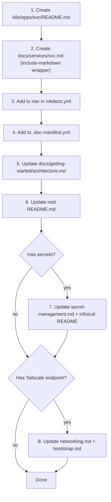

# Documentation

After every implementation, update the related documentation before considering the task complete. This is not optional.

## Doc Freshness Tracking

The repo uses `.doc-manifest.yml` to map every documentation file to its implementation sources. Before creating a PR, run:

```bash
python scripts/doc-freshness.py --check-pr    # which docs this branch should update
python scripts/doc-freshness.py --stale       # full staleness report
```

The `doc-freshness` GitHub Actions workflow runs on every PR and will comment if mapped docs are missing updates. The manifest is the **source of truth** for doc-to-source relationships — when adding a new service or doc, add an entry to `.doc-manifest.yml`.

## Single Source of Truth: `k8s/apps/<service>/README.md`

Every service directory under `k8s/apps/` **must** have a `README.md`. This README is the **single source of truth** for that service's documentation. The corresponding `docs/services/<service>.md` is always a thin MkDocs wrapper that includes the README:

```markdown
---
title: <Service Name>
---


```

**Never write documentation directly in `docs/services/<service>.md`** for services that have a `k8s/apps/<service>/` directory. Always edit the README instead.

## README Structure

Every `k8s/apps/<service>/README.md` should include these sections (adapt as needed):

1. **Title + one-line description** — what the service does
2. **Architecture** — mermaid diagram showing the service's components and connections
3. **Directory Contents** — table listing every file in the directory and its purpose
4. **Configuration** — key settings, Helm values, or Kustomize details
5. **Secrets in Infisical** — table of secret keys the service consumes (if any)
6. **Networking** — table with container port, NodePort, Tailscale port, and access URL
7. **Operational Commands** — common kubectl commands for the service
8. **Troubleshooting** — table of symptom / cause / fix

## What to Update

| Change area | Docs to update |
|---|---|
| `k8s/apps/<service>/` manifests | `k8s/apps/<service>/README.md` (the single source of truth) |
| `k8s/apps/argocd/` (projects, applications) | `k8s/apps/argocd/README.md`, `docs/getting-started/architecture.md` (Layer 1 diagram / service map) |
| `terraform/` | `docs/getting-started/bootstrap.md`, `docs/getting-started/architecture.md` (Layer 0 section) |
| `skills/` or `agents/` or `k8s/apps/openclaw/` | `k8s/apps/openclaw/README.md`, `docs/operations/ai-agents.md` |
| Secrets pipeline (ExternalSecret, Infisical) | `docs/infrastructure/secret-management.md` |
| Networking (Tailscale, services, ports) | `docs/infrastructure/networking.md` |
| New service added | See "Adding a new service" checklist below |
| **Release milestone** | Review and update root `README.md` (invoke `/release-management`) |

## Adding a New Service (documentation checklist)



## Markdown Formatting Rules

Follow these rules to ensure markdown renders correctly in MkDocs:

- **Blank line before lists** — always add a blank line between a paragraph/text line and the first `- ` or `1. ` list item. Without it, some renderers collapse the list into the preceding paragraph.
- **Blank line after headings** — always add a blank line after `#` headings before content.
- **Consistent list indentation** — use 2 spaces for nested list items.
- **No trailing whitespace** — remove trailing spaces on all lines.
- **Blank line before and after code fences** — always add blank lines around ` ``` ` blocks.

## Mermaid Diagram Conventions

When writing mermaid diagrams in documentation:

- **No spaces in node IDs** — use `camelCase`, `PascalCase`, or underscores (e.g., `UserService`, not `User Service`)
- **Quote edge labels with special characters** — wrap in double quotes: `A -->|"O(1) lookup"| B`
- **Quote node labels with special characters** — use double quotes: `A["Process (main)"]`
- **Avoid reserved keywords as node IDs** — `end`, `subgraph`, `graph`, `flowchart` (use `endNode`, `processEnd` instead)
- **No explicit colors or styling** — never use `style`, `classDef`, or `:::` syntax; they break dark mode. Let the MkDocs Material theme handle colors automatically
- **Subgraph IDs** — use explicit IDs with labels: `subgraph authFlow [Authentication Flow]`
- **No click events** — `click` syntax is disabled for security

These conventions ensure diagrams render correctly in both light and dark mode on the MkDocs Material site.

## Rules

- Keep docs concise — document the *what* and *why*, not step-by-step kubectl commands.
- Never remove documentation for existing services without explicit instruction.
- **Always include doc changes in the same commit as the implementation** (or as a follow-up commit in the same push). Pushing to `main` triggers the GitHub Pages deploy workflow, so docs go live automatically — but only if they are committed and pushed.
