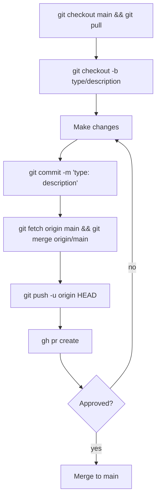
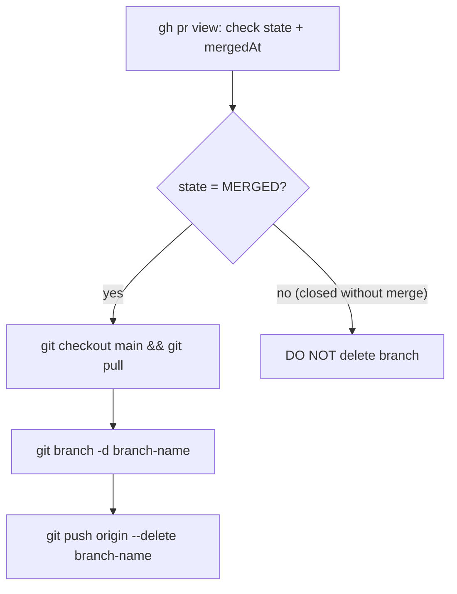

# Git Workflow

The `main` branch is **protected**. Never push directly to `main` — all changes require a feature branch and a pull request.

## Issue-First Planning (mandatory)

When addressing a GitHub issue (whether assigned by a user, picked from the backlog, or self-created), **always plan before coding**:

1. **Read the issue** — understand the requirements, acceptance criteria, and linked context
2. **Draft an implementation plan** covering:
   - Which files/services will be modified
   - The approach and key design decisions
   - Risks, dependencies, or open questions
   - Docs that need updating (invoke `/documentation` for the matrix)
3. **Comment the plan on the issue** using `gh issue comment`:
   ```bash
   gh issue comment <issue-number> --repo holdennguyen/homelab --body "$(cat <<'EOF'
   ## Implementation Plan

   **Approach:** <high-level summary>

   **Files to change:**
   - `<path>` — <what and why>

   **Risks / open questions:**
   - <any concerns>

   **Docs to update:**
   - <list from documentation matrix>
   EOF
   )"
   ```
4. **Wait for feedback** if the plan is non-trivial or the issue was filed by someone else — proceed immediately only for straightforward changes you filed yourself
5. **Reference the plan** throughout implementation — commit messages and PR body should trace back to the plan

## Branch Workflow



Branch prefixes: `feat/`, `fix/`, `chore/`, `docs/`, `refactor/`, `security/`

## Post-Merge Cleanup



## Pre-Merge Validation (for K8s/Helm changes)

Before merging PRs that modify cluster resources:
- Verify Helm value keys exist: `helm show values <chart>` (see `kubernetes.mdc`)
- Validate YAML: `kubectl apply --dry-run=client -f <file>`
- Check container image compatibility with `securityContext` changes
- Review ArgoCD sync wave dependencies

## Rules

- **Never push to `main` directly** — branch protection will reject it
- **Never force-push to `main`** — this is destructive and irreversible
- **Never delete a branch without verifying the PR was merged** — use `gh pr view` to confirm
- One PR per logical change — don't bundle unrelated changes
- Include documentation updates in the same PR as the implementation
- Never commit secrets, API keys, or credentials
- After merge, verify ArgoCD sync and pod health (for K8s changes)
- If a merge causes service degradation, invoke `/incident-response` for rollback procedures
