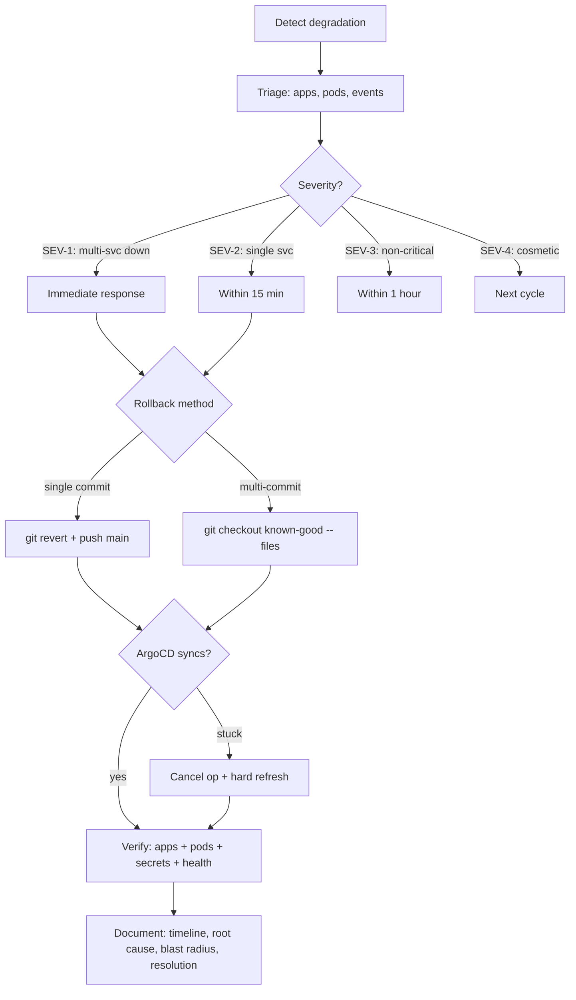

# Incident Response & Rollback

Quick-reference for detecting, triaging, and rolling back incidents. The canonical procedures live in `skills/incident-response/SKILL.md` (OpenClaw skill); this is a condensed version for Cursor context.

See `skills/incident-response/SKILL.md` for full post-incident cleanup procedures (reopen issue, label reverted PR, create sub-issues, reassess milestone).
