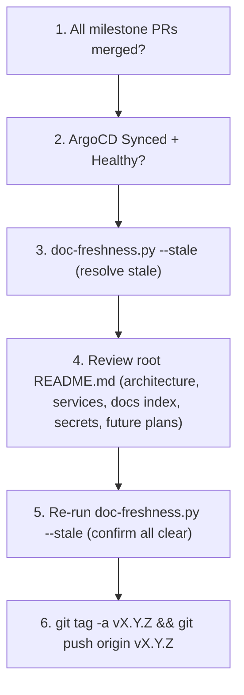
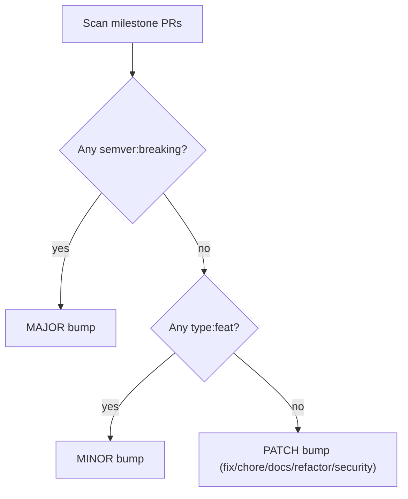

# Release Management

Before tagging a new release (e.g. `v1.1.0`), complete every item in this checklist.

## Pre-Release Checklist



## Semantic Versioning



## Milestone Lifecycle

```bash
# Check for open milestones
gh api repos/holdennguyen/homelab/milestones --jq '.[] | select(.state=="open") | .title' | head -1

# Verify milestone completeness
gh api repos/holdennguyen/homelab/milestones --jq '.[] | select(.title=="<version>") | "open: \(.open_issues), closed: \(.closed_issues)"'

# Close milestone after release
gh api repos/holdennguyen/homelab/milestones/<number> --method PATCH -f state="closed"

# Create next milestone
gh api repos/holdennguyen/homelab/milestones --method POST -f title="v<next>" -f description="<goal>"
```
