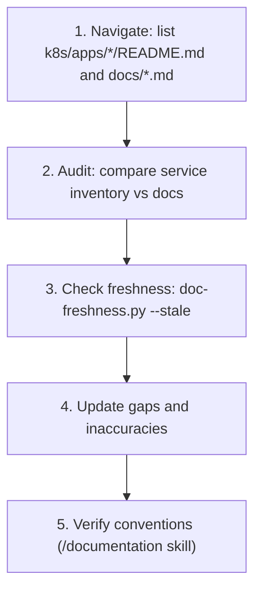

# Documentation Review

Systematic workflows for auditing and maintaining documentation quality. Complements the [documentation skill](.cursor/skills/documentation/SKILL.md) which covers creation/update conventions.

## Review Workflow

## Service Documentation Checklist

For each service in `k8s/apps/<service>/`:

- [ ] `README.md` exists and follows standard structure (Title, Architecture, Directory Contents, Configuration, Secrets, Networking, Operations, Troubleshooting)
- [ ] Architecture diagram is current and accurate
- [ ] Directory contents table matches actual files
- [ ] Configuration section reflects current values
- [ ] Secrets table is complete (cross-check with `kubectl get externalsecret -A`)
- [ ] Networking table shows current ports/endpoints
- [ ] Operational commands are tested and current
- [ ] Troubleshooting table covers recent issues
- [ ] Mermaid diagrams follow conventions (no `style`/`classDef`, no spaces in IDs, quoted special chars)
- [ ] `docs/services/<service>.md` thin wrapper exists
- [ ] Service listed in `mkdocs.yml` nav under Services section
- [ ] Entry exists in `.doc-manifest.yml`

## Cross-Cutting Checklist

- [ ] `docs/getting-started/architecture.md` shows all current services and relationships
- [ ] Root `README.md` service inventory is complete
- [ ] `docs/getting-started/bootstrap.md` matches current Terraform setup
- [ ] `docs/infrastructure/networking.md` reflects current Tailscale endpoints and ports
- [ ] `docs/infrastructure/secret-management.md` covers all ExternalSecrets
- [ ] No broken links across documentation
- [ ] Consistent terminology across docs

## Gap Analysis

Compare what's deployed vs what's documented:

- Services in `k8s/apps/` without `README.md`
- ExternalSecrets not referenced in `docs/secret-management.md`
- Tailscale endpoints not in `docs/networking.md`
- Services missing from `docs/architecture.md` diagrams
- Recent commits that changed manifests without doc updates (`git log --oneline --since="1 week ago" -- k8s/apps/ docs/`)
