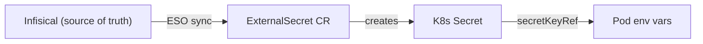
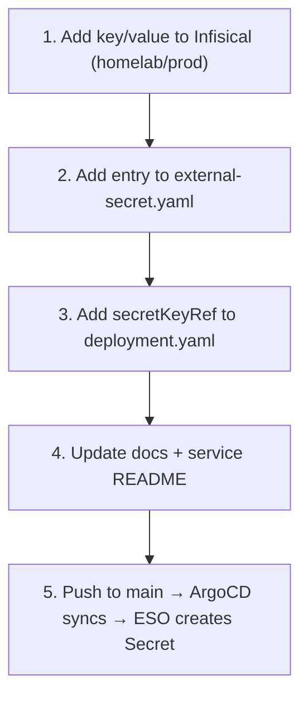
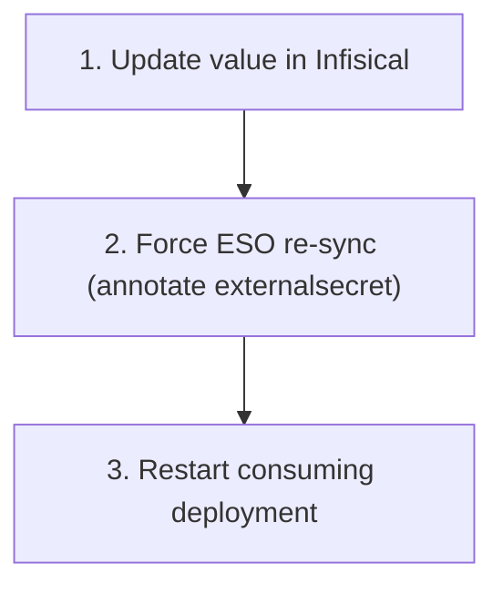

# Secret Management



Secrets never live in git.

## Adding a Secret



## Rotating a Secret



## Health Check

```bash
kubectl get clustersecretstore infisical
kubectl get externalsecret -A
kubectl get secret <name> -n <ns> -o jsonpath='{.data.<KEY>}' | base64 -d
```

## Troubleshooting

| Symptom | Fix |
|---|---|
| `InvalidProviderConfig` on ClusterSecretStore | Check Infisical machine identity credentials |
| 401 Unauthorized | Update clientId/clientSecret in `terraform.tfvars`, run `terraform apply` |
| 403 Forbidden | Add machine identity to the `homelab` project in Infisical |
| ExternalSecret stuck `SecretSyncedError` | Force re-sync with annotation |
