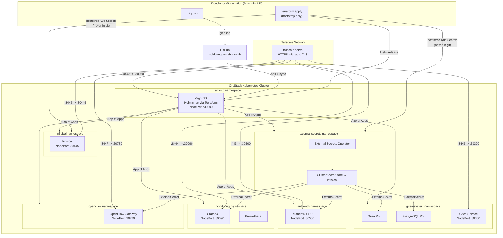
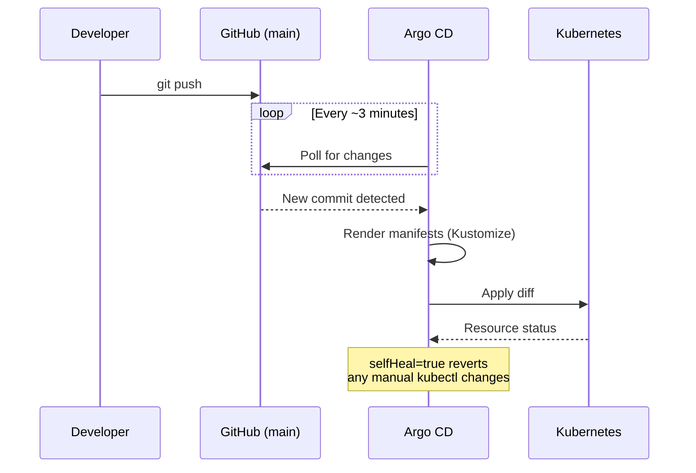

# Homelab

A GitOps-managed Kubernetes homelab running on OrbStack (Mac mini M4). Deploys self-hosted infrastructure services -- Authentik SSO, Gitea, PostgreSQL, Grafana + Prometheus, Infisical, and OpenClaw AI gateway -- orchestrated by Argo CD, with AI agent skill definitions for multi-agent development workflows. All services are accessible from any device on the Tailscale network (iPhone, iPad, Mac).

## Architecture



## Repository Structure

```
homelab/
├── README.md
├── mkdocs.yml                     # MkDocs Material site config
├── Dockerfile.openclaw            # Homelab overlay for OpenClaw image
├── .gitignore                     # Excludes terraform.tfvars and .terraform/
├── .github/workflows/docs.yml    # GitHub Pages deploy on push to main
├── terraform/                     # Bootstrap layer (run once, not GitOps)
│   ├── providers.tf               # kubernetes + helm provider config
│   ├── argocd.tf                  # ArgoCD Helm release + root Application CR
│   ├── bootstrap-secrets.tf       # K8s Secrets created from tfvars (never in git)
│   ├── variables.tf               # Variable declarations
│   ├── outputs.tf                 # Useful post-apply instructions
│   └── terraform.tfvars.example   # Template — copy to terraform.tfvars and fill in
├── k8s/                           # Kubernetes manifests (GitOps root)
│   └── apps/
│       ├── argocd/                # App of Apps — AppProjects + Application CRs
│       ├── authentik/             # Authentik SSO ExternalSecret
│       ├── external-secrets/      # ESO ClusterSecretStore config
│       ├── infisical/             # (Helm chart managed by Terraform-created Application)
│       ├── gitea/                 # Gitea kustomize manifests + ExternalSecret
│       ├── monitoring/            # Grafana ExternalSecret
│       ├── openclaw/              # OpenClaw AI gateway kustomize manifests
│       └── postgresql/            # PostgreSQL kustomize manifests + ExternalSecret
├── docs/                          # MkDocs documentation site
├── agents/workspaces/             # OpenClaw agent AGENTS.md personalities
├── skills/                        # OpenClaw homelab-specific skills
├── openclaw/                      # OpenClaw source (git submodule)
└── scripts/                       # Helper scripts (image builds, etc.)
```

## GitOps Flow

Every change follows the same path: commit to `main`, push to GitHub, Argo CD detects the change and syncs the cluster.



## Deployed Services

| Service | Source | Namespace | Access |
|---------|--------|-----------|--------|
| Argo CD | Helm chart via Terraform | `argocd` | `https://holdens-mac-mini.story-larch.ts.net:8443` |
| Authentik (SSO) | Helm chart via ArgoCD | `authentik` | `https://holdens-mac-mini.story-larch.ts.net` |
| Infisical | Helm chart via ArgoCD | `infisical` | `https://holdens-mac-mini.story-larch.ts.net:8445` |
| External Secrets Operator | Helm chart via ArgoCD | `external-secrets` | internal only |
| Grafana + Prometheus | Helm chart via ArgoCD | `monitoring` | `https://holdens-mac-mini.story-larch.ts.net:8444` |
| Gitea | Kustomize via ArgoCD | `gitea-system` | `https://holdens-mac-mini.story-larch.ts.net:8446` |
| PostgreSQL | Kustomize via ArgoCD | `gitea-system` | ClusterIP `postgresql:5432` (internal only) |
| OpenClaw | Kustomize via ArgoCD | `openclaw` | `https://holdens-mac-mini.story-larch.ts.net:8447` |

## Quick Start

### Prerequisites

- OrbStack with Kubernetes enabled
- `kubectl` and `terraform` (>= 1.5) installed
- `docker` (provided by OrbStack) for building the OpenClaw image
- Git push access to `github.com/holdennguyen/homelab`
- Tailscale installed with Serve enabled on the tailnet

### 1. Prepare Terraform variables

```bash
cp terraform/terraform.tfvars.example terraform/terraform.tfvars
# Edit terraform/terraform.tfvars and fill in all values.
# Generate secrets with:
#   openssl rand -hex 16          # ENCRYPTION_KEY
#   openssl rand -base64 32       # AUTH_SECRET
#   openssl rand -hex 12          # postgres / redis passwords
```

### 2. Bootstrap (Terraform)

```bash
cd terraform
terraform init
terraform apply
```

This installs ArgoCD via Helm, creates all bootstrap K8s Secrets (never in git), and registers the root ArgoCD Application. After apply completes, ArgoCD will auto-sync and deploy every other service.

### 3. Populate secrets in Infisical

Once ArgoCD deploys Infisical (check: `kubectl get pods -n infisical`), open the Infisical UI and create the following secrets in the `homelab` project under the `prod` environment. The project slug **must** be `homelab`:

| Key | Description |
|-----|-------------|
| `POSTGRES_PASSWORD` | PostgreSQL password for Gitea |
| `POSTGRES_USER` | `gitea` |
| `POSTGRES_DB` | `gitea` |
| `GITEA_DB_PASSWORD` | Same as `POSTGRES_PASSWORD` |
| `GITEA_SECRET_KEY` | Random base64 string (`openssl rand -base64 32`) |
| `GITEA_ADMIN_USERNAME` | Gitea admin username |
| `GITEA_ADMIN_PASSWORD` | Gitea admin password (`openssl rand -hex 12`) |
| `GITEA_ADMIN_EMAIL` | Gitea admin email |
| `AUTHENTIK_SECRET_KEY` | Cookie signing key (`openssl rand -hex 32`) |
| `AUTHENTIK_BOOTSTRAP_PASSWORD` | Authentik admin password |
| `AUTHENTIK_BOOTSTRAP_TOKEN` | Authentik API token (`openssl rand -hex 32`) |
| `AUTHENTIK_POSTGRES_PASSWORD` | Authentik PostgreSQL password (`openssl rand -hex 12`) |
| `GRAFANA_ADMIN_PASSWORD` | Grafana admin password (`openssl rand -hex 12`) |
| `GRAFANA_OAUTH_CLIENT_SECRET` | Generated when creating Authentik OIDC provider for Grafana |
| `GITEA_OAUTH_CLIENT_SECRET` | Generated when creating Authentik OIDC provider for Gitea |
| `OPENCLAW_GATEWAY_TOKEN` | Random hex string (`openssl rand -hex 32`) |
| `OPENROUTER_API_KEY` | OpenRouter API key from [openrouter.ai/keys](https://openrouter.ai/keys) |
| `GEMINI_API_KEY` | Google Gemini API key from [aistudio.google.com/apikey](https://aistudio.google.com/apikey) |

Then create a Machine Identity in Infisical (`Settings → Machine Identities → Universal Auth`), grant it **Member** access to the `homelab` project, update `terraform/terraform.tfvars` with the new `clientId` / `clientSecret`, and re-run `terraform apply` to update the credential. See [docs/bootstrap.md](docs/bootstrap.md) for the full step-by-step.

### 4. Expose Services via Tailscale

Run once on the Mac mini (persists across reboots):

```bash
tailscale serve --bg http://localhost:30500                       # Authentik (SSO portal)
tailscale serve --bg --https 8443 http://localhost:30080          # ArgoCD
tailscale serve --bg --https 8444 http://localhost:30090          # Grafana
tailscale serve --bg --https 8445 http://localhost:30445          # Infisical
tailscale serve --bg --https 8446 http://localhost:30300          # Gitea
tailscale serve --bg --https 8447 http://localhost:30789          # OpenClaw

tailscale serve status
```

Access URLs (any Tailscale device):

- Authentik (SSO): `https://holdens-mac-mini.story-larch.ts.net`
- ArgoCD: `https://holdens-mac-mini.story-larch.ts.net:8443`
- Grafana: `https://holdens-mac-mini.story-larch.ts.net:8444`
- Infisical: `https://holdens-mac-mini.story-larch.ts.net:8445`
- Gitea: `https://holdens-mac-mini.story-larch.ts.net:8446`
- OpenClaw: `https://holdens-mac-mini.story-larch.ts.net:8447`

### Verify Deployment

```bash
# Watch all ArgoCD Applications converge
kubectl get applications -n argocd -w

# Check ExternalSecrets resolved correctly
kubectl get externalsecret -A

# Check running pods
kubectl get pods -A | grep -v Running | grep -v Completed
```

## Documentation

| Document | What it covers |
|---|---|
| [docs/architecture.md](docs/architecture.md) | 3-layer design, technology choices, full service map, repository layout |
| [docs/bootstrap.md](docs/bootstrap.md) | Step-by-step setup from scratch: prerequisites, secrets generation, Terraform, Infisical, Tailscale |
| [docs/secret-management.md](docs/secret-management.md) | How secrets flow from Infisical → ESO → Kubernetes; adding secrets; rotating credentials |
| [docs/networking.md](docs/networking.md) | Tailscale Serve + NodePort architecture, request path, TLS, full port map, troubleshooting |
| [docs/authentik.md](docs/authentik.md) | Authentik SSO, OIDC provider setup, per-service integration |
| [docs/monitoring.md](docs/monitoring.md) | Grafana + Prometheus stack, dashboards, SSO integration |
| [docs/openclaw.md](docs/openclaw.md) | OpenClaw AI gateway deployment, image builds, multi-agent architecture |
| [docs/ai-agents.md](docs/ai-agents.md) | Cursor rules + OpenClaw agents/skills, when to use which |
| [terraform/README.md](terraform/README.md) | All Terraform variables, what resources are managed, day-2 operations |
| [k8s/apps/argocd/README.md](k8s/apps/argocd/README.md) | App of Apps pattern, sync waves, adding new applications |
| [k8s/apps/infisical/README.md](k8s/apps/infisical/README.md) | Infisical deployment, first-time setup, machine identity, bootstrap secrets |
| [k8s/apps/external-secrets/README.md](k8s/apps/external-secrets/README.md) | ClusterSecretStore, ExternalSecret pattern, adding secrets for new services |
| [k8s/apps/gitea/README.md](k8s/apps/gitea/README.md) | Config seeding via init container, env var overrides, ExternalSecret integration |
| [k8s/apps/postgresql/README.md](k8s/apps/postgresql/README.md) | Database configuration, pg_hba.conf, PGDATA layout, password management |

## Future Plans

1. **CI/CD Pipelines** -- Gitea Actions or Tekton for build and test automation
2. **Agent Expansion** -- Develop and integrate more AI agents for homelab automation
3. **Security Hardening** -- Network policies, RBAC, TLS everywhere, image scanning
4. **Logging** -- Loki for centralized log aggregation
