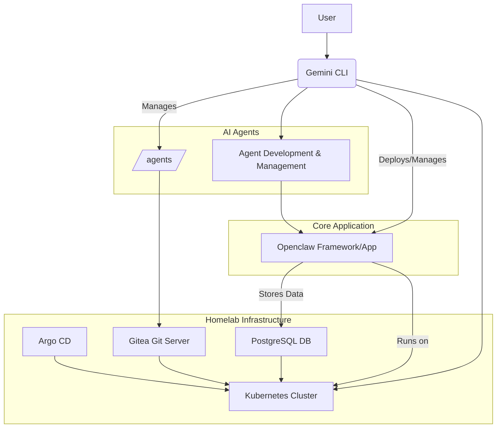

# Homelab Repository

This repository houses the configuration, code, and tools for managing a personal homelab environment. The primary goal is to create a robust and automated platform for developing, deploying, and managing AI agents and related applications.

## Architecture

The homelab is built around a Kubernetes cluster, orchestrated with Argo CD for GitOps, and includes essential services like Gitea for Git management and PostgreSQL for data storage. The core application is `openclaw`, which serves as the primary framework or backend for AI agent development and deployment.

## Key Components

*   **`openclaw`**: This directory contains the core `openclaw` framework or application. It includes `Dockerfile` and `docker-compose.yml` for containerization and local development, as well as `package.json` and TypeScript configurations for its Node.js-based development. This is expected to be deployed on the Kubernetes cluster.
*   **`agents/`**: This directory is dedicated to the development and management of AI agents. It contains subdirectories for different agent types, each with `SKILL.md` files that likely define their capabilities and behaviors. Agent configurations are managed via Git, potentially hosted in Gitea.
*   **`k8s/`**: This directory holds Kubernetes manifests and configurations for deploying and managing services within the homelab.
    *   **`argocd/`**: Configurations for Argo CD, enabling GitOps-based continuous deployment.
    *   **`gitea/`**: Configurations for Gitea, providing a self-hosted Git service.
    *   **`postgresql/`**: Configurations for PostgreSQL, serving as the primary database for applications like `openclaw`.
*   **`scripts/`**: This directory contains various utility scripts for automating tasks, building, testing, and managing the homelab environment.
*   **`docs/`**: Contains documentation related to the project.

## Homelab Plan

The homelab is envisioned as a continuously evolving platform. Key future plans include:

1.  **Agent Expansion**: Developing and integrating more sophisticated AI agents for various tasks (e.g., data analysis, security monitoring, code generation).
2.  **Scalability and Resilience**: Optimizing Kubernetes deployments for scalability and high availability.
3.  **CI/CD Enhancement**: Further refining the GitOps workflow with Argo CD for seamless updates and deployments.
4.  **Observability**: Implementing robust monitoring, logging, and tracing solutions for all components.
5.  **Security Hardening**: Continuously improving the security posture of all deployed services.
6.  **Tooling Integration**: Exploring and integrating new tools and technologies that can enhance agent capabilities or operational efficiency.
