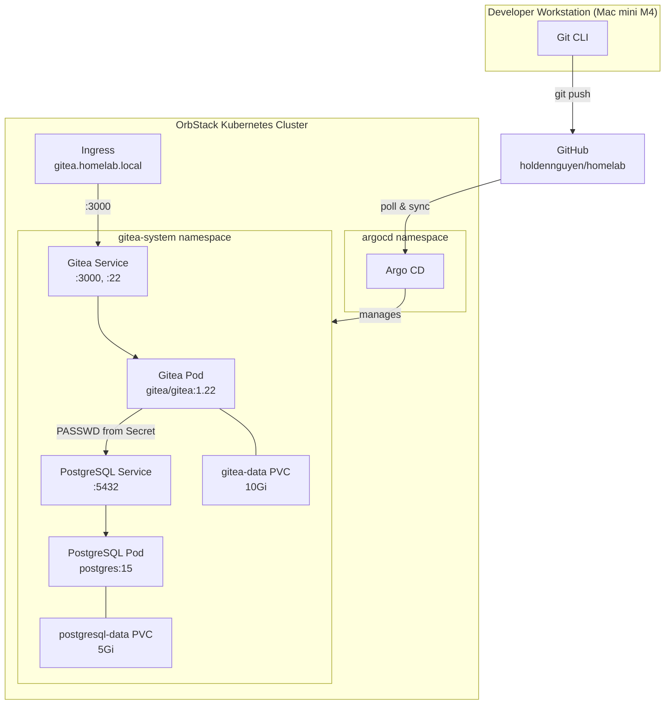
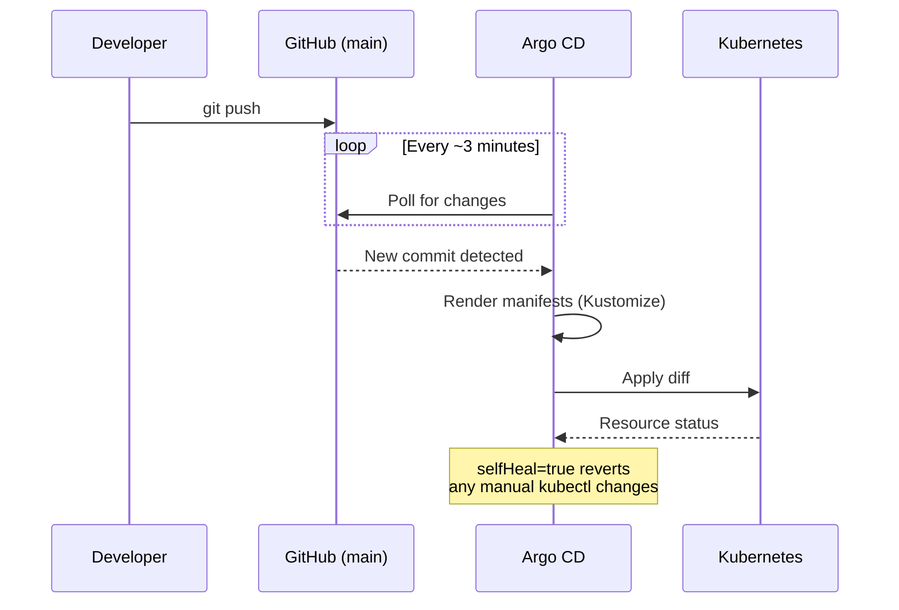

# Homelab

A GitOps-managed Kubernetes homelab running on OrbStack (Mac mini M4). Deploys self-hosted infrastructure services -- currently Gitea and PostgreSQL -- orchestrated by Argo CD, with AI agent skill definitions for multi-agent development workflows.

## Architecture



## Repository Structure

```
homelab/
├── README.md
├── agents/                        # AI agent skill definitions
│   ├── root_rules.md              # Shared rules all agents follow
│   ├── devops_sre_agent/          # Infrastructure & reliability
│   ├── software_engineer_agent/   # Code development
│   ├── qa_tester_agent/           # Testing & quality
│   ├── product_manager_agent/     # Product planning
│   ├── data_scientist_agent/      # Data analysis
│   └── security_analyst_agent/    # Security operations
├── k8s/                           # Kubernetes manifests (GitOps root)
│   └── apps/
│       ├── argocd/                # Argo CD + Application definitions
│       ├── gitea/                 # Gitea git server manifests
│       └── postgresql/            # PostgreSQL database manifests
├── openclaw/                      # Core AI agent framework (submodule)
└── skills/                        # Shared agent skill modules
```

## GitOps Flow

Every change follows the same path: commit to `main`, push to GitHub, Argo CD detects the change and syncs the cluster.



## Deployed Services

| Service | Image | Namespace | Access | Status |
|---------|-------|-----------|--------|--------|
| Argo CD | upstream `stable` | `argocd` | `kubectl port-forward svc/argocd-server -n argocd 8080:443` | Healthy |
| PostgreSQL | `postgres:15` | `gitea-system` | ClusterIP `postgresql:5432` | Healthy |
| Gitea | `gitea/gitea:1.22` | `gitea-system` | Ingress `https://gitea.homelab.local` | Running |

## Quick Start

### Prerequisites

- OrbStack with Kubernetes enabled
- `kubectl` configured to the OrbStack cluster
- Git push access to `github.com/holdennguyen/homelab`

### Bootstrap Argo CD

```bash
kubectl apply -k k8s/apps/argocd

# Get the initial admin password
kubectl -n argocd get secret argocd-initial-admin-secret -o jsonpath="{.data.password}" | base64 -d

# Access the UI
kubectl port-forward svc/argocd-server -n argocd 8080:443
```

Argo CD self-manages after the initial `kubectl apply`. It also deploys the PostgreSQL and Gitea Application definitions bundled in `k8s/apps/argocd/kustomization.yaml`.

### Verify Deployment

```bash
# Check Argo CD applications
kubectl get applications -n argocd

# Check running pods
kubectl get pods -n gitea-system

# Test Gitea API
kubectl exec -n gitea-system deploy/gitea -c gitea -- \
  wget -qO- http://localhost:3000/api/v1/settings/api

# Test PostgreSQL
kubectl exec -n gitea-system deploy/postgresql -- \
  psql -U gitea -d gitea -c '\dt'
```

## Component Documentation

Each service has detailed documentation covering its configuration, integration points, and operational notes:

- [Argo CD](k8s/apps/argocd/README.md) -- GitOps controller, Application definitions, sync policies
- [PostgreSQL](k8s/apps/postgresql/README.md) -- Database configuration, pg_hba.conf, PGDATA layout, Secret management
- [Gitea](k8s/apps/gitea/README.md) -- Config seeding via init container, env var overrides, Ingress/TLS setup

## Future Plans

1. **Observability** -- Prometheus, Grafana, Loki for monitoring and logging
2. **Secret Management** -- Sealed Secrets or External Secrets Operator to replace plaintext base64 Secrets
3. **CI/CD Pipelines** -- Gitea Actions or Tekton for build and test automation
4. **Openclaw Deployment** -- Containerize and deploy the AI agent framework to the cluster
5. **Agent Expansion** -- Develop and integrate more AI agents for homelab automation
6. **Security Hardening** -- Network policies, RBAC, TLS everywhere, image scanning
