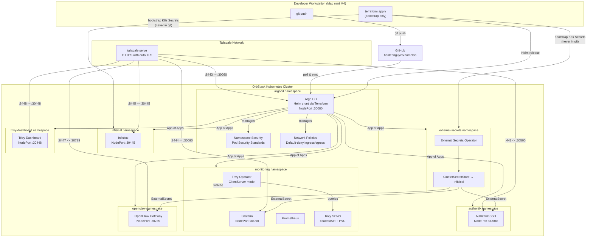
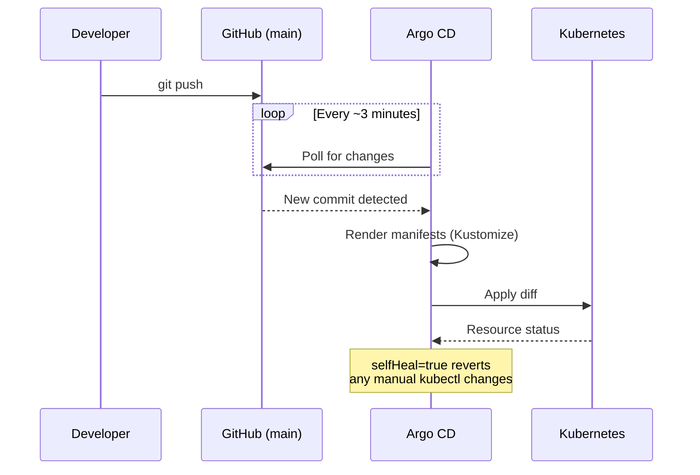

# Homelab

A GitOps-managed Kubernetes homelab running on OrbStack (Mac mini M4). Deploys self-hosted infrastructure services -- Authentik SSO, Grafana + Prometheus, Infisical, Trivy Operator, and OpenClaw AI gateway -- orchestrated by Argo CD, with security hardening (network policies, Pod Security Standards, non-root execution, vulnerability scanning) and AI agent skill definitions for multi-agent development workflows. Includes a Deutsch Tutor agent for AI-enhanced German language learning via Discord using spaced repetition (FSRS). All services are accessible from any device on the Tailscale network (iPhone, iPad, Mac).

## Architecture



## Repository Structure

```
homelab/
├── README.md
├── .doc-manifest.yml              # Doc freshness manifest (doc → source mappings)
├── mkdocs.yml                     # MkDocs Material site config
├── Dockerfile.openclaw            # Homelab overlay for OpenClaw image
├── .gitignore                     # Excludes terraform state/tfvars, site/, .DS_Store
├── .github/workflows/docs.yml    # GitHub Pages deploy on push to main
├── .github/workflows/doc-freshness.yml  # PR check for stale documentation
├── terraform/                     # Bootstrap layer (run once, not GitOps)
│   ├── providers.tf               # kubernetes + helm provider config
│   ├── argocd.tf                  # ArgoCD Helm release + root Application CR
│   ├── bootstrap-secrets.tf       # K8s Secrets created from tfvars (never in git)
│   ├── variables.tf               # Variable declarations
│   ├── outputs.tf                 # Useful post-apply instructions
│   └── terraform.tfvars.example   # Template — copy to terraform.tfvars and fill in
├── k8s/                           # Kubernetes manifests (GitOps root)
│   └── apps/
│       ├── argocd/                # App of Apps — AppProjects + Application CRs
│       ├── authentik/             # Authentik SSO ExternalSecret
│       ├── external-secrets/      # ESO ClusterSecretStore config
│       ├── infisical/             # (Helm chart managed by Terraform-created Application)
│       ├── monitoring/            # Grafana ExternalSecret
│       ├── namespace-security/    # Pod Security Standard labels per namespace
│       ├── networking-policies/   # Default-deny NetworkPolicy per namespace
│       ├── openclaw/              # OpenClaw AI gateway kustomize manifests
│       ├── trivy-operator/        # Container image vulnerability scanning
│       └── trivy-dashboard/       # Trivy Operator Dashboard web UI
├── docs/                          # MkDocs documentation site
├── agents/                        # OpenClaw agent definitions
│   └── workspaces/                # Per-agent AGENTS.md personality files (7 agents)
├── skills/                        # OpenClaw homelab-specific skills (9 domains, incl. deutsch-tutor)
├── openclaw/                      # OpenClaw source (git submodule)
└── scripts/                       # Helper scripts (image builds, etc.)
```

## GitOps Flow

Every change follows the same path: commit to `main`, push to GitHub, Argo CD detects the change and syncs the cluster.



## Deployed Services

| Service | Source | Namespace | Access |
|---------|--------|-----------|--------|
| Argo CD | Helm chart via Terraform | `argocd` | `https://holdens-mac-mini.story-larch.ts.net:8443` |
| Authentik (SSO) | Helm chart via ArgoCD | `authentik` | `https://holdens-mac-mini.story-larch.ts.net` |
| Infisical | Helm chart via ArgoCD | `infisical` | `https://holdens-mac-mini.story-larch.ts.net:8445` |
| External Secrets Operator | Helm chart via ArgoCD | `external-secrets` | internal only |
| Grafana + Prometheus | Helm chart via ArgoCD | `monitoring` | `https://holdens-mac-mini.story-larch.ts.net:8444` |
| Trivy Operator | Helm chart via ArgoCD | `monitoring` | internal only (CRs: `kubectl get vulnerabilityreports -A`) |
| Trivy Dashboard | Kustomize via ArgoCD | `trivy-dashboard` | `https://holdens-mac-mini.story-larch.ts.net:8448` |
| OpenClaw | Kustomize via ArgoCD | `openclaw` | `https://holdens-mac-mini.story-larch.ts.net:8447` |
| Namespace Security | Kustomize via ArgoCD | `argocd` | cluster-wide Pod Security Standard labels |
| Network Policies | Kustomize via ArgoCD | `argocd` | default-deny ingress/egress per namespace |

## Quick Start

### Prerequisites

- OrbStack with Kubernetes enabled
- `kubectl` and `terraform` (>= 1.5) installed
- `docker` (provided by OrbStack) for building the OpenClaw image
- Git push access to `github.com/holdennguyen/homelab`
- Tailscale installed with Serve enabled on the tailnet

### 1. Prepare Terraform variables

```bash
cp terraform/terraform.tfvars.example terraform/terraform.tfvars
# Edit terraform/terraform.tfvars and fill in all values.
# Generate secrets with:
#   openssl rand -hex 16          # ENCRYPTION_KEY
#   openssl rand -base64 32       # AUTH_SECRET
#   openssl rand -hex 12          # postgres / redis passwords
```

### 2. Bootstrap (Terraform)

```bash
cd terraform
terraform init
terraform apply
```

This installs ArgoCD via Helm, creates all bootstrap K8s Secrets (never in git), and registers the root ArgoCD Application. After apply completes, ArgoCD will auto-sync and deploy every other service.

### 3. Populate secrets in Infisical

Once ArgoCD deploys Infisical (check: `kubectl get pods -n infisical`), open the Infisical UI and create the following secrets in the `homelab` project under the `prod` environment. The project slug **must** be `homelab`:

| Key | Description |
|-----|-------------|
| `AUTHENTIK_SECRET_KEY` | Cookie signing key (`openssl rand -hex 32`) |
| `AUTHENTIK_BOOTSTRAP_PASSWORD` | Authentik admin password |
| `AUTHENTIK_BOOTSTRAP_TOKEN` | Authentik API token (`openssl rand -hex 32`) |
| `AUTHENTIK_POSTGRES_PASSWORD` | Authentik PostgreSQL password (`openssl rand -hex 12`) |
| `GRAFANA_ADMIN_PASSWORD` | Grafana admin password (`openssl rand -hex 12`) |
| `GRAFANA_OAUTH_CLIENT_SECRET` | Generated when creating Authentik OIDC provider for Grafana |
| `OPENCLAW_GATEWAY_TOKEN` | Random hex string (`openssl rand -hex 32`) |
| `OPENROUTER_API_KEY` | OpenRouter API key from [openrouter.ai/keys](https://openrouter.ai/keys) |
| `GEMINI_API_KEY` | Google Gemini API key from [aistudio.google.com/apikey](https://aistudio.google.com/apikey) |
| `GITHUB_TOKEN` | GitHub personal access token for OpenClaw agent git operations |
| `DISCORD_WEBHOOK_DEUTSCH` | *(optional)* Discord webhook URL for Deutsch Tutor learning reminders |

Then create a Machine Identity in Infisical (`Settings → Machine Identities → Universal Auth`), grant it **Member** access to the `homelab` project, update `terraform/terraform.tfvars` with the new `clientId` / `clientSecret`, and re-run `terraform apply` to update the credential. See [docs/getting-started/bootstrap.md](docs/getting-started/bootstrap.md) for the full step-by-step.

### 4. Expose Services via Tailscale

Run once on the Mac mini (persists across reboots):

```bash
tailscale serve --bg http://localhost:30500                       # Authentik (SSO portal)
tailscale serve --bg --https 8443 http://localhost:30080          # ArgoCD
tailscale serve --bg --https 8444 http://localhost:30090          # Grafana
tailscale serve --bg --https 8445 http://localhost:30445          # Infisical
tailscale serve --bg --https 8446 http://localhost:30100          # LaunchFast
tailscale serve --bg --https 8447 http://localhost:30789          # OpenClaw
tailscale serve --bg --https 8448 http://localhost:30448          # Trivy Dashboard

tailscale serve status
```

Access URLs (any Tailscale device):

- Authentik (SSO): `https://holdens-mac-mini.story-larch.ts.net`
- ArgoCD: `https://holdens-mac-mini.story-larch.ts.net:8443`
- Grafana: `https://holdens-mac-mini.story-larch.ts.net:8444`
- Infisical: `https://holdens-mac-mini.story-larch.ts.net:8445`
- LaunchFast: `https://holdens-mac-mini.story-larch.ts.net:8446`
- OpenClaw: `https://holdens-mac-mini.story-larch.ts.net:8447`
- Trivy Dashboard: `https://holdens-mac-mini.story-larch.ts.net:8448`

### Verify Deployment

```bash
# Watch all ArgoCD Applications converge
kubectl get applications -n argocd -w

# Check ExternalSecrets resolved correctly
kubectl get externalsecret -A

# Check running pods
kubectl get pods -A | grep -v Running | grep -v Completed
```

## Documentation

| Document | What it covers |
|---|---|
| **Getting Started** | |
| [docs/getting-started/architecture.md](docs/getting-started/architecture.md) | 3-layer design, technology choices, full service map, repository layout |
| [docs/getting-started/bootstrap.md](docs/getting-started/bootstrap.md) | Step-by-step setup from scratch: prerequisites, secrets generation, Terraform, Infisical, Tailscale |
| **Infrastructure** | |
| [docs/infrastructure/security.md](docs/infrastructure/security.md) | Security posture, RBAC, network policies, Pod Security Standards, LLM agent permissions, hardening roadmap |
| [docs/infrastructure/secret-management.md](docs/infrastructure/secret-management.md) | How secrets flow from Infisical → ESO → Kubernetes; adding secrets; rotating credentials |
| [docs/infrastructure/networking.md](docs/infrastructure/networking.md) | Tailscale Serve + NodePort architecture, request path, TLS, full port map, troubleshooting |
| **Services** | |
| [docs/services/argocd.md](docs/services/argocd.md) | App of Apps pattern, sync waves, adding new applications |
| [docs/services/authentik.md](docs/services/authentik.md) | Authentik SSO, OIDC provider setup, per-service integration |
| [docs/services/external-secrets.md](docs/services/external-secrets.md) | ClusterSecretStore, ExternalSecret pattern, adding secrets for new services |
| [docs/services/infisical.md](docs/services/infisical.md) | Infisical deployment, first-time setup, machine identity, bootstrap secrets |
| [docs/services/monitoring.md](docs/services/monitoring.md) | Grafana + Prometheus monitoring stack, dashboards, SSO integration |
| [docs/services/openclaw.md](docs/services/openclaw.md) | OpenClaw AI gateway deployment, image builds, multi-agent architecture |
| [docs/services/trivy-operator.md](docs/services/trivy-operator.md) | Container image vulnerability scanning, ClientServer mode, Helm values |
| [docs/services/trivy-dashboard.md](docs/services/trivy-dashboard.md) | Trivy Operator Dashboard web UI, vulnerability report viewer |
| **Operations** | |
| [docs/operations/git-workflow.md](docs/operations/git-workflow.md) | Branch conventions, PR requirements, post-merge cleanup for Cursor and OpenClaw |
| [docs/operations/ai-agents.md](docs/operations/ai-agents.md) | Cursor rules + OpenClaw agents/skills, when to use which |
| [docs/operations/nightly-shutdown.md](docs/operations/nightly-shutdown.md) | Automated nightly shutdown/startup using OrbStack CLI and macOS launchd |
| **Implementation Details** | |
| [terraform/README.md](terraform/README.md) | All Terraform variables, what resources are managed, day-2 operations |

## Documentation Freshness Tracking

Every documentation file is mapped to its implementation sources in [`.doc-manifest.yml`](.doc-manifest.yml). A Python script compares git history to detect when docs fall behind their sources.

```bash
python scripts/doc-freshness.py              # Full freshness report
python scripts/doc-freshness.py --stale      # Only stale docs
python scripts/doc-freshness.py --check-pr   # Check current branch for missing doc updates
python scripts/doc-freshness.py --json       # JSON output (for automation)
python scripts/doc-freshness.py --markdown   # Markdown table (for PR comments)
```

The [`doc-freshness`](.github/workflows/doc-freshness.yml) GitHub Actions workflow runs on every PR to `main`. If implementation sources changed but mapped docs were not updated, it posts a warning comment on the PR with a link to the details. The check is advisory — it does not block merge.

When adding a new service or documentation file, add an entry to `.doc-manifest.yml` so the freshness system tracks it.

## Future Plans

1. **Product Development via OpenClaw** -- OpenClaw agents build products in separate GitHub repos; deployment manifests live in this repo and are synced by ArgoCD
2. **CI/CD Pipelines** -- GitHub Actions for building product container images, ArgoCD Image Updater for automated deployments
3. **Agent Expansion** -- Develop and integrate more AI agents for homelab automation
4. **Logging** -- Loki for centralized log aggregation

> **Completed in v1.1.0:** Security hardening — network policies (default-deny per namespace), Pod Security Standards enforcement, RBAC scope-down (OpenClaw cluster-admin removed), non-root execution for all services, and container image vulnerability scanning (Trivy Operator).

> **Completed in v1.2.0:** Infrastructure optimization & observability — automated nightly shutdown/startup, monitoring dashboards and alerting rules as code, Gitea/PostgreSQL decommissioned (GitHub adopted), Authentik app portal with bookmarks, Trivy Dashboard, agent skills optimization.

> **Completed in v1.6.0:** Vikunja todo list application (later decommissioned in favor of Deutsch Tutor agent).

> **Completed in v1.7.0:** Decommissioned Vikunja; introduced Deutsch Tutor — an AI-enhanced German learning system via Discord using spaced repetition (FSRS), flashcard decks in repeater-compatible Markdown, and a dedicated OpenClaw agent for Vietnamese→German instruction.

> **Completed in v1.9.0:** English Tutor — an AI-powered IELTS 8.0 preparation coach via Discord using the same FSRS spaced repetition system. 6 flashcard decks covering advanced grammar, academic vocabulary, collocations, writing Task 2, speaking Parts 2-3, and reading/listening strategies. Tailored for a Vietnamese speaker with SRE and filmmaking background.
