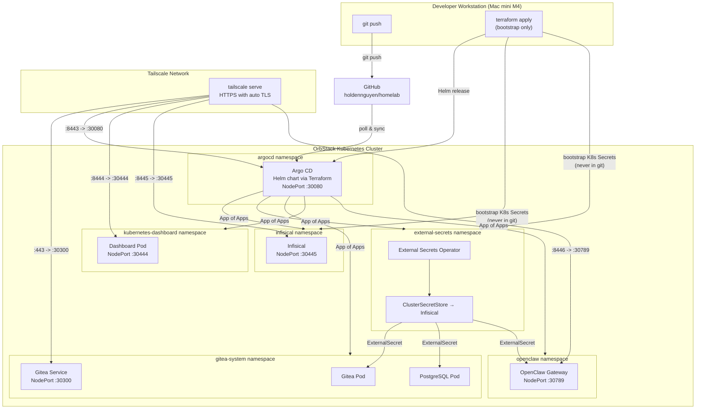
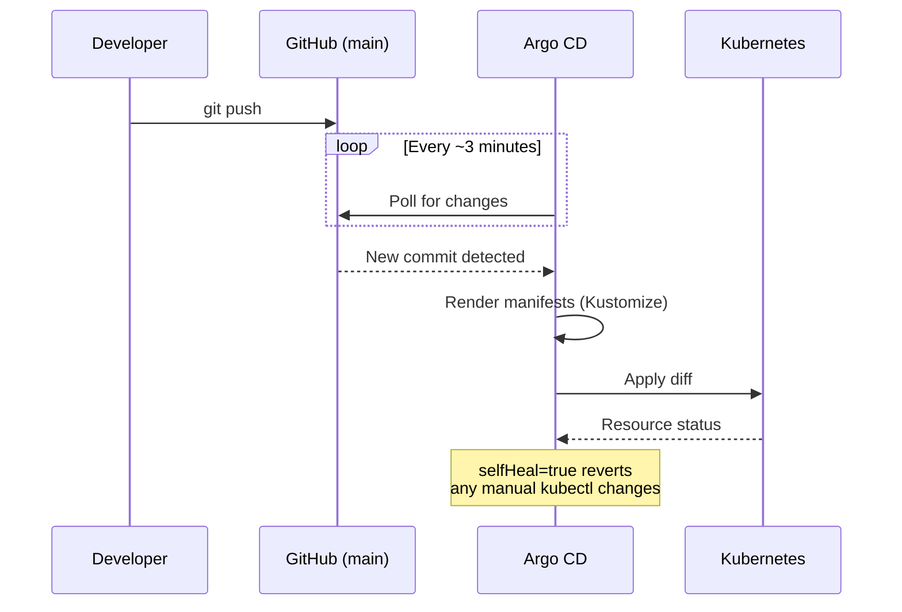

# Homelab

A GitOps-managed Kubernetes homelab running on OrbStack (Mac mini M4). Deploys self-hosted infrastructure services -- Gitea, PostgreSQL, Kubernetes Dashboard, and OpenClaw AI gateway -- orchestrated by Argo CD, with AI agent skill definitions for multi-agent development workflows. All services are accessible from any device on the Tailscale network (iPhone, iPad, Mac).

## Architecture



## Repository Structure

```
homelab/
├── README.md
├── .gitignore                     # Excludes terraform.tfvars and .terraform/
├── terraform/                     # Bootstrap layer (run once, not GitOps)
│   ├── providers.tf               # kubernetes + helm provider config
│   ├── argocd.tf                  # ArgoCD Helm release + root Application CR
│   ├── bootstrap-secrets.tf       # K8s Secrets created from tfvars (never in git)
│   ├── variables.tf               # Variable declarations
│   ├── outputs.tf                 # Useful post-apply instructions
│   └── terraform.tfvars.example   # Template — copy to terraform.tfvars and fill in
├── agents/                        # AI agent skill definitions
│   ├── root_rules.md              # Shared rules all agents follow
│   ├── devops_sre_agent/          # Infrastructure & reliability
│   ├── software_engineer_agent/   # Code development
│   ├── qa_tester_agent/           # Testing & quality
│   ├── product_manager_agent/     # Product planning
│   ├── data_scientist_agent/      # Data analysis
│   └── security_analyst_agent/    # Security operations
├── docs/                          # Architecture & networking docs
│   └── networking.md              # Tailscale + NodePort deep dive
├── k8s/                           # Kubernetes manifests (GitOps root)
│   └── apps/
│       ├── argocd/                # App of Apps — Application CRs only
│       ├── external-secrets/      # ESO ClusterSecretStore config
│       ├── infisical/             # Infisical deployment (Helm via ArgoCD App)
│       ├── gitea/                 # Gitea manifests (ExternalSecret, no plain Secrets)
│       ├── kubernetes-dashboard/  # Cluster monitoring dashboard
│       ├── openclaw/              # OpenClaw AI gateway (locally built image)
│       └── postgresql/            # PostgreSQL manifests (ExternalSecret, no plain Secrets)
├── openclaw/                      # OpenClaw source (git submodule → github.com/OpenClaw/OpenClaw)
├── scripts/                       # Helper scripts (image builds, etc.)
└── skills/                        # Shared agent skill modules
```

## GitOps Flow

Every change follows the same path: commit to `main`, push to GitHub, Argo CD detects the change and syncs the cluster.



## Deployed Services

| Service | Source | Namespace | Access |
|---------|--------|-----------|--------|
| Argo CD | Helm chart via Terraform | `argocd` | `https://holdens-mac-mini.story-larch.ts.net:8443` |
| Infisical | Helm chart via ArgoCD | `infisical` | `https://holdens-mac-mini.story-larch.ts.net:8445` |
| External Secrets Operator | Helm chart via ArgoCD | `external-secrets` | internal only |
| Gitea | Kustomize via ArgoCD | `gitea-system` | `https://holdens-mac-mini.story-larch.ts.net` |
| PostgreSQL | Kustomize via ArgoCD | `gitea-system` | ClusterIP `postgresql:5432` (internal only) |
| K8s Dashboard | Kustomize via ArgoCD | `kubernetes-dashboard` | `https://holdens-mac-mini.story-larch.ts.net:8444` |
| OpenClaw | Kustomize via ArgoCD | `openclaw` | `https://holdens-mac-mini.story-larch.ts.net:8446` |

## Quick Start

### Prerequisites

- OrbStack with Kubernetes enabled
- `kubectl` and `terraform` (>= 1.5) installed
- `docker` (provided by OrbStack) for building the OpenClaw image
- Git push access to `github.com/holdennguyen/homelab`
- Tailscale installed with Serve enabled on the tailnet

### 1. Prepare Terraform variables

```bash
cp terraform/terraform.tfvars.example terraform/terraform.tfvars
# Edit terraform/terraform.tfvars and fill in all values.
# Generate secrets with:
#   openssl rand -hex 16          # ENCRYPTION_KEY
#   openssl rand -base64 32       # AUTH_SECRET
#   openssl rand -hex 12          # postgres / redis passwords
```

### 2. Bootstrap (Terraform)

```bash
cd terraform
terraform init
terraform apply
```

This installs ArgoCD via Helm, creates all bootstrap K8s Secrets (never in git), and registers the root ArgoCD Application. After apply completes, ArgoCD will auto-sync and deploy every other service.

```bash
# Get the initial ArgoCD admin password
kubectl -n argocd get secret argocd-initial-admin-secret \
  -o jsonpath="{.data.password}" | base64 -d
```

### 3. Populate secrets in Infisical

Once ArgoCD deploys Infisical (check: `kubectl get pods -n infisical`), open the Infisical UI and create the following secrets in the `homelab` project under the `prod` environment. The project slug **must** be `homelab`:

| Key | Description |
|-----|-------------|
| `POSTGRES_PASSWORD` | PostgreSQL password for Gitea |
| `POSTGRES_USER` | `gitea` |
| `POSTGRES_DB` | `gitea` |
| `GITEA_DB_PASSWORD` | Same as `POSTGRES_PASSWORD` |
| `GITEA_SECRET_KEY` | Random base64 string (`openssl rand -base64 32`) |
| `OPENCLAW_GATEWAY_TOKEN` | Random hex string (`openssl rand -hex 32`) |
| `GEMINI_API_KEY` | Google Gemini API key from [aistudio.google.com/apikey](https://aistudio.google.com/apikey) |

Then create a Machine Identity in Infisical (`Settings → Machine Identities → Universal Auth`), grant it **Member** access to the `homelab` project, update `terraform/terraform.tfvars` with the new `clientId` / `clientSecret`, and re-run `terraform apply` to update the credential. See [docs/bootstrap.md](docs/bootstrap.md) for the full step-by-step.

### 4. Expose Services via Tailscale

Run once on the Mac mini (persists across reboots):

```bash
tailscale serve --bg http://localhost:30300                       # Gitea
tailscale serve --bg --https 8443 http://localhost:30080          # ArgoCD
tailscale serve --bg --https 8444 https+insecure://localhost:30444 # K8s Dashboard
tailscale serve --bg --https 8445 http://localhost:30445          # Infisical
tailscale serve --bg --https 8446 http://localhost:30789          # OpenClaw

tailscale serve status
```

Access URLs (any Tailscale device):

- Gitea: `https://holdens-mac-mini.story-larch.ts.net`
- ArgoCD: `https://holdens-mac-mini.story-larch.ts.net:8443`
- K8s Dashboard: `https://holdens-mac-mini.story-larch.ts.net:8444`
- Infisical: `https://holdens-mac-mini.story-larch.ts.net:8445`
- OpenClaw: `https://holdens-mac-mini.story-larch.ts.net:8446`

### Verify Deployment

```bash
# Watch all ArgoCD Applications converge
kubectl get applications -n argocd -w

# Check ExternalSecrets resolved correctly
kubectl get externalsecret -n gitea-system

# Check running pods
kubectl get pods -n gitea-system
kubectl get pods -n infisical
kubectl get pods -n openclaw
```

## Documentation

| Document | What it covers |
|---|---|
| [docs/architecture.md](docs/architecture.md) | 3-layer design, technology choices, full service map, repository layout |
| [docs/bootstrap.md](docs/bootstrap.md) | Step-by-step setup from scratch: prerequisites, secrets generation, Terraform, Infisical, Tailscale |
| [docs/secret-management.md](docs/secret-management.md) | How secrets flow from Infisical → ESO → Kubernetes; adding secrets; rotating credentials |
| [docs/networking.md](docs/networking.md) | Tailscale Serve + NodePort architecture, request path, TLS, full port map, troubleshooting |
| [terraform/README.md](terraform/README.md) | All Terraform variables, what resources are managed, day-2 operations |
| [k8s/apps/argocd/README.md](k8s/apps/argocd/README.md) | App of Apps pattern, sync waves, adding new applications |
| [k8s/apps/infisical/README.md](k8s/apps/infisical/README.md) | Infisical deployment, first-time setup, machine identity, bootstrap secrets |
| [k8s/apps/external-secrets/README.md](k8s/apps/external-secrets/README.md) | ClusterSecretStore, ExternalSecret pattern, adding secrets for new services |
| [k8s/apps/gitea/README.md](k8s/apps/gitea/README.md) | Config seeding via init container, env var overrides, ExternalSecret integration |
| [k8s/apps/postgresql/README.md](k8s/apps/postgresql/README.md) | Database configuration, pg_hba.conf, PGDATA layout, password management |
| [k8s/apps/kubernetes-dashboard/README.md](k8s/apps/kubernetes-dashboard/README.md) | Remote cluster monitoring, authentication, mobile access |
| [docs/openclaw.md](docs/openclaw.md) | OpenClaw AI gateway deployment, image builds, secrets, operations |
| [k8s/apps/openclaw/README.md](k8s/apps/openclaw/README.md) | OpenClaw k8s manifests, updating, troubleshooting |

## Future Plans

1. **Observability** -- Prometheus, Grafana, Loki for monitoring and logging
2. **CI/CD Pipelines** -- Gitea Actions or Tekton for build and test automation
3. **Agent Expansion** -- Develop and integrate more AI agents for homelab automation
4. **Security Hardening** -- Network policies, RBAC, TLS everywhere, image scanning
