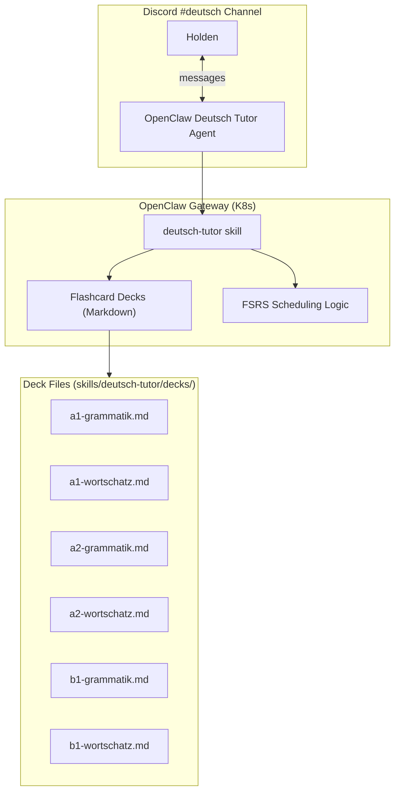

# Deutsch Learning Plan

German language learning system for a Vietnamese speaker, targeting B1 (Goethe-Zertifikat).

## Background

- Completed A1 + A2 in 1 year, then stopped for 2 years
- Native language: Vietnamese
- Goal: B1 proficiency in 6–9 months

## System Design



## Roadmap

| Phase | Duration | Focus | Weekly Hours |
|---|---|---|---|
| 0 — Assessment | 1 week | Diagnostic: identify gaps from A1/A2 | 3–5 |
| 1 — A1 Review | 2–4 weeks | Präsens, Artikel, W-Fragen, Zahlen, Pronomen | 5–7 |
| 2 — A2 Consolidation | 8–10 weeks | Perfekt, trennbare Verben, Modalverben, Präpositionen | 7–10 |
| 3 — A2→B1 Transition | 10–16 weeks | Präteritum, Nebensätze, Relativsätze, Konjunktiv II | 8–12 |
| 4 — Exam Prep | 3–4 weeks | Mock exams (Lesen, Hören, Schreiben, Sprechen) | 8–12 |

## Daily Activities

| Activity | Time | Description |
|---|---|---|
| Flashcard drill | 15–20 min | Spaced repetition via Discord (review + new cards) |
| Grammar study | 30–45 min | Rule + exercises with AI feedback |
| Conversation practice | 15–30 min | German dialogue with AI tutor |
| Writing exercise | 20–30 min | Short texts with correction |
| Vocabulary | 10–15 min | 10–15 new words/day via cloze cards |

## Spaced Repetition (FSRS)

Inspired by [shaankhosla/repeater](https://github.com/shaankhosla/repeater) — a terminal-based flashcard tool using FSRS (Free Spaced Repetition Scheduler) targeting 90% recall.

Card format (repeater-compatible Markdown):

```markdown
Q: Konjugiere "sein" im Präsens: ich ___
A: ich bin

---

C: Ich [habe] gestern ein Buch [gekauft]. (Perfekt)
```

Rating scale: Again (1) → Hard (2) → Good (3) → Easy (4)

## Deck Inventory

| File | Level | Cards | Topics |
|---|---|---|---|
| `a1-grammatik.md` | A1 | ~45 | Präsens, Artikel, W-Fragen, trennbare Verben, Negation |
| `a1-wortschatz.md` | A1 | ~65 | Greetings, family, food, home, daily life, time, colors, body |
| `a2-grammatik.md` | A2 | ~45 | Perfekt, Modalverben, Präpositionen, Komparativ, Imperativ |
| `a2-wortschatz.md` | A2 | ~60 | Work, health, travel, shopping, weather, feelings, verbs |
| `b1-grammatik.md` | B1 | ~45 | Präteritum, Nebensätze, Relativsätze, Konjunktiv II, Passiv |
| `b1-wortschatz.md` | B1 | ~60 | Education, technology, environment, society, Redewendungen |

## Vietnamese-Specific Strategies

| German Concept | Challenge for Vietnamese Speakers | Approach |
|---|---|---|
| Artikel (der/die/das) | Vietnamese has no articles | Gender patterns + color coding |
| Verb conjugation | Vietnamese verbs don't change form | Drill tables, songs, patterns |
| Cases (Nom/Akk/Dat) | Vietnamese uses word order | Map to sentence positions |
| Nebensatz word order | No equivalent in Vietnamese | "Động từ chạy về cuối" mnemonic |
| Perfekt sein vs haben | No distinction exists | Movement verbs = sein rule |

## Implementation

- **Agent**: `deutsch-tutor` in OpenClaw (see `agents/workspaces/deutsch-tutor/AGENTS.md`)
- **Skill**: `skills/deutsch-tutor/SKILL.md`
- **Decks**: `skills/deutsch-tutor/decks/*.md`
- **Discord channel**: `#deutsch` (repurposed from `#daily-briefing`)
- **Webhook**: `DISCORD_WEBHOOK_DEUTSCH` env var via Infisical → ESO
