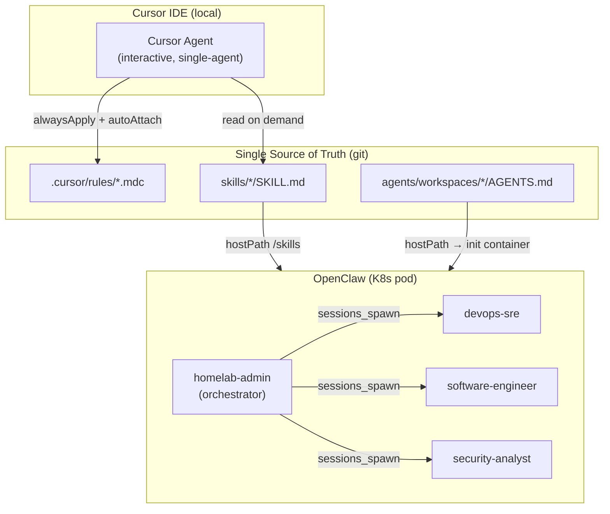
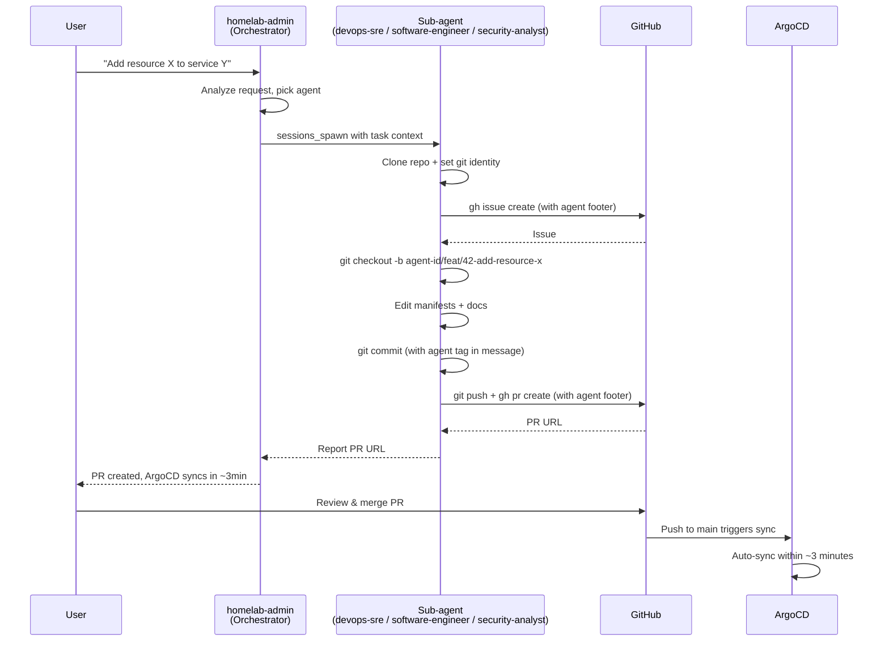

# AI Agents

The homelab uses two complementary AI agent systems: **Cursor** for interactive development and **OpenClaw** for autonomous multi-agent operations.

## Architecture



## When to Use Which

| Task | System | Why |
|---|---|---|
| Interactive coding, file editing, git ops | Cursor | Direct filesystem access, IDE integration, fast iteration |
| Planning, architecture review, Q&A | Cursor (Ask/Plan mode) | Context-aware with `.cursor/rules/` |
| Autonomous infra tasks (deploy, rotate secrets, incident response) | OpenClaw | Spawns sub-agents, runs kubectl, accessible from any device |
| Security audit, code review | OpenClaw (security-analyst, software-engineer) | Dedicated workspace, parallel execution |
| Quick kubectl check from phone/tablet | OpenClaw | Multi-device access via Tailscale |

## Cursor Rules

Cursor rules live in `.cursor/rules/*.mdc` with YAML frontmatter. They inject context into every Cursor conversation.

| File | Scope | Contents |
|---|---|---|
| `homelab.mdc` | `alwaysApply: true` | Global homelab context, architecture layers, core rules (GitOps, no secrets in git, ArgoCD labeling) |
| `kubernetes.mdc` | `autoAttach: k8s/**` | Kustomize conventions, ArgoCD Application CR template, sync waves, namespace rules |
| `terraform.mdc` | `autoAttach: terraform/**` | Layer 0 bootstrap rules, variable naming, secret handling |
| `openclaw.mdc` | `autoAttach: k8s/apps/openclaw/**, skills/**, agents/**` | Agent/skill conventions, how to add agents and skills |

### Adding a Cursor Rule

1. Create `.cursor/rules/<name>.mdc` with frontmatter:

```yaml
---
description: Short description
alwaysApply: true          # injected into every conversation
# OR
autoAttach:
  - "path/glob/**"         # injected when matching files are open
---
```

2. Write the rule content in markdown below the frontmatter.
3. Commit and push. The rule takes effect immediately in new Cursor sessions.

## OpenClaw Agents

OpenClaw runs four agents in an orchestrator pattern. The `homelab-admin` agent is the only directly accessible agent — it receives all user requests and delegates to specialized sub-agents via `sessions_spawn`.

| Agent | Role | Model | Workspace |
|---|---|---|---|
| `homelab-admin` | Default orchestrator | `google/gemini-2.5-pro` | `/data/workspaces/homelab-admin` |
| `devops-sre` | Infrastructure, K8s, Terraform | `google/gemini-2.5-pro` | `/data/workspaces/devops-sre` |
| `software-engineer` | Code development, review, testing | `google/gemini-2.5-pro` | `/data/workspaces/software-engineer` |
| `security-analyst` | Security audits, hardening | `google/gemini-2.5-pro` | `/data/workspaces/security-analyst` |

### How the Orchestrator Works

Users interact only with `homelab-admin` in the OpenClaw Control UI. It is the sole agent with `"default": true` in the config. The other three agents are sub-agents — they don't appear in the UI dropdown and can only be spawned by the orchestrator.

**Delegation rules:**

| Request type | Delegated to | Example |
|---|---|---|
| Infrastructure changes, Terraform, K8s ops, monitoring | `devops-sre` | "Add a NodePort to the monitoring stack" |
| Code changes, feature development, code review, testing | `software-engineer` | "Update the Dockerfile to add a new tool" |
| Security audits, vulnerability assessment, hardening | `security-analyst` | "Audit the RBAC configuration" |
| Read-only checks, status queries, simple answers | `homelab-admin` (handles directly) | "What pods are running?" |

When delegating, `homelab-admin` uses `sessions_spawn` and provides:
1. Clear task description and expected outcome
2. Relevant file paths or service names
3. Any context from prior conversation
4. Label instructions (agent, type, area, priority)

The spawned sub-agent session appears in the UI sidebar. Sub-agents report results back via `sessions_announce`.

### Mandatory Git Workflow

ALL agents enforce a mandatory git workflow for any change to the homelab repository. No agent — including the orchestrator — pushes directly to `main`. Branch protection is enforced on `main`: PRs require at least one approving review, force pushes are blocked, and linear history is required.



**Step-by-step process (every agent follows this):**

1. **Clone the repo** into the agent's workspace and **set git identity** (`git config user.name "<agent-id>[bot]"`, `git config user.email "<agent-id>@openclaw.homelab"`)
2. **Create a labeled GitHub issue** via `gh issue create` with `--assignee holdennguyen --label "agent:<id>,type:<type>,area:<area>,priority:<priority>"` — body ends with `Agent: <agent-id> | OpenClaw Homelab` footer
3. **Create a branch** from main: `<agent-id>/<type>/<issue-number>-<short-description>` (prefixes: `feat/`, `fix/`, `chore/`, `docs/`, `refactor/`)
4. **Make changes** to manifests, config, docs
5. **Commit** with a message referencing the issue and agent: `<type>: <description> (#<issue-number>) [<agent-id>]`
6. **Push** and **create a labeled PR** via `gh pr create` with the same labels — body ends with `Agent: <agent-id> | OpenClaw Homelab` footer
7. **Report** the PR URL back to the orchestrator or user

### GitHub Labels

Every issue and PR created by agents MUST be labeled. Labels serve as the tracking and filtering mechanism since agents are not GitHub users.

| Category | Labels | Rule |
|---|---|---|
| **Agent** | `agent:homelab-admin`, `agent:devops-sre`, `agent:software-engineer`, `agent:security-analyst` | Exactly one — who is working on this |
| **Type** | `type:feat`, `type:fix`, `type:chore`, `type:docs`, `type:refactor`, `type:security` | Exactly one — what kind of change |
| **Area** | `area:k8s`, `area:terraform`, `area:argocd`, `area:secrets`, `area:monitoring`, `area:networking`, `area:openclaw`, `area:auth`, `area:gitea` | One or more — what part of the homelab |
| **Priority** | `priority:critical`, `priority:high`, `priority:medium`, `priority:low` | Exactly one — urgency |

All issues and PRs are assigned to `holdennguyen` (repo owner) since agents are not GitHub collaborators. The `agent:*` label identifies which agent is responsible.

### Agent Footprint

Every agent action is traceable via a mandatory footprint convention. This ensures that any commit, issue, PR, or branch can be attributed to the specific agent that performed it.

| Artifact | Footprint | Example |
|---|---|---|
| Git commit author | `<agent-id>[bot] <<agent-id>@openclaw.homelab>` | `devops-sre[bot] <devops-sre@openclaw.homelab>` |
| Commit message | `... [<agent-id>]` suffix | `feat: add redis (#42) [devops-sre]` |
| Branch name | `<agent-id>/...` prefix | `devops-sre/feat/42-redis-caching` |
| Issue labels | `agent:<agent-id>` | `agent:devops-sre` |
| Issue body | Footer: `Agent: <agent-id> \| OpenClaw Homelab` | — |
| PR labels | `agent:<agent-id>` | `agent:devops-sre` |
| PR body | Footer: `Agent: <agent-id> \| OpenClaw Homelab` | — |

Each agent sets its git identity during workspace setup using `git config user.name` and `git config user.email` in the cloned repo. There is no shared global git identity — every commit is attributable to the exact agent that authored it.

**After the PR is merged:**

- **Layer 1 changes** (k8s manifests): ArgoCD auto-syncs within ~3 minutes
- **Layer 0 changes** (Terraform): Requires manual `terraform apply` on the host
- **Docker image changes**: Requires `./scripts/build-openclaw.sh` + pod restart on the host

**What enables this:**

- `git` and `gh` CLI are baked into the container image (`Dockerfile.openclaw`)
- `GITHUB_TOKEN` from Infisical provides authentication for `gh` CLI
- Per-agent git identity is set via `git config` in each cloned repo (no shared global identity)

### Agent Configuration

Agent config lives in two places:

- **Identity:** `k8s/apps/openclaw/configmap.yaml` → `openclaw.json` → `agents.list` (id, name, model, workspace, skills allowlist, `subagents.allowAgents`)
- **Personality:** `agents/workspaces/<id>/AGENTS.md` (single source of truth, copied into pod on every restart)

Key gateway-level settings in `openclaw.json`:

| Setting | Value | Purpose |
|---|---|---|
| `gateway.mode` | `"local"` | Enables full gateway functionality |
| `gateway.trustedProxies` | RFC 1918 ranges | Treats K8s internal traffic as local |
| `tools.sessions.visibility` | `"all"` | Orchestrator can view sub-agent session history |
| `tools.agentToAgent.enabled` | `true` | Enables cross-agent communication |

The container image (`Dockerfile.openclaw`) includes ops tools (kubectl, helm, terraform, argocd, jq, git, gh) and the pod runs with a `cluster-admin` ServiceAccount, so agents can execute cluster operations directly.

### Per-Agent Skill Assignment

Each agent has a `skills` allowlist in the configmap that restricts which skills it can see. Omitting the field means all skills; an empty array means none.

| Agent | Assigned Skills |
|---|---|
| `homelab-admin` | `homelab-admin`, `gitops`, `secret-management` |
| `devops-sre` | `devops-sre`, `gitops`, `secret-management` |
| `software-engineer` | `software-engineer` |
| `security-analyst` | `security-analyst`, `secret-management` |

Cross-cutting skills (e.g. `secret-management`) are shared across agents that need them.

### Adding a New Agent

1. Add the agent entry to `k8s/apps/openclaw/configmap.yaml` under `agents.list` — include a `skills` array and a `subagents.allowAgents` list
2. Add the new agent ID to the orchestrator's `subagents.allowAgents` so it can be spawned
3. Create `agents/workspaces/<id>/AGENTS.md` with the agent personality (must include the mandatory git workflow and agent footprint sections)
4. Add the agent ID to the init container's `for` loop in `k8s/apps/openclaw/deployment.yaml`
5. Add the agent ID to `tools.agentToAgent.allow` in the configmap
6. Push to `main` via PR (branch protection requires review) and restart: `kubectl rollout restart deployment/openclaw -n openclaw`

### Sub-agent Spawning

The orchestrator uses `maxSpawnDepth: 2`:

- **Depth 0:** `homelab-admin` receives user requests
- **Depth 1:** Orchestrator spawns specialized sub-agents
- **Depth 2:** Sub-agents can spawn leaf workers for parallel tasks

Limits (configured in `configmap.yaml`):

- `maxConcurrent: 4` — max parallel sub-agents
- `maxChildrenPerAgent: 3` — max children per agent session
- `archiveAfterMinutes: 120` — auto-cleanup of finished sessions

## OpenClaw Skills

Skills provide domain-specific knowledge and commands to agents. They live in `skills/` at the repo root and are mounted into the pod via hostPath at `/skills`.

| Skill | Description |
|---|---|
| `homelab-admin` | Cluster operations, service management, GitOps workflow |
| `devops-sre` | Infrastructure debugging, Terraform, incident response |
| `software-engineer` | Code development, review, testing conventions |
| `security-analyst` | Security audits, RBAC review, vulnerability assessment |
| `gitops` | ArgoCD App of Apps pattern, sync management, mandatory git workflow reference |
| `secret-management` | Infisical → ESO → K8s pipeline operations |

### Skill Format

```
skills/<name>/SKILL.md
```

With YAML frontmatter:

```yaml
---
name: <skill-name>
description: <one-line description for the agent>
metadata:
  openclaw:
    emoji: "<emoji>"
    requires: { anyBins: ["kubectl"] }  # optional binary requirements
---
```

### Adding a New Skill

1. Create `skills/<name>/SKILL.md` with the frontmatter above
2. Write operational knowledge in markdown: commands, troubleshooting tables, workflows
3. Add the skill name to the `skills` array of each agent that should use it in the configmap
4. Push to `main` and restart: `kubectl rollout restart deployment/openclaw -n openclaw`

Skills auto-load via `skills.load.extraDirs: ["/skills"]` in the OpenClaw config.

## Single Source of Truth

| Content | Source | Consumed By |
|---|---|---|
| Cursor context rules | `.cursor/rules/*.mdc` | Cursor IDE |
| Agent personalities | `agents/workspaces/*/AGENTS.md` | OpenClaw (copied into pod workspace by init container) |
| Operational skills | `skills/*/SKILL.md` | OpenClaw (mounted at `/skills`), Cursor (read on demand) |
| Agent roster & config | `k8s/apps/openclaw/configmap.yaml` | OpenClaw (mounted at `/config`) |

There is no duplication. Each piece of content has exactly one source file in git.
