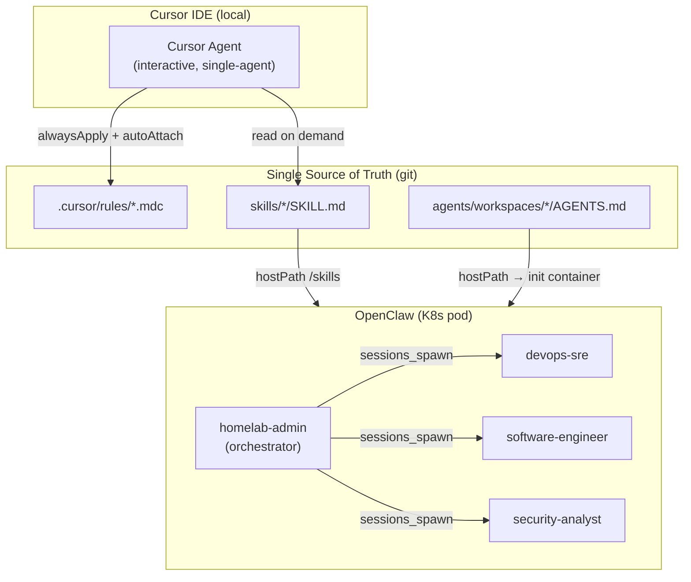

# AI Agents

The homelab uses two complementary AI agent systems: **Cursor** for interactive development and **OpenClaw** for autonomous multi-agent operations.

## Architecture



## When to Use Which

| Task | System | Why |
|---|---|---|
| Interactive coding, file editing, git ops | Cursor | Direct filesystem access, IDE integration, fast iteration |
| Planning, architecture review, Q&A | Cursor (Ask/Plan mode) | Context-aware with `.cursor/rules/` |
| Autonomous infra tasks (deploy, rotate secrets, incident response) | OpenClaw | Spawns sub-agents, runs kubectl, accessible from any device |
| Security audit, code review | OpenClaw (security-analyst, software-engineer) | Dedicated workspace, parallel execution |
| Quick kubectl check from phone/tablet | OpenClaw | Multi-device access via Tailscale |

## Cursor Rules

Cursor rules live in `.cursor/rules/*.mdc` with YAML frontmatter. They inject context into every Cursor conversation.

| File | Scope | Contents |
|---|---|---|
| `homelab.mdc` | `alwaysApply: true` | Global homelab context, architecture layers, core rules (GitOps, no secrets in git, ArgoCD labeling) |
| `kubernetes.mdc` | `autoAttach: k8s/**` | Kustomize conventions, ArgoCD Application CR template, sync waves, namespace rules |
| `terraform.mdc` | `autoAttach: terraform/**` | Layer 0 bootstrap rules, variable naming, secret handling |
| `openclaw.mdc` | `autoAttach: k8s/apps/openclaw/**, skills/**, agents/**` | Agent/skill conventions, how to add agents and skills |

### Adding a Cursor Rule

1. Create `.cursor/rules/<name>.mdc` with frontmatter:

```yaml
---
description: Short description
alwaysApply: true          # injected into every conversation
# OR
autoAttach:
  - "path/glob/**"         # injected when matching files are open
---
```

2. Write the rule content in markdown below the frontmatter.
3. Commit and push. The rule takes effect immediately in new Cursor sessions.

## OpenClaw Agents

OpenClaw runs four agents in an orchestrator pattern. The `homelab-admin` agent receives user requests and delegates to specialized sub-agents via `sessions_spawn`.

| Agent | Role | Model | Workspace |
|---|---|---|---|
| `homelab-admin` | Default orchestrator | `google/gemini-2.5-pro` | `/data/workspaces/homelab-admin` |
| `devops-sre` | Infrastructure, K8s, Terraform | `google/gemini-2.5-pro` | `/data/workspaces/devops-sre` |
| `software-engineer` | Code development, review, testing | `google/gemini-2.5-pro` | `/data/workspaces/software-engineer` |
| `security-analyst` | Security audits, hardening | `google/gemini-2.5-pro` | `/data/workspaces/security-analyst` |

### Agent Configuration

Agent config lives in two places:

- **Identity:** `k8s/apps/openclaw/configmap.yaml` → `openclaw.json` → `agents.list` (id, name, model, workspace, skills allowlist)
- **Personality:** `agents/workspaces/<id>/AGENTS.md` (single source of truth, copied into pod on every restart)

The container image (`Dockerfile.openclaw`) includes ops tools (kubectl, helm, terraform, argocd, jq) and the pod runs with a `cluster-admin` ServiceAccount, so agents can execute cluster operations directly.

### Per-Agent Skill Assignment

Each agent has a `skills` allowlist in the configmap that restricts which skills it can see. Omitting the field means all skills; an empty array means none.

| Agent | Assigned Skills |
|---|---|
| `homelab-admin` | `homelab-admin`, `gitops`, `secret-management` |
| `devops-sre` | `devops-sre`, `gitops`, `secret-management` |
| `software-engineer` | `software-engineer` |
| `security-analyst` | `security-analyst`, `secret-management` |

Cross-cutting skills (e.g. `secret-management`) are shared across agents that need them.

### Adding a New Agent

1. Add the agent entry to `k8s/apps/openclaw/configmap.yaml` under `agents.list` — include a `skills` array with only the relevant skill names
2. Create `agents/workspaces/<id>/AGENTS.md` with the agent personality
3. Add the agent ID to the init container's `for` loop in `k8s/apps/openclaw/deployment.yaml`
4. Add the agent ID to `tools.agentToAgent.allow` in the configmap
5. Push to `main` and restart: `kubectl rollout restart deployment/openclaw -n openclaw`

### Sub-agent Spawning

The orchestrator uses `maxSpawnDepth: 2`:

- **Depth 0:** `homelab-admin` receives user requests
- **Depth 1:** Orchestrator spawns specialized sub-agents
- **Depth 2:** Sub-agents can spawn leaf workers for parallel tasks

Limits (configured in `configmap.yaml`):

- `maxConcurrent: 4` — max parallel sub-agents
- `maxChildrenPerAgent: 3` — max children per agent session
- `archiveAfterMinutes: 120` — auto-cleanup of finished sessions

## OpenClaw Skills

Skills provide domain-specific knowledge and commands to agents. They live in `skills/` at the repo root and are mounted into the pod via hostPath at `/skills`.

| Skill | Description |
|---|---|
| `homelab-admin` | Cluster operations, service management, GitOps workflow |
| `devops-sre` | Infrastructure debugging, Terraform, incident response |
| `software-engineer` | Code development, review, testing conventions |
| `security-analyst` | Security audits, RBAC review, vulnerability assessment |
| `gitops` | ArgoCD App of Apps pattern, sync management |
| `secret-management` | Infisical → ESO → K8s pipeline operations |

### Skill Format

```
skills/<name>/SKILL.md
```

With YAML frontmatter:

```yaml
---
name: <skill-name>
description: <one-line description for the agent>
metadata:
  openclaw:
    emoji: "<emoji>"
    requires: { anyBins: ["kubectl"] }  # optional binary requirements
---
```

### Adding a New Skill

1. Create `skills/<name>/SKILL.md` with the frontmatter above
2. Write operational knowledge in markdown: commands, troubleshooting tables, workflows
3. Add the skill name to the `skills` array of each agent that should use it in the configmap
4. Push to `main` and restart: `kubectl rollout restart deployment/openclaw -n openclaw`

Skills auto-load via `skills.load.extraDirs: ["/skills"]` in the OpenClaw config.

## Single Source of Truth

| Content | Source | Consumed By |
|---|---|---|
| Cursor context rules | `.cursor/rules/*.mdc` | Cursor IDE |
| Agent personalities | `agents/workspaces/*/AGENTS.md` | OpenClaw (copied into pod workspace by init container) |
| Operational skills | `skills/*/SKILL.md` | OpenClaw (mounted at `/skills`), Cursor (read on demand) |
| Agent roster & config | `k8s/apps/openclaw/configmap.yaml` | OpenClaw (mounted at `/config`) |

There is no duplication. Each piece of content has exactly one source file in git.
