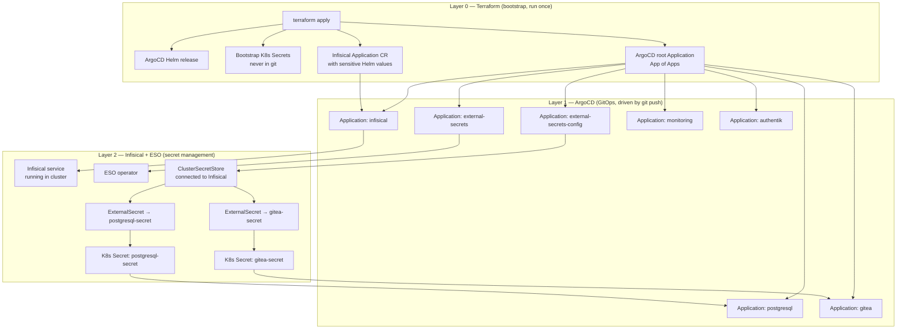
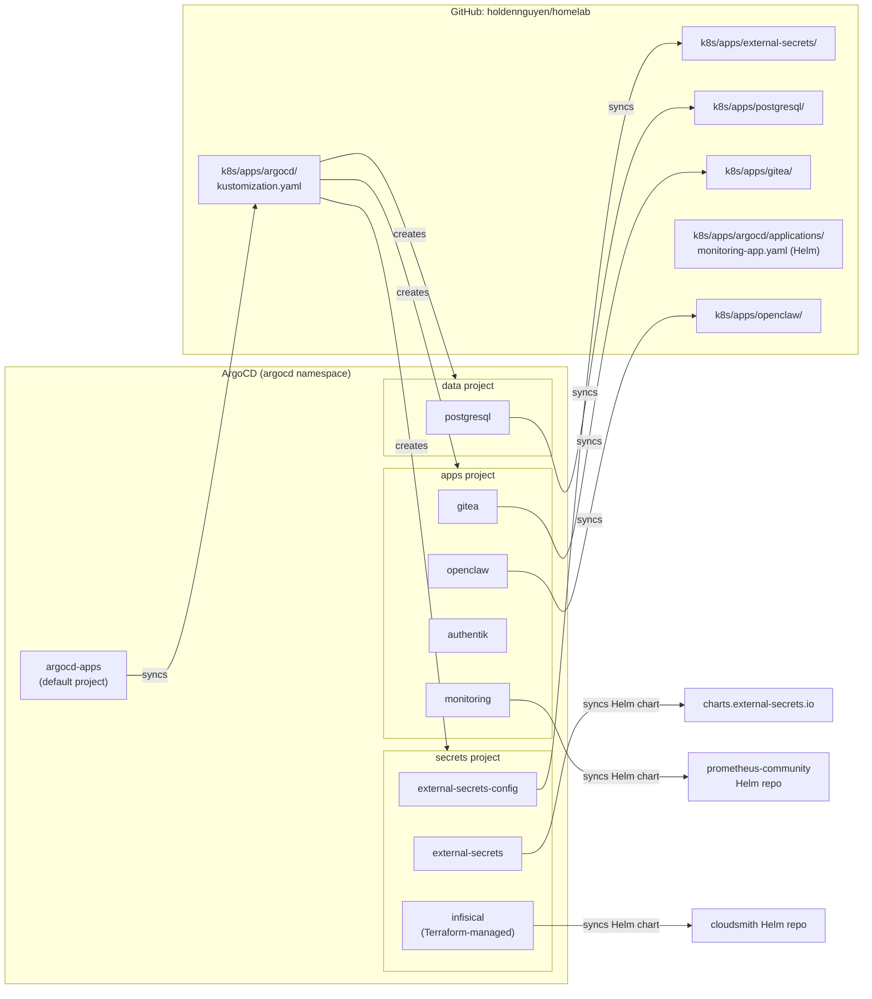
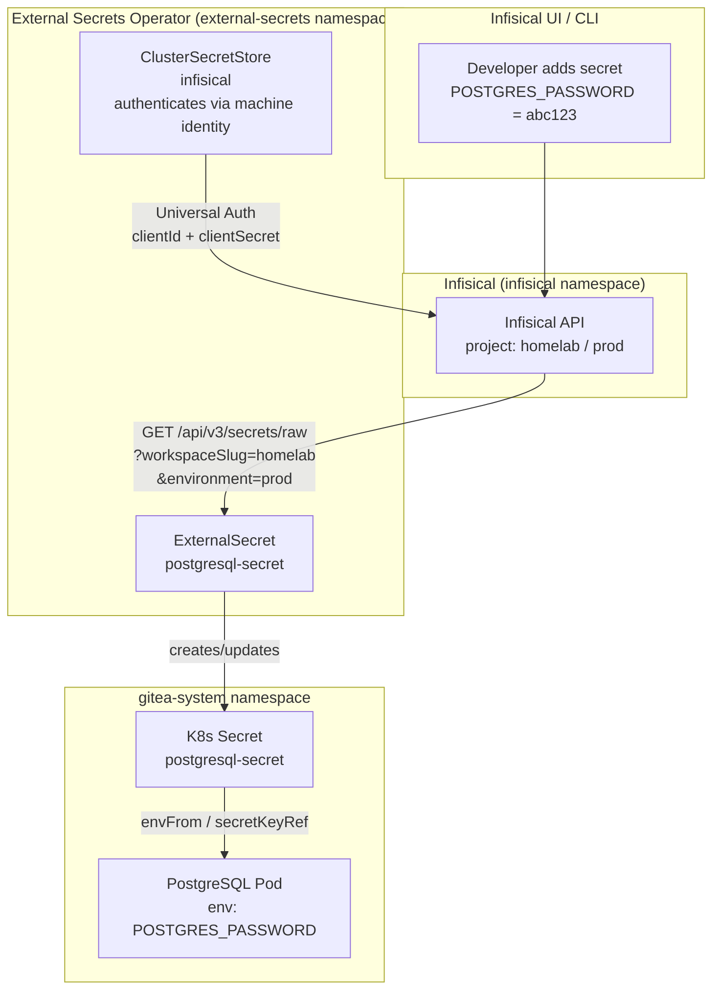
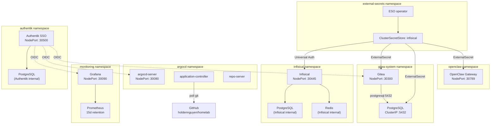

# Architecture

This document describes the full architecture of the homelab: how the three infrastructure layers relate to each other, how services are deployed and connected, and how all configuration flows from code to running pods.

## Overview

The homelab runs on a single **Mac mini M4** using **OrbStack** as the Kubernetes runtime. Everything is codified — no ad-hoc `kubectl` commands are part of normal operations. The infrastructure is organized into three distinct layers with clear responsibilities:



## Layer 0: Terraform

Terraform bootstraps the cluster exactly once. After `terraform apply`, no more Terraform is needed for day-to-day operations — only for credential rotation or ArgoCD version upgrades.

**What Terraform creates:**

| Resource | Where | Why Terraform (not git) |
|---|---|---|
| `argocd` namespace | cluster | Must exist before Helm install |
| ArgoCD Helm release | `argocd` namespace | Installs ArgoCD itself — can't use ArgoCD to deploy ArgoCD |
| `infisical-secrets` K8s Secret | `infisical` namespace | Contains `ENCRYPTION_KEY` + `AUTH_SECRET` — Infisical needs these before it can run, so they can't come from Infisical |
| `infisical-helm-secrets` K8s Secret | `argocd` namespace | Postgres + Redis passwords for the Infisical Helm chart. ArgoCD `Application` CRs don't support `valuesFrom` referencing K8s Secrets, so Terraform injects them via `helm.valuesObject` |
| `infisical-machine-identity` K8s Secret | `external-secrets` namespace | ESO uses this to authenticate to Infisical. Terraform owns it so the credential can be rotated with `terraform apply` |
| `repo-homelab` K8s Secret | `argocd` namespace | SSH deploy key for ArgoCD to clone the private GitHub repo |
| ArgoCD root Application (`argocd-apps`) | `argocd` namespace | Triggers the App of Apps — the root of all GitOps |
| ArgoCD Infisical Application (`infisical`) | `argocd` namespace | Created by Terraform because its Helm values embed sensitive credentials |

**Why Terraform for ArgoCD, not `kubectl apply`?**

Every `kubectl apply` invocation is an untracked side-effect. Terraform tracks all resources in `terraform.tfstate`, which means:
- `terraform plan` shows exactly what will change before applying
- `terraform destroy` cleanly removes everything
- The full bootstrap is reproducible from a fresh cluster with a single command

## Layer 1: ArgoCD (App of Apps)

ArgoCD watches the GitHub repository and applies any changes to `k8s/apps/` automatically. The pattern used is **App of Apps**: one root Application (`argocd-apps`) points to `k8s/apps/argocd/`, which contains AppProject and Application CRs for every other service.

Applications are organized into three **AppProjects** that scope which repos, namespaces, and cluster-scoped resources each group of apps can access:

| Project | Purpose | Applications |
|---|---|---|
| `secrets` | Secret management infrastructure | `infisical`, `external-secrets`, `external-secrets-config` |
| `data` | Databases and data stores | `postgresql` |
| `apps` | User-facing applications | `gitea`, `monitoring`, `authentik`, `openclaw` |
| `default` | Bootstrap only | `argocd-apps` (root) |



Every Application CR carries standard `app.kubernetes.io/*` labels (`name`, `part-of`, `component`, `managed-by`). See the [ArgoCD README](../k8s/apps/argocd/README.md#adding-a-new-application) for the full labeling rules and new-application template.

**Branch protection** on `main`:
- PRs require at least one approving review before merge
- Force pushes and branch deletion are blocked
- Linear history is required (no merge commits)
- Admin bypass is available for emergencies (`enforce_admins: false`)

**Sync policies** on all applications:
- `automated.prune: true` — resources removed from git are deleted from the cluster
- `automated.selfHeal: true` — any manual `kubectl` change is reverted within ~3 minutes
- All applications target `targetRevision: HEAD` — every merge to `main` is deployed

## Layer 2: Secret Management

Secrets never live in git. All application credentials flow from **Infisical** (the secret store) through **External Secrets Operator** into Kubernetes Secrets that pods consume.



For the full secret management reference, see [docs/secret-management.md](./secret-management.md).

## Service Map



## Networking

Services are exposed through **Tailscale Serve**, which provides automatic TLS certificates and makes services accessible from any device on the tailnet. OrbStack NodePorts only bind to `localhost`, and Tailscale Serve bridges the gap.

| Service | NodePort | Tailscale URL | Tailscale Port | Auth |
|---|---|---|---|---|
| Authentik (SSO) | `:30500` | `https://holdens-mac-mini.story-larch.ts.net` | 443 (default) | SSO portal |
| ArgoCD | `:30080` (HTTP) | `https://holdens-mac-mini.story-larch.ts.net:8443` | 8443 | SSO via Authentik |
| Grafana | `:30090` | `https://holdens-mac-mini.story-larch.ts.net:8444` | 8444 | SSO via Authentik |
| Infisical | `:30445` | `https://holdens-mac-mini.story-larch.ts.net:8445` | 8445 | Local admin |
| Gitea | `:30300` | `https://holdens-mac-mini.story-larch.ts.net:8446` | 8446 | SSO via Authentik |
| OpenClaw | `:30789` | `https://holdens-mac-mini.story-larch.ts.net:8447` | 8447 | Local |

For the full networking reference, see [docs/networking.md](./networking.md).

## Technology Choices

| Technology | Role | Why |
|---|---|---|
| **OrbStack** | Kubernetes runtime | Lightweight, single-node, Mac-native, fast startup |
| **Terraform** | Bootstrap layer | Tracks cluster setup as code; reproducible; safe credential injection via tfvars |
| **ArgoCD** | GitOps controller | Continuous sync from git; self-healing; declarative; App of Apps for service lifecycle |
| **Infisical** | Secret store | Self-hosted; UI for secret management; supports ESO Universal Auth; project/environment scoping |
| **External Secrets Operator** | Secret sync | Bridges Infisical to Kubernetes Secrets; polling refresh; decoupled from app manifests |
| **Tailscale** | Private networking | Zero-config WireGuard VPN; MagicDNS; auto TLS via `tailscale serve`; works across all devices |
| **Kustomize** | Manifest rendering | Native in `kubectl apply -k` and ArgoCD; overlays without templating language |

## Repository Layout

```
homelab/
├── .gitignore                      # Guards terraform.tfvars, .terraform/, *.tfstate
├── .github/workflows/docs.yml     # GitHub Pages deploy on push to main
├── README.md                       # Quick-start and service table
├── mkdocs.yml                      # MkDocs Material site config
├── Dockerfile.openclaw             # Homelab overlay for OpenClaw image (kubectl, helm, git, gh, etc.)
├── terraform/                      # Layer 0 — bootstrap (run once)
│   ├── README.md                   # Terraform variables and day-2 ops reference
│   ├── providers.tf                # kubernetes + helm + local + null providers
│   ├── argocd.tf                   # ArgoCD Helm release, Infisical App, root App, SSH credential
│   ├── bootstrap-secrets.tf        # K8s Secrets created from tfvars
│   ├── variables.tf                # All variable declarations
│   ├── outputs.tf                  # Post-apply instructions
│   └── terraform.tfvars.example   # Template — copy to terraform.tfvars
├── k8s/                            # Layer 1 — GitOps manifests
│   └── apps/
│       ├── argocd/                 # App of Apps: AppProjects + Application CRs
│       │   ├── projects/           # AppProject CRs (secrets, data, apps)
│       │   └── applications/       # Application CRs
│       ├── authentik/              # Authentik SSO ExternalSecret
│       ├── external-secrets/       # ClusterSecretStore
│       ├── infisical/              # (Helm chart managed by Terraform-created Application)
│       ├── gitea/                  # Gitea kustomize manifests + ExternalSecret
│       ├── monitoring/             # Grafana ExternalSecret
│       ├── openclaw/               # OpenClaw AI gateway manifests
│       └── postgresql/             # PostgreSQL kustomize manifests + ExternalSecret
├── docs/                           # MkDocs documentation site
│   ├── architecture.md             # This file
│   ├── bootstrap.md                # Day-1 setup walkthrough
│   ├── networking.md               # Tailscale + NodePort deep-dive
│   ├── secret-management.md       # Infisical + ESO reference
│   ├── argocd.md                   # ArgoCD (includes k8s/apps/argocd/README.md)
│   ├── authentik.md                # Authentik SSO and OIDC integration
│   ├── gitea.md                    # Gitea (includes k8s/apps/gitea/README.md)
│   ├── postgresql.md               # PostgreSQL (includes k8s/apps/postgresql/README.md)
│   ├── external-secrets.md         # ESO (includes k8s/apps/external-secrets/README.md)
│   ├── infisical.md                # Infisical (includes k8s/apps/infisical/README.md)
│   ├── monitoring.md               # Grafana + Prometheus monitoring stack
│   ├── openclaw.md                 # OpenClaw AI gateway
│   └── ai-agents.md               # Cursor rules + OpenClaw agents/skills
├── agents/workspaces/              # OpenClaw agent AGENTS.md personality files
├── skills/                         # Homelab-specific OpenClaw skills
├── openclaw/                       # OpenClaw source (git submodule)
└── scripts/                        # Helper scripts (image builds, etc.)
```
