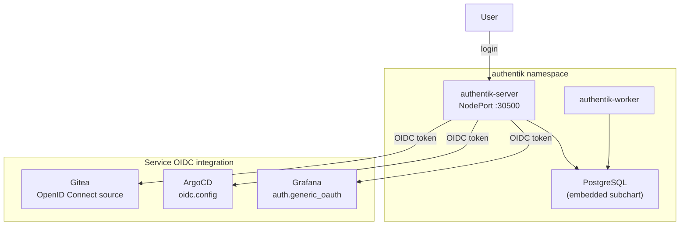

# Authentik (SSO / Identity Provider)

Authentik provides **Single Sign-On (SSO)** for the homelab via **OpenID Connect (OIDC)**. One login, one password for Grafana, ArgoCD, and Gitea.

## Access

| Interface | URL | Credentials |
|---|---|---|
| Authentik Admin | `https://holdens-mac-mini.story-larch.ts.net:8447` | akadmin / `AUTHENTIK_BOOTSTRAP_PASSWORD` from Infisical |
| Authentik (local) | `http://localhost:30500` | same |

## Architecture

## OIDC Providers

Each service has a dedicated OIDC provider in Authentik with its own client ID and secret:

| Service | Client ID | Redirect URI | Secret location |
|---|---|---|---|
| Grafana | `grafana` | `https://holdens-mac-mini.story-larch.ts.net:8444/login/generic_oauth` | Infisical: `GRAFANA_OAUTH_CLIENT_SECRET` |
| ArgoCD | `argocd` | `https://holdens-mac-mini.story-larch.ts.net:8443/auth/callback` | Terraform: `argocd_oidc_client_secret` |
| Gitea | `gitea` | `https://holdens-mac-mini.story-larch.ts.net/user/oauth2/authentik/callback` | Infisical: `GITEA_OAUTH_CLIENT_SECRET` |

## Configuration

Authentik is deployed via ArgoCD using the Helm chart source. All configuration is in `k8s/apps/argocd/applications/authentik-app.yaml`.

Key settings:

- **Helm chart:** `authentik/authentik` v2025.12.4
- **PostgreSQL:** Embedded subchart with 2Gi PVC
- **Secrets:** All sensitive values (secret key, bootstrap password/token, PG password) come from Infisical via ExternalSecret
- **NodePort:** 30500 (HTTP), 30501 (HTTPS)
- **Tailscale Serve:** Port 8447

### Secrets in Infisical

| Key | Purpose |
|---|---|
| `AUTHENTIK_SECRET_KEY` | Cookie signing and unique user IDs (never change after first install) |
| `AUTHENTIK_BOOTSTRAP_PASSWORD` | Initial admin password |
| `AUTHENTIK_BOOTSTRAP_TOKEN` | API token for automation |
| `AUTHENTIK_POSTGRES_PASSWORD` | Embedded PostgreSQL password |

### OIDC integration per service

**Grafana** — configured in Helm values (`monitoring-app.yaml`) via `grafana.ini.auth.generic_oauth`. Client secret mounted from `grafana-secret` ExternalSecret.

**ArgoCD** — configured in Terraform (`argocd.tf`) via `configs.cm.oidc.config`. Client secret stored in `argocd-secret` via Terraform `set_sensitive`. Requires `terraform apply` to update.

**Gitea** — configured via `gitea admin auth add-oauth` in the PostSync init job (`admin-init-job.yaml`). Client secret from `gitea-secret` ExternalSecret.

## Adding a new OIDC-protected service

1. Create an OAuth2 provider in Authentik (UI or API): set client ID, secret, and redirect URI
2. Create an Authentik Application and link it to the provider
3. Store the client secret in Infisical
4. Add the secret key to the service's ExternalSecret
5. Configure the service's OIDC settings to point to Authentik's endpoints:
   - Authorize: `https://holdens-mac-mini.story-larch.ts.net:8447/application/o/authorize/`
   - Token: `https://holdens-mac-mini.story-larch.ts.net:8447/application/o/token/`
   - Userinfo: `https://holdens-mac-mini.story-larch.ts.net:8447/application/o/userinfo/`
   - Discovery: `https://holdens-mac-mini.story-larch.ts.net:8447/application/o/<slug>/.well-known/openid-configuration`

## Troubleshooting

| Symptom | Cause | Fix |
|---|---|---|
| "Login failed" on Grafana/ArgoCD | Redirect URI mismatch | Check the redirect URI in Authentik matches exactly (scheme, host, port, path) |
| Authentik returns 502 | Server pod not ready | `kubectl get pods -n authentik` |
| "Invalid client" error | Wrong client_id or secret | Verify the secret in Infisical matches what's in Authentik |
| OIDC login button not showing | Config not applied | For ArgoCD: run `terraform apply`; for Grafana: wait for ArgoCD sync |
| Gitea shows no OAuth option | Init job didn't run | Check job: `kubectl get jobs -n gitea-system` |
