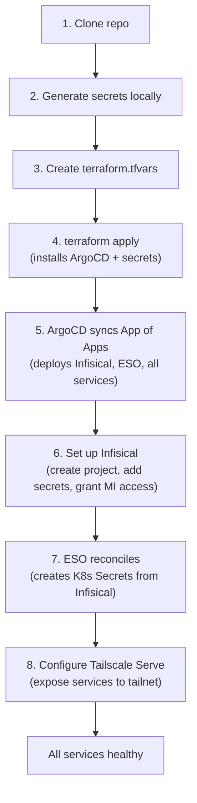

# Bootstrap Guide

This guide walks a new maintainer through setting up the homelab from a completely fresh Kubernetes cluster to a fully operational GitOps-managed environment.

## Prerequisites

| Tool | Version | Install |
|---|---|---|
| `terraform` | >= 1.5 | `brew install terraform` |
| `kubectl` | any | `brew install kubectl` |
| `helm` | any | `brew install helm` |
| `tailscale` | latest | [tailscale.com/download](https://tailscale.com/download) |
| OrbStack | latest | [orbstack.dev](https://orbstack.dev) |
| `openssl` | any | pre-installed on macOS |
| `ssh-keygen` | any | pre-installed on macOS |

Verify your cluster context:

```bash
kubectl config current-context   # should print: orbstack
kubectl cluster-info              # should show the API server URL
```

## Architecture Summary

The bootstrap runs in strict order. Each step depends on the previous. Security enforcement (non-root execution, Pod Security Standards, network policies) is applied automatically by ArgoCD after the bootstrap completes — no additional manual steps are required.



## Step 1: Clone the Repository

```bash
git clone https://github.com/holdennguyen/homelab.git
cd homelab
```

## Step 2: Generate Bootstrap Secrets

These secrets are used by Infisical to encrypt its data. They are generated once and must never change (without a migration procedure). Run these commands and save the output for the next step:

```bash
# Infisical ENCRYPTION_KEY — a 32-character hex string
openssl rand -hex 16

# Infisical AUTH_SECRET — a 32-byte base64-encoded string
openssl rand -base64 32

# Infisical internal PostgreSQL password
openssl rand -hex 12

# Infisical internal Redis password
openssl rand -hex 12
```

## Step 3: Create `terraform/terraform.tfvars`

Copy the example file:

```bash
cp terraform/terraform.tfvars.example terraform/terraform.tfvars
```

Then populate every value (the file is gitignored — it never gets committed):

```hcl
kube_context   = "orbstack"
argocd_version = "7.8.0"

# From Step 2
infisical_encryption_key    = "<output of: openssl rand -hex 16>"
infisical_auth_secret       = "<output of: openssl rand -base64 32>"
infisical_postgres_password = "<output of: openssl rand -hex 12>"
infisical_redis_password    = "<output of: openssl rand -hex 12>"

# From Infisical UI after first run (see Step 5)
# Leave placeholder values for the first apply and update after Infisical starts
infisical_machine_identity_client_id     = "placeholder-update-after-infisical-starts"
infisical_machine_identity_client_secret = "placeholder-update-after-infisical-starts"

# ArgoCD OIDC client secret (create Authentik provider with client_id=argocd after bootstrap)
argocd_oidc_client_secret = "<leave placeholder, set after Authentik is running>"
```

> **Note on machine identity credentials:** On the first `terraform apply`, you can use placeholder values for `infisical_machine_identity_client_id` and `infisical_machine_identity_client_secret`. After Infisical is running and you have created a real Machine Identity (Step 6), re-run `terraform apply` with the real values.

## Step 4: Bootstrap with Terraform

```bash
cd terraform

# Download provider plugins
terraform init

# Preview what will be created
terraform plan

# Apply — this creates ArgoCD and all bootstrap secrets
terraform apply
```

Terraform creates the following in order:
1. Namespaces: `argocd`, `infisical`, `external-secrets`
2. ArgoCD Helm release (NodePort :30080/:30443)
3. Bootstrap K8s Secrets: `infisical-secrets`, `infisical-helm-secrets`, `infisical-machine-identity`
4. ArgoCD `Application` CR for the root App of Apps (`argocd-apps`)
5. ArgoCD `Application` CR for Infisical (with embedded Helm values)

After `terraform apply` finishes, ArgoCD starts syncing. Watch it:

```bash
# Wait for all ArgoCD pods to be running
kubectl get pods -n argocd -w

# Watch applications roll out (open another terminal)
kubectl get applications -n argocd -w
```

Expected sequence:
1. `infisical` app syncs first (sync-wave 0) → Infisical pods start
2. `external-secrets` app syncs (sync-wave 0) → ESO operator installs CRDs
3. `external-secrets-config` app syncs (sync-wave 1) → ClusterSecretStore is created
4. `postgresql`, `gitea`, `monitoring`, `authentik` sync → pods start (secrets not yet available)

## Step 5: Configure Infisical

This step is done once in the Infisical web UI. Infisical cannot configure itself automatically.

### 6a: Access Infisical

```bash
# Get the NodePort
kubectl get svc -n infisical -l app.kubernetes.io/component=infisical
```

Open `http://localhost:30445` (or via Tailscale: `https://holdens-mac-mini.story-larch.ts.net:8445` if Tailscale Serve is already configured).

### 6b: Create Admin Account

On first visit, Infisical shows a signup screen. Create an admin account.

### 6c: Create the `homelab` Project

1. Click **New Project**
2. Name it `homelab` — the slug **must** be exactly `homelab`
3. Open the project settings to verify: **Settings → General → Slug: homelab**

### 6d: Add Application Secrets

Navigate to the `homelab` project → `prod` environment → path `/` and add these secrets:

**Database credentials (pulled by ESO into K8s Secrets):**

| Key | Value | How to generate |
|---|---|---|
| `POSTGRES_PASSWORD` | random password | `openssl rand -hex 12` |
| `POSTGRES_USER` | `gitea` | static |
| `POSTGRES_DB` | `gitea` | static |
| `GITEA_DB_PASSWORD` | same as `POSTGRES_PASSWORD` | must match exactly |
| `GITEA_SECRET_KEY` | random base64 | `openssl rand -base64 32` |

> **Important:** `GITEA_DB_PASSWORD` and `POSTGRES_PASSWORD` must be identical. PostgreSQL is initialized with `POSTGRES_PASSWORD`; Gitea connects using `GITEA_DB_PASSWORD`. A mismatch causes Gitea to crash with `password authentication failed`.

**Gitea admin credentials (used by the `gitea-admin-init` PostSync Job):**

| Key | Value | How to generate |
|---|---|---|
| `GITEA_ADMIN_USERNAME` | your chosen admin username | e.g. `holden` |
| `GITEA_ADMIN_PASSWORD` | random password | `openssl rand -hex 12` |
| `GITEA_ADMIN_EMAIL` | your email address | e.g. `you@example.com` |

**Authentik SSO secrets (added after Authentik is deployed):**

| Key | Value | How to generate |
|---|---|---|
| `AUTHENTIK_SECRET_KEY` | Cookie signing key | `openssl rand -hex 32` (never change after first install) |
| `AUTHENTIK_BOOTSTRAP_PASSWORD` | Initial admin password | Choose a strong password |
| `AUTHENTIK_BOOTSTRAP_TOKEN` | API token for automation | `openssl rand -hex 32` |
| `AUTHENTIK_POSTGRES_PASSWORD` | Authentik PostgreSQL password | `openssl rand -hex 12` |
| `GRAFANA_ADMIN_PASSWORD` | Grafana admin password | `openssl rand -hex 12` |
| `GRAFANA_OAUTH_CLIENT_SECRET` | Grafana OIDC client secret | Generated when creating Authentik provider |
| `GITEA_OAUTH_CLIENT_SECRET` | Gitea OIDC client secret | Generated when creating Authentik provider |

### 6e: Create a Machine Identity for ESO

1. Go to **Settings → Machine Identities → Create**
2. Name: `homelab-eso`
3. Auth method: **Universal Auth**
4. Click **Create** and save the `clientId` and `clientSecret`
5. Add the identity to the `homelab` project:
   - Open the `homelab` project → **Access Control → Machine Identities → Add Identity**
   - Select `homelab-eso` with **Member** role

### 6f: Update `terraform.tfvars` with Real Machine Identity Credentials

```hcl
infisical_machine_identity_client_id     = "<clientId from step 6e>"
infisical_machine_identity_client_secret = "<clientSecret from step 6e>"
```

```bash
cd terraform && terraform apply
```

This updates only the `infisical-machine-identity` K8s Secret. ESO detects the change and reconnects to Infisical within ~30 seconds.

### 6g: Verify ESO is Working

```bash
kubectl get clustersecretstore infisical
# STATUS should show: Valid / Ready: True

kubectl get externalsecret -n gitea-system
# Should show SecretSynced: True for both postgresql-secret and gitea-secret
```

If ExternalSecrets are stuck, force a refresh:

```bash
kubectl annotate externalsecret postgresql-secret -n gitea-system force-sync=$(date +%s) --overwrite
kubectl annotate externalsecret gitea-secret -n gitea-system force-sync=$(date +%s) --overwrite
```

## Step 6: Configure Tailscale Serve

These commands expose services to all devices on your tailnet with automatic TLS:

```bash
# Authentik (SSO portal) — default HTTPS port (443)
tailscale serve --bg http://localhost:30500

# ArgoCD — custom HTTPS port 8443
tailscale serve --bg --https 8443 http://localhost:30080

# Grafana — custom HTTPS port 8444
tailscale serve --bg --https 8444 http://localhost:30090

# Infisical — custom HTTPS port 8445
tailscale serve --bg --https 8445 http://localhost:30445

# Gitea — custom HTTPS port 8446
tailscale serve --bg --https 8446 http://localhost:30300

# OpenClaw — custom HTTPS port 8447
tailscale serve --bg --https 8447 http://localhost:30789
```

Verify:

```bash
tailscale serve status
```

Expected output:

```
https://holdens-mac-mini.story-larch.ts.net (tailnet only)
|-- / proxy http://localhost:30500

https://holdens-mac-mini.story-larch.ts.net:8443 (tailnet only)
|-- / proxy http://localhost:30080

https://holdens-mac-mini.story-larch.ts.net:8444 (tailnet only)
|-- / proxy http://localhost:30090

https://holdens-mac-mini.story-larch.ts.net:8445 (tailnet only)
|-- / proxy http://localhost:30445

https://holdens-mac-mini.story-larch.ts.net:8446 (tailnet only)
|-- / proxy http://localhost:30300

https://holdens-mac-mini.story-larch.ts.net:8447 (tailnet only)
|-- / proxy http://localhost:30789
```

## Step 7: Verify Everything is Healthy

```bash
# ArgoCD — all applications should be Synced + Healthy
kubectl get applications -n argocd

# All pods across all namespaces
kubectl get pods -A | grep -v Running | grep -v Completed
# Should only show header row if everything is healthy

# ESO
kubectl get clustersecretstores
kubectl get externalsecrets -A

```

Access URLs after bootstrap:

| Service | URL | Auth |
|---|---|---|
| Authentik (SSO) | `https://holdens-mac-mini.story-larch.ts.net` | akadmin / bootstrap password |
| ArgoCD | `https://holdens-mac-mini.story-larch.ts.net:8443` | SSO via Authentik |
| Grafana | `https://holdens-mac-mini.story-larch.ts.net:8444` | SSO via Authentik |
| Infisical | `https://holdens-mac-mini.story-larch.ts.net:8445` | Local admin |
| Gitea | `https://holdens-mac-mini.story-larch.ts.net:8446` | SSO via Authentik |
| OpenClaw | `https://holdens-mac-mini.story-larch.ts.net:8447` | Local |

## Re-bootstrap from Scratch

If you need to start over (e.g., on a new machine or after cluster reset):

```bash
# 1. Reset the OrbStack cluster
# In OrbStack UI: Kubernetes → Reset Cluster

# 2. Destroy Terraform state (optional — tfstate is local)
cd terraform
terraform destroy   # This will fail since the cluster is gone, use -destroy flag
rm terraform.tfstate terraform.tfstate.backup

# 3. Re-apply
terraform init
terraform apply
```

> **Note:** `terraform.tfvars` and the generated secrets inside it should be **preserved** across re-bootstraps. Using the same `infisical_encryption_key` and `infisical_auth_secret` values will let you restore Infisical with its existing database (if you have a backup). If the database is also lost, all application secrets must be re-added to Infisical.

## Common Bootstrap Issues

| Issue | Symptom | Fix |
|---|---|---|
| ArgoCD fails to pull repo | `App shows OutOfSync, authentication required` | Verify `argocd_repo_ssh_private_key` in tfvars is the correct private key authorized on GitHub |
| Infisical CrashLoopBackOff | Pod restarts, DB migration errors in logs | PostgreSQL not ready yet — Kubernetes retries automatically. Wait ~2 minutes |
| ESO ClusterSecretStore 401 | `InvalidProviderConfig: status-code=401` | Machine identity credentials are wrong or placeholders — re-run `terraform apply` with real values |
| ExternalSecrets not syncing | `SecretSyncedError: ClusterSecretStore not ready` | ClusterSecretStore is still connecting — force refresh with annotate command |
| ArgoCD CRD conflict | `terraform apply` fails with `AlreadyExists` for ArgoCD CRDs | Leftover CRDs from previous install — run `kubectl delete crd applications.argoproj.io applicationsets.argoproj.io appprojects.argoproj.io` |
