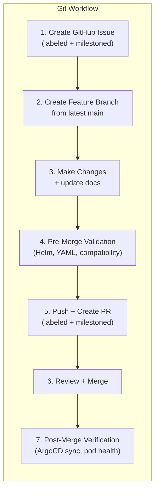

# Git Workflow

The `main` branch is **protected**. No agent — Cursor, OpenClaw, or human — pushes directly to `main`. All changes require a feature branch and a pull request with at least one approving review.

This page documents the unified git workflow that both Cursor (local IDE) and OpenClaw (autonomous K8s agents) follow.

## Overview



## Branch Protection Rules

| Rule | Enforcement |
|---|---|
| Direct pushes to `main` | Blocked |
| Force pushes to `main` | Blocked |
| PR required for merge | Yes — at least 1 approving review |
| Linear history | Required |
| Branch deletion after merge | Recommended |

## Cursor (Local IDE) Workflow

Cursor operates interactively on the local filesystem. It follows the same protected-branch rules but without the OpenClaw agent footprint conventions.

### Step-by-step

1. **Start from latest main:**

```bash
git checkout main && git pull origin main
git checkout -b <type>/<short-description>
```

2. **Make changes** to manifests, config, code, and docs.

3. **Commit** with conventional messages:

```bash
git add <files>
git commit -m "<type>: <description>"
```

4. **Keep branch fresh** — before every push:

```bash
git fetch origin main
git merge origin/main --no-edit
```

5. **Push and create a PR:**

```bash
git push -u origin HEAD
gh pr create --title "<type>: <description>" --body "<summary>"
```

6. **After merge**, clean up:

```bash
git checkout main && git pull origin main
git branch -d <branch-name>
git push origin --delete <branch-name>
```

### Branch naming

| Prefix | Use for |
|---|---|
| `feat/` | New features, services, resources |
| `fix/` | Bug fixes, misconfigurations |
| `chore/` | Maintenance, dependency updates, cleanup |
| `docs/` | Documentation-only changes |
| `refactor/` | Restructuring without behavior change |
| `security/` | Security hardening, vulnerability fixes |

### Commit message format

```
<type>: <description>
```

Examples:

- `feat: add incident response skill and pre-merge validation`
- `fix: correct Helm value path for Authentik securityContext`
- `docs: update networking table with new Tailscale port`

## OpenClaw Agent Workflow

OpenClaw agents follow the same branch protection rules with additional traceability requirements. Every action must be attributable to the specific agent that performed it.

### Step-by-step

1. **Workspace setup** (once per session):

```bash
cd /data/workspaces/<agent-id>
gh repo clone holdennguyen/homelab homelab 2>/dev/null || \
  (cd homelab && git checkout main && git pull origin main)
cd homelab
git config user.name "<agent-id>[bot]"
git config user.email "<agent-id>@openclaw.homelab"
```

2. **Create a labeled GitHub issue** assigned to the current milestone:

```bash
gh issue create \
  --title "<type>: <description>" \
  --body "<details>

---
Agent: <agent-id> | OpenClaw Homelab" \
  --assignee holdennguyen \
  --label "agent:<agent-id>,type:<type>,area:<area>,priority:<priority>" \
  --milestone "<current-milestone>" \
  --repo holdennguyen/homelab
```

3. **Create a branch** from latest main:

```bash
git checkout main && git pull origin main
git checkout -b <agent-id>/<type>/<issue-number>-<short-description>
```

4. **Make changes** to manifests, config, docs.

5. **Commit** with issue reference and agent tag:

```bash
git add <files>
git commit -m "<type>: <description> (#<issue-number>) [<agent-id>]"
```

6. **Keep branch fresh** — before every push:

```bash
git fetch origin main
git merge origin/main --no-edit
```

7. **Push and create a labeled PR** assigned to the same milestone:

```bash
git push -u origin HEAD
gh pr create \
  --title "<type>: <description>" \
  --assignee holdennguyen \
  --label "agent:<agent-id>,type:<type>,area:<area>,priority:<priority>" \
  --milestone "<current-milestone>" \
  --body "Closes #<issue-number>

## Summary
- <what changed and why>

## Test plan
- [ ] ArgoCD syncs successfully
- [ ] Service health verified
- [ ] Documentation updated

---
Agent: <agent-id> | OpenClaw Homelab"
```

8. **Report** the PR URL back to the orchestrator or user.

### Agent footprint

Every OpenClaw agent action is traceable via mandatory conventions:

| Artifact | Format | Example |
|---|---|---|
| Git commit author | `<agent-id>[bot] <<agent-id>@openclaw.homelab>` | `devops-sre[bot] <devops-sre@openclaw.homelab>` |
| Commit message | `<type>: <desc> (#<issue>) [<agent-id>]` | `feat: add redis (#42) [devops-sre]` |
| Branch name | `<agent-id>/<type>/<issue>-<desc>` | `devops-sre/feat/42-redis-caching` |
| Issue/PR labels | `agent:<agent-id>` | `agent:devops-sre` |
| Issue/PR body | Footer: `Agent: <id> \| OpenClaw Homelab` | — |

### Agent git identities

| Agent | `user.name` | `user.email` |
|---|---|---|
| `homelab-admin` | `homelab-admin[bot]` | `homelab-admin@openclaw.homelab` |
| `devops-sre` | `devops-sre[bot]` | `devops-sre@openclaw.homelab` |
| `software-engineer` | `software-engineer[bot]` | `software-engineer@openclaw.homelab` |
| `security-analyst` | `security-analyst[bot]` | `security-analyst@openclaw.homelab` |
| `qa-tester` | `qa-tester[bot]` | `qa-tester@openclaw.homelab` |

## GitHub Labels

Every issue and PR MUST be labeled. Labels are the tracking and filtering mechanism for all agents.

| Category | Labels | Rule |
|---|---|---|
| **Agent** | `agent:homelab-admin`, `agent:devops-sre`, `agent:software-engineer`, `agent:security-analyst`, `agent:qa-tester` | Exactly one (OpenClaw only) |
| **Type** | `type:feat`, `type:fix`, `type:chore`, `type:docs`, `type:refactor`, `type:security` | Exactly one |
| **Area** | `area:k8s`, `area:terraform`, `area:argocd`, `area:secrets`, `area:monitoring`, `area:networking`, `area:openclaw`, `area:auth`, `area:gitea` | One or more |
| **Priority** | `priority:critical`, `priority:high`, `priority:medium`, `priority:low` | Exactly one |
| **Semver** | `semver:breaking` | Only when a change has breaking impact regardless of type |
| **Status** | `status:reverted` | Applied to PRs that were merged then reverted |

## Branch Freshness

Feature branches MUST stay current with `main`. Stale branches cause merge conflicts and block ArgoCD sync after merge.

**Before every push:**

```bash
git fetch origin main
git merge origin/main --no-edit
```

**If the merge has conflicts:**

1. Do NOT force-push or reset
2. Resolve conflicts in every affected file
3. `git add <resolved-files> && git merge --continue`
4. If conflicts are too complex, report to the orchestrator (or user) with the list of conflicting files

**When to run this:**

- Before your first commit on a new branch (right after `git checkout -b`)
- Before every `git push`
- When `main` has been updated while your branch/PR is open

## Pre-Merge Validation

Run these checks before merging any PR that modifies cluster resources.

### Manifest validation

- [ ] YAML is valid: `kubectl apply --dry-run=client -f <file>`
- [ ] Labels follow `app.kubernetes.io/*` conventions
- [ ] Namespace exists or `CreateNamespace=true` is set
- [ ] No secrets or credentials in the diff

### Helm chart value verification

Before changing any Helm `valuesObject` in an ArgoCD Application CR:

```bash
# Verify the key exists in the chart
helm show values <repo>/<chart> --version <version> | grep -A5 "<key>"

# Confirm the value renders into the output
helm template <release> <repo>/<chart> --version <version> \
  --set <key>=<value> | grep -A10 "<expected-output>"
```

!!! warning "Charts silently ignore unknown keys"
    If a key doesn't appear in `helm show values`, the chart will accept it without error but it will have **no effect** on the rendered manifests. This was the root cause of the PR #11 incident where `controller.securityContext` (External Secrets) and `infisical.securityContext` (Infisical) were silently ignored.

### Service compatibility

- [ ] Container image supports proposed `securityContext` (check for s6-overlay, tini, or similar init systems)
- [ ] Volume permissions match `fsGroup`/`runAsUser`
- [ ] Upstream chart docs confirm the value path

### Cross-service impact

- [ ] Changes don't break sync wave dependencies
- [ ] Shared resources (ClusterRoles, CRDs) are not removed or renamed
- [ ] ExternalSecrets still reference valid keys

## Post-Merge Verification

After every merge to `main`, verify the deployment succeeded:

```bash
# 1. ArgoCD application health (wait ~3 minutes for sync)
kubectl get applications -n argocd

# 2. Pod health across all namespaces
kubectl get pods -A | grep -v Running | grep -v Completed

# 3. ExternalSecrets synced
kubectl get externalsecrets -A

# 4. Service endpoints reachable
curl -sf http://localhost:30300/api/v1/version   # Gitea
curl -sf http://localhost:30400/api/health        # Grafana
curl -sf http://localhost:30600/api/v3/root/config/  # Authentik
curl -sf http://localhost:30789/health            # OpenClaw

# 5. No error events
kubectl get events -A --sort-by='.lastTimestamp' --field-selector type!=Normal | tail -10
```

**If any check fails**, initiate rollback. See [Rollback Procedures](#rollback-procedures).

## Rollback Procedures

When a merge to `main` causes service degradation, roll back via git — ArgoCD auto-syncs the revert.

### Standard rollback (git revert)

```bash
# Revert a merge commit
git revert <bad-commit-sha> -m 1 --no-edit
git push origin main
```

### Multi-commit rollback (file restore)

```bash
# Restore files to a known-good commit
git checkout <known-good-sha> -- path/to/file1.yaml path/to/file2.yaml
git commit -m "revert: restore files to pre-<incident> state"
git push origin main
```

### ArgoCD recovery

If ArgoCD is stuck after a rollback:

```bash
# Cancel stuck operation
kubectl patch application <app> -n argocd \
  --type json -p '[{"op":"remove","path":"/operation"}]'

# Force-delete crashing pods
kubectl delete pod <pod> -n <namespace> --force --grace-period=0

# Force hard refresh on all applications
for app in $(kubectl get applications -n argocd -o jsonpath='{.items[*].metadata.name}'); do
  kubectl patch application "$app" -n argocd \
    --type merge -p '{"metadata":{"annotations":{"argocd.argoproj.io/refresh":"hard"}}}'
done
```

### Post-incident cleanup

After the cluster is recovered:

1. **Reopen** the auto-closed issue (feature was not delivered)
2. **Label** the reverted PR with `status:reverted`
3. **Assign** the issue to a future milestone for re-implementation
4. **Create per-service sub-issues** for safer re-implementation
5. **Post a post-incident report** on the PR with timeline, root cause, and action items

Full procedures are documented in `skills/incident-response/SKILL.md`.

## Semantic Versioning & Releases

The repository follows [Semantic Versioning 2.0.0](https://semver.org/) (`vMAJOR.MINOR.PATCH`).

### Version bump rules

| Condition | Bump | Example |
|---|---|---|
| Any PR has `semver:breaking` | **MAJOR** | Terraform state migration, removed service |
| At least one `type:feat` (no breaking) | **MINOR** | New service, new agent, new capability |
| Only fixes, chores, docs, refactors, security | **PATCH** | Bug fix, dependency update, doc improvement |

### Milestones

GitHub Milestones group issues and PRs into planned releases:

- Named with the target version (e.g., `v1.1.0`)
- Every issue and PR MUST be assigned to a milestone
- `homelab-admin` creates milestones and adjusts versions if breaking changes appear
- If no open milestone exists, ask the orchestrator (or user) to create one

### Release process

Owned by `homelab-admin` or the user — sub-agents never create tags or releases:

1. Verify all issues in the milestone are closed
2. Check for `status:reverted` PRs (merge + revert = net zero, exclude from changelog)
3. Determine the version from the highest-impact non-reverted PR
4. Create a git tag and GitHub Release: `gh release create "v<version>" --target main --generate-notes --latest`
5. Close the milestone and create the next one

### Milestone reassessment

When incidents, reverts, or scope changes alter a milestone's planned work, the release manager must reassess before cutting the release.

**When to reassess:**

- A PR in the milestone was merged then reverted
- Sibling PRs from the same batch were closed without merge
- Planned features were deferred to a future milestone
- Orphaned merged PRs (no milestone) are discovered

**Procedure:**

1. **Triage sibling PRs** — unreviewed PRs created in the same batch as a reverted PR share the same quality risks. Close them and rewrite with proper pre-merge validation.

2. **Move deferred work** — parent issues of closed PRs go to the next milestone with fresh per-service sub-issues.

3. **Assign orphaned merged PRs** — any merged PR without a milestone must be assigned:

```bash
gh pr list --repo holdennguyen/homelab --state merged --json number,title,milestone \
  --jq '.[] | select(.milestone == null) | "\(.number) | \(.title)"'
```

4. **Update milestone description** — explain the scope change:

```bash
gh api repos/holdennguyen/homelab/milestones/<number> --method PATCH \
  -f description="<updated scope and rationale>"
```

5. **Reassess version bump** — if the only `type:feat` PRs were reverted, the effective bump may change (e.g., MINOR → PATCH).

6. **Release what's shipped** — if the milestone has 0 open issues, cut the release with what's already merged. Don't hold a milestone open waiting for deferred work.

!!! tip "Release what you have, not what you planned"
    A milestone that lost its flagship feature to a revert is still releasable if it contains other merged work (infrastructure, docs, tooling). Rescope the description, adjust the version if needed, and ship it. Deferred features go to the next milestone.

## What NOT to Do

- Never push directly to `main`
- Never force-push to `main`
- Never commit secrets, API keys, or credentials
- Never bundle unrelated changes in one PR
- Never assume a Helm value key exists — always verify with `helm show values`
- Never apply `securityContext` changes without verifying image compatibility
- Never skip documentation updates in implementation PRs
- Never create an issue or PR without labels (OpenClaw agents)
- Never omit the agent footprint from any artifact (OpenClaw agents)
- Never rely on `kubectl rollout undo` as a permanent fix — ArgoCD will overwrite it

## Quick Reference

### Cursor

```bash
git checkout main && git pull origin main
git checkout -b feat/my-feature
# ... make changes ...
git add . && git commit -m "feat: my feature"
git fetch origin main && git merge origin/main --no-edit
git push -u origin HEAD
gh pr create --title "feat: my feature" --body "Summary of changes"
# After merge:
git checkout main && git pull origin main
git branch -d feat/my-feature
```

### OpenClaw agent

```bash
# Setup
cd /data/workspaces/<agent-id>
gh repo clone holdennguyen/homelab homelab 2>/dev/null || (cd homelab && git checkout main && git pull origin main)
cd homelab
git config user.name "<agent-id>[bot]"
git config user.email "<agent-id>@openclaw.homelab"

# Issue + branch
gh issue create --title "<type>: <desc>" --label "agent:<id>,type:<t>,area:<a>,priority:<p>" --milestone "<ms>" ...
git checkout main && git pull origin main
git checkout -b <agent-id>/<type>/<issue>-<desc>

# Changes + commit + push + PR
git add <files>
git commit -m "<type>: <desc> (#<issue>) [<agent-id>]"
git fetch origin main && git merge origin/main --no-edit
git push -u origin HEAD
gh pr create --title "<type>: <desc>" --label "agent:<id>,..." --milestone "<ms>" ...
```
