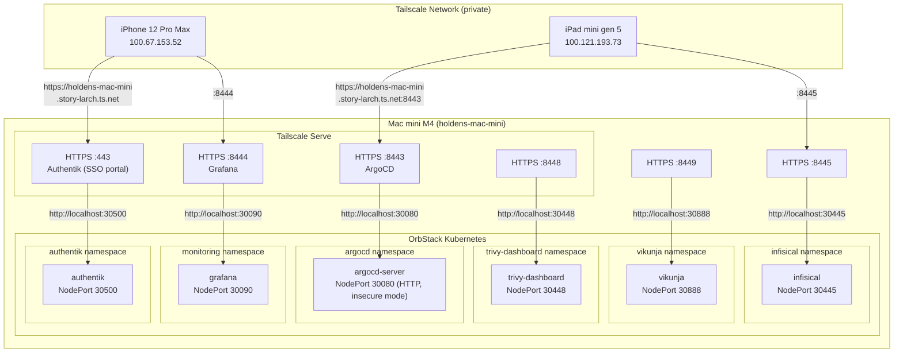
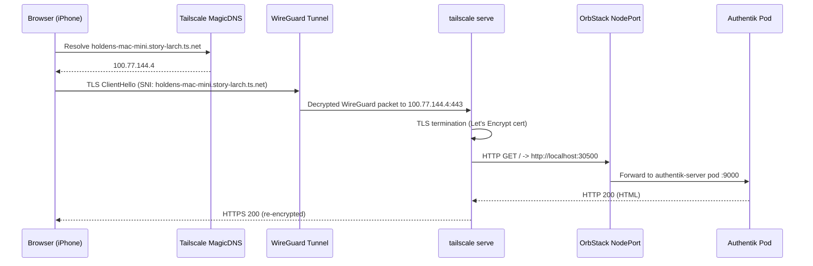
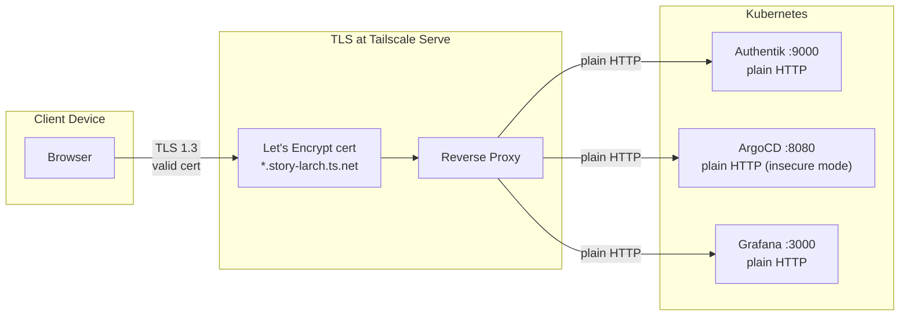
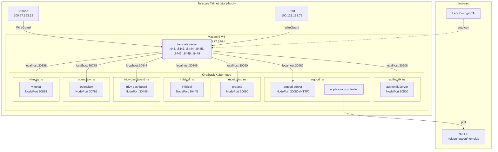

# Networking: Tailscale + NodePort

This document explains how services running inside the OrbStack Kubernetes cluster on a headless Mac mini M4 are exposed to all devices on a private Tailscale network (tailnet).

## The Problem

Three constraints shape the networking setup:

1. **OrbStack NodePorts bind to localhost only.** Unlike cloud Kubernetes, OrbStack's single-node cluster exposes NodePort services on `127.0.0.1`, not on the host's LAN or Tailscale interfaces.
2. **No Ingress controller is installed.** A full nginx/traefik deployment is unnecessary for a homelab.
3. **The Mac mini is headless.** All access comes from other devices (iPhone, iPad, other machines) over Tailscale.

## Solution: NodePort + Tailscale Serve

The architecture uses two layers:

- **NodePort** -- makes Kubernetes services reachable at `localhost:<port>` on the Mac mini
- **Tailscale Serve** -- listens on the Tailscale interface, terminates TLS with auto-provisioned Let's Encrypt certificates, and reverse-proxies to the localhost NodePorts



## Request Path (Detailed)

A browser request to `https://holdens-mac-mini.story-larch.ts.net` traverses five hops:



| Hop | From | To | Protocol | Purpose |
|-----|------|----|----------|---------|
| 1 | Browser | MagicDNS (100.100.100.100) | DNS | Resolves `*.story-larch.ts.net` to Tailscale IP |
| 2 | Browser | Mac mini (100.77.144.4) | WireGuard | Encrypted tunnel between devices |
| 3 | Tailscale interface | `tailscale serve` | TLS | TLS termination with LE cert |
| 4 | `tailscale serve` | `localhost:30500` | HTTP | Reverse proxy to NodePort |
| 5 | NodePort | Authentik Pod `:9000` | HTTP | Kubernetes Service routing |

## Layer 1: Kubernetes NodePort Services

### Port Map

| Service | Container Port | NodePort | localhost URL |
|---------|---------------|----------|---------------|
| Authentik | 9000 | 30500 | `http://localhost:30500` |
| ArgoCD HTTP | 8080 | 30080 | `http://localhost:30080` |
| Grafana | 3000 | 30090 | `http://localhost:30090` |
| Infisical | 8080 | 30445 | `http://localhost:30445` |
| Trivy Dashboard | 8900 | 30448 | `http://localhost:30448` |
| OpenClaw | 18789 | 30789 | `http://localhost:30789` |
| Vikunja | 3456 | 30888 | `http://localhost:30888` |

## Layer 2: Tailscale Serve

`tailscale serve` runs as a background daemon on the Mac mini. It listens on the Tailscale network interface (`100.77.144.4`) and proxies incoming HTTPS requests to local ports.

### Configuration Commands

```bash
# Authentik (SSO portal) — default HTTPS port (443)
tailscale serve --bg http://localhost:30500

# ArgoCD — custom HTTPS port (8443); ArgoCD runs in insecure mode so plain HTTP
tailscale serve --bg --https 8443 http://localhost:30080

# Grafana — custom HTTPS port (8444)
tailscale serve --bg --https 8444 http://localhost:30090

# Infisical — custom HTTPS port (8445)
tailscale serve --bg --https 8445 http://localhost:30445

# Trivy Dashboard — custom HTTPS port (8448)
tailscale serve --bg --https 8448 http://localhost:30448

# OpenClaw — custom HTTPS port (8447)
tailscale serve --bg --https 8447 http://localhost:30789

# Vikunja — custom HTTPS port (8449)
tailscale serve --bg --https 8449 http://localhost:30888
```

The `--bg` flag runs the proxy as a persistent background service that survives terminal sessions.

### How TLS Works



Tailscale automatically provisions and renews Let's Encrypt certificates for the `*.ts.net` domain. No manual certificate management, no cert-manager, no self-signed certs.

### Verify Status

```bash
$ tailscale serve status

https://holdens-mac-mini.story-larch.ts.net (tailnet only)
|-- / proxy http://localhost:30500

https://holdens-mac-mini.story-larch.ts.net:8443 (tailnet only)
|-- / proxy http://localhost:30080

https://holdens-mac-mini.story-larch.ts.net:8444 (tailnet only)
|-- / proxy http://localhost:30090

https://holdens-mac-mini.story-larch.ts.net:8445 (tailnet only)
|-- / proxy http://localhost:30445

https://holdens-mac-mini.story-larch.ts.net:8447 (tailnet only)
|-- / proxy http://localhost:30789

https://holdens-mac-mini.story-larch.ts.net:8448 (tailnet only)
|-- / proxy http://localhost:30448

https://holdens-mac-mini.story-larch.ts.net:8449 (tailnet only)
|-- / proxy http://localhost:30888
```

### Manage Serve

```bash
# Stop Authentik proxy
tailscale serve --https=443 off

# Stop ArgoCD proxy
tailscale serve --https=8443 off

# Stop Grafana proxy
tailscale serve --https=8444 off

# Stop Trivy Dashboard proxy
tailscale serve --https=8448 off

# Stop OpenClaw proxy
tailscale serve --https=8447 off

# Stop Vikunja proxy
tailscale serve --https=8449 off

# Reset all serve config
tailscale serve reset
```

## Layer 3: Tailscale Network (Tailnet)

### MagicDNS

Tailscale's MagicDNS automatically resolves `<hostname>.story-larch.ts.net` to the device's Tailscale IP across all devices on the tailnet. No `/etc/hosts` entries or custom DNS servers needed.

| Device | Tailscale IP | DNS Name |
|--------|-------------|----------|
| Mac mini M4 | `100.77.144.4` | `holdens-mac-mini.story-larch.ts.net` |
| iPad mini gen 5 | `100.121.193.73` | `ipad-mini-gen-5.story-larch.ts.net` |
| iPhone 12 Pro Max | `100.67.153.52` | `iphone-12-pro-max.story-larch.ts.net` |

### Access URLs

| Service | URL | Port | Auth |
|---------|-----|------|------|
| Authentik (SSO) | `https://holdens-mac-mini.story-larch.ts.net` | 443 (default) | SSO portal (Homelab Homepage) |
| ArgoCD | `https://holdens-mac-mini.story-larch.ts.net:8443` | 8443 | SSO via Authentik |
| Grafana | `https://holdens-mac-mini.story-larch.ts.net:8444` | 8444 | SSO via Authentik |
| Infisical | `https://holdens-mac-mini.story-larch.ts.net:8445` | 8445 | Local admin |
| OpenClaw | `https://holdens-mac-mini.story-larch.ts.net:8447` | 8447 | SSO portal bookmark |
| Trivy Dashboard | `https://holdens-mac-mini.story-larch.ts.net:8448` | 8448 | SSO portal bookmark |
| Vikunja | `https://holdens-mac-mini.story-larch.ts.net:8449` | 8449 | SSO via Authentik |

### Tailscale Serve vs Funnel

| Feature | `tailscale serve` | `tailscale funnel` |
|---------|-------------------|-------------------|
| Audience | Tailnet devices only | Public internet |
| TLS | Let's Encrypt via Tailscale | Let's Encrypt via Tailscale |
| Auth | Tailscale identity (WireGuard) | None (public) |
| Use here | Yes | No -- homelab should stay private |

## Why Not an Ingress Controller?

| Approach | Pros | Cons |
|----------|------|------|
| **Tailscale Serve + NodePort** (current) | Zero config TLS, no extra pods, works on headless Mac, private by default | Requires Tailscale on all client devices |
| nginx-ingress / Traefik | Standard K8s pattern, works with any client | Extra pods, manual TLS (cert-manager), DNS setup, overkill for homelab |
| `kubectl port-forward` | No config needed | Manual, dies when terminal closes, no TLS, single user |
| LoadBalancer (MetalLB) | Standard K8s pattern | Complex setup for single-node, still need TLS and DNS |

For a single-node homelab with Tailscale already in use, NodePort + `tailscale serve` is the simplest path to secure, private, multi-device access.

## Complete Network Topology



## Troubleshooting

| Symptom | Cause | Fix |
|---------|-------|-----|
| `Could not resolve host: *.story-larch.ts.net` | MagicDNS not enabled or not propagated | Enable MagicDNS in Tailscale admin; or add `100.77.144.4 holdens-mac-mini.story-larch.ts.net` to `/etc/hosts` |
| `connection refused` on NodePort | Pod not running or Service not NodePort | `kubectl get svc,pods -n <namespace>` |
| `Serve is not enabled on your tailnet` | Tailscale Serve feature not activated | Visit the URL shown in the error to enable it |
| TLS certificate error in browser | `tailscale serve` not running | `tailscale serve status`; restart with `--bg` commands |
| ArgoCD returns 502 | ArgoCD pod restarting or not ready | `kubectl get pods -n argocd` |
| Works from iPhone but not Mac mini | MagicDNS resolves on mobile but not macOS | Add `/etc/hosts` entry or verify macOS Tailscale has MagicDNS enabled |

## Security: Default-Deny Network Policies

To enforce the principle of least privilege, a comprehensive set of NetworkPolicy resources has been deployed across all application namespaces. These policies implement a *default-deny* security posture: all ingress and egress traffic is blocked unless explicitly allowed.

### Policies in Place

Each namespace has three foundational policies:

- **default-deny-all**: Blocks all ingress and egress traffic.
- **allow-same-namespace**: Allows unrestricted communication between pods within the same namespace (required for intra-application communication).
- **allow-dns**: Allows egress to the cluster's DNS service (CoreDNS) for name resolution on UDP/TCP port 53.

Additionally, namespace-specific rules enable required connectivity:

- **Tailscale Ingress**: Services exposed via Tailscale have ingress restricted to the Tailscale CIDR (`100.64.0.0/10`) on the NodePort service ports.
- **API Server Access**: Namespaces that need to communicate with the Kubernetes API (e.g., `argocd`, `openclaw`, `monitoring`, `external-secrets`) have an egress rule permitting traffic to the API server on port 6443.
- **Internet Egress**: The `argocd` and `openclaw` namespaces are allowed to egress to the internet on ports 443 (HTTPS) and 22 (SSH) to facilitate Git operations and external API calls.
- **External Secrets**: The `external-secrets` namespace can egress to the Infisical API (`infisical` namespace, port 8080); conversely, `infisical` has an ingress rule allowing traffic from `external-secrets` on that port.

Additionally, the `vikunja` namespace follows the same pattern with deny-all, allow-same-namespace, allow-dns, and Tailscale ingress on port 3456.

The complete set of policies is stored in `k8s/apps/networking-policies/`.

### Tailscale CIDR

All Tailscale devices are assigned IPs in the range `100.64.0.0/10`. Ingress rules for services use this CIDR to ensure only tailnet devices can access them.

### Future Considerations

When adding new services, corresponding network policies should be created to maintain the default-deny security model.
