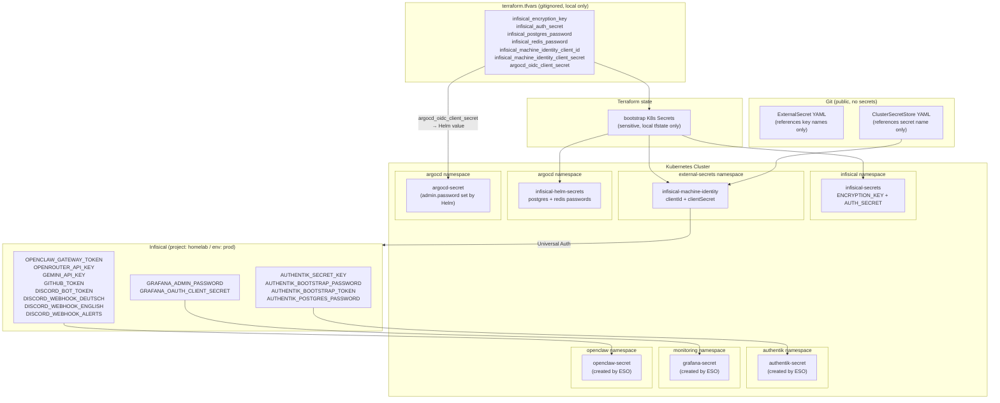
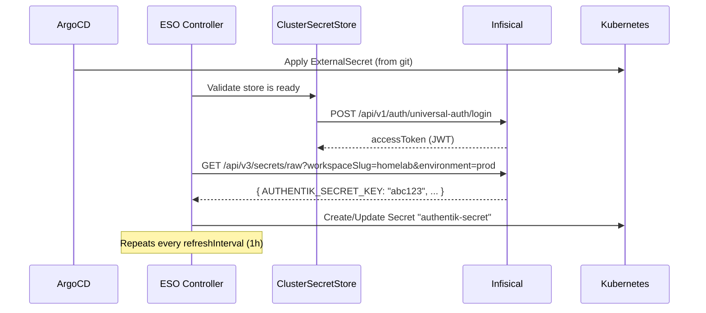
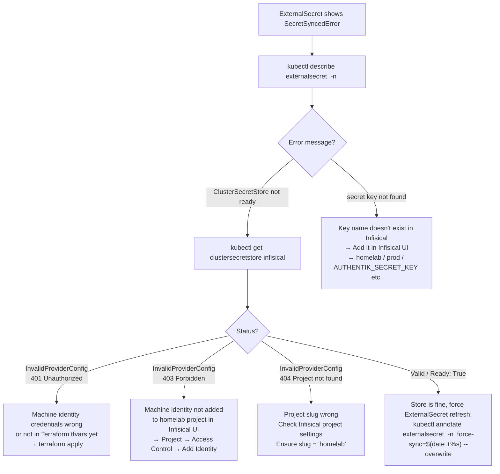

# Secret Management

This document covers how secrets are managed in the homelab: where they are stored, how they flow into running pods, how to add secrets for new services, and how to rotate credentials.

## Design Principles

1. **No secrets in git** — no `Secret` YAML files are committed. Only `ExternalSecret` resources (which reference secret names, not values) live in git.
2. **Infisical is the single source of truth** — all application credentials live in one place with an audit trail.
3. **Terraform owns bootstrap secrets** — a small set of credentials that Infisical itself needs to start (ENCRYPTION_KEY, AUTH_SECRET, postgres/redis passwords) are injected by Terraform from a local `terraform.tfvars` file that is gitignored.
4. **ESO bridges Infisical to Kubernetes** — the External Secrets Operator watches `ExternalSecret` resources and creates real `Secret` objects in the cluster, polling Infisical every hour.
5. **Least privilege** — both ESO and Infisical run with non-root security contexts and read-only root filesystems where supported by their upstream charts. See each service's `README.md` for security details.

## Secret Layers



## Bootstrap Secrets (Terraform-Managed)

These secrets are the "chicken-and-egg" exceptions — they cannot come from Infisical because Infisical itself needs them to start. All are created by `terraform apply`, live in `terraform.tfstate` (local only), and are never committed to git.

| K8s Secret | Namespace | Keys | Purpose |
|---|---|---|---|
| `infisical-secrets` | `infisical` | `ENCRYPTION_KEY`, `AUTH_SECRET` | Infisical app encryption and session signing |
| `infisical-helm-secrets` | `argocd` | `values.yaml` (YAML blob) | Postgres + Redis passwords passed to Infisical Helm chart via ArgoCD Application |
| `infisical-machine-identity` | `external-secrets` | `clientId`, `clientSecret` | ESO authenticates to Infisical using this Universal Auth identity |
| `argocd-secret` | `argocd` | `oidc.argocd.clientSecret` | ArgoCD OIDC client secret for Authentik SSO — set via Terraform `set_sensitive` Helm value. **Not** managed by ESO to avoid annotation-propagation conflicts. |

## Infisical Project Structure

```mermaid
flowchart LR
    subgraph infisical["Infisical"]
        subgraph org["Organization"]
            subgraph project["Project: homelab\nslug: homelab"]
                subgraph prod["Environment: prod"]
                    subgraph path["Secret Path: /"]
                        s9["AUTHENTIK_SECRET_KEY"]
                        s10["AUTHENTIK_BOOTSTRAP_PASSWORD"]
                        s11["AUTHENTIK_BOOTSTRAP_TOKEN"]
                        s12["AUTHENTIK_POSTGRES_PASSWORD"]
                        s13["GRAFANA_ADMIN_PASSWORD"]
                        s14["GRAFANA_OAUTH_CLIENT_SECRET"]
                        s16["OPENCLAW_GATEWAY_TOKEN"]
                        s17["OPENROUTER_API_KEY"]
                        s18["GEMINI_API_KEY"]
                        s19["GITHUB_TOKEN"]
                        s20["DISCORD_BOT_TOKEN"]
                        s25["DISCORD_WEBHOOK_DEUTSCH"]
                        s26["DISCORD_WEBHOOK_ENGLISH"]
                        s27["DISCORD_WEBHOOK_ALERTS"]
                    end
                end
            end
            subgraph identities["Machine Identities"]
                MI["homelab-eso\nUniversal Auth"]
            end
        end
    end

    MI -- "Member role\non homelab project" --> project
```



> **ArgoCD OIDC client secret** is the only secret managed via Terraform instead of ESO (to avoid annotation-propagation conflicts with `argocd-secret`). All other secrets are pulled from Infisical by ESO.

The ClusterSecretStore in `k8s/apps/external-secrets/cluster-secret-store.yaml` is configured with:

- `projectSlug: homelab`
- `environmentSlug: prod`
- `secretsPath: /`

This means any `ExternalSecret` using this store references secrets by their key name directly (e.g., `key: AUTHENTIK_SECRET_KEY`).

## How ExternalSecrets Work

Each application that needs secrets has an `ExternalSecret` resource in its kustomization directory. ArgoCD syncs the `ExternalSecret` to the cluster; ESO then creates the actual `Secret`.



## Adding Secrets for a New Service

When deploying a new service that needs secrets, follow these steps:

### Step 1: Add the secret to Infisical

Open `https://holdens-mac-mini.story-larch.ts.net:8445`, navigate to the `homelab` project → `prod` environment, and add your secret (e.g., `MY_SERVICE_API_KEY`).

### Step 2: Create an ExternalSecret manifest

Create `k8s/apps/my-service/external-secret.yaml`:

```yaml
apiVersion: external-secrets.io/v1
kind: ExternalSecret
metadata:
  name: my-service-secret
  namespace: my-service
spec:
  refreshInterval: 1h
  secretStoreRef:
    name: infisical
    kind: ClusterSecretStore
  target:
    name: my-service-secret
    creationPolicy: Owner
  data:
    - secretKey: API_KEY
      remoteRef:
        key: MY_SERVICE_API_KEY
```

### Step 3: Add to kustomization

In `k8s/apps/my-service/kustomization.yaml`, add:

```yaml
resources:
  - external-secret.yaml
  # ... other resources
```

### Step 4: Reference the Secret in the Deployment

```yaml
env:
  - name: API_KEY
    valueFrom:
      secretKeyRef:
        name: my-service-secret
        key: API_KEY
```

### Step 5: Push to git

ArgoCD will detect the new `ExternalSecret` and sync it. ESO will then create the K8s `Secret` within seconds. The Deployment will get the secret on next rollout.

## Credential Rotation

### Rotating the Machine Identity (ESO ↔ Infisical)

1. In the Infisical UI, go to **Settings → Machine Identities** → create a new identity or generate new credentials for the existing one.
2. Update `terraform/terraform.tfvars`:
   ```hcl
   infisical_machine_identity_client_id     = "<new-client-id>"
   infisical_machine_identity_client_secret = "<new-client-secret>"
   ```
3. Apply:
   ```bash
   cd terraform && terraform apply
   ```
   Terraform updates only the `infisical-machine-identity` K8s Secret. ESO picks up the new credentials on its next poll cycle (~30s).

### Rotating the Infisical ENCRYPTION_KEY / AUTH_SECRET

> **Warning:** Changing `ENCRYPTION_KEY` requires a data migration — all encrypted secrets in Infisical's database must be re-encrypted. Do this only if the key is compromised, and follow the [Infisical key rotation guide](https://infisical.com/docs/self-hosting/configuration/envars) first.

1. Update `terraform/terraform.tfvars` with new values.
2. Run `terraform apply`.
3. Restart the Infisical pod: `kubectl rollout restart deployment -n infisical -l app.kubernetes.io/component=infisical`

### Rotating the ArgoCD OIDC Client Secret

ArgoCD's OIDC client secret for Authentik SSO is managed through Terraform Helm values, not ESO.

1. Generate a new client secret in Authentik (UI or API) for the `argocd` provider.
2. Update `terraform/terraform.tfvars`:
   ```hcl
   argocd_oidc_client_secret = "<new-secret>"
   ```
3. Apply:
   ```bash
   cd terraform && terraform apply
   ```
   Helm updates `argocd-secret` with the new OIDC secret. ArgoCD picks it up on the next login — no pod restart required.

### Updating an Application Secret

1. In the Infisical UI, update the secret value in `homelab / prod`.
2. ESO automatically reconciles within `refreshInterval` (1 hour). To apply immediately:
   ```bash
   kubectl annotate externalsecret <name> -n <namespace> \
     force-sync=$(date +%s) --overwrite
   ```
3. The K8s Secret is updated. Restart the consuming pod to pick up the new value:
   ```bash
   kubectl rollout restart deployment <name> -n <namespace>
   ```

## Troubleshooting



| Symptom | Cause | Fix |
|---|---|---|
| `ClusterSecretStore` shows `InvalidProviderConfig` 401 | Wrong machine identity credentials | `terraform apply` with correct credentials in tfvars |
| `ClusterSecretStore` shows `InvalidProviderConfig` 403 | Machine identity not added to Infisical project | Infisical UI → Project → Access Control → Machine Identities → Add |
| `ClusterSecretStore` shows `InvalidProviderConfig` 404 | Wrong project slug | Infisical UI → Project Settings → confirm slug is `homelab` |
| `ExternalSecret` shows `SecretSyncedError` after store becomes valid | Cached old error state | `kubectl annotate externalsecret <name> -n <ns> force-sync=$(date +%s) --overwrite` |
| Pod can't start, missing secret keys | ExternalSecret not synced yet | `kubectl get externalsecret -n <ns>` — wait for `SecretSynced: True` |
| Infisical pod crashes on startup | `infisical-secrets` K8s Secret is wrong/missing | Check `kubectl get secret infisical-secrets -n infisical`; re-run `terraform apply` |
