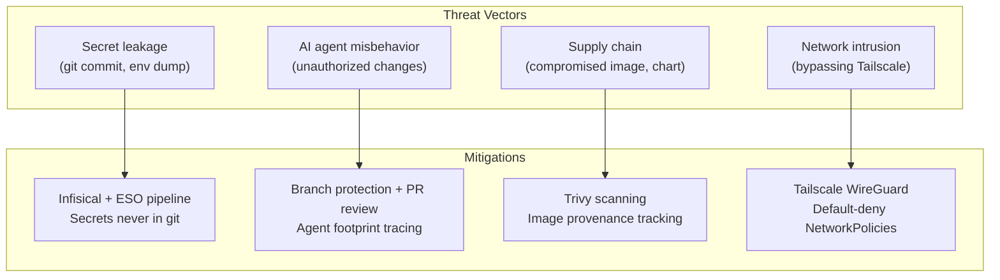
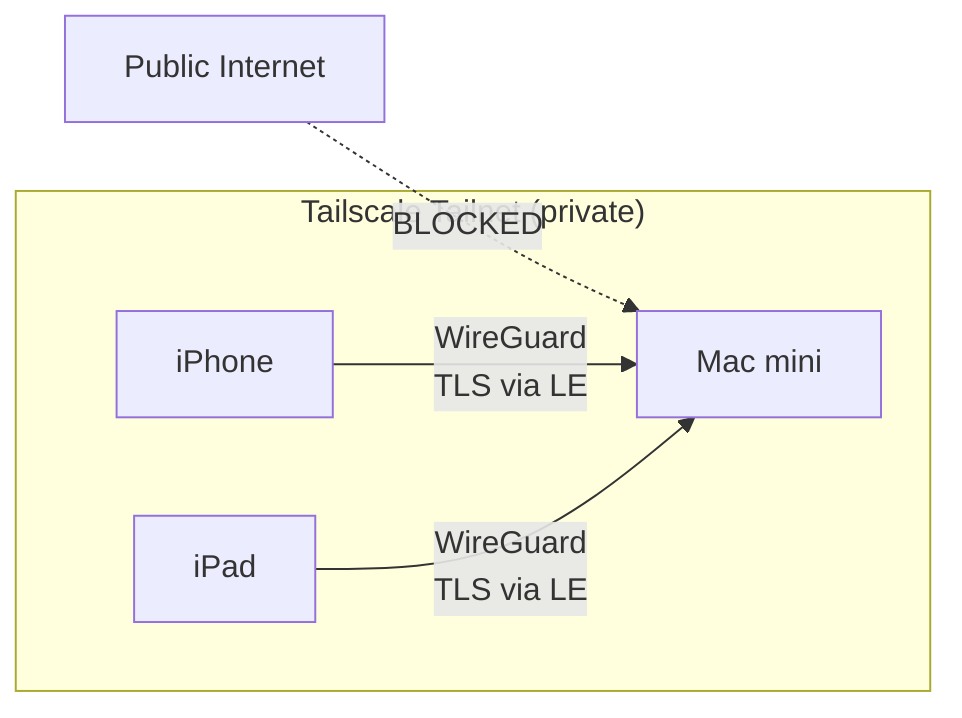
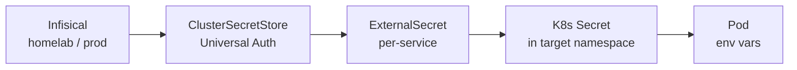
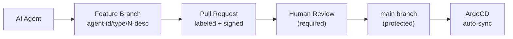
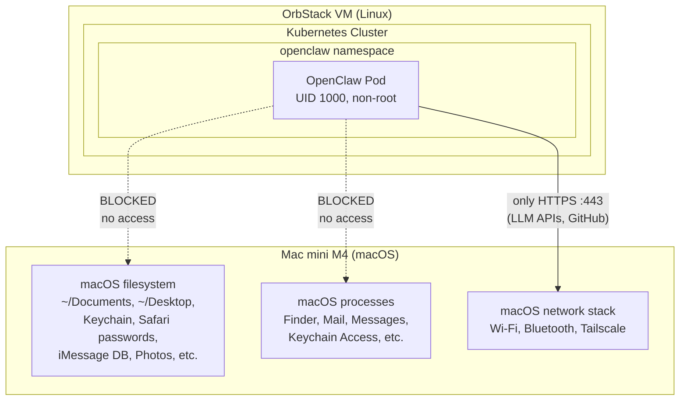
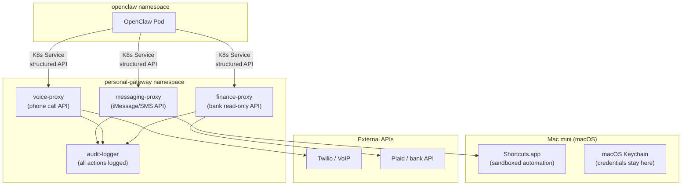
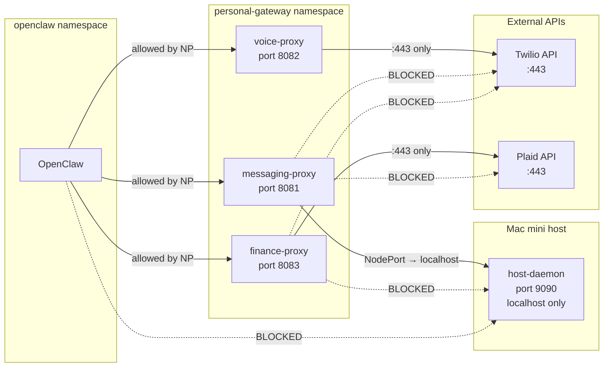

# Security

**Last reviewed:** March 8, 2025 — security documentation is current; no policy changes pending.

This document is the consolidated security report for the homelab. It covers the overall security posture, per-layer controls, and a dedicated section on LLM/AI agent (OpenClaw) permissions. This report is tracked by the doc-freshness system and should be reviewed and updated with every release.

## Overview

The homelab follows a defense-in-depth model across three dimensions: **network isolation** (Tailscale-only access, default-deny NetworkPolicies), **workload hardening** (Pod Security Standards, non-root containers, least-privilege RBAC), and **secret hygiene** (Infisical-managed secrets that never touch git). All cluster changes flow through GitOps (ArgoCD with self-heal), and all code changes require pull request review on a protected `main` branch.

## Threat Model

The homelab operates under a constrained threat model that differs significantly from a production cloud environment:

| Factor | Detail |
|---|---|
| **Operator** | Single user (owner) — no multi-tenancy |
| **Network boundary** | Private Tailscale tailnet only — no public internet exposure |
| **Devices on tailnet** | 3 devices: Mac mini M4 (`100.77.144.4`), iPhone 12 Pro Max (`100.67.153.52`), iPad mini gen 5 (`100.121.193.73`) |
| **Cluster topology** | Single-node OrbStack Kubernetes on macOS (arm64) |
| **Data sensitivity** | Infrastructure credentials, API keys, personal git repos |
| **Primary risks** | Secret leakage, misconfigured RBAC, AI agent misbehavior, supply chain compromise |



Since the tailnet is single-user with only owner-controlled devices, threats like unauthorized network access or multi-tenant privilege escalation are out of scope. The primary concerns are operational: accidental secret exposure, AI agent drift beyond intended scope, and supply chain integrity.

## Network Security

No services are exposed to the public internet. All external access flows through Tailscale Serve, which provides WireGuard encryption and automatic Let's Encrypt TLS certificates.

### Access Model



| Control | Status |
|---|---|
| LoadBalancer services | None — not used |
| Ingress controller | None — not deployed |
| NodePort binding | `localhost` only (OrbStack constraint) |
| External access | Tailscale Serve (WireGuard + auto TLS) |
| `tailscale funnel` (public) | **Disabled** — all endpoints are tailnet-only |

### Default-Deny Network Policies

Every application namespace has a `default-deny-all` NetworkPolicy that blocks all ingress and egress. Traffic is then explicitly allowed per namespace:

| Namespace | Foundational Policies | Namespace-Specific Rules |
|---|---|---|
| `argocd` | deny-all, allow-same-ns, allow-dns | Tailscale ingress (:8080), API server egress (:6443), internet egress (:443, :22) |
| `monitoring` | deny-all, allow-same-ns, allow-dns | Tailscale ingress (:3000), API server egress (:6443), internet egress (:443) |
| `authentik` | deny-all, allow-same-ns, allow-dns | Tailscale ingress (:9000, :9443) |
| `openclaw` | deny-all, allow-same-ns, allow-dns | Tailscale ingress (:18789), API server egress (:6443), internet egress (:443) |
| `external-secrets` | deny-all, allow-same-ns, allow-dns | API server egress (:6443), Infisical egress (:8080) |
| `infisical` | deny-all, allow-same-ns, allow-dns | Tailscale ingress (:8080), ingress from `external-secrets` (:8080) |

Tailscale ingress rules are locked to the CGNAT range `100.64.0.0/10`, ensuring only tailnet devices can reach services.

!!! note "OrbStack CNI limitation"
    OrbStack does not enforce NetworkPolicies at the CNI level. These policies serve as declarative intent and will be enforced if the cluster is migrated to a CNI that supports them (Cilium, Calico). They still provide value as documentation and as a GitOps-tracked security baseline.

## Pod Security Standards

Namespaces are labeled with Kubernetes Pod Security Standards (PSS) to control what workloads can run:

| Namespace | Enforce | Audit/Warn | Reason |
|---|---|---|---|
| `argocd` | `restricted` | `restricted` | Fully compliant |
| `external-secrets` | `restricted` | `restricted` | Fully compliant |
| `monitoring` | `baseline` | `restricted` | node-exporter requires host namespaces and hostPort |
| `authentik` | `baseline` | `restricted` | server/worker containers run as root, missing seccompProfile |
| `infisical` | `baseline` | `restricted` | standalone + ingress-nginx run as root, missing seccompProfile |
| `openclaw` | — | — | Excluded: uses hostPath volumes disallowed by the restricted profile |

Namespaces at `baseline` enforce + `restricted` audit/warn log violations without blocking pods, surfacing non-compliant workloads in audit logs for future remediation.

## RBAC

Every service runs under a dedicated ServiceAccount with least-privilege permissions. No service has `cluster-admin` access.

| Service | ServiceAccount | Scope | Permissions |
|---|---|---|---|
| OpenClaw | `openclaw` (ns: `openclaw`) | Namespace Role + ClusterRole | See [OpenClaw RBAC detail](#kubernetes-rbac) below |
| ArgoCD | `argocd-*` (ns: `argocd`) | ClusterRole | Managed by Helm chart — application controller needs cluster-wide access to sync resources |
| ESO | `external-secrets` (ns: `external-secrets`) | ClusterRole | Managed by Helm chart — needs cluster-wide access to create secrets in any namespace |
| Monitoring | `kube-prometheus-stack-*` | ClusterRole | Managed by Helm chart — Prometheus needs cluster-wide metrics scraping |

OpenClaw's RBAC was expanded from a namespace-only Role (v1.1.0–v1.3.0) to a namespace Role + targeted ClusterRole in v1.4.0. The ClusterRole grants cluster-wide read and scoped operational writes (rollout restart, force-sync, ArgoCD hard refresh) without granting `cluster-admin`. See the [full RBAC breakdown](#kubernetes-rbac) in the OpenClaw security section.

## Secret Management

Secrets follow a strict pipeline: **Infisical** (source of truth) -> **External Secrets Operator** (sync) -> **Kubernetes Secret** (consumed by pods). Secrets are never stored in git.

### Pipeline



### Controls

| Control | Implementation |
|---|---|
| Storage | Infisical (self-hosted, in-cluster) |
| Sync mechanism | ESO with `refreshInterval: 1h` |
| Git protection | `.gitignore` excludes `terraform.tfvars`, `*.tfstate`, `.env` |
| Bootstrap credentials | Created by Terraform from `terraform.tfvars` (gitignored) |
| Rotation | Manual via Infisical UI, force-sync with ESO annotation |
| Per-service isolation | Each service has its own ExternalSecret and K8s Secret |

### ExternalSecret Inventory

| ExternalSecret | Namespace | Keys |
|---|---|---|
| `openclaw-secret` | `openclaw` | `OPENCLAW_GATEWAY_TOKEN`, `OPENROUTER_API_KEY`, `GEMINI_API_KEY`, `GITHUB_TOKEN`, `DISCORD_BOT_TOKEN`, `DISCORD_WEBHOOK_DEUTSCH`, `DISCORD_WEBHOOK_ENGLISH`, `DISCORD_WEBHOOK_ALERTS`, `CURSOR_API_KEY` |
| `authentik-secret` | `authentik` | `AUTHENTIK_SECRET_KEY`, `AUTHENTIK_BOOTSTRAP_PASSWORD`, `AUTHENTIK_BOOTSTRAP_TOKEN`, `AUTHENTIK_POSTGRES_PASSWORD` |
| `grafana-secret` | `monitoring` | `GRAFANA_ADMIN_PASSWORD`, `GRAFANA_OAUTH_CLIENT_SECRET` |

## Container Security

### Non-Root Execution

| Service | `runAsUser` | `runAsNonRoot` | `readOnlyRootFilesystem` | Notes |
|---|---|---|---|---|
| OpenClaw | 1000 | `true` | no | Needs writable `/data` for workspaces |
| ArgoCD | Helm-managed | `true` | `true` | Restricted PSS compliant |
| ESO | Helm-managed | `true` | `true` | Restricted PSS compliant |
| Infisical | root | no | no | Upstream Helm default; hardening tracked in roadmap |
| Authentik | root | no | no | Upstream Helm default; hardening tracked in roadmap |

### Image Provenance

| Service | Image | Source | Pinned |
|---|---|---|---|
| OpenClaw | `openclaw:latest` | Built locally from submodule + `Dockerfile.openclaw` | Submodule pinned to commit |
| ArgoCD | `quay.io/argoproj/argocd` | Official upstream (Helm chart) | Chart version pinned |
| ESO | `ghcr.io/external-secrets/external-secrets` | Official upstream (Helm chart) | Chart version pinned |
| Prometheus/Grafana | kube-prometheus-stack images | Official upstream (Helm chart) | Chart version pinned |
| Trivy | `aquasecurity/trivy` | Official upstream (Helm chart) | Chart version pinned |

## Supply Chain Security

| Control | Status | Details |
|---|---|---|
| Branch protection on `main` | Enforced | PRs require review; no direct push; linear history required |
| ArgoCD repo access (HTTPS) | Active | Unauthenticated HTTPS clone of public repo — no credentials stored |
| ArgoCD self-heal | Enabled | Manual `kubectl` changes are reverted within ~3 minutes |
| Helm chart version pinning | Enforced | All Application CRs pin `targetRevision` |
| Container image scanning | Active | Trivy Operator (ClientServer mode) scans all running images |
| Signed commits | Not enforced | Tracked in hardening roadmap |
| Dependabot / Renovate | Not configured | Tracked in hardening roadmap |
| Image signing (cosign) | Not configured | Tracked in hardening roadmap |

## Vulnerability Scanning

Trivy Operator runs in **ClientServer mode** in the `monitoring` namespace. A dedicated `trivy-server` StatefulSet maintains the vulnerability database on a persistent volume. Scan jobs query it over HTTP instead of each managing their own cache.

| Setting | Value |
|---|---|
| Mode | ClientServer (centralized DB) |
| Concurrent scan jobs | 3 |
| Excluded namespaces | `openclaw` (locally-built image not in any registry) |
| Report type | `VulnerabilityReport` CRs per pod |

```bash
# List all vulnerability reports
kubectl get vulnerabilityreports -A

# View critical/high vulnerabilities
kubectl get vulnerabilityreports -A -o json | \
  jq '.items[] | select(.report.summary.criticalCount > 0 or .report.summary.highCount > 0) |
  {namespace: .metadata.namespace, name: .metadata.name, critical: .report.summary.criticalCount, high: .report.summary.highCount}'
```

---

## LLM / AI Agent Security (OpenClaw)

This section provides a detailed breakdown of OpenClaw's permissions, access, and blast radius. OpenClaw is a multi-agent AI gateway running in the `openclaw` namespace that can execute tools (kubectl, git, gh) on behalf of AI-driven agents.

### Kubernetes RBAC

The `openclaw` ServiceAccount has two layers of RBAC:

1. **Namespace Role** (`openclaw-role` in `openclaw` namespace) — namespace-specific permissions
2. **ClusterRole** (`openclaw-homelab-admin`) — cluster-wide read + targeted operational writes

#### Namespace Role (openclaw namespace only)

| Resources | Verbs | Risk |
|---|---|---|
| secrets | get, list, watch | **Medium** — can read secrets in the `openclaw` namespace (API keys) |
| pods/exec | create | **Medium** — allows shell access into pods in the `openclaw` namespace |

Since only the OpenClaw pod itself runs in the namespace, `pods/exec` is effectively self-referential. Secrets read is limited to the `openclaw` namespace — the agent cannot read secrets in `argocd`, `monitoring`, `authentik`, or other namespaces.

#### ClusterRole (cluster-wide)

| Resources | Verbs | Purpose | Risk |
|---|---|---|---|
| pods, pods/log, services, endpoints, configmaps, events, nodes, namespaces, PVCs, PVs, replicationcontrollers | get, list, watch | Cluster-wide monitoring (`kubectl get pods -A`, `kubectl describe node`) | Low (read-only) |
| deployments, statefulsets, daemonsets, replicasets | get, list, watch | Workload status across namespaces | Low (read-only) |
| deployments, statefulsets | patch | Rollout restart (annotation), rollout undo | **Medium** — can restart or roll back any deployment |
| deployments/scale, statefulsets/scale | get, patch | Emergency scaling (`kubectl scale`) | **Medium** — can scale to 0 (mitigated by Critical Risk Protocol) |
| pods | delete | Remove stuck pods | Low |
| configmaps, services, PVCs | patch | Annotate resources for troubleshooting | Low |
| externalsecrets (external-secrets.io) | get, list, watch, patch | Check sync status, force-sync annotation | Low |
| applications, appprojects (argoproj.io) | get, list, watch | Check ArgoCD sync status | Low (read-only) |
| applications (argoproj.io) | patch | Hard refresh annotation | Low |
| pods, nodes (metrics.k8s.io) | get, list | `kubectl top pods/nodes` | Low (read-only) |

#### What the ClusterRole does NOT grant

| Capability | Why excluded |
|---|---|
| **Create** deployments, services, namespaces, configmaps | Persistent resource creation goes through GitOps (git → ArgoCD) |
| **Delete** deployments, services, statefulsets, namespaces | Destructive deletions go through GitOps (git revert → ArgoCD prune) |
| **Read secrets** outside `openclaw` namespace | Secrets in `argocd`, `monitoring`, `authentik`, `infisical` are not accessible |
| **Modify** ClusterRoles, ClusterRoleBindings, NetworkPolicies | Security-sensitive cluster resources are GitOps-only |
| **Create/delete** ArgoCD Applications or AppProjects | Application lifecycle is managed through git manifests |
| **Exec** into pods in other namespaces | pods/exec is namespace-scoped to `openclaw` only |

This design allows the agent to **monitor everything, operate on running workloads, but never create or destroy infrastructure**. All persistent changes flow through GitOps.

### Secrets Accessible

Eight secrets are injected as environment variables into the OpenClaw container:

| Secret Key | Purpose | Scope |
|---|---|---|
| `OPENCLAW_GATEWAY_TOKEN` | Gateway authentication (device pairing + API access) | OpenClaw gateway only |
| `OPENROUTER_API_KEY` | LLM inference via OpenRouter | OpenRouter account (usage-based billing) |
| `GEMINI_API_KEY` | LLM inference via Google Gemini (fallback) | Google AI Studio account |
| `GITHUB_TOKEN` | GitHub API access for the agent git workflow | **Fine-grained PAT scoped to `holdennguyen/homelab` only**: read access to metadata; read and write access to code, issues, and pull requests |
| `DISCORD_BOT_TOKEN` | Discord bot for chat-based agent interaction | Discord application bot user |
| `DISCORD_WEBHOOK_DEUTSCH` | Discord webhook for German learning reminders | Single Discord channel |
| `DISCORD_WEBHOOK_ENGLISH` | Discord webhook for IELTS learning reminders | Single Discord channel |
| `CURSOR_API_KEY` | Cursor CLI authentication for headless code generation | Cursor account (AI-assisted coding) |

The `GITHUB_TOKEN` is the most sensitive credential from a blast-radius perspective. Its scope is intentionally narrow:

- Limited to a single repository (`holdennguyen/homelab`)
- Cannot access other repositories, organizations, or GitHub settings
- Cannot manage repository settings, webhooks, or deploy keys
- Write access is limited to code (branches/PRs), issues, and pull requests

All eight secrets are also readable via `kubectl get secret openclaw-secret -n openclaw` due to the RBAC `secrets` read permission. Any process running inside the container can access them through the environment.

### Host Filesystem Access

Two `hostPath` volumes are mounted into the pod:

| Volume | Host Path | Mount Path | Mode |
|---|---|---|---|
| `workspace-src` | `/Users/holden.nguyen/homelab/agents/workspaces` | `/workspace-src` | **Read-only** |
| `openclaw-skills` | `/Users/holden.nguyen/homelab/skills` | `/skills` | **Read-only** |

Both mounts are read-only. The exposed paths contain only agent personality Markdown files and skill definitions — no credentials, no broader filesystem access.

### Container Security Context

```yaml
securityContext:
  runAsUser: 1000
  runAsGroup: 1000
  runAsNonRoot: true
  fsGroup: 1000
```

| Control | Status |
|---|---|
| Non-root execution | Enforced (UID 1000) |
| `runAsNonRoot` | `true` |
| `allowPrivilegeEscalation` | **Not set** (defaults to `true`) |
| `capabilities.drop: [ALL]` | **Not set** |
| `readOnlyRootFilesystem` | **Not set** (needs writable `/data`) |
| `seccompProfile` | **Not set** |

Missing controls are tracked in the [Hardening Roadmap](#hardening-roadmap).

### Network Exposure

| Layer | Port | Access |
|---|---|---|
| Container | 18789 | Pod-internal |
| NodePort | 30789 | `localhost` only (OrbStack) |
| Tailscale Serve | 8447 | `https://hardy-mac-mini.folk-adelie.ts.net:8447` (tailnet only) |

**Authentication layers:**

1. **Tailscale identity** — only devices on the tailnet (WireGuard-authenticated) can reach the endpoint
2. **Gateway token** — clients must present `OPENCLAW_GATEWAY_TOKEN` to authenticate
3. **Device pairing** — remote connections require explicit one-time approval via `devices approve`

The gateway starts with `--allow-unconfigured`, which permits connections from any client that presents a valid token (no pre-registration required). The `trustedProxies` setting covers all RFC 1918 ranges (`192.168.0.0/16`, `10.0.0.0/8`, `172.16.0.0/12`).

**NetworkPolicy rules for `openclaw` namespace:**

- Default-deny all ingress and egress
- Allow intra-namespace communication
- Allow DNS to `kube-system`
- Allow ingress from Tailscale CIDR (`100.64.0.0/10`) on port 18789
- Allow egress to Kubernetes API server on port 6443
- Allow egress to internet on port 443 (HTTPS — required for LLM API calls and GitHub)


### Agent Capabilities

OpenClaw runs six agents in a two-tier orchestrator pattern (1 orchestrator, 1 senior lead, 4 junior agents):

| Agent | Skills | Can Delegate To |
|---|---|---|
| `homelab-admin` (orchestrator) | homelab-admin, gitops, secret-management, incident-response, weather, deutsch-tutor, english-tutor | cursor-agent, devops-sre, software-engineer, security-analyst, qa-tester, deutsch-tutor, english-tutor |
| `cursor-agent` (senior lead) | cursor-agent, gitops, software-engineer, security-analyst, qa-tester | devops-sre, software-engineer, security-analyst, qa-tester |
| `devops-sre` (junior) | devops-sre, gitops, secret-management, incident-response | — |
| `software-engineer` (junior) | software-engineer, gitops | — |
| `security-analyst` (junior) | security-analyst, gitops, secret-management | — |
| `qa-tester` (junior) | qa-tester, gitops, secret-management, incident-response | — |

**Spawning limits:**

| Setting | Value |
|---|---|
| `maxSpawnDepth` | 2 (orchestrator -> sub-agent -> leaf worker) |
| `maxConcurrent` | 4 parallel sub-agents |
| `maxChildrenPerAgent` | 3 per session |
| `archiveAfterMinutes` | 120 (auto-cleanup) |
| `sessions.visibility` | `all` (every agent can see every session) |

**Tools available inside the container:**

| Tool | Capability |
|---|---|
| `kubectl` | Kubernetes operations (limited by RBAC to `openclaw` namespace) |
| `helm` | Helm chart operations |
| `terraform` | Terraform commands (no state file in pod — informational only) |
| `argocd` | ArgoCD CLI |
| `git` | Git operations (authenticated via `GITHUB_TOKEN` through `gh auth git-credential`) |
| `gh` | GitHub CLI (create issues, PRs, manage labels — scoped to `holdennguyen/homelab`) |
| `jq` | JSON processing |

### Agent Git Workflow Guardrails

Agents interact with the GitHub repository through a controlled workflow:



| Guardrail | Implementation |
|---|---|
| No direct push to `main` | GitHub branch protection — PRs require at least one approving review |
| Agent identity tracing | Every commit, branch, issue, and PR carries the agent ID (author, suffix, labels, footer) |
| Scoped GitHub token | Fine-grained PAT: only `holdennguyen/homelab`, only code/issues/PRs |
| ArgoCD self-heal | Any manual `kubectl apply` is reverted within ~3 minutes |
| Human approval gate | All PRs require explicit human review before merge |

### Risk Summary

| # | Risk | Severity | Current Mitigation | Residual Risk |
|---|---|---|---|---|
| 1 | `GITHUB_TOKEN` grants repo write access to all agents | Medium | Scoped to single repo; PR review required; agent footprint tracing | A misbehaving agent could create spam PRs or issues |
| 2 | `pods/exec` + `secrets` read lets agents read their own secrets via kubectl | Medium | Only one pod in namespace; secrets read is namespace-scoped to `openclaw` | If more pods are added to `openclaw` ns, blast radius grows |
| 3 | ClusterRole allows `patch` on deployments/statefulsets cluster-wide | Medium | Limited to patch (restart/scale) — cannot create or delete workloads; Critical Risk Protocol requires user confirmation for scaling to 0 | A misbehaving agent could restart or scale down any deployment |
| 4 | ClusterRole allows `patch` on ArgoCD Applications | Low | Limited to patch (hard refresh annotation) — cannot create or delete Applications | Agent could trigger unnecessary refreshes; self-heal reverts any drift |
| 5 | Missing `allowPrivilegeEscalation: false` | Low | Container runs as non-root (UID 1000) | Theoretical escalation path if kernel vulnerability exists |
| 6 | `--allow-unconfigured` on gateway | Low | Tailscale + gateway token + device pairing provide three auth layers | Removes one defense layer (client pre-registration) |
| 7 | `trustedProxies` covers all RFC 1918 space | Low | Only OrbStack internal traffic uses these ranges | Broader than necessary; could be narrowed |
| 8 | `sessions.visibility: "all"` | Low | Single-user system; no multi-tenant data | All agents see all session history |
| 9 | Read-only hostPath volumes expose host filesystem | Low | Paths are narrow; read-only; contain only Markdown files | Container compromise could read skill/agent definitions |
| 10 | LLM API keys grant inference access | Low | Keys are per-provider; usage-based billing with spending limits | Compromised key could incur API costs |

### OpenClaw Hardening Recommendations

1. **Add `allowPrivilegeEscalation: false`** and **`capabilities.drop: [ALL]`** to the container securityContext
2. **Add `seccompProfile: { type: RuntimeDefault }`** to the pod securityContext
3. **Narrow `trustedProxies`** to the actual OrbStack pod CIDR instead of all RFC 1918 ranges
4. **Consider removing `--allow-unconfigured`** if all client devices are known
5. **Consider per-agent GitHub tokens** with even narrower scopes if agent count grows
6. **Restrict `sessions.visibility`** if sensitive data flows through agent sessions

## Host Isolation — How OpenClaw Cannot Reach the Mac Mini

OpenClaw runs inside a Kubernetes container on OrbStack. Multiple independent layers prevent it from accessing the bare-metal Mac mini, personal files, macOS credentials, or anything outside its narrow sandbox.

### Isolation layers (defense in depth)



### Layer-by-layer breakdown

| Layer | What it does | What OpenClaw cannot do |
|---|---|---|
| **OrbStack VM boundary** | OrbStack runs Kubernetes inside a lightweight Linux VM. The container's Linux kernel is separate from macOS. | Cannot invoke macOS APIs, cannot access macOS processes, cannot use macOS Keychain, cannot interact with Finder/Messages/Safari |
| **Container filesystem isolation** | The container has its own root filesystem. Only explicitly mounted volumes are visible. | Cannot see `/Users/holden.nguyen/`, cannot read Desktop/Documents/Downloads, cannot access Photos/Music/Mail, cannot read browser profiles or cookies |
| **hostPath scope** | Two host directories are mounted — both read-only, both containing only Markdown files | Can read `agents/workspaces/*.md` and `skills/*.md`. Cannot write to them. Cannot mount additional host paths without changing the deployment manifest (which requires a PR + human review) |
| **Non-root execution** | Pod runs as UID 1000 with `runAsNonRoot: true` | Cannot escalate to root inside the container, cannot modify system binaries, cannot change container network config |
| **Targeted RBAC (no cluster-admin)** | ClusterRole grants cluster-wide read + scoped operational writes (restart, scale, annotate). Namespace Role grants secrets read + pods/exec in `openclaw` only | Cannot create or delete deployments, services, or namespaces. Cannot read secrets outside `openclaw`. Cannot modify ClusterRoles, NetworkPolicies, or RBAC resources. Cannot exec into pods in other namespaces |
| **Network policies** | Default-deny with explicit allowlist: DNS, K8s API (:6443), Tailscale ingress (:18789), internet egress (:443) | Cannot reach other namespaces' pods over the network (declarative intent — enforcement depends on CNI). Cannot open arbitrary ports. Cannot reach macOS services on the host network (except through the K8s API server) |
| **Secret scoping** | Only `openclaw-secret` is injected (8 keys). Infisical stores all other secrets in separate ExternalSecrets per namespace | Cannot read Authentik passwords, Grafana credentials, PostgreSQL passwords, or any secret outside its namespace |
| **GitHub token scope** | Fine-grained PAT: only `holdennguyen/homelab`, only code/issues/PRs | Cannot access other repos, cannot modify repo settings/webhooks, cannot access GitHub account settings, cannot read private repos beyond `homelab` |
| **Git workflow guardrails** | Branch protection on `main` requires PR + human review | Cannot push directly to `main`, cannot merge without human approval, cannot bypass branch protection |

### What OpenClaw CAN access

To be precise about the actual attack surface:

| Resource | Access level | Risk |
|---|---|---|
| Its own container filesystem (`/data`, `/tmp`, etc.) | Read-write | Low — only agent workspace data, no personal files |
| `agents/workspaces/*.md` via hostPath | Read-only | Minimal — only Markdown personality files |
| `skills/*.md` via hostPath | Read-only | Minimal — only skill definition Markdown files |
| `openclaw-secret` (8 keys) | Read via env vars and `kubectl get secret` | Medium — LLM API keys could incur billing; GitHub token scoped to one repo; Cursor API key grants AI code generation access |
| Pods in `openclaw` namespace | Read + exec | Medium — only the OpenClaw pod itself runs there |
| Pods, deployments, services, events in **all** namespaces | Read-only | Low — monitoring only, cannot modify |
| Deployments, statefulsets in **all** namespaces | Patch (restart, scale) | Medium — can restart or scale workloads; scaling to 0 is gated by Critical Risk Protocol |
| ArgoCD Applications | Read + patch (hard refresh) | Low — can trigger syncs but cannot create/delete apps |
| ExternalSecrets in **all** namespaces | Read + patch (force-sync) | Low — can check status and trigger re-sync |
| Secrets **outside** `openclaw` namespace | **No access** | N/A — cannot read secrets in argocd, monitoring, authentik, infisical |
| Internet on port 443 | Outbound HTTPS | Required for LLM APIs and GitHub; could theoretically exfiltrate data visible to the agent |

### What would need to change for OpenClaw to harm the host

For OpenClaw to access personal files, macOS credentials, or bare-metal resources, an attacker would need to:

1. **Escape the container** — exploit a Linux kernel vulnerability in the OrbStack VM to break out of the container namespace
2. **Escape the VM** — exploit the OrbStack hypervisor to break from the Linux VM into macOS
3. **Escalate on macOS** — gain access to the logged-in user's macOS session

Each of these is a distinct, independently difficult exploit. The combination of all three makes host compromise via OpenClaw extremely unlikely in practice — especially for a single-user homelab that is not exposed to the public internet.

## Personal Task Gateway — Safely Extending OpenClaw to Personal Tasks

If you want OpenClaw to handle personal tasks — sending messages, making phone calls, checking bank balances — you should **never** give it direct access to the Mac mini. Instead, build a Kubernetes-native gateway layer that brokers access to each personal service through constrained, auditable APIs.

### Architecture: K8s proxy services instead of host access



### Design principles

| Principle | Why | How |
|---|---|---|
| **No host shell access** | A shell on the Mac mini means access to everything — Keychain, iMessage DB, browser sessions, all files | Every personal capability is a dedicated K8s service (a proxy) that exposes a narrow, typed API — never a shell |
| **Least-privilege per service** | Banking does not need message access; messaging does not need call access | Each proxy runs in its own pod with its own ServiceAccount, secrets, and NetworkPolicy. OpenClaw talks to each via K8s Service DNS |
| **Audit everything** | Personal actions (send a message, initiate a call, check a balance) must be logged for review | Every proxy logs the request, who triggered it, the timestamp, and the outcome. Logs are retained on a PVC and queryable |
| **Read-only by default** | Checking a bank balance is safe; initiating a wire transfer is not | Proxies default to read-only. Write actions (send message, make call, initiate payment) require explicit confirmation via a callback to the user |
| **Credentials stay on the host** | Bank passwords, iMessage auth, and phone account credentials must never enter a K8s pod | The proxy calls out to the host (e.g., via macOS Shortcuts HTTP endpoint or a host-side daemon) which holds the actual credentials in Keychain |
| **Separate namespace** | Isolate personal task infrastructure from homelab infrastructure | All proxies run in a dedicated `personal-gateway` namespace with its own RBAC, secrets, and network policies |

### Per-capability architecture

#### Messaging (iMessage / SMS)

| Component | Where | Role |
|---|---|---|
| `messaging-proxy` pod | `personal-gateway` namespace | Accepts structured API calls (`send_message`, `read_messages`) from OpenClaw. Validates, rate-limits, and logs |
| Host-side daemon or Shortcuts endpoint | Mac mini macOS | Receives HTTP requests from the proxy (via NodePort/localhost). Interacts with Messages.app via AppleScript or Shortcuts. Credentials never leave the host |
| NetworkPolicy | K8s | `messaging-proxy` can only talk to the host on one specific port. OpenClaw can only talk to `messaging-proxy` |

**API contract example:**

```
POST /api/messages/send
{
  "to": "+1234567890",
  "body": "Running 10 minutes late",
  "confirmation_required": true
}

Response: { "status": "pending_confirmation", "confirmation_id": "abc123" }
```

The proxy never sends the message directly — it returns a confirmation ID. OpenClaw must relay this to the user. Only after the user confirms does the proxy forward the request to the host.

#### Phone calls (VoIP)

| Component | Where | Role |
|---|---|---|
| `voice-proxy` pod | `personal-gateway` namespace | Accepts call requests, validates the number against an allowlist, logs, and forwards to Twilio/VoIP provider |
| Twilio API | External | Initiates the actual call. Credentials (Twilio SID, auth token) are in Infisical, injected via ESO into the `personal-gateway` namespace only |
| Rate limiter | In `voice-proxy` | Max N calls per hour, no international numbers unless explicitly allowlisted |

**Safeguards:**

- Phone number allowlist (only pre-approved contacts)
- Call duration limit
- No simultaneous calls
- All calls logged with timestamp, number, duration, and who triggered it

#### Banking / finance (read-only)

| Component | Where | Role |
|---|---|---|
| `finance-proxy` pod | `personal-gateway` namespace | Accepts read-only queries (`get_balance`, `list_transactions`). No write operations |
| Plaid API (or similar) | External | Provides read-only bank account access via tokenized OAuth. The Plaid access token is in Infisical, never in the pod env |
| Write operations | **Intentionally absent** | The proxy does not implement `transfer`, `pay`, or any write endpoint. There is no code path for moving money, so even a compromised agent cannot initiate a transaction |

**Safeguards:**

- Strictly read-only API (no transfer/payment endpoints exist)
- Plaid access token scoped to read-only permissions at the provider level
- Response data filtered: full account numbers are never returned, only last-4 digits
- Query rate limited: max N requests per hour

### Kubernetes controls for the personal-gateway namespace

```yaml
# Namespace with restricted PSS
apiVersion: v1
kind: Namespace
metadata:
  name: personal-gateway
  labels:
    pod-security.kubernetes.io/enforce: restricted
    pod-security.kubernetes.io/audit: restricted
    pod-security.kubernetes.io/warn: restricted
```

| Control | Configuration |
|---|---|
| **RBAC** | Each proxy pod gets its own ServiceAccount with zero K8s API permissions (no Role/RoleBinding). They are pure application pods — they do not need kubectl access |
| **NetworkPolicy** | Default-deny all. Allow ingress from `openclaw` namespace only (on specific proxy ports). Allow egress only to the specific external API each proxy needs. No cross-proxy communication |
| **Secrets** | Each proxy has its own ExternalSecret pulling only its specific credentials from Infisical. The messaging proxy cannot read the banking token and vice versa |
| **Pod Security** | `restricted` PSS enforced: non-root, read-only root filesystem, no privilege escalation, no host access, seccomp profile |
| **Resource limits** | CPU and memory limits prevent a compromised proxy from consuming node resources |
| **No hostPath** | Personal-gateway pods do NOT mount any host directories. All host interaction goes through network calls to a host-side daemon |

### Network flow diagram



Each proxy can only reach its designated backend. OpenClaw cannot bypass the proxies to reach the host daemon or external APIs directly (enforced by NetworkPolicy).

### Summary: full power vs. K8s-mediated access

| Approach | OpenClaw gets | Risk |
|---|---|---|
| **Full host access** (DO NOT DO THIS) | Shell on Mac mini, access to Keychain, iMessage DB, browser sessions, all files, all macOS APIs | **Catastrophic** — a misbehaving agent can read passwords, send messages as you, access bank accounts, delete files |
| **K8s gateway layer** (recommended) | Structured API calls to purpose-built proxies, each with its own credentials, audit log, rate limits, and confirmation gates | **Controlled** — each capability is independently scoped, auditable, and revocable. A compromised agent can only do what the proxy API permits, and write actions require human confirmation |

The K8s layer acts as a **permission membrane**: OpenClaw asks for things through typed APIs, but the actual credentials and execution happen in isolated, auditable proxies that the agent cannot modify or bypass.

## Hardening Roadmap

Open items to improve the security posture in future releases:

| Item | Affected Services | Priority | Effort |
|---|---|---|---|
| Add `allowPrivilegeEscalation: false` + `capabilities.drop: [ALL]` | OpenClaw | High | Low |
| Add `seccompProfile: RuntimeDefault` | OpenClaw | High | Low |
| Narrow OpenClaw `trustedProxies` to actual pod CIDR | OpenClaw | Medium | Low |
| Enforce `restricted` PSS on `openclaw` | OpenClaw | Medium | Medium (requires replacing hostPath with a different volume strategy) |
| Harden Infisical and Authentik containers to non-root | Infisical, Authentik | Medium | High (depends on upstream chart support) |
| Enable GPG-signed commits for agent git operations | OpenClaw agents | Low | Medium |
| Configure Dependabot or Renovate for Helm chart updates | All Helm-deployed services | Low | Low |
| Image signing with cosign | OpenClaw (locally-built) | Low | Medium |
| Enforce NetworkPolicy at CNI level | All namespaces | Low | High (requires migration from OrbStack to Cilium/Calico CNI) |
| Add Trivy scanning for `openclaw` namespace | OpenClaw | Low | Low (push image to local registry) |
