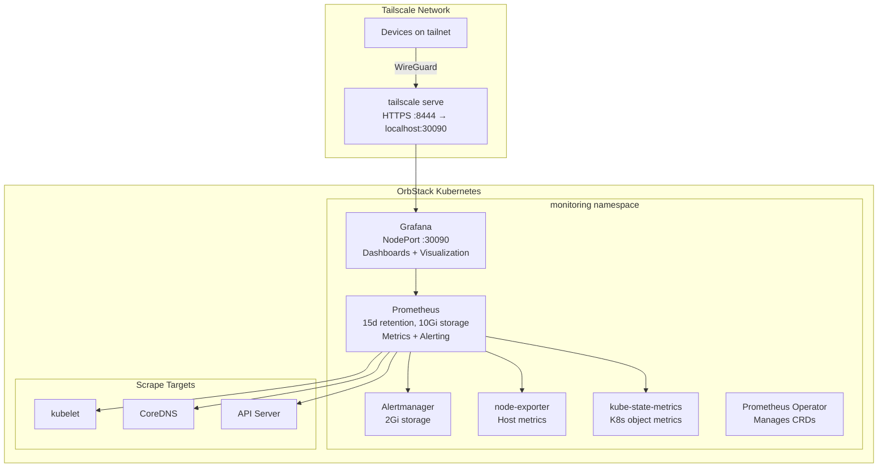

# Monitoring

The homelab uses **kube-prometheus-stack** for cluster monitoring: Prometheus for metrics collection and alerting, Grafana for dashboards and visualization, plus node-exporter and kube-state-metrics for comprehensive cluster observability.

## Architecture



## Access

| Interface | URL | Credentials |
|---|---|---|
| Grafana | `https://holdens-mac-mini.story-larch.ts.net:8444` | admin / admin |
| Grafana (local) | `http://localhost:30090` | admin / admin |

Change the default admin password after first login via Grafana UI (Profile → Change password).

## What's Included

The kube-prometheus-stack Helm chart deploys:

| Component | Purpose |
|---|---|
| **Prometheus** | Time-series metrics collection, PromQL queries, alerting rules |
| **Grafana** | Dashboards and visualization with 30+ pre-built K8s dashboards |
| **Alertmanager** | Alert routing and notification |
| **node-exporter** | Host-level metrics (CPU, memory, disk, network) |
| **kube-state-metrics** | Kubernetes object state metrics (pods, deployments, nodes) |
| **Prometheus Operator** | Manages Prometheus/Alertmanager CRDs declaratively |

### Pre-built Dashboards

Grafana ships with dashboards for:
- Cluster overview (CPU, memory, network, disk)
- Node metrics
- Pod/container resource usage
- Namespace resource quotas
- Persistent volume usage
- CoreDNS performance
- API server request rates and latency

## Configuration

The monitoring stack is deployed via ArgoCD using the Helm chart source directly (no local manifests). All configuration is in the Application CR at `k8s/apps/argocd/applications/monitoring-app.yaml`.

Key settings:
- **Prometheus retention:** 15 days
- **Prometheus storage:** 10Gi PVC
- **Alertmanager storage:** 2Gi PVC
- **Grafana storage:** 2Gi PVC (dashboard persistence)
- **Disabled scrapers:** kubeProxy, kubeEtcd, kubeScheduler, kubeControllerManager (not applicable to OrbStack single-node)

### Modifying Configuration

Edit the `helm.valuesObject` in `k8s/apps/argocd/applications/monitoring-app.yaml`, then push to `main`. ArgoCD will sync the changes.

### Upgrading the Chart

Update `targetRevision` in the Application CR to the desired chart version, then push to `main`.

## Operational Commands

```bash
# Check monitoring pods
kubectl get pods -n monitoring

# Check Prometheus targets
kubectl port-forward -n monitoring svc/monitoring-kube-prometheus-prometheus 9090:9090
# Then open http://localhost:9090/targets

# Check Alertmanager
kubectl port-forward -n monitoring svc/monitoring-kube-prometheus-alertmanager 9093:9093

# View Prometheus storage usage
kubectl exec -n monitoring prometheus-monitoring-kube-prometheus-prometheus-0 -- df -h /prometheus

# Check PVCs
kubectl get pvc -n monitoring
```

## Troubleshooting

| Symptom | Cause | Fix |
|---|---|---|
| Grafana login fails | Wrong credentials | Default is admin/admin; reset via `kubectl exec` into Grafana pod |
| No metrics in dashboards | Prometheus targets down | Check `kubectl get pods -n monitoring`; verify targets via port-forward |
| High memory usage | Retention too long or too many metrics | Reduce `retention` or add `retentionSize` limit in Prometheus spec |
| PVC pending | No storage provisioner | Verify `local-path` provisioner is running in `kube-system` |
| Grafana unreachable via Tailscale | Serve not configured | `tailscale serve --bg --https 8444 http://localhost:30090` |
