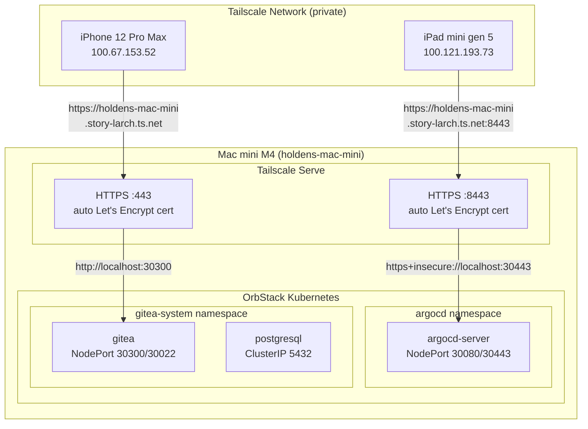
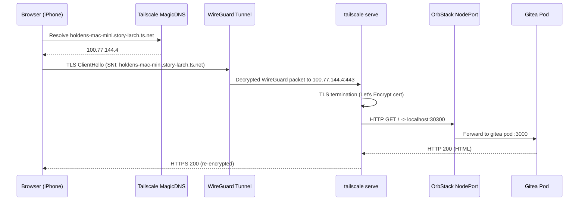
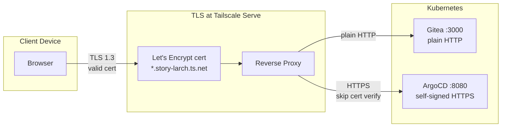
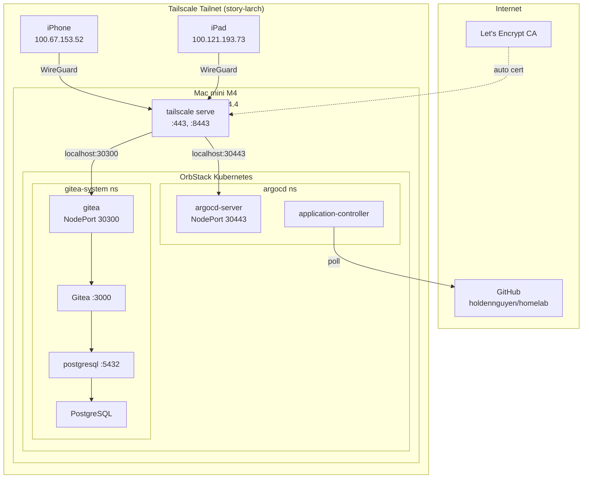

# Networking: Tailscale + NodePort

This document explains how services running inside the OrbStack Kubernetes cluster on a headless Mac mini M4 are exposed to all devices on a private Tailscale network (tailnet).

## The Problem

Three constraints shape the networking setup:

1. **OrbStack NodePorts bind to localhost only.** Unlike cloud Kubernetes, OrbStack's single-node cluster exposes NodePort services on `127.0.0.1`, not on the host's LAN or Tailscale interfaces.
2. **No Ingress controller is installed.** A full nginx/traefik deployment is unnecessary for a two-service homelab.
3. **The Mac mini is headless.** All access comes from other devices (iPhone, iPad, other machines) over Tailscale.

## Solution: NodePort + Tailscale Serve

The architecture uses two layers:

- **NodePort** -- makes Kubernetes services reachable at `localhost:<port>` on the Mac mini
- **Tailscale Serve** -- listens on the Tailscale interface, terminates TLS with auto-provisioned Let's Encrypt certificates, and reverse-proxies to the localhost NodePorts



## Request Path (Detailed)

A browser request to `https://holdens-mac-mini.story-larch.ts.net` traverses five hops:



| Hop | From | To | Protocol | Purpose |
|-----|------|----|----------|---------|
| 1 | Browser | MagicDNS (100.100.100.100) | DNS | Resolves `*.story-larch.ts.net` to Tailscale IP |
| 2 | Browser | Mac mini (100.77.144.4) | WireGuard | Encrypted tunnel between devices |
| 3 | Tailscale interface | `tailscale serve` | TLS | TLS termination with LE cert |
| 4 | `tailscale serve` | `localhost:30300` | HTTP | Reverse proxy to NodePort |
| 5 | NodePort | Gitea Pod `:3000` | HTTP | Kubernetes Service routing |

## Layer 1: Kubernetes NodePort Services

### Gitea (`k8s/apps/gitea/service.yaml`)

```yaml
spec:
  type: NodePort
  ports:
    - port: 3000        # ClusterIP port (pod-to-pod)
      targetPort: http   # Container port name
      nodePort: 30300    # Exposed on localhost:30300
      name: http
    - port: 22
      targetPort: ssh
      nodePort: 30022    # Exposed on localhost:30022
      name: ssh
```

### ArgoCD (`k8s/apps/argocd/kustomization.yaml` patch)

The upstream ArgoCD `install.yaml` defines `argocd-server` as `ClusterIP`. A Kustomize JSON patch overrides it to `NodePort`:

```yaml
patches:
  - target:
      kind: Service
      name: argocd-server
    patch: |
      - op: replace
        path: /spec/type
        value: NodePort
      - op: add
        path: /spec/ports/0/nodePort    # HTTP port 80
        value: 30080
      - op: add
        path: /spec/ports/1/nodePort    # HTTPS port 443
        value: 30443
```

### Port Map

| Service | Container Port | NodePort | localhost URL |
|---------|---------------|----------|---------------|
| Gitea HTTP | 3000 | 30300 | `http://localhost:30300` |
| Gitea SSH | 22 | 30022 | `ssh://localhost:30022` |
| ArgoCD HTTP | 80 (-> 8080) | 30080 | `http://localhost:30080` |
| ArgoCD HTTPS | 443 (-> 8080) | 30443 | `https://localhost:30443` |
| PostgreSQL | 5432 | -- | ClusterIP only (no external access) |

## Layer 2: Tailscale Serve

`tailscale serve` runs as a background daemon on the Mac mini. It listens on the Tailscale network interface (`100.77.144.4`) and proxies incoming HTTPS requests to local ports.

### Configuration Commands

```bash
# Gitea -- default HTTPS port (443)
tailscale serve --bg http://localhost:30300

# ArgoCD -- custom HTTPS port (8443)
tailscale serve --bg --https 8443 https+insecure://localhost:30443
```

The `--bg` flag runs the proxy as a persistent background service that survives terminal sessions. The `https+insecure://` prefix tells Tailscale to connect to ArgoCD's self-signed HTTPS endpoint without verifying its certificate (since TLS is re-terminated by Tailscale with a valid cert).

### How TLS Works



Tailscale automatically provisions and renews Let's Encrypt certificates for the `*.ts.net` domain. No manual certificate management, no cert-manager, no self-signed certs.

### Verify Status

```bash
$ tailscale serve status

https://holdens-mac-mini.story-larch.ts.net (tailnet only)
|-- / proxy http://localhost:30300

https://holdens-mac-mini.story-larch.ts.net:8443 (tailnet only)
|-- / proxy https+insecure://localhost:30443
```

### Manage Serve

```bash
# Stop Gitea proxy
tailscale serve --https=443 off

# Stop ArgoCD proxy
tailscale serve --https=8443 off

# Reset all serve config
tailscale serve reset
```

## Layer 3: Tailscale Network (Tailnet)

### MagicDNS

Tailscale's MagicDNS automatically resolves `<hostname>.story-larch.ts.net` to the device's Tailscale IP across all devices on the tailnet. No `/etc/hosts` entries or custom DNS servers needed.

| Device | Tailscale IP | DNS Name |
|--------|-------------|----------|
| Mac mini M4 | `100.77.144.4` | `holdens-mac-mini.story-larch.ts.net` |
| iPad mini gen 5 | `100.121.193.73` | `ipad-mini-gen-5.story-larch.ts.net` |
| iPhone 12 Pro Max | `100.67.153.52` | `iphone-12-pro-max.story-larch.ts.net` |

### Access URLs

| Service | URL | Port |
|---------|-----|------|
| Gitea | `https://holdens-mac-mini.story-larch.ts.net` | 443 (default) |
| ArgoCD | `https://holdens-mac-mini.story-larch.ts.net:8443` | 8443 |

### Tailscale Serve vs Funnel

| Feature | `tailscale serve` | `tailscale funnel` |
|---------|-------------------|-------------------|
| Audience | Tailnet devices only | Public internet |
| TLS | Let's Encrypt via Tailscale | Let's Encrypt via Tailscale |
| Auth | Tailscale identity (WireGuard) | None (public) |
| Use here | Yes | No -- homelab should stay private |

## Why Not an Ingress Controller?

| Approach | Pros | Cons |
|----------|------|------|
| **Tailscale Serve + NodePort** (current) | Zero config TLS, no extra pods, works on headless Mac, private by default | Requires Tailscale on all client devices |
| nginx-ingress / Traefik | Standard K8s pattern, works with any client | Extra pods, manual TLS (cert-manager), DNS setup, overkill for 2 services |
| `kubectl port-forward` | No config needed | Manual, dies when terminal closes, no TLS, single user |
| LoadBalancer (MetalLB) | Standard K8s pattern | Complex setup for single-node, still need TLS and DNS |

For a single-node homelab with Tailscale already in use, NodePort + `tailscale serve` is the simplest path to secure, private, multi-device access.

## Gitea ROOT_URL Integration

Gitea uses `ROOT_URL` to generate all links in its web UI (clone URLs, redirect URLs, API links). This must match the external URL users access:

```ini
[server]
ROOT_URL = https://holdens-mac-mini.story-larch.ts.net/
SSH_DOMAIN = holdens-mac-mini.story-larch.ts.net
```

If `ROOT_URL` doesn't match the Tailscale hostname, clone URLs and OAuth redirects will point to the wrong address. This value is set in `k8s/apps/gitea/configmap.yaml`.

## Complete Network Topology



## Troubleshooting

| Symptom | Cause | Fix |
|---------|-------|-----|
| `Could not resolve host: *.story-larch.ts.net` | MagicDNS not enabled or not propagated | Enable MagicDNS in Tailscale admin; or add `100.77.144.4 holdens-mac-mini.story-larch.ts.net` to `/etc/hosts` |
| `connection refused` on :30300 | Gitea pod not running or Service not NodePort | `kubectl get svc,pods -n gitea-system` |
| `Serve is not enabled on your tailnet` | Tailscale Serve feature not activated | Visit the URL shown in the error to enable it |
| TLS certificate error in browser | `tailscale serve` not running | `tailscale serve status`; restart with `--bg` commands |
| ArgoCD returns 502 | ArgoCD pod restarting or not ready | `kubectl get pods -n argocd` |
| Gitea clone URLs show wrong domain | `ROOT_URL` mismatch | Update `ROOT_URL` in `k8s/apps/gitea/configmap.yaml`, push, restart Gitea pod |
| Works from iPhone but not Mac mini | MagicDNS resolves on mobile but not macOS | Add `/etc/hosts` entry or verify macOS Tailscale has MagicDNS enabled |
