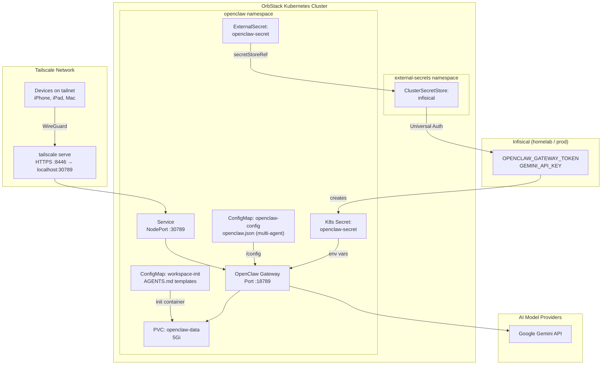
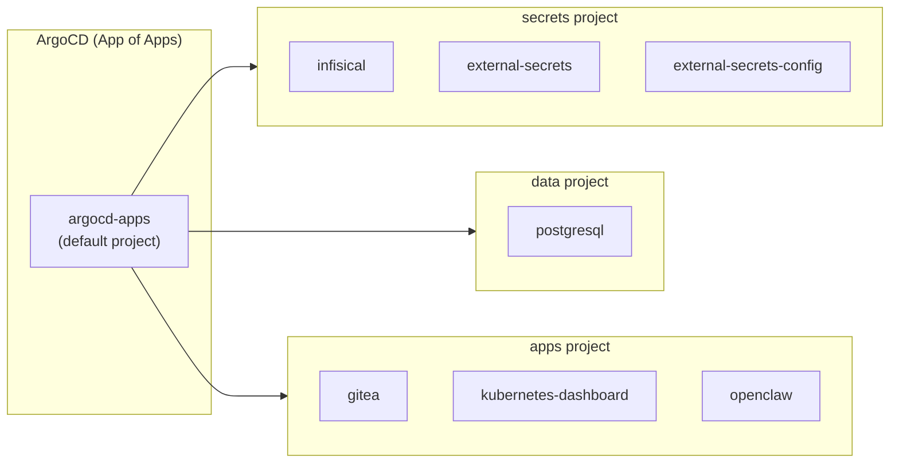
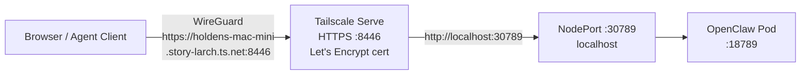
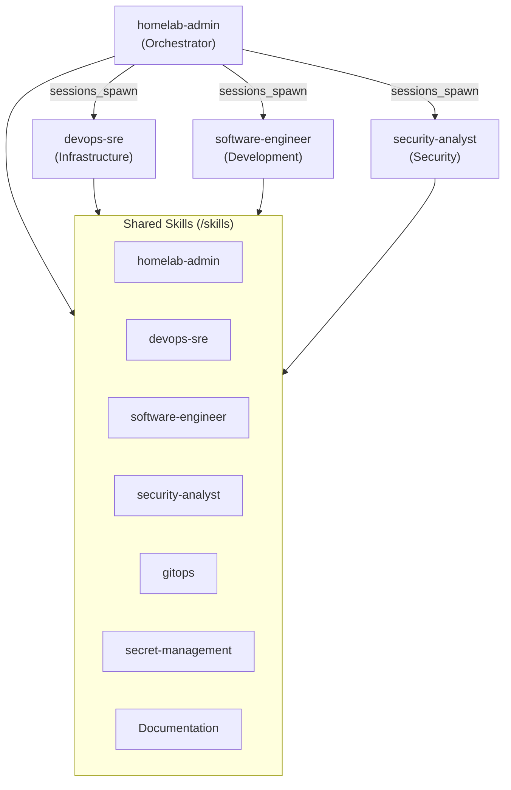

# OpenClaw

OpenClaw is a multi-channel AI gateway that serves as the agent orchestration layer for the homelab. It connects to multiple AI model providers (Anthropic, OpenAI, Gemini, etc.) and exposes a unified gateway API for AI agent workflows running on the Mac mini.

## Architecture



## How It Fits in the Homelab

OpenClaw runs as a standard Kustomize application managed by ArgoCD, following the same App of Apps pattern as every other service. Its secrets flow through the Infisical → ESO → K8s Secret pipeline.



## Deployment

### Prerequisites

- OpenClaw Docker image built locally (see [Build the Image](#build-the-image))
- Secrets added to Infisical (see [Secrets](#secrets))

### Build the Image

OpenClaw uses a locally built Docker image. OrbStack's Kubernetes shares the host Docker daemon, so locally built images are immediately available with `imagePullPolicy: Never`.

```bash
./scripts/build-openclaw.sh
```

This builds the image as `openclaw:latest` from the `openclaw/` directory. To use a custom tag:

```bash
./scripts/build-openclaw.sh openclaw:v2026.2.16
```

If using a custom tag, update `image:` in `k8s/apps/openclaw/deployment.yaml` to match.

### Secrets

Add the following secrets to Infisical under **homelab / prod**:

| Infisical Key | How to Generate | Required |
|---|---|---|
| `OPENCLAW_GATEWAY_TOKEN` | `openssl rand -hex 32` | Yes |
| `GEMINI_API_KEY` | From [aistudio.google.com/apikey](https://aistudio.google.com/apikey) | At least one provider |

After adding secrets, ESO syncs them into the `openclaw-secret` K8s Secret within the `refreshInterval` (1 hour), or force an immediate sync:

```bash
kubectl annotate externalsecret openclaw-secret -n openclaw \
  force-sync=$(date +%s) --overwrite
```

### Adding More Providers or Channels

To add a new API key (e.g., `ANTHROPIC_API_KEY`, `OPENAI_API_KEY`, or `TELEGRAM_BOT_TOKEN`):

1. Add the key to Infisical under `homelab / prod`
2. Add a new entry to `k8s/apps/openclaw/external-secret.yaml`:

```yaml
    - secretKey: ANTHROPIC_API_KEY
      remoteRef:
        key: ANTHROPIC_API_KEY
```

3. Add a corresponding `env` entry to `k8s/apps/openclaw/deployment.yaml`:

```yaml
            - name: ANTHROPIC_API_KEY
              valueFrom:
                secretKeyRef:
                  name: openclaw-secret
                  key: ANTHROPIC_API_KEY
```

4. Push to `main` — ArgoCD syncs the change automatically.

### Deploy

Once the image is built and secrets are in Infisical, push the k8s manifests to `main`. ArgoCD detects the new Application CR and deploys within ~3 minutes.

```bash
# Verify the ArgoCD application
kubectl get application openclaw -n argocd

# Watch pod come up
kubectl get pods -n openclaw -w

# Check ExternalSecret resolved
kubectl get externalsecret -n openclaw
```

### Expose via Tailscale

Run once on the Mac mini (persists across reboots):

```bash
tailscale serve --bg --https 8446 http://localhost:30789
```

Access from any Tailscale device: `https://holdens-mac-mini.story-larch.ts.net:8446`

## Running CLI Commands Inside the Pod

The OpenClaw CLI is built into the container image. Run any `openclaw` subcommand via `kubectl exec`:

```bash
kubectl exec -n openclaw deploy/openclaw -- node dist/index.js <command>
```

The gateway uses its default port (18789) inside the pod, so CLI commands auto-discover it without extra env vars or flags.

Common commands:

```bash
# Gateway health
kubectl exec -n openclaw deploy/openclaw -- node dist/index.js health

# List devices (paired + pending)
kubectl exec -n openclaw deploy/openclaw -- node dist/index.js devices list

# Approve a device
kubectl exec -n openclaw deploy/openclaw -- node dist/index.js devices approve <requestId>

# Print dashboard URL with embedded token
kubectl exec -n openclaw deploy/openclaw -- node dist/index.js dashboard --no-open

# Run diagnostics
kubectl exec -n openclaw deploy/openclaw -- node dist/index.js doctor
```

## First Connection: Device Pairing

OpenClaw requires a **one-time device pairing approval** for every new browser or device that connects to the Control UI over the network. This is a security measure separate from the gateway token -- even with the correct token, remote connections must be explicitly approved.

### What Happens

1. Open the Control UI at `https://holdens-mac-mini.story-larch.ts.net:8446`
2. Enter your `OPENCLAW_GATEWAY_TOKEN` in the settings panel and click **Connect**
3. You see: `disconnected (1008): pairing required`

This is expected. The browser generated a unique device ID and sent a pairing request to the gateway.

### Approve the Device

```bash
# List pending pairing requests
kubectl exec -n openclaw deploy/openclaw -- node dist/index.js devices list

# Find the request ID in the "Request" column and approve it
kubectl exec -n openclaw deploy/openclaw -- node dist/index.js devices approve <requestId>
```

After approval, go back to the UI and click **Connect** again. The connection should succeed.

### Pairing Rules

- **Local connections** (`127.0.0.1`, e.g., via `kubectl port-forward`) are auto-approved.
- **Remote connections** (Tailscale, LAN) always require explicit approval.
- **Each browser profile** generates a unique device ID. Switching browsers, clearing browser data, or using incognito mode requires re-pairing.
- **Approval persists** across gateway restarts (stored in the PVC at `/data`).
- **Revoke a device**: `kubectl exec -n openclaw deploy/openclaw -- node dist/index.js devices revoke --device <id> --role <role>`

### Retrieve the Gateway Token

If you need to retrieve the token value stored in the cluster:

```bash
kubectl get secret openclaw-secret -n openclaw \
  -o jsonpath='{.data.OPENCLAW_GATEWAY_TOKEN}' | base64 -d
```

## Networking



| Layer | Port | Protocol |
|---|---|---|
| Container | 18789 | HTTP |
| NodePort | 30789 | HTTP (localhost only) |
| Tailscale Serve | 8446 | HTTPS (Let's Encrypt) |

## Updating OpenClaw

The `openclaw/` directory is a **git submodule** pointing to `github.com/OpenClaw/OpenClaw`. The homelab repo pins a specific commit; openclaw's internal files are not tracked by the homelab repo.

### Pull the latest upstream release

```bash
# 1. Fetch and update the submodule to the latest upstream commit
cd openclaw
git fetch origin
git checkout main
git pull origin main
cd ..

# 2. Record the new commit in the homelab repo
git add openclaw
git commit -m "update openclaw submodule to $(cd openclaw && git log -1 --format='%h — %s')"
git push origin main

# 3. Rebuild the Docker image with the new source
./scripts/build-openclaw.sh

# 4. Restart the deployment to pick up the new image
kubectl rollout restart deployment/openclaw -n openclaw

# 5. Watch the rollout
kubectl rollout status deployment/openclaw -n openclaw
```

### Pin to a specific version

```bash
cd openclaw
git fetch origin --tags
git checkout v2026.2.16    # or any tag/commit
cd ..
git add openclaw
git commit -m "pin openclaw submodule to v2026.2.16"
git push origin main
./scripts/build-openclaw.sh
kubectl rollout restart deployment/openclaw -n openclaw
```

### Clone the homelab repo (fresh machine)

When cloning the homelab repo on a new machine, the submodule directory will be empty by default. Initialize it with:

```bash
git clone git@github.com:holdennguyen/homelab.git
cd homelab
git submodule update --init
```

## Multi-Agent & Skills Architecture

OpenClaw runs four agents with the orchestrator pattern: a default `homelab-admin` agent that delegates to specialized sub-agents.



### Agents

| Agent ID | Role | Model | Workspace |
|---|---|---|---|
| `homelab-admin` | Default orchestrator — coordinates tasks, delegates to sub-agents | `google/gemini-2.5-pro` | `/data/workspaces/homelab-admin` |
| `devops-sre` | Infrastructure, K8s ops, Terraform, incident response | `google/gemini-2.5-pro` | `/data/workspaces/devops-sre` |
| `software-engineer` | Code development, review, testing | `google/gemini-2.5-pro` | `/data/workspaces/software-engineer` |
| `security-analyst` | Security audits, vulnerability assessment, hardening | `google/gemini-2.5-pro` | `/data/workspaces/security-analyst` |

Agent configuration is in the `openclaw-config` ConfigMap (mounted at `/config/openclaw.json`). Each agent has its own AGENTS.md personality file, bootstrapped on first deploy by the `init-workspaces` init container.

### Skills

Homelab-specific skills live in `skills/` at the repo root and are mounted into the pod at `/skills` via hostPath:

| Skill | Description |
|---|---|
| `homelab-admin` | Cluster operations, service management, GitOps workflow |
| `devops-sre` | Infrastructure debugging, Terraform, incident response |
| `software-engineer` | Code development, review, testing conventions |
| `security-analyst` | Security audits, RBAC review, vulnerability assessment |
| `gitops` | ArgoCD App of Apps pattern, sync management |
| `secret-management` | Infisical → ESO → K8s pipeline operations |
| `common/Documentation` | Standardized documentation generation |

Skills follow the [AgentSkills](https://agentskills.io) format with OpenClaw-compatible `SKILL.md` frontmatter.

### Sub-agent spawning

The orchestrator pattern uses `maxSpawnDepth: 2`:
- **Depth 0** — main agent (`homelab-admin`) receives user requests
- **Depth 1** — orchestrator spawns specialized sub-agents via `sessions_spawn`
- **Depth 2** — sub-agents can spawn leaf workers for parallel tasks

Sub-agents announce results back up the chain. Configure limits in the ConfigMap:
- `maxConcurrent: 4` — max parallel sub-agents
- `maxChildrenPerAgent: 3` — max children per agent session
- `archiveAfterMinutes: 120` — auto-cleanup of finished sub-agent sessions

### Adding a new agent

1. Add the agent entry to `k8s/apps/openclaw/configmap.yaml` under `agents.list`
2. Add its AGENTS.md to `k8s/apps/openclaw/init-workspaces-configmap.yaml`
3. Add the agent ID to `allowAgents` and `agentToAgent.allow` in the config
4. Create its workspace AGENTS.md in `agents/workspaces/<id>/AGENTS.md` (source of truth)
5. Push to `main`

### Adding a new skill

1. Create `skills/<name>/SKILL.md` with OpenClaw frontmatter (`name`, `description`, optional `metadata`)
2. The skill auto-loads via `skills.load.extraDirs: ["/skills"]` in the config
3. Push to `main` and restart the pod: `kubectl rollout restart deployment/openclaw -n openclaw`

## Manifest Reference

| File | Purpose |
|---|---|
| `k8s/apps/openclaw/namespace.yaml` | Dedicated `openclaw` namespace |
| `k8s/apps/openclaw/pvc.yaml` | 5Gi PVC for state data |
| `k8s/apps/openclaw/external-secret.yaml` | Syncs secrets from Infisical |
| `k8s/apps/openclaw/configmap.yaml` | Multi-agent `openclaw.json` configuration |
| `k8s/apps/openclaw/init-workspaces-configmap.yaml` | AGENTS.md templates for workspace bootstrap |
| `k8s/apps/openclaw/deployment.yaml` | Gateway deployment with config/skills volumes |
| `k8s/apps/openclaw/service.yaml` | NodePort 30789 |
| `k8s/apps/openclaw/kustomization.yaml` | Kustomize resource list |
| `k8s/apps/argocd/applications/openclaw-app.yaml` | ArgoCD Application CR |
| `scripts/build-openclaw.sh` | Docker image build helper |
| `skills/` | Homelab-specific skills (mounted into pod) |
| `agents/workspaces/` | Agent AGENTS.md source files |

## Operational Commands

### Kubernetes

```bash
# Pod status
kubectl get pods -n openclaw

# Logs (last 100 lines)
kubectl logs -n openclaw deploy/openclaw --tail=100

# Follow logs
kubectl logs -n openclaw deploy/openclaw -f

# Restart deployment
kubectl rollout restart deployment/openclaw -n openclaw

# Check ExternalSecret status
kubectl describe externalsecret openclaw-secret -n openclaw

# Force secret re-sync
kubectl annotate externalsecret openclaw-secret -n openclaw \
  force-sync=$(date +%s) --overwrite

# Port-forward for local testing (bypasses Tailscale)
kubectl port-forward -n openclaw svc/openclaw 18789:18789

# Check ArgoCD application sync status
kubectl get application openclaw -n argocd
```

### OpenClaw CLI (via kubectl exec)

```bash
# Gateway health check
kubectl exec -n openclaw deploy/openclaw -- node dist/index.js health

# List paired and pending devices
kubectl exec -n openclaw deploy/openclaw -- node dist/index.js devices list

# Approve a pending device
kubectl exec -n openclaw deploy/openclaw -- node dist/index.js devices approve <requestId>

# Revoke a device
kubectl exec -n openclaw deploy/openclaw -- node dist/index.js devices revoke --device <id> --role <role>

# Print dashboard URL with embedded token
kubectl exec -n openclaw deploy/openclaw -- node dist/index.js dashboard --no-open

# List connected channels
kubectl exec -n openclaw deploy/openclaw -- node dist/index.js channels status

# Run diagnostics
kubectl exec -n openclaw deploy/openclaw -- node dist/index.js doctor

# View/edit gateway config
kubectl exec -n openclaw deploy/openclaw -- node dist/index.js config get
```

## Troubleshooting

| Symptom | Cause | Fix |
|---|---|---|
| `disconnected (1008): pairing required` | New browser/device needs approval | `kubectl exec -n openclaw deploy/openclaw -- node dist/index.js devices list` then `devices approve <requestId>` |
| `unauthorized: gateway token missing` | Token not set in UI settings | Open Control UI settings, paste the `OPENCLAW_GATEWAY_TOKEN` |
| `ErrImageNeverPull` | Docker image not built locally | Run `./scripts/build-openclaw.sh` |
| Pod `CrashLoopBackOff` | Missing secrets or config error | `kubectl logs -n openclaw deploy/openclaw` — check for missing env vars |
| ExternalSecret `SecretSyncedError` | Secret key missing in Infisical | Add the missing key to Infisical `homelab / prod /` |
| `connection refused` on `:30789` | Pod not running or not ready | `kubectl get pods -n openclaw` — wait for `Running` status |
| Health check `/health` failing | Gateway still starting up | Wait 30s for initial startup; check logs for errors |
| 401 Unauthorized on gateway | Wrong `OPENCLAW_GATEWAY_TOKEN` | Verify the token in Infisical matches what you use in requests |
| Model API errors | Invalid or expired API key | Update the key in Infisical; force ESO re-sync; restart pod |
| Tailscale URL not responding | `tailscale serve` not configured | Run `tailscale serve --bg --https 8446 http://localhost:30789` |
