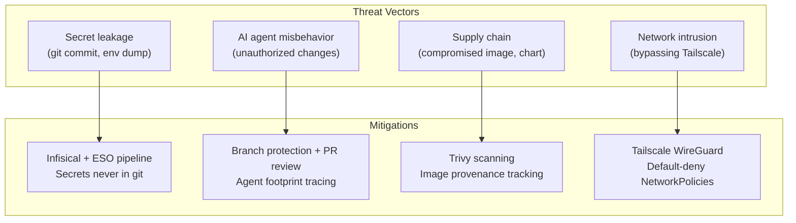
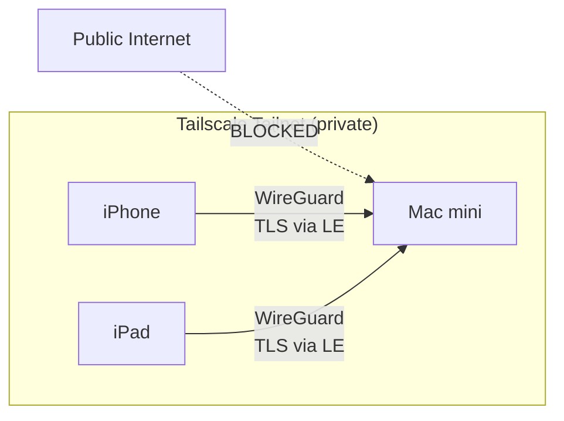
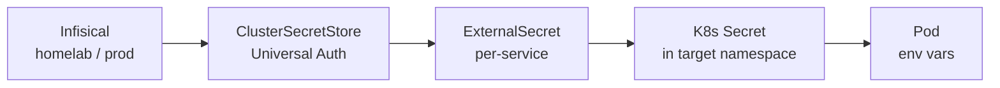
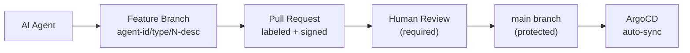

# Security

This document is the consolidated security report for the homelab. It covers the overall security posture, per-layer controls, and a dedicated section on LLM/AI agent (OpenClaw) permissions. This report is tracked by the doc-freshness system and should be reviewed and updated with every release.

## Overview

The homelab follows a defense-in-depth model across three dimensions: **network isolation** (Tailscale-only access, default-deny NetworkPolicies), **workload hardening** (Pod Security Standards, non-root containers, least-privilege RBAC), and **secret hygiene** (Infisical-managed secrets that never touch git). All cluster changes flow through GitOps (ArgoCD with self-heal), and all code changes require pull request review on a protected `main` branch.

## Threat Model

The homelab operates under a constrained threat model that differs significantly from a production cloud environment:

| Factor | Detail |
|---|---|
| **Operator** | Single user (owner) — no multi-tenancy |
| **Network boundary** | Private Tailscale tailnet only — no public internet exposure |
| **Devices on tailnet** | 3 devices: Mac mini M4 (`100.77.144.4`), iPhone 12 Pro Max (`100.67.153.52`), iPad mini gen 5 (`100.121.193.73`) |
| **Cluster topology** | Single-node OrbStack Kubernetes on macOS (arm64) |
| **Data sensitivity** | Infrastructure credentials, API keys, personal git repos |
| **Primary risks** | Secret leakage, misconfigured RBAC, AI agent misbehavior, supply chain compromise |



Since the tailnet is single-user with only owner-controlled devices, threats like unauthorized network access or multi-tenant privilege escalation are out of scope. The primary concerns are operational: accidental secret exposure, AI agent drift beyond intended scope, and supply chain integrity.

## Network Security

No services are exposed to the public internet. All external access flows through Tailscale Serve, which provides WireGuard encryption and automatic Let's Encrypt TLS certificates.

### Access Model



| Control | Status |
|---|---|
| LoadBalancer services | None — not used |
| Ingress controller | None — not deployed |
| NodePort binding | `localhost` only (OrbStack constraint) |
| External access | Tailscale Serve (WireGuard + auto TLS) |
| `tailscale funnel` (public) | **Disabled** — all endpoints are tailnet-only |

### Default-Deny Network Policies

Every application namespace has a `default-deny-all` NetworkPolicy that blocks all ingress and egress. Traffic is then explicitly allowed per namespace:

| Namespace | Foundational Policies | Namespace-Specific Rules |
|---|---|---|
| `argocd` | deny-all, allow-same-ns, allow-dns | Tailscale ingress (:8080), API server egress (:6443), internet egress (:443, :22) |
| `gitea-system` | deny-all, allow-same-ns, allow-dns | Tailscale ingress (:3000, :22) |
| `monitoring` | deny-all, allow-same-ns, allow-dns | Tailscale ingress (:3000), API server egress (:6443), internet egress (:443) |
| `authentik` | deny-all, allow-same-ns, allow-dns | Tailscale ingress (:9000, :9443) |
| `openclaw` | deny-all, allow-same-ns, allow-dns | Tailscale ingress (:18789), API server egress (:6443), internet egress (:443) |
| `external-secrets` | deny-all, allow-same-ns, allow-dns | API server egress (:6443), Infisical egress (:8080) |
| `infisical` | deny-all, allow-same-ns, allow-dns | Tailscale ingress (:8080), ingress from `external-secrets` (:8080) |

Tailscale ingress rules are locked to the CGNAT range `100.64.0.0/10`, ensuring only tailnet devices can reach services.

!!! note "OrbStack CNI limitation"
    OrbStack does not enforce NetworkPolicies at the CNI level. These policies serve as declarative intent and will be enforced if the cluster is migrated to a CNI that supports them (Cilium, Calico). They still provide value as documentation and as a GitOps-tracked security baseline.

## Pod Security Standards

Namespaces are labeled with Kubernetes Pod Security Standards (PSS) to control what workloads can run:

| Namespace | Enforce | Audit/Warn | Reason |
|---|---|---|---|
| `argocd` | `restricted` | `restricted` | Fully compliant |
| `external-secrets` | `restricted` | `restricted` | Fully compliant |
| `monitoring` | `baseline` | `restricted` | node-exporter requires host namespaces and hostPort |
| `authentik` | `baseline` | `restricted` | server/worker containers run as root, missing seccompProfile |
| `infisical` | `baseline` | `restricted` | standalone + ingress-nginx run as root, missing seccompProfile |
| `gitea-system` | — | — | Excluded: Gitea uses s6-overlay requiring root at startup |
| `openclaw` | — | — | Excluded: uses hostPath volumes disallowed by the restricted profile |

Namespaces at `baseline` enforce + `restricted` audit/warn log violations without blocking pods, surfacing non-compliant workloads in audit logs for future remediation.

## RBAC

Every service runs under a dedicated ServiceAccount with least-privilege permissions. No service has `cluster-admin` access.

| Service | ServiceAccount | Scope | Permissions |
|---|---|---|---|
| OpenClaw | `openclaw` (ns: `openclaw`) | Namespace Role | Read pods, logs, secrets, configmaps, services, PVCs; create pods/exec |
| ArgoCD | `argocd-*` (ns: `argocd`) | ClusterRole | Managed by Helm chart — application controller needs cluster-wide access to sync resources |
| ESO | `external-secrets` (ns: `external-secrets`) | ClusterRole | Managed by Helm chart — needs cluster-wide access to create secrets in any namespace |
| Gitea | default | Namespace | No custom RBAC — uses default SA |
| PostgreSQL | default | Namespace | No custom RBAC — uses default SA |
| Monitoring | `kube-prometheus-stack-*` | ClusterRole | Managed by Helm chart — Prometheus needs cluster-wide metrics scraping |

The previous `cluster-admin` ClusterRoleBinding on the OpenClaw ServiceAccount was removed in v1.1.0, scoping it down to a namespace-only Role.

## Secret Management

Secrets follow a strict pipeline: **Infisical** (source of truth) -> **External Secrets Operator** (sync) -> **Kubernetes Secret** (consumed by pods). Secrets are never stored in git.

### Pipeline



### Controls

| Control | Implementation |
|---|---|
| Storage | Infisical (self-hosted, in-cluster) |
| Sync mechanism | ESO with `refreshInterval: 1h` |
| Git protection | `.gitignore` excludes `terraform.tfvars`, `*.tfstate`, `.env` |
| Bootstrap credentials | Created by Terraform from `terraform.tfvars` (gitignored) |
| Rotation | Manual via Infisical UI, force-sync with ESO annotation |
| Per-service isolation | Each service has its own ExternalSecret and K8s Secret |

### ExternalSecret Inventory

| ExternalSecret | Namespace | Keys |
|---|---|---|
| `postgresql-secret` | `gitea-system` | `POSTGRES_PASSWORD`, `POSTGRES_USER`, `POSTGRES_DB`, `GITEA_DB_PASSWORD` |
| `gitea-secret` | `gitea-system` | `GITEA_SECRET_KEY` |
| `gitea-admin-secret` | `gitea-system` | `GITEA_ADMIN_USERNAME`, `GITEA_ADMIN_PASSWORD`, `GITEA_ADMIN_EMAIL` |
| `openclaw-secret` | `openclaw` | `OPENCLAW_GATEWAY_TOKEN`, `OPENROUTER_API_KEY`, `GEMINI_API_KEY`, `GITHUB_TOKEN` |
| `authentik-secret` | `authentik` | `AUTHENTIK_SECRET_KEY`, `AUTHENTIK_BOOTSTRAP_PASSWORD`, `AUTHENTIK_BOOTSTRAP_TOKEN`, `AUTHENTIK_POSTGRES_PASSWORD` |
| `grafana-secret` | `monitoring` | `GRAFANA_ADMIN_PASSWORD`, `GRAFANA_OAUTH_CLIENT_SECRET`, `GITEA_OAUTH_CLIENT_SECRET` |

## Container Security

### Non-Root Execution

| Service | `runAsUser` | `runAsNonRoot` | `readOnlyRootFilesystem` | Notes |
|---|---|---|---|---|
| OpenClaw | 1000 | `true` | no | Needs writable `/data` for workspaces |
| ArgoCD | Helm-managed | `true` | `true` | Restricted PSS compliant |
| ESO | Helm-managed | `true` | `true` | Restricted PSS compliant |
| Gitea | root (s6-overlay) | no | no | s6 init system requires root at startup; drops privileges internally |
| PostgreSQL | 999 | `true` | no | Needs writable PGDATA |
| Infisical | root | no | no | Upstream Helm default; hardening tracked in roadmap |
| Authentik | root | no | no | Upstream Helm default; hardening tracked in roadmap |

### Image Provenance

| Service | Image | Source | Pinned |
|---|---|---|---|
| OpenClaw | `openclaw:latest` | Built locally from submodule + `Dockerfile.openclaw` | Submodule pinned to commit |
| ArgoCD | `quay.io/argoproj/argocd` | Official upstream (Helm chart) | Chart version pinned |
| ESO | `ghcr.io/external-secrets/external-secrets` | Official upstream (Helm chart) | Chart version pinned |
| Gitea | `gitea/gitea` | Docker Hub official | Tag pinned in deployment |
| PostgreSQL | `postgres` | Docker Hub official | Tag pinned in deployment |
| Prometheus/Grafana | kube-prometheus-stack images | Official upstream (Helm chart) | Chart version pinned |
| Trivy | `aquasecurity/trivy` | Official upstream (Helm chart) | Chart version pinned |

## Supply Chain Security

| Control | Status | Details |
|---|---|---|
| Branch protection on `main` | Enforced | PRs require review; no direct push; linear history required |
| ArgoCD repo access (HTTPS) | Active | Unauthenticated HTTPS clone of public repo — no credentials stored |
| ArgoCD self-heal | Enabled | Manual `kubectl` changes are reverted within ~3 minutes |
| Helm chart version pinning | Enforced | All Application CRs pin `targetRevision` |
| Container image scanning | Active | Trivy Operator (ClientServer mode) scans all running images |
| Signed commits | Not enforced | Tracked in hardening roadmap |
| Dependabot / Renovate | Not configured | Tracked in hardening roadmap |
| Image signing (cosign) | Not configured | Tracked in hardening roadmap |

## Vulnerability Scanning

Trivy Operator runs in **ClientServer mode** in the `monitoring` namespace. A dedicated `trivy-server` StatefulSet maintains the vulnerability database on a persistent volume. Scan jobs query it over HTTP instead of each managing their own cache.

| Setting | Value |
|---|---|
| Mode | ClientServer (centralized DB) |
| Concurrent scan jobs | 3 |
| Excluded namespaces | `openclaw` (locally-built image not in any registry) |
| Report type | `VulnerabilityReport` CRs per pod |

```bash
# List all vulnerability reports
kubectl get vulnerabilityreports -A

# View critical/high vulnerabilities
kubectl get vulnerabilityreports -A -o json | \
  jq '.items[] | select(.report.summary.criticalCount > 0 or .report.summary.highCount > 0) |
  {namespace: .metadata.namespace, name: .metadata.name, critical: .report.summary.criticalCount, high: .report.summary.highCount}'
```

---

## LLM / AI Agent Security (OpenClaw)

This section provides a detailed breakdown of OpenClaw's permissions, access, and blast radius. OpenClaw is a multi-agent AI gateway running in the `openclaw` namespace that can execute tools (kubectl, git, gh) on behalf of AI-driven agents.

### Kubernetes RBAC

The `openclaw` ServiceAccount has a **namespace-scoped Role** (not a ClusterRole). It cannot access resources in any other namespace via the Kubernetes API.

| Resources | Verbs | Risk |
|---|---|---|
| pods, pods/log, secrets, configmaps, services, persistentvolumeclaims | get, list, watch | Low (read-only) |
| pods/exec | create | **Medium** — allows shell access into pods in the `openclaw` namespace |

Since only the OpenClaw pod itself runs in the namespace, `pods/exec` is effectively self-referential. However, if additional pods are ever deployed to the `openclaw` namespace, this permission would extend to them.

### Secrets Accessible

Four secrets are injected as environment variables into the OpenClaw container:

| Secret Key | Purpose | Scope |
|---|---|---|
| `OPENCLAW_GATEWAY_TOKEN` | Gateway authentication (device pairing + API access) | OpenClaw gateway only |
| `OPENROUTER_API_KEY` | LLM inference via OpenRouter | OpenRouter account (usage-based billing) |
| `GEMINI_API_KEY` | LLM inference via Google Gemini (fallback) | Google AI Studio account |
| `GITHUB_TOKEN` | GitHub API access for the agent git workflow | **Fine-grained PAT scoped to `holdennguyen/homelab` only**: read access to metadata; read and write access to code, issues, and pull requests |

The `GITHUB_TOKEN` is the most sensitive credential from a blast-radius perspective. Its scope is intentionally narrow:

- Limited to a single repository (`holdennguyen/homelab`)
- Cannot access other repositories, organizations, or GitHub settings
- Cannot manage repository settings, webhooks, or deploy keys
- Write access is limited to code (branches/PRs), issues, and pull requests

All four secrets are also readable via `kubectl get secret openclaw-secret -n openclaw` due to the RBAC `secrets` read permission. Any process running inside the container can access them through the environment.

### Host Filesystem Access

Two `hostPath` volumes are mounted into the pod:

| Volume | Host Path | Mount Path | Mode |
|---|---|---|---|
| `workspace-src` | `/Users/holden.nguyen/homelab/agents/workspaces` | `/workspace-src` | **Read-only** |
| `openclaw-skills` | `/Users/holden.nguyen/homelab/skills` | `/skills` | **Read-only** |

Both mounts are read-only. The exposed paths contain only agent personality Markdown files and skill definitions — no credentials, no broader filesystem access.

### Container Security Context

```yaml
securityContext:
  runAsUser: 1000
  runAsGroup: 1000
  runAsNonRoot: true
  fsGroup: 1000
```

| Control | Status |
|---|---|
| Non-root execution | Enforced (UID 1000) |
| `runAsNonRoot` | `true` |
| `allowPrivilegeEscalation` | **Not set** (defaults to `true`) |
| `capabilities.drop: [ALL]` | **Not set** |
| `readOnlyRootFilesystem` | **Not set** (needs writable `/data`) |
| `seccompProfile` | **Not set** |

Missing controls are tracked in the [Hardening Roadmap](#hardening-roadmap).

### Network Exposure

| Layer | Port | Access |
|---|---|---|
| Container | 18789 | Pod-internal |
| NodePort | 30789 | `localhost` only (OrbStack) |
| Tailscale Serve | 8447 | `https://holdens-mac-mini.story-larch.ts.net:8447` (tailnet only) |

**Authentication layers:**

1. **Tailscale identity** — only devices on the tailnet (WireGuard-authenticated) can reach the endpoint
2. **Gateway token** — clients must present `OPENCLAW_GATEWAY_TOKEN` to authenticate
3. **Device pairing** — remote connections require explicit one-time approval via `devices approve`

The gateway starts with `--allow-unconfigured`, which permits connections from any client that presents a valid token (no pre-registration required). The `trustedProxies` setting covers all RFC 1918 ranges (`192.168.0.0/16`, `10.0.0.0/8`, `172.16.0.0/12`).

**NetworkPolicy rules for `openclaw` namespace:**

- Default-deny all ingress and egress
- Allow intra-namespace communication
- Allow DNS to `kube-system`
- Allow ingress from Tailscale CIDR (`100.64.0.0/10`) on port 18789
- Allow egress to Kubernetes API server on port 6443
- Allow egress to internet on port 443 (HTTPS — required for LLM API calls and GitHub)

### Agent Capabilities

OpenClaw runs five agents in an orchestrator pattern:

| Agent | Skills | Can Delegate To |
|---|---|---|
| `homelab-admin` (orchestrator) | homelab-admin, gitops, secret-management, incident-response | devops-sre, software-engineer, security-analyst, qa-tester |
| `devops-sre` | devops-sre, gitops, secret-management, incident-response | software-engineer, security-analyst, qa-tester |
| `software-engineer` | software-engineer | devops-sre, security-analyst, qa-tester |
| `security-analyst` | security-analyst, secret-management | devops-sre, software-engineer, qa-tester |
| `qa-tester` | qa-tester, gitops, incident-response | devops-sre, software-engineer |

**Spawning limits:**

| Setting | Value |
|---|---|
| `maxSpawnDepth` | 2 (orchestrator -> sub-agent -> leaf worker) |
| `maxConcurrent` | 4 parallel sub-agents |
| `maxChildrenPerAgent` | 3 per session |
| `archiveAfterMinutes` | 120 (auto-cleanup) |
| `sessions.visibility` | `all` (every agent can see every session) |

**Tools available inside the container:**

| Tool | Capability |
|---|---|
| `kubectl` | Kubernetes operations (limited by RBAC to `openclaw` namespace) |
| `helm` | Helm chart operations |
| `terraform` | Terraform commands (no state file in pod — informational only) |
| `argocd` | ArgoCD CLI |
| `git` | Git operations (authenticated via `GITHUB_TOKEN` through `gh auth git-credential`) |
| `gh` | GitHub CLI (create issues, PRs, manage labels — scoped to `holdennguyen/homelab`) |
| `jq` | JSON processing |

### Agent Git Workflow Guardrails

Agents interact with the GitHub repository through a controlled workflow:



| Guardrail | Implementation |
|---|---|
| No direct push to `main` | GitHub branch protection — PRs require at least one approving review |
| Agent identity tracing | Every commit, branch, issue, and PR carries the agent ID (author, suffix, labels, footer) |
| Scoped GitHub token | Fine-grained PAT: only `holdennguyen/homelab`, only code/issues/PRs |
| ArgoCD self-heal | Any manual `kubectl apply` is reverted within ~3 minutes |
| Human approval gate | All PRs require explicit human review before merge |

### Risk Summary

| # | Risk | Severity | Current Mitigation | Residual Risk |
|---|---|---|---|---|
| 1 | `GITHUB_TOKEN` grants repo write access to all agents | Medium | Scoped to single repo; PR review required; agent footprint tracing | A misbehaving agent could create spam PRs or issues |
| 2 | `pods/exec` + `secrets` read lets agents read their own secrets via kubectl | Medium | Only one pod in namespace; RBAC is namespace-scoped | If more pods are added to `openclaw` ns, blast radius grows |
| 3 | Missing `allowPrivilegeEscalation: false` | Low | Container runs as non-root (UID 1000) | Theoretical escalation path if kernel vulnerability exists |
| 4 | `--allow-unconfigured` on gateway | Low | Tailscale + gateway token + device pairing provide three auth layers | Removes one defense layer (client pre-registration) |
| 5 | `trustedProxies` covers all RFC 1918 space | Low | Only OrbStack internal traffic uses these ranges | Broader than necessary; could be narrowed |
| 6 | `sessions.visibility: "all"` | Low | Single-user system; no multi-tenant data | All agents see all session history |
| 7 | Read-only hostPath volumes expose host filesystem | Low | Paths are narrow; read-only; contain only Markdown files | Container compromise could read skill/agent definitions |
| 8 | LLM API keys grant inference access | Low | Keys are per-provider; usage-based billing with spending limits | Compromised key could incur API costs |

### OpenClaw Hardening Recommendations

1. **Add `allowPrivilegeEscalation: false`** and **`capabilities.drop: [ALL]`** to the container securityContext
2. **Add `seccompProfile: { type: RuntimeDefault }`** to the pod securityContext
3. **Narrow `trustedProxies`** to the actual OrbStack pod CIDR instead of all RFC 1918 ranges
4. **Consider removing `--allow-unconfigured`** if all client devices are known
5. **Consider per-agent GitHub tokens** with even narrower scopes if agent count grows
6. **Restrict `sessions.visibility`** if sensitive data flows through agent sessions

## Hardening Roadmap

Open items to improve the security posture in future releases:

| Item | Affected Services | Priority | Effort |
|---|---|---|---|
| Add `allowPrivilegeEscalation: false` + `capabilities.drop: [ALL]` | OpenClaw | High | Low |
| Add `seccompProfile: RuntimeDefault` | OpenClaw | High | Low |
| Narrow OpenClaw `trustedProxies` to actual pod CIDR | OpenClaw | Medium | Low |
| Enforce `restricted` PSS on `gitea-system` | Gitea | Medium | Medium (requires upstream image change or init container workaround) |
| Enforce `restricted` PSS on `openclaw` | OpenClaw | Medium | Medium (requires replacing hostPath with a different volume strategy) |
| Harden Infisical and Authentik containers to non-root | Infisical, Authentik | Medium | High (depends on upstream chart support) |
| Enable GPG-signed commits for agent git operations | OpenClaw agents | Low | Medium |
| Configure Dependabot or Renovate for Helm chart updates | All Helm-deployed services | Low | Low |
| Image signing with cosign | OpenClaw (locally-built) | Low | Medium |
| Enforce NetworkPolicy at CNI level | All namespaces | Low | High (requires migration from OrbStack to Cilium/Calico CNI) |
| Add Trivy scanning for `openclaw` namespace | OpenClaw | Low | Low (push image to local registry) |
