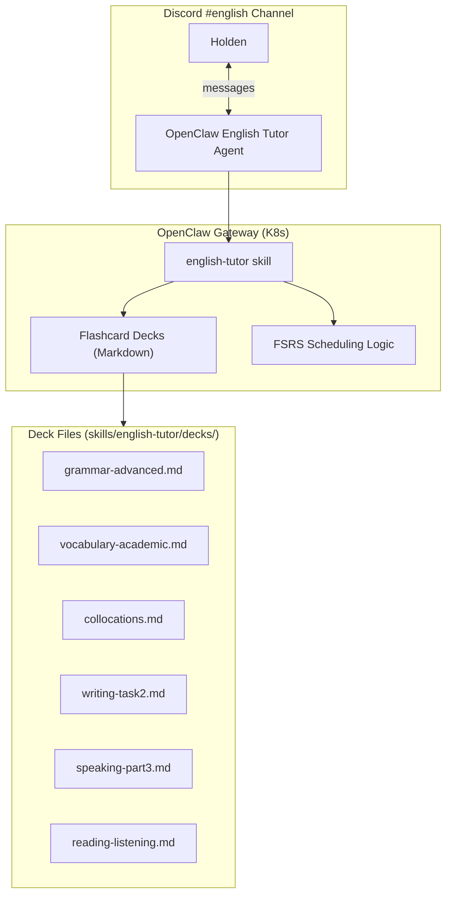

# English Learning Plan — IELTS 8.0

English language learning system for a Vietnamese speaker targeting IELTS 8.0 Overall.

## Background

- Native language: Vietnamese
- Professional background: Senior SRE (9 years), filmmaker & photographer
- Current level: Speaking/Writing beginner-intermediate, Reading/Listening intermediate
- Target: IELTS 8.0 Overall (8.5+ in R/L to buffer W/S)
- Timeline: 10 months

## System Design

## Roadmap

| Phase | Weeks | Focus | Goal |
|---|---|---|---|
| 1 — Foundation | 1–12 | Grammar precision, output stabilization | Transition from "being understood" to "being accurate" |
| 2 — IELTS Immersion | 13–24 | Input mastery, argument logic | Bridge the gap to 7.0 |
| 3 — Mastery Push | 25–36 | High-level literacy, sophisticated output | Push toward 8.0+ in R/L |
| 4 — Tactical Sprint | 37–40+ | Mock tests, error analysis, immersion | Peak performance under exam pressure |

## Daily Schedule

| Time | Activity | Focus |
|---|---|---|
| Morning commute (30m) | Passive immersion | BBC Global News, cinema podcasts |
| Lunch break (30m) | Active reading | 1 long-form article (The Guardian/Medium) |
| Evening (90m) | Skill drilling | Mon/Wed/Fri: Writing/Reading — Tue/Thu: Speaking/Listening |
| Weekend (3h) | Deep work | Full mock test + error correction |

## FSRS Integration

Same spaced repetition system as Deutsch Tutor — cards in repeater-compatible Markdown format (Q/A + cloze), FSRS scheduling with 90% target recall rate.

## Deck Inventory

| Deck | Cards | Content |
|---|---|---|
| `grammar-advanced.md` | ~55 | Complex sentences, conditionals, passive voice, relative clauses, nominalization |
| `vocabulary-academic.md` | ~60 | Academic word list, precise synonyms, formal register |
| `collocations.md` | ~55 | Common collocations, phrasal verbs, idiomatic expressions |
| `writing-task2.md` | ~50 | Essay structures, cohesive devices, argument patterns, topic vocabulary |
| `speaking-part3.md` | ~50 | Abstract reasoning prompts, opinion structures, fluency patterns |
| `reading-listening.md` | ~50 | Paraphrase recognition, inference skills, connected speech traps |

## Vietnamese-Specific Strategies

| English concept | Vietnamese challenge | Teaching approach |
|---|---|---|
| Articles (a/an/the) | Vietnamese has no articles | Rules-based system: specific vs. general, first/subsequent mention |
| Verb tenses (12 tenses) | Vietnamese uses time markers, not conjugation | Timeline visualization, signal word mapping |
| Prepositions | Vietnamese prepositions map differently | Colocation drilling, "verb + preposition" as unit |
| Relative clauses | Vietnamese uses simpler linking | Build from simple → complex, embed gradually |
| Passive voice | Vietnamese rarely uses passive | "bị/được" analogy, practice transformation drills |
| Conditionals | Vietnamese uses "nếu...thì" only | Type 0/1/2/3 with Vietnamese parallel structures |

## SRE-Specific Advantages

- Debug writing like debugging code: systematic error analysis
- Documentation habit → personal knowledge base for idioms/collocations
- Logical reasoning from incident response → essay argument structure (Point → Evidence → Impact → Conclusion)

## Filmmaker Advantages

- Sensory vocabulary from cinematography → vivid descriptions in Speaking Part 2
- Narrative structure from screenwriting → coherent essay flow
- Visual thinking → mind maps for topic vocabulary
