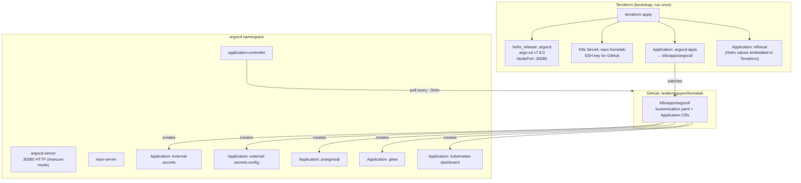
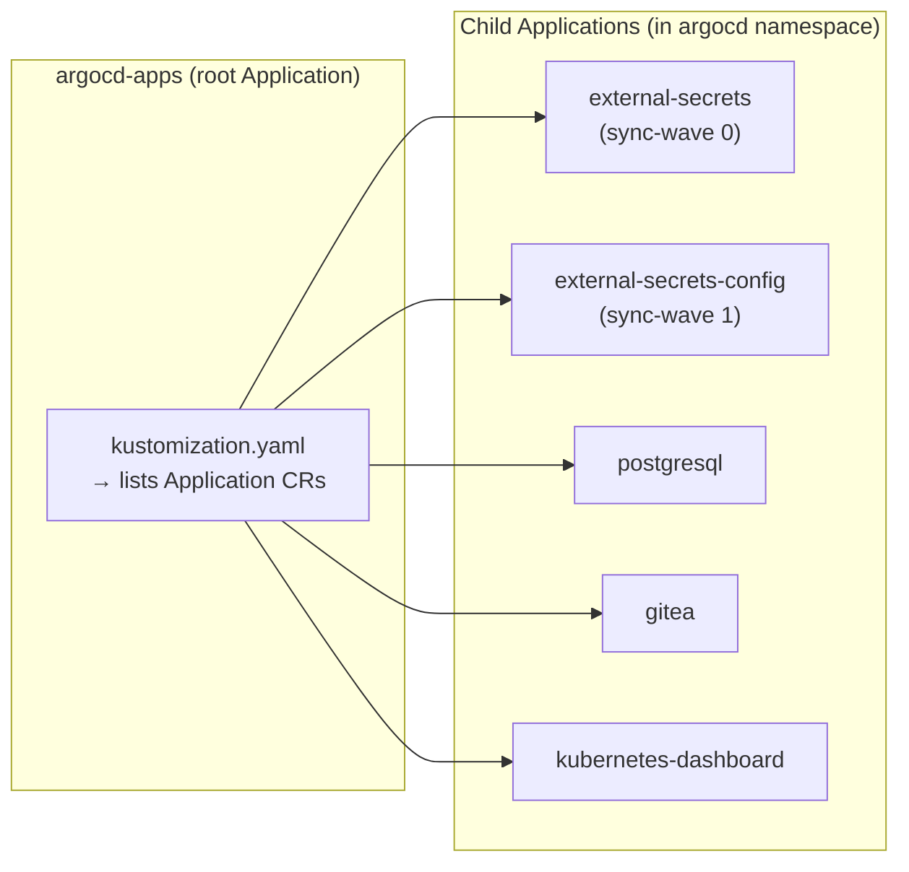

# ArgoCD

GitOps continuous delivery controller for the homelab Kubernetes cluster. ArgoCD watches the GitHub repository and automatically synchronizes cluster state to match the manifests in `main`.

## How It Works

ArgoCD is bootstrapped by Terraform (not by `kubectl apply -k`). Terraform installs the ArgoCD Helm chart and creates the root `Application` CR (`argocd-apps`) that triggers the App of Apps pattern. From that point on, git pushes automatically deploy to the cluster.



## Directory Contents

| File | Purpose |
|------|---------|
| `kustomization.yaml` | Lists Application CRs managed by the App of Apps |
| `applications/external-secrets-app.yaml` | ESO Helm chart (sync-wave 0 — installs CRDs first) |
| `applications/external-secrets-config-app.yaml` | ClusterSecretStore (sync-wave 1 — after ESO CRDs) |
| `applications/postgresql-app.yaml` | PostgreSQL deployment in `gitea-system` namespace |
| `applications/gitea-app.yaml` | Gitea deployment in `gitea-system` namespace |
| `applications/kubernetes-dashboard-app.yaml` | Kubernetes Dashboard deployment |

> **Note:** The `infisical` Application CR is **not** in this directory. It is created by `terraform/argocd.tf` because its Helm values include sensitive PostgreSQL and Redis passwords that cannot be stored in git.

## App of Apps Pattern

The root Application (`argocd-apps`) watches `k8s/apps/argocd/`. Any Application CR added to that directory (and listed in `kustomization.yaml`) is automatically deployed by ArgoCD.



## Sync Wave Ordering

The `external-secrets` and `external-secrets-config` applications use sync waves to handle the CRD dependency:

| Wave | Application | Why |
|---|---|---|
| 0 | `external-secrets` | Installs the ESO Helm chart + CRDs (`ExternalSecret`, `ClusterSecretStore`, etc.) |
| 1 | `external-secrets-config` | Applies the `ClusterSecretStore` — requires CRDs from wave 0 to be present |
| (default) | `postgresql`, `gitea`, `kubernetes-dashboard` | No ordering requirements between them |

## ArgoCD Configuration

ArgoCD runs in **insecure mode** (`server.insecure = true`) — it serves plain HTTP on port 8080/30080. TLS is terminated by Tailscale Serve, which provides a valid Let's Encrypt certificate. This avoids the need for cert-manager or self-signed certificates inside the cluster.

| Setting | Value | Set via |
|---|---|---|
| `server.service.type` | `NodePort` | Terraform Helm values |
| `server.service.nodePorts.http` | `30080` | Terraform Helm values |
| `configs.params.server.insecure` | `true` | Terraform Helm values |
| `configs.secret.argocdServerAdminPassword` | bcrypt hash | Terraform Helm values (`argocd_admin_password_bcrypt` tfvar) |
| `configs.cm.resource.customizations.ignoreDifferences.external-secrets.io_ExternalSecret` | `jsonPointers: [/metadata/finalizers]` | Terraform Helm values — prevents ESO finalizer from causing permanent OutOfSync |
| Chart version | `7.8.0` | `terraform/variables.tf` default |

## Repository Authentication

ArgoCD authenticates to the private GitHub repository using an SSH deploy key. The key is stored in a Kubernetes Secret `repo-homelab` in the `argocd` namespace, created by Terraform. All Application CRs use the SSH URL format:

```
repoURL: git@github.com:holdennguyen/homelab.git
```

The SSH key is stored in `terraform/terraform.tfvars` (gitignored) and injected by `terraform/argocd.tf`.

## Adding a New Application

To deploy a new service via ArgoCD:

1. Create a directory `k8s/apps/my-service/` with `kustomization.yaml` and resource manifests
2. Create `k8s/apps/argocd/applications/my-service-app.yaml`:

```yaml
apiVersion: argoproj.io/v1alpha1
kind: Application
metadata:
  name: my-service
  namespace: argocd
spec:
  project: default
  source:
    repoURL: git@github.com:holdennguyen/homelab.git
    targetRevision: HEAD
    path: k8s/apps/my-service
  destination:
    server: https://kubernetes.default.svc
    namespace: my-service
  syncPolicy:
    automated:
      prune: true
      selfHeal: true
    syncOptions:
      - CreateNamespace=true
```

3. Add it to `k8s/apps/argocd/kustomization.yaml`:

```yaml
resources:
  - applications/my-service-app.yaml
```

4. Push to `main`. ArgoCD detects the change within ~3 minutes and deploys.

## Accessing the UI

ArgoCD is accessible at `https://holdens-mac-mini.story-larch.ts.net:8443` from any Tailscale device.

**One-time Tailscale Serve setup:**

```bash
tailscale serve --bg --https 8443 http://localhost:30080
```

**Admin credentials:**

The ArgoCD admin password is managed via Terraform Helm values (`argocd_admin_password_bcrypt` in `terraform/terraform.tfvars`). The plaintext is stored in Infisical as `ARGOCD_ADMIN_PASSWORD` for team reference.

```bash
# Retrieve from Infisical UI → homelab / prod → ARGOCD_ADMIN_PASSWORD
# Or from the initial-admin-secret if it matches the hash in terraform.tfvars:
kubectl -n argocd get secret argocd-initial-admin-secret \
  -o jsonpath="{.data.password}" | base64 -d
```

To rotate the password, see [terraform/README.md — Rotate the ArgoCD Admin Password](../../../terraform/README.md).

## Operational Commands

```bash
# Check application status
kubectl get applications -n argocd

# Check all ArgoCD pods
kubectl get pods -n argocd

# Force an immediate sync on a specific application
kubectl patch application gitea -n argocd \
  --type merge -p '{"metadata":{"annotations":{"argocd.argoproj.io/refresh":"hard"}}}'

# View ArgoCD server logs
kubectl logs -n argocd deploy/argocd-server --tail=50

# View application controller logs
kubectl logs -n argocd deploy/argocd-application-controller --tail=50
```

## Troubleshooting

| Symptom | Cause | Fix |
|---|---|---|
| App shows `OutOfSync` forever | ArgoCD can't clone repo | Check `repo-homelab` secret exists; verify SSH key is authorized on GitHub |
| `authentication required` error | SSH key not authorized | Confirm public key is in GitHub → repo → Settings → Deploy keys |
| Application stuck in `Progressing` | Pod not ready | `kubectl describe pod -n <namespace>` for Events |
| CRD not found during sync | Wrong sync wave order | Ensure `external-secrets` (wave 0) is healthy before `external-secrets-config` (wave 1) syncs |
| Changes not deployed after push | Normal poll delay | Wait ~3min or force refresh via annotation |
| `kubernetes_manifest` schema error | Not applicable | ArgoCD Application CRs are applied via `local-exec` in Terraform, not `kubernetes_manifest` |
