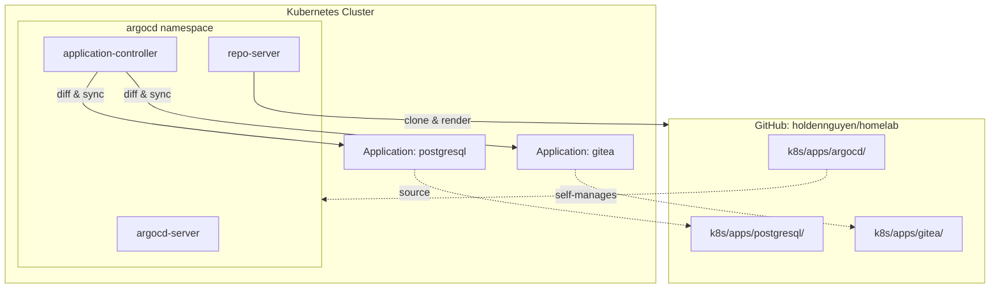
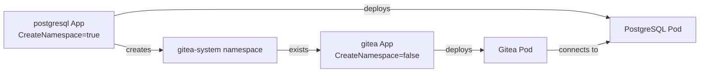

# Argo CD

GitOps continuous delivery controller for the homelab Kubernetes cluster. Argo CD watches the GitHub repository and automatically synchronizes cluster state to match the manifests in `main`.

## How It Works

Argo CD is bootstrapped once with `kubectl apply -k`, then manages itself and all other applications declaratively through `Application` custom resources.



## Directory Contents

| File | Purpose |
|------|---------|
| `kustomization.yaml` | Pulls upstream Argo CD `install.yaml` from the `stable` branch and includes both Application definitions |
| `applications/postgresql-app.yaml` | Application CR that syncs `k8s/apps/postgresql` to the cluster |
| `applications/gitea-app.yaml` | Application CR that syncs `k8s/apps/gitea` to the cluster |

## Kustomization

`kustomization.yaml` uses a remote resource to fetch the official Argo CD manifests:

```yaml
resources:
  - https://raw.githubusercontent.com/argoproj/argo-cd/stable/manifests/install.yaml
  - applications/postgresql-app.yaml
  - applications/gitea-app.yaml
```

This deploys the full Argo CD stack (server, application-controller, repo-server, dex, redis, notifications-controller, applicationset-controller) into the `argocd` namespace.

## Application Definitions

Both applications share the same structure:

```yaml
spec:
  source:
    repoURL: https://github.com/holdennguyen/homelab.git
    targetRevision: HEAD
    path: k8s/apps/<app>       # directory containing Kustomize manifests
  destination:
    server: https://kubernetes.default.svc
    namespace: gitea-system
  syncPolicy:
    automated:
      prune: true              # delete resources removed from Git
      selfHeal: true           # revert manual kubectl changes
```

### Sync Policy Details

| Policy | Effect |
|--------|--------|
| `automated` | Argo CD syncs automatically when it detects Git changes (poll interval ~3 min) |
| `prune: true` | Resources deleted from the Git manifests are removed from the cluster |
| `selfHeal: true` | Any manual `kubectl` changes are reverted to match Git state |

### Application Ordering

The PostgreSQL application has `CreateNamespace=true` and owns the `gitea-system` namespace. The Gitea application has `CreateNamespace=false` since the namespace already exists when it syncs. This is intentional -- PostgreSQL must be available before Gitea can connect.



## Initial Bootstrap

Argo CD cannot deploy itself from nothing (bootstrap paradox). The first install is manual:

```bash
kubectl apply -k k8s/apps/argocd
```

After this single command, Argo CD is running and will:
1. Detect its own manifests in `k8s/apps/argocd/` and self-manage future updates
2. Create the `postgresql` and `gitea` Application resources
3. Sync both applications, deploying PostgreSQL and Gitea to the cluster

### Accessing the UI

```bash
kubectl port-forward svc/argocd-server -n argocd 8080:443
# Open https://localhost:8080
```

### Retrieving the Admin Password

```bash
kubectl -n argocd get secret argocd-initial-admin-secret \
  -o jsonpath="{.data.password}" | base64 -d
```

## Forcing a Sync

Argo CD polls Git every ~3 minutes. To sync immediately after a push:

```bash
# Hard refresh (re-fetch from Git)
kubectl patch application <name> -n argocd \
  --type merge -p '{"metadata":{"annotations":{"argocd.argoproj.io/refresh":"hard"}}}'
```

## Operational Notes

- Argo CD runs in the `argocd` namespace, separate from application workloads in `gitea-system`.
- The `argocd-server` service is `ClusterIP` by default. Use port-forwarding or patch to `LoadBalancer`/`NodePort` for persistent access.
- ConfigMap changes do not trigger pod rollouts automatically. A `kubectl rollout restart` or a Deployment spec change is needed for pods to pick up updated ConfigMaps.
