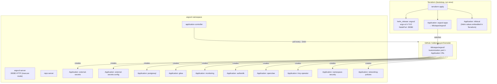
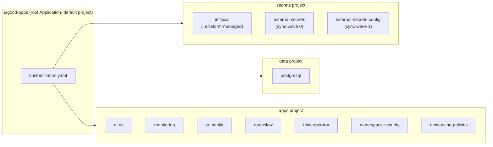

# ArgoCD

GitOps continuous delivery controller for the homelab Kubernetes cluster. ArgoCD watches the GitHub repository and automatically synchronizes cluster state to match the manifests in `main`.

## How It Works

ArgoCD is bootstrapped by Terraform (not by `kubectl apply -k`). Terraform installs the ArgoCD Helm chart and creates the root `Application` CR (`argocd-apps`) that triggers the App of Apps pattern. From that point on, git pushes automatically deploy to the cluster.



## Directory Contents

| File | Purpose |
|------|---------|
| `kustomization.yaml` | Lists AppProjects and Application CRs managed by the App of Apps |
| `projects/secrets.yaml` | AppProject for secret management infrastructure |
| `projects/data.yaml` | AppProject for databases and data stores |
| `projects/apps.yaml` | AppProject for user-facing applications |
| `applications/external-secrets-app.yaml` | ESO Helm chart (sync-wave 0 — installs CRDs first) |
| `applications/external-secrets-config-app.yaml` | ClusterSecretStore (sync-wave 1 — after ESO CRDs) |
| `applications/postgresql-app.yaml` | PostgreSQL deployment in `gitea-system` namespace |
| `applications/gitea-app.yaml` | Gitea deployment in `gitea-system` namespace |
| `applications/monitoring-app.yaml` | kube-prometheus-stack Helm chart (Grafana + Prometheus) |
| `applications/monitoring-config-app.yaml` | Grafana ExternalSecret (monitoring namespace) |
| `applications/authentik-app.yaml` | Authentik SSO Helm chart |
| `applications/authentik-config-app.yaml` | Authentik ExternalSecret (authentik namespace) |
| `applications/openclaw-app.yaml` | OpenClaw AI gateway deployment |
| `applications/trivy-operator-app.yaml` | Trivy vulnerability scanner Helm chart (monitoring namespace, ClientServer mode) |
| `applications/namespace-security-app.yaml` | Pod Security Standard labels for namespaces |
| `applications/networking-policies-app.yaml` | Default-deny NetworkPolicies across all namespaces |

> **Note:** The `infisical` Application CR is **not** in this directory. It is created by `terraform/argocd.tf` because its Helm values include sensitive PostgreSQL and Redis passwords that cannot be stored in git.

## App of Apps Pattern

The root Application (`argocd-apps`) watches `k8s/apps/argocd/`. Any AppProject or Application CR added to that directory (and listed in `kustomization.yaml`) is automatically deployed by ArgoCD.



## Sync Wave Ordering

Sync waves control the order in which resources are applied. AppProjects must exist before Applications reference them.

| Wave | Resource | Why |
|---|---|---|
| -1 | AppProjects (`secrets`, `data`, `apps`) | Must exist before any Application references them |
| 0 | `external-secrets` | Installs the ESO Helm chart + CRDs (`ExternalSecret`, `ClusterSecretStore`, etc.) |
| 1 | `external-secrets-config` | Applies the `ClusterSecretStore` — requires CRDs from wave 0 to be present |
| 2 | `trivy-operator` | Vulnerability scanner — after core apps are synced |
| (default) | `postgresql`, `gitea`, `monitoring`, `authentik`, `openclaw`, `namespace-security`, `networking-policies` | No ordering requirements between them |

## ArgoCD Configuration

ArgoCD runs in **insecure mode** (`server.insecure = true`) — it serves plain HTTP on port 8080/30080. TLS is terminated by Tailscale Serve, which provides a valid Let's Encrypt certificate. This avoids the need for cert-manager or self-signed certificates inside the cluster.

| Setting | Value | Set via |
|---|---|---|
| `server.service.type` | `NodePort` | Terraform Helm values |
| `server.service.nodePorts.http` | `30080` | Terraform Helm values |
| `configs.params.server.insecure` | `true` | Terraform Helm values |
| `configs.cm.oidc.config` | Authentik OIDC | Terraform Helm values (`argocd_oidc_client_secret` tfvar) |
| `configs.rbac.policy.default` | `role:admin` | Terraform Helm values — all SSO users get admin access |
| `configs.cm.admin.enabled` | `false` | Terraform Helm values — local admin login disabled |
| `configs.cm.resource.customizations.ignoreDifferences.external-secrets.io_ExternalSecret` | `jsonPointers: [/metadata/finalizers]` | Terraform Helm values — prevents ESO finalizer from causing permanent OutOfSync |
| Chart version | `7.8.0` | `terraform/variables.tf` default |

## Repository Authentication

The homelab repository is public on GitHub. ArgoCD clones it via unauthenticated HTTPS — no deploy keys, PATs, or credentials are needed. All Application CRs use the HTTPS URL format:

```
repoURL: https://github.com/holdennguyen/homelab.git
```

This eliminates the risk of SSH private key leakage in the public repo's Terraform state or tfvars. If the repo ever goes private, a Fine-grained PAT can be added via the Infisical → ESO pipeline.

## Adding a New Application

### Projects

Every Application must belong to an AppProject. Pick the project that matches the service's role:

| Project | Purpose | When to use |
|---|---|---|
| `secrets` | Secret management infrastructure | Secret stores, secret operators, certificate managers |
| `data` | Databases and persistent data stores | PostgreSQL, Redis, object storage, message queues |
| `apps` | User-facing applications and services | Web apps, APIs, dashboards, developer tools |
| `default` | Bootstrap only | **Reserved** for the `argocd-apps` root Application |

If a new application's destination namespace is not already listed in the project's `destinations`, add it to the corresponding `projects/*.yaml` file. Similarly, if it deploys cluster-scoped resources (CRDs, ClusterRoles, etc.), add them to `clusterResourceWhitelist`.

### Labels

Every Application CR **must** carry these four standard Kubernetes labels:

| Label | Value | Rule |
|---|---|---|
| `app.kubernetes.io/name` | Application name | Must match `metadata.name` |
| `app.kubernetes.io/part-of` | `homelab` | Always `homelab` |
| `app.kubernetes.io/component` | Functional role | One of: `secrets`, `database`, `git`, `dashboard`, `ai`, `gitops`, or a new descriptive value |
| `app.kubernetes.io/managed-by` | `argocd` | Always `argocd` |

Do not add custom-prefixed labels (e.g., `homelab/*`). Use only `app.kubernetes.io/*` labels to stay consistent with the Kubernetes recommended labels convention.

### Template

1. Create a directory `k8s/apps/my-service/` with `kustomization.yaml` and resource manifests
2. Create `k8s/apps/argocd/applications/my-service-app.yaml`:

```yaml
apiVersion: argoproj.io/v1alpha1
kind: Application
metadata:
  name: my-service
  namespace: argocd
  labels:
    app.kubernetes.io/name: my-service
    app.kubernetes.io/part-of: homelab
    app.kubernetes.io/component: <component>    # e.g. database, monitoring
    app.kubernetes.io/managed-by: argocd
spec:
  project: <project>                            # secrets | data | apps
  source:
    repoURL: https://github.com/holdennguyen/homelab.git
    targetRevision: HEAD
    path: k8s/apps/my-service
  destination:
    server: https://kubernetes.default.svc
    namespace: my-service
  syncPolicy:
    automated:
      prune: true
      selfHeal: true
    syncOptions:
      - CreateNamespace=true
```

3. If the destination namespace is not in the project's `destinations`, add it to the project file in `projects/`
4. Add the Application to `k8s/apps/argocd/kustomization.yaml`:

```yaml
resources:
  - applications/my-service-app.yaml
```

5. Push to `main`. ArgoCD detects the change within ~3 minutes and deploys.

### Checklist

- [ ] `metadata.name` matches the service name
- [ ] `metadata.labels` includes all four `app.kubernetes.io/*` labels
- [ ] `spec.project` is set to `secrets`, `data`, or `apps` (never `default`)
- [ ] Destination namespace is allowed in the project's `destinations`
- [ ] Any cluster-scoped resources are allowed in the project's `clusterResourceWhitelist`
- [ ] Application file is listed in `kustomization.yaml`

## Accessing the UI

ArgoCD is accessible at `https://holdens-mac-mini.story-larch.ts.net:8443` from any Tailscale device. Authentication is handled exclusively via **Authentik SSO** (OIDC) — the local admin login is disabled.

**One-time Tailscale Serve setup:**

```bash
tailscale serve --bg --https 8443 http://localhost:30080
```

**Authentication:**

Click "Log in via Authentik" on the ArgoCD login page. All SSO-authenticated users receive `role:admin` access (single-user homelab). The OIDC configuration is managed in `terraform/argocd.tf`.

## Operational Commands

```bash
# Check application status
kubectl get applications -n argocd

# Check all ArgoCD pods
kubectl get pods -n argocd

# Force an immediate sync on a specific application
kubectl patch application gitea -n argocd \
  --type merge -p '{"metadata":{"annotations":{"argocd.argoproj.io/refresh":"hard"}}}'

# View ArgoCD server logs
kubectl logs -n argocd deploy/argocd-server --tail=50

# View application controller logs
kubectl logs -n argocd deploy/argocd-application-controller --tail=50
```

## Troubleshooting

| Symptom | Cause | Fix |
|---|---|---|
| App shows `OutOfSync` forever | ArgoCD can't clone repo | Verify the HTTPS URL is reachable: `git ls-remote https://github.com/holdennguyen/homelab.git` |
| Application stuck in `Progressing` | Pod not ready | `kubectl describe pod -n <namespace>` for Events |
| CRD not found during sync | Wrong sync wave order | Ensure `external-secrets` (wave 0) is healthy before `external-secrets-config` (wave 1) syncs |
| Changes not deployed after push | Normal poll delay | Wait ~3min or force refresh via annotation |
| `kubernetes_manifest` schema error | Not applicable | ArgoCD Application CRs are applied via `local-exec` in Terraform, not `kubernetes_manifest` |
