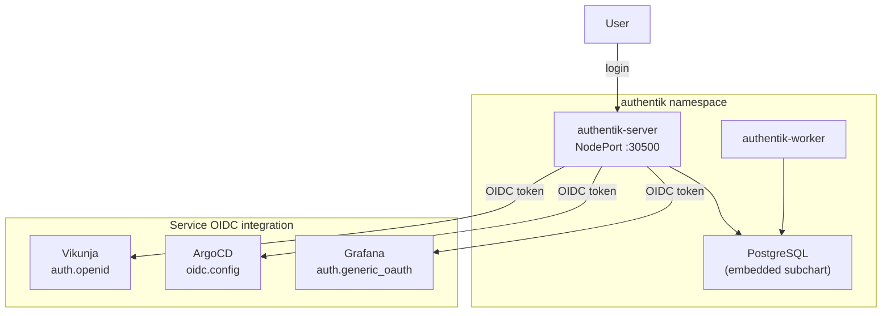
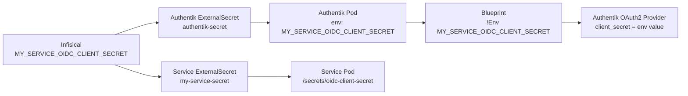

# Authentik (SSO / Identity Provider)

Authentik provides **Single Sign-On (SSO)** for the homelab via **OpenID Connect (OIDC)**. One login, one password for Grafana, ArgoCD, and Vikunja.

## Access

| Interface | URL | Credentials |
|---|---|---|
| Authentik Admin | `https://holdens-mac-mini.story-larch.ts.net` | akadmin / `AUTHENTIK_BOOTSTRAP_PASSWORD` from Infisical |
| Authentik (local) | `http://localhost:30500` | same |

## Architecture



## Directory Contents

| File | Purpose |
|------|---------|
| `kustomization.yaml` | Lists resources for Kustomize/ArgoCD rendering |
| `external-secret.yaml` | `ExternalSecret` that pulls Authentik secrets + OIDC client secrets from Infisical → `authentik-secret` |
| `blueprints-configmap.yaml` | Authentik Blueprint: bookmark apps + OIDC providers (applied automatically) |

> **Note:** Authentik is deployed via the **Helm chart source** defined in `k8s/apps/argocd/applications/authentik-app.yaml`. This directory only contains the ExternalSecret that provides credentials to the Helm release. The `authentik-config` ArgoCD Application syncs this directory, while the `authentik` Application syncs the upstream Helm chart.

## Security

Authentik's server and worker pods run as non-root users. The pod-level securityContext is configured with:

- `runAsUser: 1000`
- `runAsGroup: 1000`
- `runAsNonRoot: true`
- `fsGroup: 1000`

These settings ensure compliance with the cluster's restricted Pod Security Standard. The embedded PostgreSQL instance also runs as a non-root user (UID 999).

## OIDC Providers

Each service has a dedicated OIDC provider in Authentik with its own client ID and secret:

| Service | Client ID | Redirect URI | Secret location |
|---|---|---|---|
| Grafana | `grafana` | `https://holdens-mac-mini.story-larch.ts.net:8444/login/generic_oauth` | Infisical: `GRAFANA_OAUTH_CLIENT_SECRET` |
| ArgoCD | `argocd` | `https://holdens-mac-mini.story-larch.ts.net:8443/auth/callback` | Terraform: `argocd_oidc_client_secret` |
| Vikunja | `vikunja` | `https://holdens-mac-mini.story-larch.ts.net:8449/auth/openid/authentik` | Infisical: `VIKUNJA_OIDC_CLIENT_SECRET` |

All providers use **RS256** signing (asymmetric keys). Scope mappings assigned: `openid`, `email`, `profile`.

## Authentication Model

All services enforce SSO-only access — local login forms are disabled:

| Service | How SSO is enforced |
|---|---|
| ArgoCD | `configs.cm.admin.enabled: false` — admin login disabled, RBAC default `role:admin` for all SSO users |
| Grafana | `auth.disable_login_form: true`, `auto_login: true` — auto-redirects to Authentik |
| Vikunja | `service.enableregistration: false` — local registration disabled, OIDC login available via config file |

## Configuration

Authentik is deployed via ArgoCD using the Helm chart source. All configuration is in `k8s/apps/argocd/applications/authentik-app.yaml`.

Key settings:

- **Helm chart:** `authentik/authentik` v2025.12.4
- **PostgreSQL:** Embedded subchart with 2Gi PVC
- **Secrets:** All sensitive values (secret key, bootstrap password/token, PG password) come from Infisical via ExternalSecret
- **NodePort:** 30500 (HTTP), 30501 (HTTPS)
- **Tailscale Serve:** Default HTTPS port (443)

### Secrets in Infisical

| Key | Purpose | Consumed by |
|---|---|---|
| `AUTHENTIK_SECRET_KEY` | Cookie signing and unique user IDs (never change after first install) | Authentik server/worker |
| `AUTHENTIK_BOOTSTRAP_PASSWORD` | Initial admin password | Authentik server |
| `AUTHENTIK_BOOTSTRAP_TOKEN` | API token for automation | Authentik server |
| `AUTHENTIK_POSTGRES_PASSWORD` | Embedded PostgreSQL password | Authentik server + PostgreSQL |
| `VIKUNJA_OIDC_CLIENT_SECRET` | OAuth2 client secret for Vikunja provider | Authentik blueprint (`!Env`) + Vikunja config |

### OIDC integration per service

**Grafana** — Provider created manually in Authentik UI. Client-side configured in Helm values (`monitoring-app.yaml`) via `grafana.ini.auth.generic_oauth`. Client secret mounted from `grafana-secret` ExternalSecret.

**ArgoCD** — Provider created manually in Authentik UI. Client-side configured in Terraform (`argocd.tf`) via `configs.cm.oidc.config`. Client secret stored in `argocd-secret` via Terraform `set_sensitive`. Requires `terraform apply` to update.

**Vikunja** (reference implementation) — Fully code-managed. Provider created via Authentik Blueprint with `!Env` for the client secret. Client-side configured via `config.yml` ConfigMap mounted at `/etc/vikunja/config.yml`. Both Authentik and Vikunja read the same secret from Infisical — zero manual UI steps. See [Adding a new OIDC-protected service](#adding-a-new-oidc-protected-service) for the pattern.

## Networking

| Layer | Value |
|---|---|
| Container port | 9000 (HTTP), 9443 (HTTPS) |
| NodePort | 30500 (HTTP), 30501 (HTTPS) |
| Tailscale HTTPS | 443 (default) |
| URL | `https://holdens-mac-mini.story-larch.ts.net` |

One-time Tailscale Serve setup:

```bash
tailscale serve --bg http://localhost:30500
```

## Application Inventory

| Application | Integration | URL |
|---|---|---|
| Grafana | `auth.generic_oauth` | `https://holdens-mac-mini.story-larch.ts.net:8444` |
| ArgoCD | `oidc.config` | `https://holdens-mac-mini.story-larch.ts.net:8443` |
| Infisical | Bookmark | `https://holdens-mac-mini.story-larch.ts.net:8445` |
| OpenClaw | Bookmark | `https://holdens-mac-mini.story-larch.ts.net:8447` |
| Trivy Dashboard | Bookmark | `https://holdens-mac-mini.story-larch.ts.net:8448` |
| Vikunja | OIDC (`auth.openid`) | `https://holdens-mac-mini.story-larch.ts.net:8449` |
| Homelab Docs | Bookmark | `https://holdennguyen.github.io/homelab` |

## Adding a new Bookmark Application

For services without native OIDC support, you can add them to the Authentik portal as a Bookmark Application using the Blueprint system.

1. Edit `k8s/apps/authentik/blueprints-configmap.yaml`
2. Add a new entry to the `entries` list under the `bookmarks.yaml` key:

```yaml
      - model: authentik_core.application
        id: app-my-service
        state: present
        identifiers:
          slug: my-service
        attrs:
          name: My Service
          group: Development # Or whatever logical group makes sense
          meta_launch_url: https://url-to-service
          meta_icon: https://url-to-icon.png
          meta_description: Short description of the service
          meta_publisher: Homelab
```

3. Commit and push the changes. ArgoCD will sync the new ConfigMap, and Authentik will automatically discover and apply the Blueprint, making the bookmark appear in the portal.

## Adding a new OIDC-protected service

This homelab uses a **fully code-managed** OIDC pattern. The Authentik OAuth2 provider, application, and client secret are all defined in git — no manual UI configuration required.

### How it works



The secret is defined once in Infisical and flows to both sides:
- **Authentik side:** ExternalSecret → `authentik-secret` K8s Secret → `envFrom` in pod → `!Env` in blueprint → OAuth2 provider `client_secret`
- **Service side:** ExternalSecret → service K8s Secret → file mount → service OIDC config

### Step-by-step checklist

#### 1. Generate and store the client secret in Infisical

Generate a random secret and add it to Infisical under `homelab / prod /` (root path):

| Key | Example |
|---|---|
| `MY_SERVICE_OIDC_CLIENT_SECRET` | (random 64-char alphanumeric string) |

#### 2. Add the secret to the Authentik ExternalSecret

Edit `k8s/apps/authentik/external-secret.yaml`. Add a template data entry and a corresponding `data` entry:

```yaml
    template:
      data:
        # ... existing entries ...
        MY_SERVICE_OIDC_CLIENT_SECRET: "{{ .myServiceOidcClientSecret }}"
  data:
    # ... existing entries ...
    - secretKey: myServiceOidcClientSecret
      remoteRef:
        key: MY_SERVICE_OIDC_CLIENT_SECRET
```

This makes the secret available as an environment variable in all Authentik pods (via `global.envFrom` in the Helm values).

#### 3. Add the OAuth2 provider and application to the blueprint

Edit `k8s/apps/authentik/blueprints-configmap.yaml`. Add two entries — the provider first (so `!KeyOf` can reference it), then the application:

```yaml
      - model: authentik_providers_oauth2.oauth2provider
        id: provider-my-service
        state: present
        identifiers:
          name: my-service
        attrs:
          name: my-service
          authorization_flow: !Find [authentik_flows.flow, [slug, default-provider-authorization-implicit-consent]]
          client_type: confidential
          client_id: my-service
          client_secret: !Env MY_SERVICE_OIDC_CLIENT_SECRET
          redirect_uris: |
            https://holdens-mac-mini.story-larch.ts.net:<port>/auth/callback
          signing_key: !Find [authentik_crypto.certificatekeypair, [name, "authentik Self-signed Certificate"]]
          property_mappings:
            - !Find [authentik_providers_oauth2.scopemapping, [scope_name, openid]]
            - !Find [authentik_providers_oauth2.scopemapping, [scope_name, email]]
            - !Find [authentik_providers_oauth2.scopemapping, [scope_name, profile]]
      - model: authentik_core.application
        id: app-my-service
        state: present
        identifiers:
          slug: my-service
        attrs:
          name: My Service
          slug: my-service
          group: Development
          provider: !KeyOf provider-my-service
          meta_launch_url: https://holdens-mac-mini.story-larch.ts.net:<port>
          meta_icon: https://url-to-icon.png
          meta_description: Short description
          meta_publisher: Homelab
```

Key blueprint tags:
- `!Env MY_SERVICE_OIDC_CLIENT_SECRET` — reads from the pod environment (sourced from `authentik-secret`)
- `!Find` — looks up existing Authentik objects by field (flows, keys, scope mappings)
- `!KeyOf provider-my-service` — resolves to the primary key of the provider created earlier in the same blueprint

#### 4. Add the secret to the service's ExternalSecret

In the service's own `external-secret.yaml`, add a mapping for the same Infisical key:

```yaml
    - secretKey: OIDC_CLIENT_SECRET
      remoteRef:
        key: MY_SERVICE_OIDC_CLIENT_SECRET
```

#### 5. Configure the service to use OIDC

Mount the secret as a file or env var and configure the service's OIDC settings. Authentik endpoints are auto-discovered from:

```
https://holdens-mac-mini.story-larch.ts.net/application/o/<slug>/.well-known/openid-configuration
```

Standard Authentik endpoints:
- **Authorize:** `https://holdens-mac-mini.story-larch.ts.net/application/o/authorize/`
- **Token:** `https://holdens-mac-mini.story-larch.ts.net/application/o/token/`
- **Userinfo:** `https://holdens-mac-mini.story-larch.ts.net/application/o/userinfo/`
- **OIDC Discovery:** `https://holdens-mac-mini.story-larch.ts.net/application/o/<slug>/.well-known/openid-configuration`

#### 6. Update documentation

- Add the service to the [OIDC Providers](#oidc-providers) table above
- Add the service to the [Authentication Model](#authentication-model) table
- Add the service to the [Application Inventory](#application-inventory) table
- Add the Infisical key to the [Secrets in Infisical](#secrets-in-infisical) table
- Update the service's own README with OIDC setup notes
- Update `k8s/apps/external-secrets/README.md` with the new secret key

#### 7. Commit, merge, verify

Push changes, create PR, merge to `main`. ArgoCD will sync both the `authentik-config` and service applications. Verify:

```bash
# Check Authentik blueprint applied
kubectl logs -n authentik -l app.kubernetes.io/component=worker --tail=50 | grep -i blueprint

# Check the provider exists
kubectl exec -n authentik deploy/authentik-server -- \
  ak test_provider my-service 2>/dev/null || echo "Use Authentik Admin UI to verify"

# Check the service pod has the OIDC config
kubectl logs -n <namespace> deploy/<service> --tail=20
```

## Operational Commands

```bash
# Check pod status
kubectl get pods -n authentik

# View server logs
kubectl logs -n authentik -l app.kubernetes.io/component=server --tail=50

# View worker logs
kubectl logs -n authentik -l app.kubernetes.io/component=worker --tail=50

# Check ExternalSecret status
kubectl get externalsecret -n authentik

# Force secret re-sync
kubectl annotate externalsecret authentik-secret -n authentik \
  force-sync=$(date +%s) --overwrite

# Check ArgoCD application status
kubectl get application authentik authentik-config -n argocd
```

## Troubleshooting

| Symptom | Cause | Fix |
|---|---|---|
| "Login failed" on Grafana/ArgoCD | Redirect URI mismatch | Check the redirect URI in Authentik matches exactly (scheme, host, port, path) |
| Authentik returns 502 | Server pod not ready | `kubectl get pods -n authentik` |
| "Invalid client" error | Wrong client_id or secret | Verify the secret in Infisical matches what's in Authentik provider |
| OIDC login button not showing | Config not applied | For ArgoCD: run `terraform apply`; for Grafana/Vikunja: wait for ArgoCD sync |
| 403 `insufficient_scope` on userinfo | Provider missing scope mappings | Assign `openid`, `email`, `profile` scope mappings to the provider in Authentik |
| ArgoCD `malformed jwt: unexpected algorithm HS256` | Provider using HS256 instead of RS256 | Update the provider's signing key to an RS256 keypair in Authentik |
| ArgoCD shows no applications after SSO login | RBAC policy.default is empty | Set `configs.rbac.policy.default: role:admin` in Terraform |
| Blueprint `!Env` returns empty | Secret not in `authentik-secret` K8s Secret | Check Authentik ExternalSecret template has the key; force re-sync and restart Authentik pods |
| Provider created but client_secret wrong | Infisical value mismatch | Ensure the same Infisical key is used by both Authentik and service ExternalSecrets; force re-sync both |
| Blueprint not applying after ConfigMap change | Worker hasn't picked up the new ConfigMap | Restart the Authentik worker: `kubectl rollout restart deployment authentik-worker -n authentik` |
