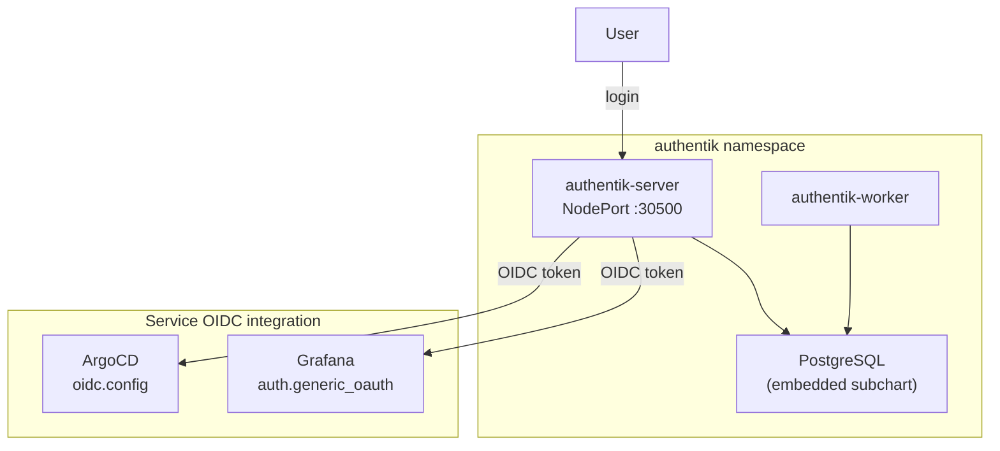
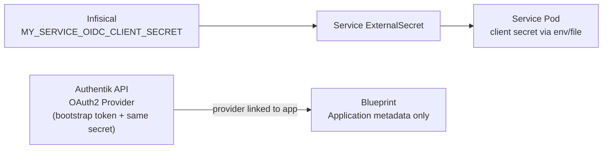

# Authentik (SSO / Identity Provider)

Authentik provides **Single Sign-On (SSO)** for the homelab via **OpenID Connect (OIDC)**. One login, one password for Grafana and ArgoCD.

## Access

| Interface | URL | Credentials |
|---|---|---|
| Authentik Admin | `https://hardy-mac-mini.folk-adelie.ts.net` | akadmin / `AUTHENTIK_BOOTSTRAP_PASSWORD` from Infisical |
| Authentik (local) | `http://localhost:30500` | same |

## Architecture



## Directory Contents

| File | Purpose |
|------|---------|
| `kustomization.yaml` | Lists resources for Kustomize/ArgoCD rendering |
| `external-secret.yaml` | `ExternalSecret` that pulls Authentik secrets from Infisical → `authentik-secret` |
| `blueprints-configmap.yaml` | Authentik Blueprint: application entries for the portal (bookmarks + metadata) |

> **Note:** Authentik is deployed via the **Helm chart source** defined in `k8s/apps/argocd/applications/authentik-app.yaml`. This directory only contains the ExternalSecret that provides credentials to the Helm release. The `authentik-config` ArgoCD Application syncs this directory, while the `authentik` Application syncs the upstream Helm chart.

## Security

Authentik's server and worker pods run as non-root users. The pod-level securityContext is configured with:

- `runAsUser: 1000`
- `runAsGroup: 1000`
- `runAsNonRoot: true`
- `fsGroup: 1000`

These settings ensure compliance with the cluster's restricted Pod Security Standard. The embedded PostgreSQL instance also runs as a non-root user (UID 999).

## OIDC Providers

Each service has a dedicated OIDC provider in Authentik with its own client ID and secret:

| Service | Client ID | Redirect URI | Secret location |
|---|---|---|---|
| Grafana | `grafana` | `https://hardy-mac-mini.folk-adelie.ts.net:8444/login/generic_oauth` | Infisical: `GRAFANA_OAUTH_CLIENT_SECRET` |
| ArgoCD | `argocd` | `https://hardy-mac-mini.folk-adelie.ts.net:8443/auth/callback` | Terraform: `argocd_oidc_client_secret` |

All providers use **RS256** signing (asymmetric keys). Scope mappings assigned: `openid`, `email`, `profile`.

## Authentication Model

All services enforce SSO-only access — local login forms are disabled:

| Service | How SSO is enforced |
|---|---|
| ArgoCD | `configs.cm.admin.enabled: false` — admin login disabled, RBAC default `role:admin` for all SSO users |
| Grafana | `auth.disable_login_form: true`, `auto_login: true` — auto-redirects to Authentik |

## Configuration

Authentik is deployed via ArgoCD using the Helm chart source. All configuration is in `k8s/apps/argocd/applications/authentik-app.yaml`.

Key settings:

- **Helm chart:** `authentik/authentik` v2025.12.4
- **PostgreSQL:** Embedded subchart with 2Gi PVC
- **Secrets:** All sensitive values (secret key, bootstrap password/token, PG password) come from Infisical via ExternalSecret
- **NodePort:** 30500 (HTTP), 30501 (HTTPS)
- **Tailscale Serve:** Default HTTPS port (443)

### Secrets in Infisical

| Key | Purpose | Consumed by |
|---|---|---|
| `AUTHENTIK_SECRET_KEY` | Cookie signing and unique user IDs (never change after first install) | Authentik server/worker |
| `AUTHENTIK_BOOTSTRAP_PASSWORD` | Initial admin password | Authentik server |
| `AUTHENTIK_BOOTSTRAP_TOKEN` | API token for automation | Authentik server |
| `AUTHENTIK_POSTGRES_PASSWORD` | Embedded PostgreSQL password | Authentik server + PostgreSQL |

### OIDC integration per service

All OIDC providers are created via the Authentik API using the bootstrap token. The blueprint manages only application metadata (name, icon, group, launch URL). Provider linking is done via API after creation.

**Grafana** — Client-side configured in Helm values (`monitoring-app.yaml`) via `grafana.ini.auth.generic_oauth`. Client secret mounted from `grafana-secret` ExternalSecret.

**ArgoCD** — Client-side configured in Terraform (`argocd.tf`) via `configs.cm.oidc.config`. Client secret stored in `argocd-secret` via Terraform `set_sensitive`. Requires `terraform apply` to update.

## Networking

| Layer | Value |
|---|---|
| Container port | 9000 (HTTP), 9443 (HTTPS) |
| NodePort | 30500 (HTTP), 30501 (HTTPS) |
| Tailscale HTTPS | 443 (default) |
| URL | `https://hardy-mac-mini.folk-adelie.ts.net` |

One-time Tailscale Serve setup:

```bash
tailscale serve --bg http://localhost:30500
```

## Application Inventory

| Application | Integration | URL |
|---|---|---|
| Grafana | `auth.generic_oauth` | `https://hardy-mac-mini.folk-adelie.ts.net:8444` |
| ArgoCD | `oidc.config` | `https://hardy-mac-mini.folk-adelie.ts.net:8443` |
| Infisical | Bookmark | `https://hardy-mac-mini.folk-adelie.ts.net:8445` |
| OpenClaw | Bookmark | `https://hardy-mac-mini.folk-adelie.ts.net:8447` |
| Trivy Dashboard | Bookmark | `https://hardy-mac-mini.folk-adelie.ts.net:8448` |
| LaunchFast | Bookmark | `https://hardy-mac-mini.folk-adelie.ts.net:8446` |
| Homelab Docs | Bookmark | `https://holdennguyen.github.io/homelab` |

## Adding a new Bookmark Application

For services without native OIDC support, you can add them to the Authentik portal as a Bookmark Application using the Blueprint system.

1. Edit `k8s/apps/authentik/blueprints-configmap.yaml`
2. Add a new entry to the `entries` list under the `bookmarks.yaml` key:

```yaml
      - model: authentik_core.application
        id: app-my-service
        state: present
        identifiers:
          slug: my-service
        attrs:
          name: My Service
          group: Development # Or whatever logical group makes sense
          meta_launch_url: https://url-to-service
          meta_icon: https://url-to-icon.png
          meta_description: Short description of the service
          meta_publisher: Homelab
```

3. Commit and push the changes. ArgoCD will sync the new ConfigMap, and Authentik will automatically discover and apply the Blueprint, making the bookmark appear in the portal.

## Adding a new OIDC-protected service

OIDC providers are created via the **Authentik API** using the bootstrap token — same one-time bootstrap pattern for all services. The blueprint manages only application metadata (name, icon, group). The client secret is stored once in Infisical and delivered to the service via ExternalSecret.

### How it works



### Step-by-step checklist

#### 1. Generate and store the client secret in Infisical

Generate a random secret and add it to Infisical under `homelab / prod /` (root path):

| Key | Example |
|---|---|
| `MY_SERVICE_OIDC_CLIENT_SECRET` | (random 64-char alphanumeric string) |

#### 2. Add the application bookmark to the blueprint

Edit `k8s/apps/authentik/blueprints-configmap.yaml` and add an entry (see [Adding a new Bookmark Application](#adding-a-new-bookmark-application)). Commit and merge so the application exists before linking.

#### 3. Add the secret to the service's ExternalSecret

In the service's own `external-secret.yaml`, add a mapping for the Infisical key:

```yaml
    - secretKey: OIDC_CLIENT_SECRET
      remoteRef:
        key: MY_SERVICE_OIDC_CLIENT_SECRET
```

#### 4. Create the OAuth2 provider via Authentik API

Run the following on the Mac mini after the service ExternalSecret has synced:

```bash
BOOTSTRAP_TOKEN=$(kubectl get secret authentik-secret -n authentik \
  -o jsonpath='{.data.AUTHENTIK_BOOTSTRAP_TOKEN}' | base64 -d)

OIDC_SECRET=$(kubectl get secret <service-secret> -n <namespace> \
  -o jsonpath='{.data.OIDC_CLIENT_SECRET}' | base64 -d)

AUTH_FLOW=$(curl -sk -H "Authorization: Bearer $BOOTSTRAP_TOKEN" \
  "https://hardy-mac-mini.folk-adelie.ts.net/api/v3/flows/instances/?slug=default-provider-authorization-implicit-consent" \
  | python3 -c "import json,sys; print(json.load(sys.stdin)['results'][0]['pk'])")

INVAL_FLOW=$(curl -sk -H "Authorization: Bearer $BOOTSTRAP_TOKEN" \
  "https://hardy-mac-mini.folk-adelie.ts.net/api/v3/flows/instances/?slug=default-provider-invalidation-flow" \
  | python3 -c "import json,sys; print(json.load(sys.stdin)['results'][0]['pk'])")

SIGNING_KEY=$(curl -sk -H "Authorization: Bearer $BOOTSTRAP_TOKEN" \
  "https://hardy-mac-mini.folk-adelie.ts.net/api/v3/crypto/certificatekeypairs/?name=authentik+Self-signed+Certificate" \
  | python3 -c "import json,sys; print(json.load(sys.stdin)['results'][0]['pk'])")

SCOPE_OPENID=$(curl -sk -H "Authorization: Bearer $BOOTSTRAP_TOKEN" \
  "https://hardy-mac-mini.folk-adelie.ts.net/api/v3/propertymappings/provider/scope/?scope_name=openid" \
  | python3 -c "import json,sys; print(json.load(sys.stdin)['results'][0]['pk'])")
SCOPE_EMAIL=$(curl -sk -H "Authorization: Bearer $BOOTSTRAP_TOKEN" \
  "https://hardy-mac-mini.folk-adelie.ts.net/api/v3/propertymappings/provider/scope/?scope_name=email" \
  | python3 -c "import json,sys; print(json.load(sys.stdin)['results'][0]['pk'])")
SCOPE_PROFILE=$(curl -sk -H "Authorization: Bearer $BOOTSTRAP_TOKEN" \
  "https://hardy-mac-mini.folk-adelie.ts.net/api/v3/propertymappings/provider/scope/?scope_name=profile" \
  | python3 -c "import json,sys; print(json.load(sys.stdin)['results'][0]['pk'])")

PROVIDER_PK=$(curl -sk -X POST \
  -H "Authorization: Bearer $BOOTSTRAP_TOKEN" \
  -H "Content-Type: application/json" \
  "https://hardy-mac-mini.folk-adelie.ts.net/api/v3/providers/oauth2/" \
  -d "{
    \"name\": \"<service-slug>\",
    \"authorization_flow\": \"$AUTH_FLOW\",
    \"invalidation_flow\": \"$INVAL_FLOW\",
    \"client_type\": \"confidential\",
    \"client_id\": \"<service-slug>\",
    \"client_secret\": \"$OIDC_SECRET\",
    \"redirect_uris\": [{\"matching_mode\": \"strict\", \"url\": \"https://hardy-mac-mini.folk-adelie.ts.net:<port>/auth/callback\"}],
    \"signing_key\": \"$SIGNING_KEY\",
    \"property_mappings\": [\"$SCOPE_OPENID\", \"$SCOPE_EMAIL\", \"$SCOPE_PROFILE\"]
  }" | python3 -c "import json,sys; print(json.load(sys.stdin)['pk'])")

curl -sk -X PATCH \
  -H "Authorization: Bearer $BOOTSTRAP_TOKEN" \
  -H "Content-Type: application/json" \
  "https://hardy-mac-mini.folk-adelie.ts.net/api/v3/core/applications/<service-slug>/" \
  -d "{\"provider\": $PROVIDER_PK}"
```

Replace `<service-slug>`, `<service-secret>`, `<namespace>`, and `<port>` with actual values.

#### 5. Configure the service to use OIDC

Mount the secret as a file or env var and configure the service's OIDC settings. Authentik endpoints are auto-discovered from:

```
https://hardy-mac-mini.folk-adelie.ts.net/application/o/<slug>/.well-known/openid-configuration
```

Standard Authentik endpoints:
- **Authorize:** `https://hardy-mac-mini.folk-adelie.ts.net/application/o/authorize/`
- **Token:** `https://hardy-mac-mini.folk-adelie.ts.net/application/o/token/`
- **Userinfo:** `https://hardy-mac-mini.folk-adelie.ts.net/application/o/userinfo/`
- **OIDC Discovery:** `https://hardy-mac-mini.folk-adelie.ts.net/application/o/<slug>/.well-known/openid-configuration`

#### 6. Update documentation

- Add the service to the [OIDC Providers](#oidc-providers) table
- Add the service to the [Authentication Model](#authentication-model) table
- Add the service to the [Application Inventory](#application-inventory) table
- Update the service's own README with OIDC setup notes
- Update `k8s/apps/external-secrets/README.md` with the new secret key

#### 7. Restart and verify

```bash
kubectl rollout restart deployment <service> -n <namespace>

# Verify OIDC discovery
curl -sk "https://hardy-mac-mini.folk-adelie.ts.net/application/o/<slug>/.well-known/openid-configuration" | python3 -m json.tool

# Test login via the service's OIDC button
```

## Operational Commands

```bash
# Check pod status
kubectl get pods -n authentik

# View server logs
kubectl logs -n authentik -l app.kubernetes.io/component=server --tail=50

# View worker logs
kubectl logs -n authentik -l app.kubernetes.io/component=worker --tail=50

# Check ExternalSecret status
kubectl get externalsecret -n authentik

# Force secret re-sync
kubectl annotate externalsecret authentik-secret -n authentik \
  force-sync=$(date +%s) --overwrite

# Check ArgoCD application status
kubectl get application authentik authentik-config -n argocd
```

## Troubleshooting

| Symptom | Cause | Fix |
|---|---|---|
| "Login failed" on Grafana/ArgoCD | Redirect URI mismatch | Check the redirect URI in Authentik matches exactly (scheme, host, port, path) |
| Authentik returns 502 | Server pod not ready | `kubectl get pods -n authentik` |
| "Invalid client" error | Wrong client_id or secret | Verify the secret in Infisical matches what's in Authentik provider |
| OIDC login button not showing | Config not applied | For ArgoCD: run `terraform apply`; for Grafana: wait for ArgoCD sync |
| 403 `insufficient_scope` on userinfo | Provider missing scope mappings | Assign `openid`, `email`, `profile` scope mappings to the provider in Authentik |
| ArgoCD `malformed jwt: unexpected algorithm HS256` | Provider using HS256 instead of RS256 | Update the provider's signing key to an RS256 keypair in Authentik |
| ArgoCD shows no applications after SSO login | RBAC policy.default is empty | Set `configs.rbac.policy.default: role:admin` in Terraform |
| Service OIDC shows empty providers | Provider exists but service hasn't re-discovered | Restart the service deployment: `kubectl rollout restart deployment <service> -n <namespace>` |
| Provider client_secret mismatch | Infisical value doesn't match what was passed to API | Re-create the provider via API with the current secret value; restart service pod |
| OIDC discovery returns 404 | Provider not created or not linked to app | Run the API bootstrap script to create provider and link it to the application |
| Blueprint not applying after ConfigMap change | Worker hasn't picked up the new ConfigMap | Restart the Authentik worker: `kubectl rollout restart deployment authentik-worker -n authentik` |
