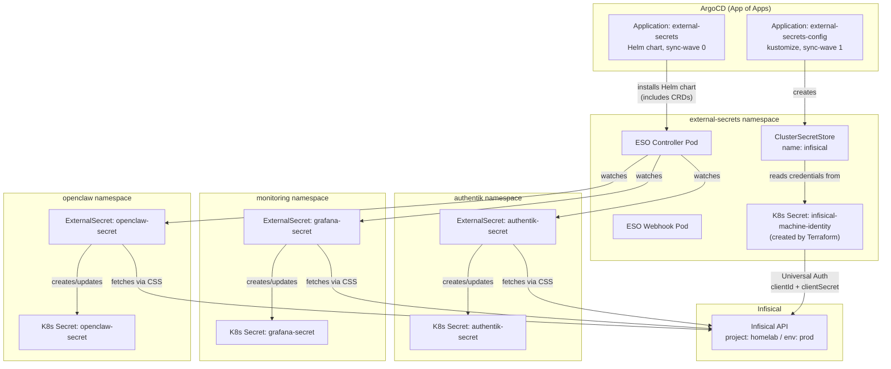
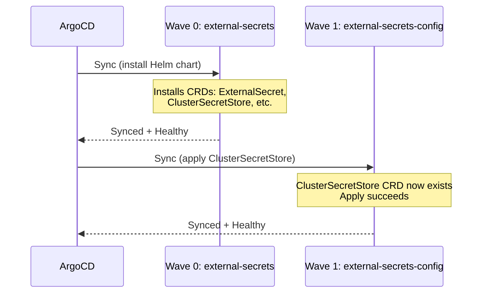
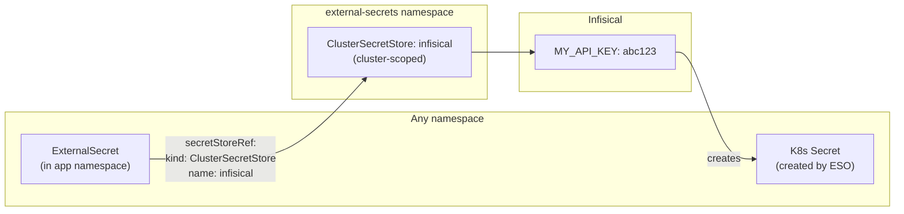

# External Secrets Operator

External Secrets Operator (ESO) is a Kubernetes operator that reads credentials from external secret stores (in this case, Infisical) and creates native Kubernetes `Secret` objects in the cluster. Applications consume these Kubernetes Secrets normally — they have no knowledge of Infisical.

## Architecture



## Sync Wave Ordering

ESO is deployed in two ArgoCD Applications to handle the CRD dependency:



If `external-secrets-config` syncs before the Helm chart installs the CRDs, it fails with `no kind "ClusterSecretStore" is registered`. The sync-wave annotation prevents this race condition.

## Directory Contents

| File | Purpose |
|---|---|
| `kustomization.yaml` | Lists `cluster-secret-store.yaml` as the only resource |
| `cluster-secret-store.yaml` | `ClusterSecretStore` resource that connects ESO to Infisical |
| `README.md` | This file |

Note: The `infisical-machine-identity` Kubernetes Secret referenced by the `ClusterSecretStore` is **not** in this directory — it is created by `terraform/bootstrap-secrets.tf` to avoid storing credentials in git.

## ClusterSecretStore Configuration

```yaml
apiVersion: external-secrets.io/v1
kind: ClusterSecretStore
metadata:
  name: infisical
spec:
  provider:
    infisical:
      hostAPI: http://infisical-infisical-standalone-infisical.infisical.svc.cluster.local:8080
      auth:
        universalAuthCredentials:
          clientId:
            name: infisical-machine-identity
            namespace: external-secrets
            key: clientId
          clientSecret:
            name: infisical-machine-identity
            namespace: external-secrets
            key: clientSecret
      secretsScope:
        projectSlug: homelab
        environmentSlug: prod
        secretsPath: /
```

Key fields explained:

| Field | Value | Notes |
|---|---|---|
| `hostAPI` | `http://infisical-infisical-standalone-infisical.infisical.svc.cluster.local:8080` | Internal cluster DNS — no external network hop |
| `universalAuthCredentials.clientId.name` | `infisical-machine-identity` | K8s Secret created by Terraform |
| `projectSlug` | `homelab` | Must match the project slug in the Infisical UI exactly |
| `environmentSlug` | `prod` | Must match an existing environment in the Infisical project |
| `secretsPath` | `/` | Root path — all secrets in the environment are accessible |

## ExternalSecret Pattern

Each application that needs secrets has an `ExternalSecret` resource in its own namespace. The `ClusterSecretStore` (cluster-scoped) is referenced from any namespace.



### Adding a New ExternalSecret

1. **Add the secret to Infisical** under `homelab / prod /`
2. **Create `external-secret.yaml`** in the application's directory:

```yaml
apiVersion: external-secrets.io/v1
kind: ExternalSecret
metadata:
  name: my-app-secret
  namespace: my-app
spec:
  refreshInterval: 1h
  secretStoreRef:
    name: infisical
    kind: ClusterSecretStore
  target:
    name: my-app-secret      # name of the K8s Secret to create
    creationPolicy: Owner    # ESO manages the lifecycle of this Secret
  data:
    - secretKey: MY_API_KEY  # key in the created K8s Secret
      remoteRef:
        key: MY_APP_API_KEY  # key name in Infisical
```

3. **Add to `kustomization.yaml`** in the app directory:
```yaml
resources:
  - external-secret.yaml
```

4. **Reference in Deployment**:
```yaml
env:
  - name: MY_API_KEY
    valueFrom:
      secretKeyRef:
        name: my-app-secret
        key: MY_API_KEY
```

5. **Push to git** — ArgoCD syncs the `ExternalSecret`; ESO creates the K8s `Secret` within seconds.

## Current ExternalSecrets

| ExternalSecret | Namespace | K8s Secret Created | Keys | Consumed By |
|---|---|---|---|---|
| `authentik-secret` | `authentik` | `authentik-secret` | `AUTHENTIK_SECRET_KEY`, `AUTHENTIK_BOOTSTRAP_PASSWORD`, `AUTHENTIK_BOOTSTRAP_TOKEN`, `AUTHENTIK_POSTGRESQL__PASSWORD`, `pg-password` | Authentik server + worker pods; embedded PostgreSQL |
| `grafana-secret` | `monitoring` | `grafana-secret` | `admin-user`, `admin-password`, `oauth-client-id`, `oauth-client-secret` | Grafana admin login; Grafana OIDC via Authentik |
| `openclaw-secret` | `openclaw` | `openclaw-secret` | `OPENCLAW_GATEWAY_TOKEN`, `OPENROUTER_API_KEY`, `GEMINI_API_KEY`, `GITHUB_TOKEN` | OpenClaw gateway env vars, agent git workflow |
| `vikunja-db-secret` | `vikunja` | `vikunja-db-secret` | `POSTGRES_USER`, `POSTGRES_PASSWORD`, `POSTGRES_DB`, `OIDC_CLIENT_SECRET` | PostgreSQL + Vikunja database credentials; Authentik OIDC client secret |

## Security

The External Secrets Operator runs as a non-root user by default. The Helm chart configures the container-level security context with:

- `runAsUser: 1000`
- `runAsNonRoot: true`
- `readOnlyRootFilesystem: true`
- `allowPrivilegeEscalation: false`

This complies with the cluster's restricted Pod Security Standard. No additional configuration is required.

## Operational Commands

```bash
# Check ClusterSecretStore status
kubectl get clustersecretstore infisical
kubectl describe clustersecretstore infisical

# Check all ExternalSecrets in the cluster
kubectl get externalsecret -A

# Check specific ExternalSecret
kubectl describe externalsecret authentik-secret -n authentik

# Force immediate reconciliation (skips refreshInterval)
kubectl annotate externalsecret authentik-secret -n authentik \
  force-sync=$(date +%s) --overwrite

# View the created K8s Secret (base64 encoded)
kubectl get secret authentik-secret -n authentik -o yaml

# Decode a specific secret value
kubectl get secret openclaw-secret -n openclaw \
  -o jsonpath='{.data.OPENCLAW_GATEWAY_TOKEN}' | base64 -d

# Check ESO operator logs
kubectl logs -n external-secrets -l app.kubernetes.io/name=external-secrets --tail=50
```

## Troubleshooting

| Symptom | Cause | Fix |
|---|---|---|
| `ClusterSecretStore` shows `InvalidProviderConfig` | Auth or config error | `kubectl describe clustersecretstore infisical` — check the error message |
| 401 Unauthorized | Wrong `clientId` / `clientSecret` | Update `terraform.tfvars` and `terraform apply` |
| 403 Forbidden | Machine identity not added to `homelab` project | Infisical UI → Project → Access Control → Machine Identities → Add |
| 404 Project not found | Wrong `projectSlug` | Verify slug in Infisical UI → Project Settings (must be exactly `homelab`) |
| `ExternalSecret` stuck as `SecretSyncedError` | Stale error cache after store becomes valid | `kubectl annotate externalsecret <name> -n <ns> force-sync=$(date +%s) --overwrite` |
| CRD `no kind "ClusterSecretStore"` on apply | ESO Helm chart not yet synced | Wait for `external-secrets` ArgoCD app to reach `Synced + Healthy` first |
