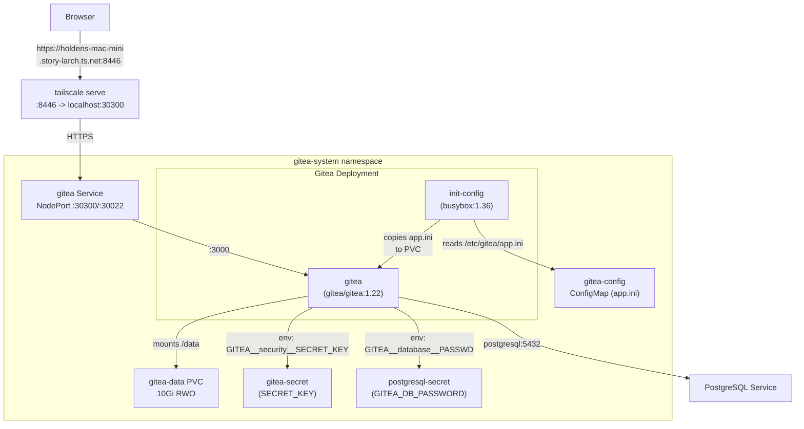
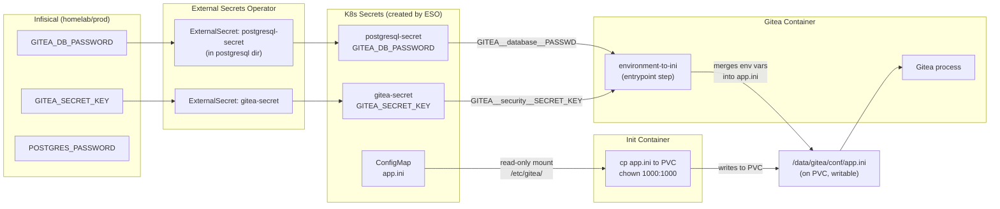
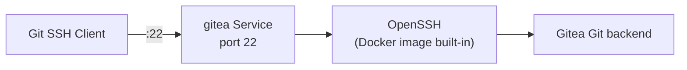
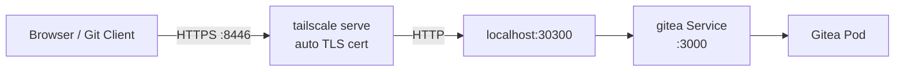
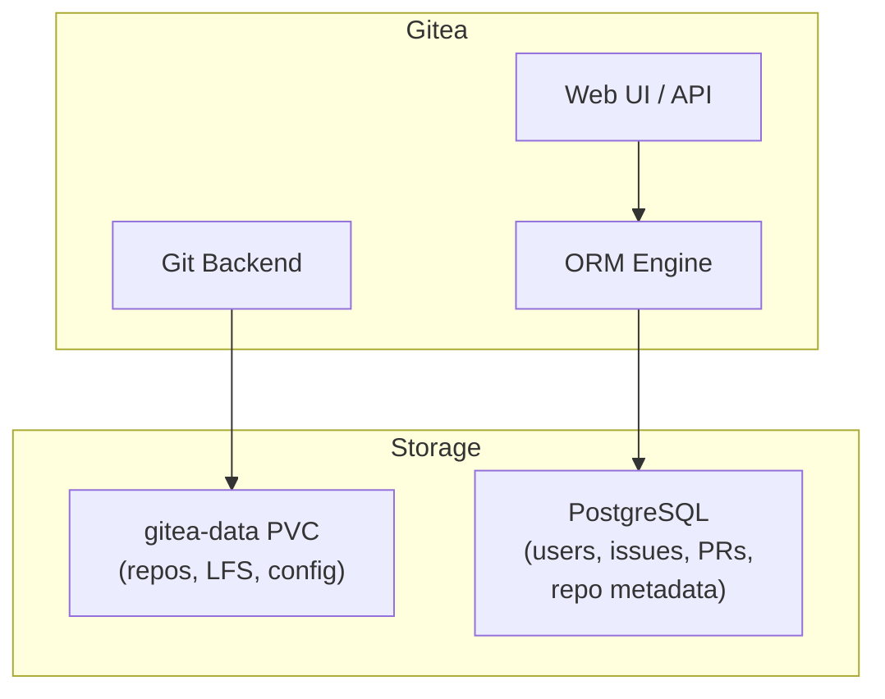
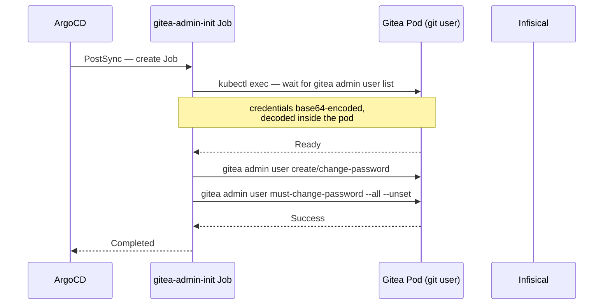

# Gitea

Self-hosted Git service running on Kubernetes, backed by PostgreSQL. Provides repository hosting, SSH access, and a web UI accessible at `https://holdens-mac-mini.story-larch.ts.net:8446` via Tailscale. Authentication is handled via **Authentik SSO** (OIDC).

## Architecture



## Directory Contents

| File | Purpose |
|------|---------|
| `kustomization.yaml` | Lists all resources for Kustomize/ArgoCD rendering |
| `pvc.yaml` | 10Gi `ReadWriteOnce` PVC for Gitea repositories and data |
| `external-secret.yaml` | `ExternalSecret` that pulls `GITEA_SECRET_KEY` from Infisical → `gitea-secret` |
| `admin-external-secret.yaml` | `ExternalSecret` that pulls admin credentials from Infisical → `gitea-admin-secret` |
| `admin-init-job.yaml` | ArgoCD PostSync `Job` that creates or updates the Gitea admin user after every sync |
| `configmap.yaml` | `app.ini` with all non-sensitive Gitea configuration |
| `deployment.yaml` | Deployment with init container, env var overrides, and resource limits |
| `service.yaml` | NodePort Service exposing HTTP (:30300) and SSH (:30022) |

## Configuration Strategy

Gitea configuration uses a three-layer approach:

1. **ConfigMap** (`configmap.yaml`) — holds all non-sensitive settings in `app.ini` format
2. **ExternalSecret** (`external-secret.yaml`) — ESO pulls `GITEA_SECRET_KEY` from Infisical and creates the `gitea-secret` K8s Secret
3. **Secret-backed env vars** — inject sensitive values from K8s Secrets, overriding specific `app.ini` keys

> **No `secret.yaml`:** There is no static `Secret` manifest in this directory. All secrets originate in Infisical and are synchronized by the External Secrets Operator. See [docs/secret-management.md](../../docs/secret-management.md) for details.



### Why an Init Container Is Needed

The Gitea Docker image reads its config from `/data/gitea/conf/app.ini` (inside the PVC), not from `/etc/gitea/`. Without the init container, a fresh PVC would have no `app.ini`, and Gitea would start in install-wizard mode with default settings.

The init container (`busybox:1.36`) runs before Gitea starts:

```sh
mkdir -p /data/gitea/conf
cp /etc/gitea/app.ini /data/gitea/conf/app.ini
chown 1000:1000 /data/gitea/conf/app.ini
```

The `chown` is required because the init container runs as root, but Gitea runs as UID 1000 (`git` user) and needs write access to save auto-generated tokens (e.g., `INTERNAL_TOKEN`, `LFS_JWT_SECRET`).

On every pod start, the init container overwrites the PVC copy with the ConfigMap version, ensuring the ConfigMap remains the source of truth. Gitea's `environment-to-ini` entrypoint then merges any `GITEA__*` env vars into the file before the main process reads it.

### Environment Variable Overrides

Only two env vars are set, both for sensitive values that cannot be stored in a ConfigMap:

| Env Var | Source | Overrides in app.ini |
|---------|--------|---------------------|
| `GITEA__database__PASSWD` | `postgresql-secret` key `GITEA_DB_PASSWORD` | `[database] PASSWD` |
| `GITEA__security__SECRET_KEY` | `gitea-secret` key `GITEA_SECRET_KEY` | `[security] SECRET_KEY` |

Gitea's env var convention is `GITEA__<SECTION>__<KEY>` (double underscores as separators).

### ConfigMap: app.ini

The `app.ini` covers all non-sensitive configuration:

**`[database]`** -- PostgreSQL connection (password excluded, injected via env var):

| Key | Value | Notes |
|-----|-------|-------|
| `DB_TYPE` | `postgres` | |
| `HOST` | `postgresql:5432` | Kubernetes Service DNS name (same namespace) |
| `USER` | `gitea` | Must match `POSTGRES_USER` in postgresql-secret |
| `NAME` | `gitea` | Must match `POSTGRES_DB` in postgresql-secret |
| `SSL_MODE` | `disable` | Internal cluster traffic, no TLS needed |

**`[server]`** -- HTTP and SSH settings:

| Key | Value | Notes |
|-----|-------|-------|
| `HTTP_PORT` | `3000` | Container listens here |
| `ROOT_URL` | `https://holdens-mac-mini.story-larch.ts.net:8446/` | Tailscale hostname for link generation |
| `START_SSH_SERVER` | `false` | Disabled; the Docker image's OpenSSH handles port 22 |
| `SSH_DOMAIN` | `holdens-mac-mini.story-larch.ts.net` | Used in SSH clone URLs |
| `LFS_START_SERVER` | `true` | Git LFS support |

**`[security]`**:

| Key | Value | Notes |
|-----|-------|-------|
| `INSTALL_LOCK` | `true` | Prevents the install wizard from showing |

### SSH Configuration

The Gitea Docker image bundles OpenSSH, which starts on port 22 inside the container. Gitea's built-in SSH server (`START_SSH_SERVER`) is disabled to avoid a port conflict. Both services would try to bind `:22`, and the second one fails with `address already in use`.



## Networking

### Service

The `gitea` Service is `NodePort` with two ports:

| Port | NodePort | Target | Protocol | Use |
|------|----------|--------|----------|-----|
| 3000 | 30300 | `http` | TCP | Web UI, API, Git HTTP |
| 22 | 30022 | `ssh` | TCP | Git SSH operations |

### Tailscale Serve

External access is provided via `tailscale serve` rather than a Kubernetes Ingress controller. This avoids the need for an ingress controller, certificate management, or DNS configuration.

```bash
tailscale serve --bg --https 8446 http://localhost:30300
```



Access URL: `https://holdens-mac-mini.story-larch.ts.net:8446`

The TLS certificate is automatically provisioned by Tailscale (Let's Encrypt) for the `*.ts.net` domain. No manual certificate management is needed.

OrbStack NodePorts only bind to `localhost`, not to external interfaces. `tailscale serve` bridges this by listening on the Tailscale interface and proxying to localhost.

### Storage

The `gitea-data` PVC (10Gi, ReadWriteOnce) is mounted at `/data` and holds:

```
/data/
├── git/
│   ├── repositories/     # Git bare repos
│   └── lfs/              # LFS objects
└── gitea/
    ├── conf/
    │   └── app.ini        # Runtime config (seeded by init container)
    ├── sessions/
    ├── avatars/
    ├── attachments/
    ├── packages/
    └── data/
        └── ssh/           # OpenSSH host keys
```

## Resource Limits

| Resource | Request | Limit |
|----------|---------|-------|
| CPU | 100m | 500m |
| Memory | 256Mi | 512Mi |

## Non-Root Execution

The Gitea container runs as a non-root user (`git` UID 1000) enforced by the pod's `securityContext`. This mitigates the impact of a container escape by limiting the attacker's privileges inside the host.

```yaml
securityContext:
  runAsUser: 1000
  runAsGroup: 1000
  fsGroup: 1000
```

The init container still runs as root to set up the configuration volume with correct ownership, then the main container drops to non-root.

## Integration with PostgreSQL

Gitea depends on PostgreSQL for all persistent application data (users, repositories metadata, issues, pull requests, etc.). Git repository data (bare repos, LFS objects) is stored on the PVC.



## Admin User Management

The `gitea-admin-init` Job (an ArgoCD PostSync hook) creates or updates the Gitea admin user after every sync. It runs as the `git` user (UID 1000) inside the running Gitea pod using `kubectl exec`, which avoids config file issues.



The admin credentials are pulled from Infisical into `gitea-admin-secret` by `admin-external-secret.yaml` before the Job runs.

**To update the admin password:** Change `GITEA_ADMIN_PASSWORD` in Infisical, force-sync the ExternalSecret, then trigger an ArgoCD sync to re-run the PostSync job.

```bash
# Force ESO to pull the new password
kubectl annotate externalsecret gitea-admin-secret -n gitea-system \
  force-sync=$(date +%s) --overwrite

# Check admin user credentials are correct
GITEA_USER=$(kubectl get secret gitea-admin-secret -n gitea-system \
  -o jsonpath='{.data.GITEA_ADMIN_USERNAME}' | base64 -d)
GITEA_PASS=$(kubectl get secret gitea-admin-secret -n gitea-system \
  -o jsonpath='{.data.GITEA_ADMIN_PASSWORD}' | base64 -d)
curl -s "http://localhost:30300/api/v1/user" -u "${GITEA_USER}:${GITEA_PASS}" | python3 -m json.tool
```

## Operational Commands

```bash
# Check pod status
kubectl get pods -n gitea-system -l app.kubernetes.io/name=gitea

# View logs (main container)
kubectl logs -n gitea-system deploy/gitea -c gitea

# View init container logs
kubectl logs -n gitea-system deploy/gitea -c init-config

# Check admin-init job logs (PostSync)
kubectl logs -n gitea-system -l job-name=gitea-admin-init

# Test API with admin credentials from secret
GITEA_USER=$(kubectl get secret gitea-admin-secret -n gitea-system \
  -o jsonpath='{.data.GITEA_ADMIN_USERNAME}' | base64 -d)
GITEA_PASS=$(kubectl get secret gitea-admin-secret -n gitea-system \
  -o jsonpath='{.data.GITEA_ADMIN_PASSWORD}' | base64 -d)
curl -s "http://localhost:30300/api/v1/user" -u "${GITEA_USER}:${GITEA_PASS}"

# Check effective app.ini on the PVC
kubectl exec -n gitea-system deploy/gitea -c gitea -- \
  cat /data/gitea/conf/app.ini

# List Gitea users (run as git user inside pod)
kubectl exec -n gitea-system deploy/gitea -- \
  su git -s /bin/sh -c 'gitea admin user list'
```

## Troubleshooting

| Symptom | Likely Cause | Fix |
|---------|-------------|-----|
| `password authentication failed` | `GITEA_DB_PASSWORD` in postgresql-secret doesn't match `POSTGRES_PASSWORD` | Align both values, delete PG PVC, restart |
| `database "gitea" does not exist` | PostgreSQL init was interrupted | Delete PG PVC and let it reinitialize |
| `permission denied` on app.ini | Init container didn't chown to UID 1000 | Check init container command includes `chown 1000:1000` |
| `address already in use` on :22 | `START_SSH_SERVER = true` in app.ini | Set to `false` (Docker OpenSSH already uses port 22) |
| Install wizard appears | No `app.ini` on PVC or `INSTALL_LOCK` not set | Verify init container runs and ConfigMap has `INSTALL_LOCK = true` |
| Config changes not taking effect | Pod not restarted after ConfigMap update | `kubectl rollout restart deployment gitea -n gitea-system` |
