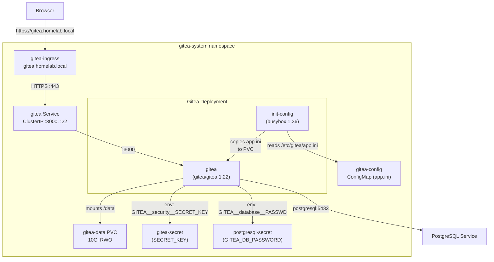
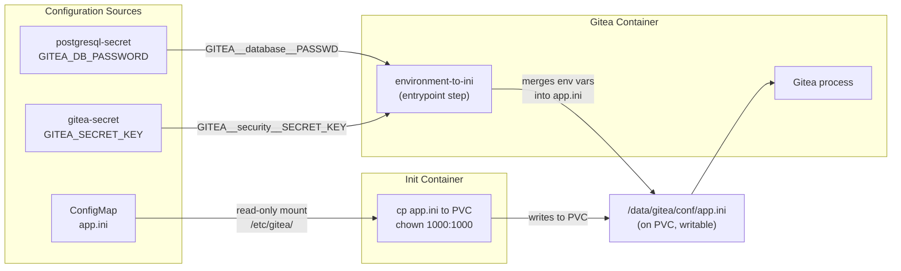
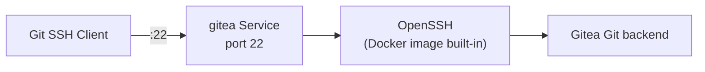
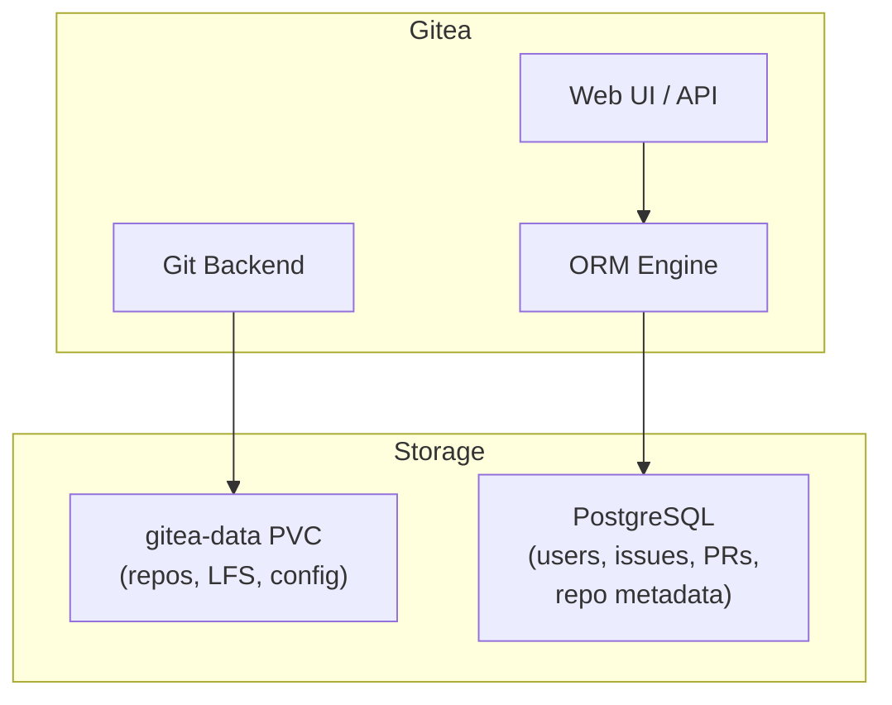

# Gitea

Self-hosted Git service running on Kubernetes, backed by PostgreSQL. Provides repository hosting, SSH access, and a web UI accessible at `https://gitea.homelab.local`.

## Architecture



## Directory Contents

| File | Purpose |
|------|---------|
| `kustomization.yaml` | Lists all resources for Kustomize/Argo CD rendering |
| `pvc.yaml` | 10Gi `ReadWriteOnce` PVC for Gitea repositories and data |
| `secret.yaml` | `GITEA_SECRET_KEY` for session signing and CSRF protection |
| `configmap.yaml` | `app.ini` with all non-sensitive Gitea configuration |
| `deployment.yaml` | Deployment with init container, env var overrides, and resource limits |
| `service.yaml` | ClusterIP Service exposing HTTP (:3000) and SSH (:22) |
| `ingress.yaml` | HTTPS Ingress for `gitea.homelab.local` with TLS termination |

## Configuration Strategy

Gitea configuration uses a two-layer approach:

1. **ConfigMap** (`configmap.yaml`) -- holds all non-sensitive settings in `app.ini` format
2. **Secret-backed env vars** -- inject sensitive values that override specific `app.ini` keys



### Why an Init Container Is Needed

The Gitea Docker image reads its config from `/data/gitea/conf/app.ini` (inside the PVC), not from `/etc/gitea/`. Without the init container, a fresh PVC would have no `app.ini`, and Gitea would start in install-wizard mode with default settings.

The init container (`busybox:1.36`) runs before Gitea starts:

```sh
mkdir -p /data/gitea/conf
cp /etc/gitea/app.ini /data/gitea/conf/app.ini
chown 1000:1000 /data/gitea/conf/app.ini
```

The `chown` is required because the init container runs as root, but Gitea runs as UID 1000 (`git` user) and needs write access to save auto-generated tokens (e.g., `INTERNAL_TOKEN`, `LFS_JWT_SECRET`).

On every pod start, the init container overwrites the PVC copy with the ConfigMap version, ensuring the ConfigMap remains the source of truth. Gitea's `environment-to-ini` entrypoint then merges any `GITEA__*` env vars into the file before the main process reads it.

### Environment Variable Overrides

Only two env vars are set, both for sensitive values that cannot be stored in a ConfigMap:

| Env Var | Source | Overrides in app.ini |
|---------|--------|---------------------|
| `GITEA__database__PASSWD` | `postgresql-secret` key `GITEA_DB_PASSWORD` | `[database] PASSWD` |
| `GITEA__security__SECRET_KEY` | `gitea-secret` key `GITEA_SECRET_KEY` | `[security] SECRET_KEY` |

Gitea's env var convention is `GITEA__<SECTION>__<KEY>` (double underscores as separators).

### ConfigMap: app.ini

The `app.ini` covers all non-sensitive configuration:

**`[database]`** -- PostgreSQL connection (password excluded, injected via env var):

| Key | Value | Notes |
|-----|-------|-------|
| `DB_TYPE` | `postgres` | |
| `HOST` | `postgresql:5432` | Kubernetes Service DNS name (same namespace) |
| `USER` | `gitea` | Must match `POSTGRES_USER` in postgresql-secret |
| `NAME` | `gitea` | Must match `POSTGRES_DB` in postgresql-secret |
| `SSL_MODE` | `disable` | Internal cluster traffic, no TLS needed |

**`[server]`** -- HTTP and SSH settings:

| Key | Value | Notes |
|-----|-------|-------|
| `HTTP_PORT` | `3000` | Container listens here |
| `ROOT_URL` | `https://gitea.homelab.local/` | External URL for link generation |
| `START_SSH_SERVER` | `false` | Disabled; the Docker image's OpenSSH handles port 22 |
| `SSH_DOMAIN` | `gitea.homelab.local` | Used in SSH clone URLs |
| `LFS_START_SERVER` | `true` | Git LFS support |

**`[security]`**:

| Key | Value | Notes |
|-----|-------|-------|
| `INSTALL_LOCK` | `true` | Prevents the install wizard from showing |

### SSH Configuration

The Gitea Docker image bundles OpenSSH, which starts on port 22 inside the container. Gitea's built-in SSH server (`START_SSH_SERVER`) is disabled to avoid a port conflict. Both services would try to bind `:22`, and the second one fails with `address already in use`.



## Networking

### Service

The `gitea` Service is `ClusterIP` with two ports:

| Port | Target | Protocol | Use |
|------|--------|----------|-----|
| 3000 | `http` | TCP | Web UI, API, Git HTTP |
| 22 | `ssh` | TCP | Git SSH operations |

### Ingress

The Ingress routes `gitea.homelab.local` to the Gitea Service on port 3000:

- Forces SSL redirect via `nginx.ingress.kubernetes.io/force-ssl-redirect: "true"`
- TLS termination using the `gitea-tls` Secret (must be provisioned separately, e.g., via cert-manager or a self-signed certificate)
- SSH traffic is not handled by the Ingress (TCP passthrough requires separate configuration)

### Storage

The `gitea-data` PVC (10Gi, ReadWriteOnce) is mounted at `/data` and holds:

```
/data/
├── git/
│   ├── repositories/     # Git bare repos
│   └── lfs/              # LFS objects
└── gitea/
    ├── conf/
    │   └── app.ini        # Runtime config (seeded by init container)
    ├── sessions/
    ├── avatars/
    ├── attachments/
    ├── packages/
    └── data/
        └── ssh/           # OpenSSH host keys
```

## Resource Limits

| Resource | Request | Limit |
|----------|---------|-------|
| CPU | 100m | 500m |
| Memory | 256Mi | 512Mi |

## Integration with PostgreSQL

Gitea depends on PostgreSQL for all persistent application data (users, repositories metadata, issues, pull requests, etc.). Git repository data (bare repos, LFS objects) is stored on the PVC.



## Operational Commands

```bash
# Check pod status
kubectl get pods -n gitea-system -l app.kubernetes.io/name=gitea

# View logs (main container)
kubectl logs -n gitea-system deploy/gitea -c gitea

# View init container logs
kubectl logs -n gitea-system deploy/gitea -c init-config

# Test API
kubectl exec -n gitea-system deploy/gitea -c gitea -- \
  wget -qO- http://localhost:3000/api/v1/settings/api

# Check effective app.ini on the PVC
kubectl exec -n gitea-system deploy/gitea -c gitea -- \
  cat /data/gitea/conf/app.ini

# Create first admin user (interactive)
kubectl exec -it -n gitea-system deploy/gitea -c gitea -- \
  gitea admin user create --admin --username admin --password <password> --email admin@homelab.local
```

## Troubleshooting

| Symptom | Likely Cause | Fix |
|---------|-------------|-----|
| `password authentication failed` | `GITEA_DB_PASSWORD` in postgresql-secret doesn't match `POSTGRES_PASSWORD` | Align both values, delete PG PVC, restart |
| `database "gitea" does not exist` | PostgreSQL init was interrupted | Delete PG PVC and let it reinitialize |
| `permission denied` on app.ini | Init container didn't chown to UID 1000 | Check init container command includes `chown 1000:1000` |
| `address already in use` on :22 | `START_SSH_SERVER = true` in app.ini | Set to `false` (Docker OpenSSH already uses port 22) |
| Install wizard appears | No `app.ini` on PVC or `INSTALL_LOCK` not set | Verify init container runs and ConfigMap has `INSTALL_LOCK = true` |
| Config changes not taking effect | Pod not restarted after ConfigMap update | `kubectl rollout restart deployment gitea -n gitea-system` |
