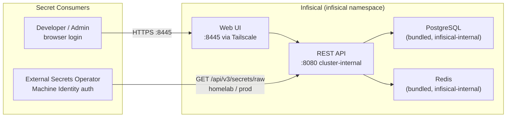
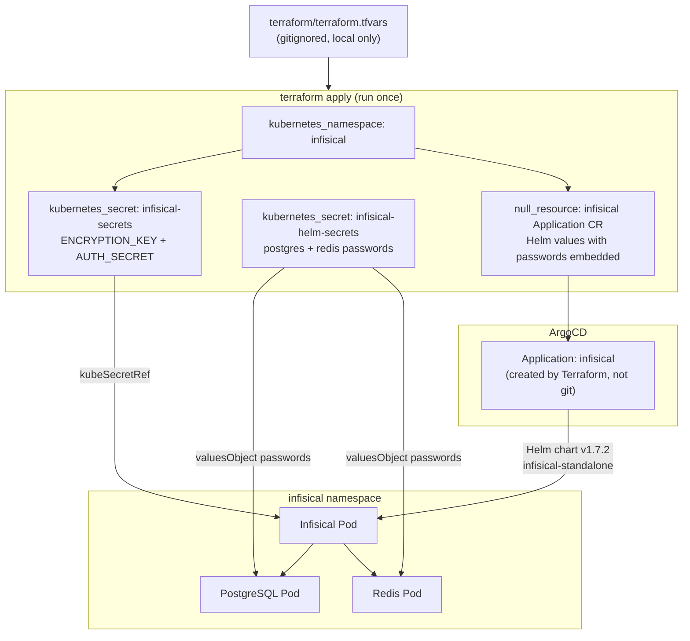
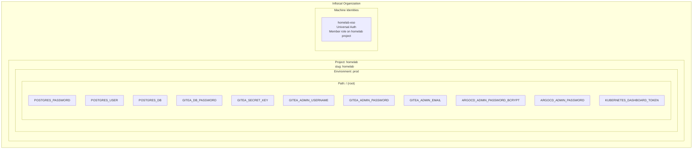
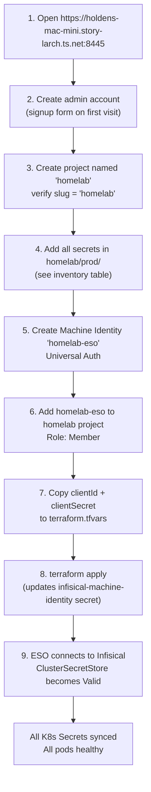
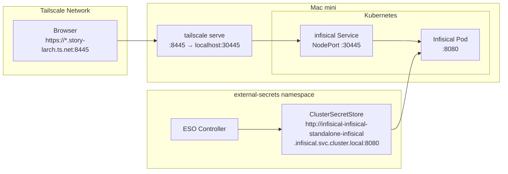
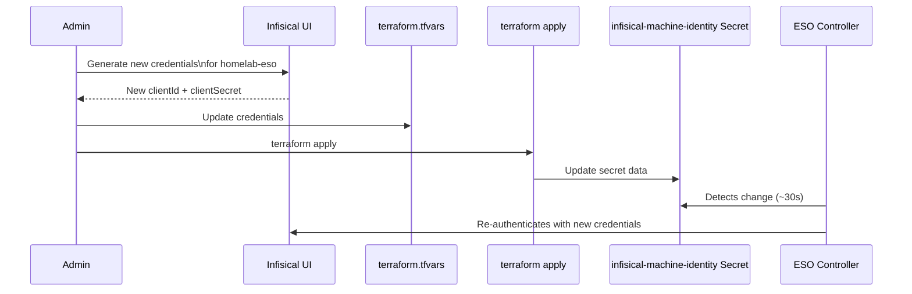
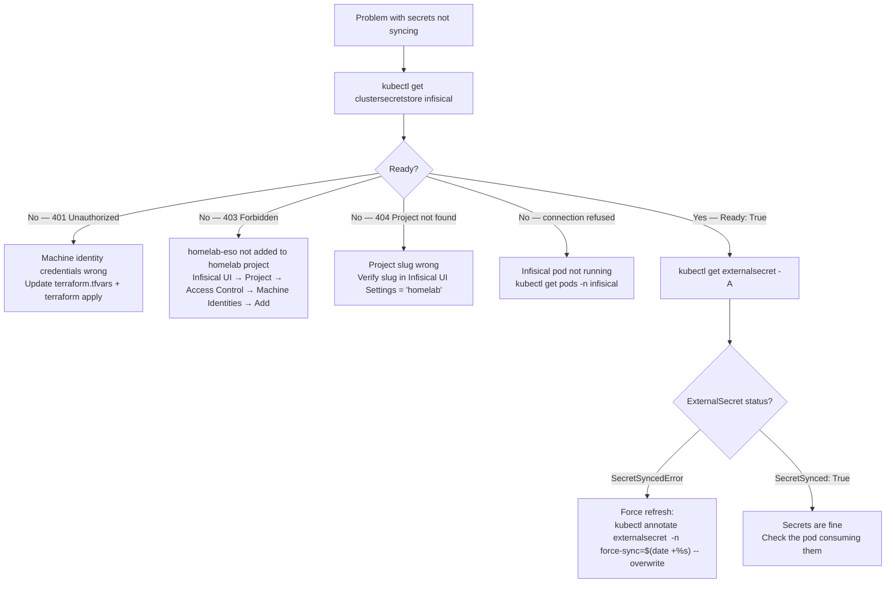

# Infisical

Self-hosted secret management platform. Every application credential in this homelab — database passwords, signing keys, admin passwords, API tokens — is stored in Infisical and pulled into the cluster by the External Secrets Operator.

## What Infisical Does



Infisical is the **single source of truth** for all secrets. No secret values live in git. Applications access secrets indirectly through Kubernetes `Secret` objects that ESO keeps in sync with Infisical.

## How It Is Deployed

Infisical is **not** managed by a git-tracked ArgoCD Application CR. Its Helm values contain sensitive credentials (PostgreSQL and Redis passwords) that cannot be committed to git. Instead:



The Terraform source of truth is `terraform/argocd.tf`. Any changes to Infisical's Helm configuration (version upgrade, resource limits, etc.) are made there and applied with `terraform apply`.

There is intentionally **no** `k8s/apps/argocd/applications/infisical-app.yaml` — that file would need to embed the DB passwords, which would expose them in git.

## Bootstrap Secrets

These two K8s Secrets are created by Terraform and must exist before Infisical starts:

### `infisical/infisical-secrets`

| Key | Purpose | How to generate |
|---|---|---|
| `ENCRYPTION_KEY` | AES key — Infisical encrypts every stored secret at rest with this | `openssl rand -hex 16` (must be exactly 32 hex chars) |
| `AUTH_SECRET` | JWT signing secret — used to sign user session tokens | `openssl rand -base64 32` |

**Critical:** `ENCRYPTION_KEY` must never change once Infisical has stored secrets. Changing it without running a migration makes all stored secrets permanently unreadable.

### `argocd/infisical-helm-secrets`

Contains a `values.yaml` blob injected via `helm.valuesObject` in the Terraform-managed Application CR:

| Helm path | K8s secret key | Purpose |
|---|---|---|
| `postgresql.auth.password` | extracted from `values.yaml` | Password for Infisical's internal PostgreSQL |
| `redis.auth.password` | extracted from `values.yaml` | Password for Infisical's internal Redis |

Both are generated with `openssl rand -hex 12` and stored in `terraform/terraform.tfvars`.

## Project and Environment Structure



## Complete Secrets Inventory

### Application Credentials

| Key | Used By | Value Constraints | How to Generate |
|---|---|---|---|
| `POSTGRES_PASSWORD` | PostgreSQL Deployment env `POSTGRES_PASSWORD` | Any string, no special char limits | `openssl rand -hex 12` |
| `POSTGRES_USER` | PostgreSQL Deployment env `POSTGRES_USER` | Static: `gitea` | `gitea` |
| `POSTGRES_DB` | PostgreSQL Deployment env `POSTGRES_DB` | Static: `gitea` | `gitea` |
| `GITEA_DB_PASSWORD` | Gitea Deployment env `GITEA__database__PASSWD` | **Must equal `POSTGRES_PASSWORD`** | same as `POSTGRES_PASSWORD` |
| `GITEA_SECRET_KEY` | Gitea Deployment env `GITEA__security__SECRET_KEY` | Any base64 string | `openssl rand -base64 32` |

### UI Credentials

| Key | Used By | Value Constraints | How to Generate |
|---|---|---|---|
| `GITEA_ADMIN_USERNAME` | `gitea-admin-init` PostSync Job | Valid Gitea username | e.g. `holden` |
| `GITEA_ADMIN_PASSWORD` | `gitea-admin-init` PostSync Job | Any string | `openssl rand -hex 12` |
| `GITEA_ADMIN_EMAIL` | `gitea-admin-init` PostSync Job | Valid email | your email |
| `ARGOCD_ADMIN_PASSWORD` | **Reference only** — not consumed by ESO | Plaintext ArgoCD admin password | your chosen password |
| `ARGOCD_ADMIN_PASSWORD_BCRYPT` | **Reference only** — managed by Terraform Helm values, not ESO | bcrypt hash of the above | see below |
| `KUBERNETES_DASHBOARD_TOKEN` | **Reference only** — K8s-generated SA token | Base64-decoded token string | see below |

> **ArgoCD password is NOT managed by ESO.** Using an `ExternalSecret` with `creationPolicy: Merge` to write to `argocd-secret` caused ArgoCD to propagate its tracking annotation onto `argocd-secret` and then prune it (since it wasn't in git). Instead, the bcrypt hash is set via the `configs.secret.argocdServerAdminPassword` Helm value in `terraform/argocd.tf`. The Infisical entries are for team reference only.

### Generating the ArgoCD bcrypt hash

```bash
# Python (available on any Mac)
python3 -c "import bcrypt; print(bcrypt.hashpw(b'YOUR_PASSWORD', bcrypt.gensalt(10)).decode())"
# pip3 install bcrypt if needed

# Or htpasswd (brew install httpd)
htpasswd -bnBC 10 "" YOUR_PASSWORD | tr -d ':\n'
```

Store both values in Infisical, then put the hash in `terraform/terraform.tfvars` as `argocd_admin_password_bcrypt` and run `terraform apply`.

### Retrieving the Kubernetes Dashboard token

After ArgoCD syncs the `kubernetes-dashboard` Application (which creates the `admin-user-token` Secret), retrieve it:

```bash
kubectl get secret admin-user-token -n kubernetes-dashboard \
  -o jsonpath='{.data.token}' | base64 -d
```

Paste the output into Infisical as `KUBERNETES_DASHBOARD_TOKEN`. This token is permanently valid (Kubernetes-managed long-lived SA token — it does not expire unless the Secret is deleted).

## First-Time Setup Walkthrough

This is done once after `terraform apply` deploys Infisical.



### Step 1 — First Login

Open `https://holdens-mac-mini.story-larch.ts.net:8445`. On first visit, Infisical shows a registration screen. Create an admin account. This is the superadmin of the Infisical instance.

### Step 2 — Create the `homelab` Project

1. Click **New Project** → name it `homelab`
2. Verify the slug: **Project Settings → General** must show `Slug: homelab`

The slug is hardcoded in `k8s/apps/external-secrets/cluster-secret-store.yaml`. If you use a different slug, update both files.

### Step 3 — Add Secrets

Navigate to `homelab` project → `prod` environment → click the **+** to add secrets. Add every key in the secrets inventory table above. Pay special attention to:
- `GITEA_DB_PASSWORD` must equal `POSTGRES_PASSWORD` exactly
- `ARGOCD_ADMIN_PASSWORD_BCRYPT` must be a valid bcrypt hash (starts with `$2a$10$`)

### Step 4 — Create Machine Identity

1. Top-left dropdown → **Organization Settings → Machine Identities → Create**
2. Name: `homelab-eso`, Auth method: **Universal Auth**, click **Create**
3. A `clientId` and `clientSecret` are shown — copy them immediately (secret is not shown again)

### Step 5 — Grant Project Access

1. Open the `homelab` project → **Access Control → Machine Identities → Add Identity**
2. Select `homelab-eso` → Role: **Member** → **Add**

Without this step, ESO gets a 403 when trying to read secrets.

### Step 6 — Update Terraform and Apply

```bash
# Edit terraform/terraform.tfvars:
infisical_machine_identity_client_id     = "<clientId>"
infisical_machine_identity_client_secret = "<clientSecret>"

cd terraform && terraform apply
```

Terraform updates only the `infisical-machine-identity` K8s Secret. ESO picks it up within ~30 seconds.

## Accessing the UI

| Method | URL | Notes |
|---|---|---|
| Tailscale (any device) | `https://holdens-mac-mini.story-larch.ts.net:8445` | Requires Tailscale |
| Local (Mac mini only) | `http://localhost:30445` | Direct NodePort access |

If Tailscale Serve is not yet configured:

```bash
tailscale serve --bg --https 8445 http://localhost:30445
```

## Networking



| Layer | Value |
|---|---|
| Container port | `:8080` |
| Kubernetes NodePort | `:30445` |
| Tailscale Serve upstream | `http://localhost:30445` |
| Tailscale URL | `https://holdens-mac-mini.story-larch.ts.net:8445` |
| Internal cluster DNS | `infisical-infisical-standalone-infisical.infisical.svc.cluster.local:8080` |

The internal DNS name is what the `ClusterSecretStore` uses to reach Infisical — no external network hop, no Tailscale, no NodePort.

## Day-2 Operations

### Adding a New Application Secret

1. Open the Infisical UI → `homelab / prod` → add the new key (e.g. `MY_APP_API_KEY`)
2. Create `k8s/apps/my-app/external-secret.yaml`:

```yaml
apiVersion: external-secrets.io/v1
kind: ExternalSecret
metadata:
  name: my-app-secret
  namespace: my-app
spec:
  refreshInterval: 1h
  secretStoreRef:
    name: infisical
    kind: ClusterSecretStore
  target:
    name: my-app-secret
    creationPolicy: Owner
  data:
    - secretKey: API_KEY
      remoteRef:
        key: MY_APP_API_KEY
```

3. Add it to `k8s/apps/my-app/kustomization.yaml`, push to git.

### Rotating the Machine Identity



```bash
# After updating terraform.tfvars:
cd terraform && terraform apply

# Verify ESO reconnected:
kubectl get clustersecretstore infisical
# Should show: Ready: True
```

### Rotating `ENCRYPTION_KEY` (Emergency Only)

> **This is destructive.** Only do this if the key is compromised. You must re-encrypt all stored secrets.

1. Read the [Infisical key rotation guide](https://infisical.com/docs/self-hosting/configuration/envars) first
2. Export all secrets from the Infisical UI before proceeding
3. Update `infisical_encryption_key` in `terraform/terraform.tfvars`
4. `terraform apply`
5. Restart Infisical: `kubectl rollout restart deployment -n infisical -l app.kubernetes.io/component=infisical`
6. Re-import secrets

### Upgrading the Infisical Helm Chart

1. Check available versions: `helm search repo infisical/infisical-standalone --versions`
2. Update `targetRevision` in `terraform/argocd.tf`:
   ```hcl
   locals {
     infisical_app_yaml = yamlencode({
       ...
       source = {
         targetRevision = "1.8.0"  # <-- update here
   ```
3. `terraform apply`
4. ArgoCD detects the change and upgrades the Helm release

### Backing Up Infisical Data

Infisical stores all data in its bundled PostgreSQL. To back up:

```bash
# Export all secrets from UI (recommended for disaster recovery)
# Infisical UI → homelab project → Export Secrets → JSON or CSV

# Or pg_dump from the pod
kubectl exec -n infisical postgresql-0 -- \
  pg_dump -U infisical infisicalDB > infisical-backup-$(date +%Y%m%d).sql
```

## Operational Commands

```bash
# Check Infisical pod status
kubectl get pods -n infisical

# View Infisical application logs
kubectl logs -n infisical -l app.kubernetes.io/component=infisical --tail=50

# View PostgreSQL logs
kubectl logs -n infisical -l app.kubernetes.io/instance=infisical-standalone,app.kubernetes.io/name=postgresql --tail=30

# Check the bootstrap secret is present and has the right keys
kubectl get secret infisical-secrets -n infisical -o jsonpath='{.data}' | python3 -c "import sys,json,base64; d=json.load(sys.stdin); [print(k,'=',base64.b64decode(v).decode()[:8]+'...') for k,v in d.items()]"

# Restart Infisical (e.g. after credential rotation)
kubectl rollout restart deployment -n infisical -l app.kubernetes.io/component=infisical

# Port-forward for local access without Tailscale
kubectl port-forward -n infisical svc/infisical-infisical-standalone-infisical 8080:8080
# Then open http://localhost:8080
```

## Troubleshooting



| Symptom | Cause | Fix |
|---|---|---|
| `CrashLoopBackOff` on first start | PostgreSQL not ready when Infisical starts DB migration | Wait — Kubernetes retries automatically. Usually resolves within 2–3 minutes |
| `Error: ENCRYPTION_KEY must be 32 hex characters` | Wrong format for `ENCRYPTION_KEY` | Regenerate: `openssl rand -hex 16` — output must be exactly 32 characters |
| `Error: invalid AUTH_SECRET` | `AUTH_SECRET` missing or malformed in `infisical-secrets` | `kubectl describe secret infisical-secrets -n infisical` — verify keys exist |
| `ClusterSecretStore` 401 | Machine identity credentials are wrong or placeholder values | Update `terraform.tfvars` and `terraform apply` |
| `ClusterSecretStore` 403 | Machine identity not added to `homelab` project | Infisical UI → Project → Access Control → Machine Identities → Add Identity |
| `ClusterSecretStore` 404 project not found | `projectSlug` doesn't match Infisical project | Infisical UI → Project Settings → confirm Slug field is exactly `homelab` |
| UI shows "Invalid login" | Wrong admin password | Use the password stored in Infisical under `ARGOCD_ADMIN_PASSWORD` (not ArgoCD — Infisical itself doesn't use this key, it's the Infisical admin password you set in the signup form) |
| ESO can read secrets but wrong values | Secret updated in Infisical but ESO cache not refreshed | `kubectl annotate externalsecret <name> -n <ns> force-sync=$(date +%s) --overwrite` |
| Infisical UI inaccessible from Tailscale | `tailscale serve` not configured for :8445 | `tailscale serve --bg --https 8445 http://localhost:30445` |
