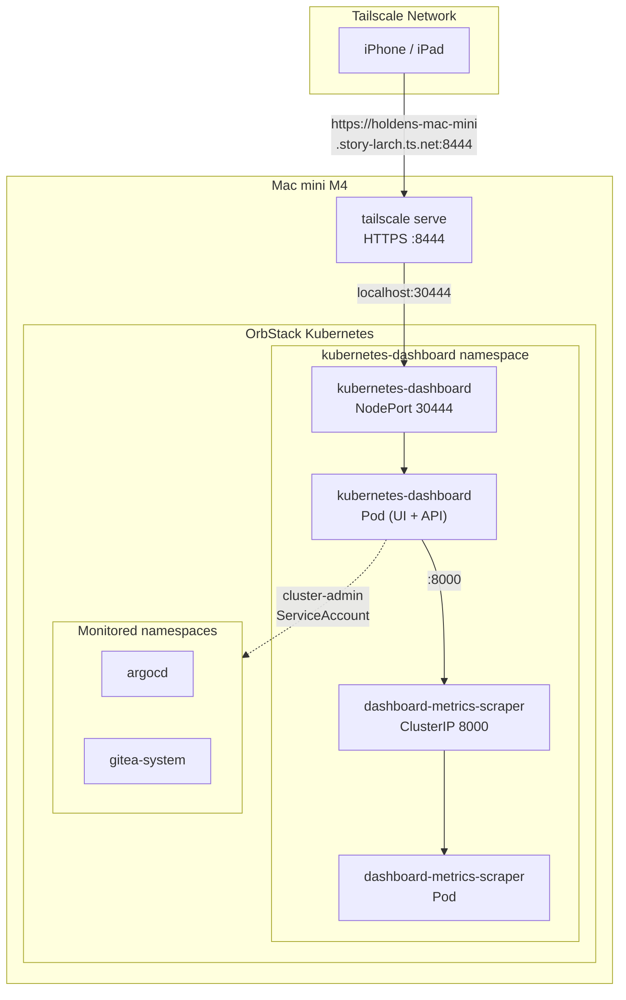
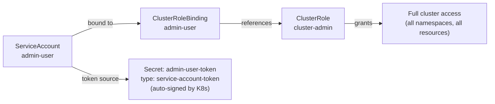
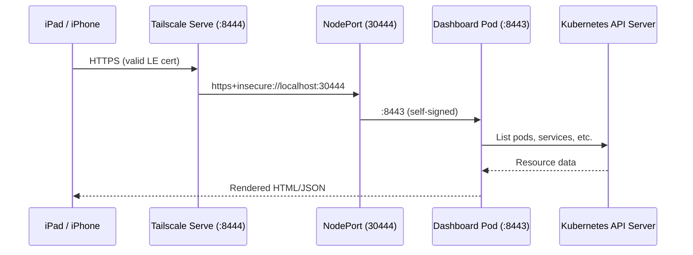
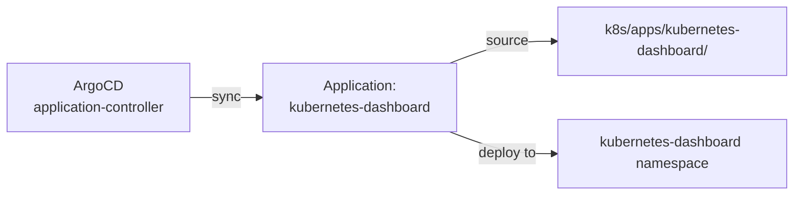

# Kubernetes Dashboard

Web-based UI for monitoring and managing the OrbStack Kubernetes cluster. Provides visibility into workloads, pods, services, and resource usage from any device on the Tailscale network -- including iPhone and iPad.

## Architecture



## Directory Contents

| File | Purpose |
|------|---------|
| `kustomization.yaml` | Pulls upstream dashboard v2.7.0 manifests, patches Service to NodePort |
| `admin-user.yaml` | ServiceAccount + ClusterRoleBinding for dashboard login |

## How It Works

### Deployment

The dashboard is deployed via a Kustomize remote resource pointing to the official v2.7.0 release:

```yaml
resources:
  - https://raw.githubusercontent.com/kubernetes/dashboard/v2.7.0/aio/deploy/recommended.yaml
  - admin-user.yaml
```

This installs two pods:

| Pod | Purpose |
|-----|---------|
| `kubernetes-dashboard` | Serves the web UI, queries the Kubernetes API |
| `dashboard-metrics-scraper` | Collects resource metrics (CPU/memory) from the Metrics API |

### NodePort Patch

The upstream manifests define the dashboard Service as `ClusterIP`. A Kustomize patch overrides it:

```yaml
patches:
  - target:
      kind: Service
      name: kubernetes-dashboard
      namespace: kubernetes-dashboard
    patch: |
      - op: replace
        path: /spec/type
        value: NodePort
      - op: add
        path: /spec/ports/0/nodePort
        value: 30444
```

The dashboard serves HTTPS on port 8443 inside the container. NodePort 30444 maps to this.

### Authentication

The dashboard requires a Bearer token for login. An `admin-user` ServiceAccount is created with `cluster-admin` privileges and a **long-lived Secret** (`admin-user-token`) of type `kubernetes.io/service-account-token` is bound to it. Kubernetes automatically signs and populates this token — it never expires as long as the Secret exists.



Retrieve the token:

```bash
kubectl get secret admin-user-token -n kubernetes-dashboard \
  -o jsonpath='{.data.token}' | base64 -d
```

This token is stored in Infisical as `KUBERNETES_DASHBOARD_TOKEN` for team access. Copy it and paste into the dashboard login screen.

> **Why a long-lived Secret instead of `create token`?** The `kubectl create token` command produces a short-lived token (default 1h, max ~1y) that must be regenerated. The `kubernetes.io/service-account-token` Secret type provides a permanent token that never needs rotation unless the Secret itself is deleted or the SA is revoked.

## Networking

### Request Path



### Port Map

| Layer | Port | Protocol |
|-------|------|----------|
| Dashboard container | 8443 | HTTPS (self-signed) |
| NodePort | 30444 | HTTPS (forwarded) |
| Tailscale Serve | 8444 | HTTPS (Let's Encrypt) |

### Tailscale Serve Setup

```bash
tailscale serve --bg --https 8444 https+insecure://localhost:30444
```

The `https+insecure://` prefix is needed because the dashboard uses a self-signed certificate. Tailscale terminates TLS with a valid Let's Encrypt cert and re-connects to the dashboard without certificate verification.

Access URL: `https://holdens-mac-mini.story-larch.ts.net:8444`

## ArgoCD Integration

The dashboard is managed by ArgoCD like all other applications:



The Application definition (`k8s/apps/argocd/applications/kubernetes-dashboard-app.yaml`) uses:
- `CreateNamespace=true` since the namespace is new
- `automated.prune=true` and `selfHeal=true` for full GitOps control

## What You Can Monitor

From your iPad or iPhone browser:

| View | What it shows |
|------|---------------|
| **Cluster > Nodes** | OrbStack node health, CPU/memory usage |
| **Workloads > Pods** | All pods across namespaces (Gitea, PostgreSQL, ArgoCD, Dashboard) |
| **Workloads > Deployments** | Replica counts, rollout status |
| **Service > Services** | ClusterIP/NodePort endpoints |
| **Config > ConfigMaps** | Gitea app.ini, pg_hba.conf |
| **Storage > PVCs** | Disk usage for gitea-data and postgresql-data |
| **Logs** | Real-time container logs (like `kubectl logs`) |
| **Exec** | Terminal into pods (like `kubectl exec`) |

## Operational Commands

```bash
# Check pod status
kubectl get pods -n kubernetes-dashboard

# Retrieve the long-lived login token (also stored in Infisical as KUBERNETES_DASHBOARD_TOKEN)
kubectl get secret admin-user-token -n kubernetes-dashboard \
  -o jsonpath='{.data.token}' | base64 -d; echo

# View dashboard logs
kubectl logs -n kubernetes-dashboard deploy/kubernetes-dashboard

# Restart the dashboard
kubectl rollout restart deployment kubernetes-dashboard -n kubernetes-dashboard
```

## Troubleshooting

| Symptom | Cause | Fix |
|---------|-------|-----|
| Login page shows but token rejected | Wrong token pasted | Retrieve the correct token: `kubectl get secret admin-user-token -n kubernetes-dashboard -o jsonpath='{.data.token}' \| base64 -d` |
| Dashboard shows no metrics | metrics-scraper pod not running | `kubectl get pods -n kubernetes-dashboard` |
| 502 from Tailscale | Dashboard pod not ready | Check pod status, wait for readiness |
| Can't reach :8444 | Tailscale Serve not configured | Run `tailscale serve --bg --https 8444 https+insecure://localhost:30444` |
