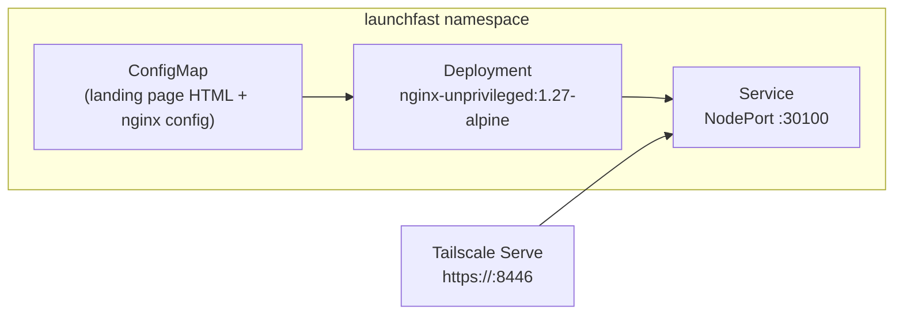

# LaunchFast

A CLI tool that scaffolds production-ready startup projects with modern best practices — landing page, auth, payments, analytics, CI/CD, and documentation. Built entirely by a multi-agent team coordinated through OpenClaw.

## How It Works

LaunchFast is deployed as a static landing page in the homelab cluster while the product is under development. The full CLI and backend will be developed in a separate repository (`launchfast-dev`) and integrated back into homelab infrastructure as the product matures.



## Directory Contents

| File | Purpose |
|------|---------|
| `kustomization.yaml` | Kustomize resource list |
| `configmap.yaml` | Landing page HTML and nginx configuration |
| `deployment.yaml` | nginx-unprivileged deployment (1 replica, read-only root filesystem) |
| `service.yaml` | NodePort service exposing port 8080 → 30100 |

## Configuration

| Setting | Value |
|---|---|
| Image | `nginxinc/nginx-unprivileged:1.27-alpine` |
| Replicas | 1 |
| Container port | 8080 |
| NodePort | 30100 |
| Pod Security | `restricted` compliant (non-root UID 101, read-only rootfs, no capabilities) |

## Multi-Agent Product Development

This service is the homelab integration point for the LaunchFast product sprint (issue #101). The development is coordinated by OpenClaw agents:

| Agent | Role |
|---|---|
| `homelab-admin` | Orchestrator — tracks progress, coordinates PRs, triggers deployments |
| `product-manager` | Writes PRD, defines features and milestones |
| `devops-sre` | Designs infrastructure (k8s manifests, CI/CD) |
| `software-engineer` | Implements CLI, backend services, and frontend |
| `qa-tester` | Writes test plans and validates functionality |
| `security-analyst` | Reviews for vulnerabilities |

## Development Phases

LaunchFast follows a phased approach where each phase is gated by the previous one. Tech stack choices are evaluated per-phase rather than locked in upfront.

### Phase 0 — Homelab Integration (current)

Static landing page deployed via ArgoCD. Validates namespace, networking, and Tailscale access.

### Phase 1 — Tech Stack Assessment

Agents evaluate candidate technologies against LaunchFast requirements. The selection criteria prioritize performance, developer experience, ecosystem maturity, and alignment with modern industry trends.

| Domain | Candidates Under Evaluation | Selection Criteria |
|---|---|---|
| CLI framework | Go (`cobra`/`bubbletea`), Rust (`clap`/`ratatui`) | Binary size, cross-compile, startup time |
| Backend API | Go (`net/http`, `echo`), Rust (`axum`, `actix-web`) | Concurrency model, memory footprint, ecosystem |
| Frontend | React/Next.js, SvelteKit, Astro | SSR/SSG, bundle size, DX |
| Template engine | WebAssembly (Wasm) plugins, Go `text/template`, Tera (Rust) | Sandboxing, extensibility, user-authored templates |
| Vector database | Qdrant, Weaviate, pgvector | Embedding search for smart template matching |
| ML/AI integration | LLM-driven scaffold suggestions, code generation, RAG-powered docs | Context-aware project setup, natural language config |
| CI/CD templates | GitHub Actions, GitLab CI, Dagger (Go SDK) | Reproducibility, container-native pipelines |

The `product-manager` agent owns the PRD and final tech stack decision. The `software-engineer` agent produces spike prototypes for each candidate.

### Phase 2 — Core CLI & Scaffolding Engine

Implement the CLI binary that generates project scaffolds. Key capabilities:

- Interactive project wizard (TUI or prompt-based)
- Template registry with versioned scaffold blueprints
- Plugin system via WebAssembly for community-contributed generators
- AI-assisted scaffold selection using vector similarity search

### Phase 3 — Backend Services & API

API server for template registry, user accounts, and telemetry. Deployed to homelab alongside the landing page.

### Phase 4 — Frontend & Documentation

Marketing site, interactive docs, and playground. Replaces the current static landing page.

### Phase 5 — Monitoring & Observability

Grafana dashboards, Prometheus metrics, and structured logging integrated into the homelab monitoring stack.

## Authentik Portal Integration

LaunchFast is registered as a **bookmark** in the Authentik SSO portal under the **Development** group. This provides single-click access from the portal alongside all other homelab services.

The bookmark is managed via the Authentik Blueprint in `k8s/apps/authentik/blueprints-configmap.yaml`. When LaunchFast gains a backend API (Phase 3), the bookmark will be upgraded to a full OIDC provider with its own client credentials — same pattern as Grafana and ArgoCD.

## Accessing the Landing Page

**Via Authentik portal (recommended):**

Visit `https://hardy-mac-mini.folk-adelie.ts.net` and click the LaunchFast tile.

**Via Tailscale Serve (direct):**

```bash
tailscale serve --bg --https 8446 http://localhost:30100
```

Then visit `https://hardy-mac-mini.folk-adelie.ts.net:8446` from any Tailscale device.

**Via direct NodePort:**

```bash
curl http://localhost:30100
```

## Troubleshooting

| Symptom | Cause | Fix |
|---|---|---|
| 502 on landing page | Pod not ready | `kubectl describe pod -n launchfast` — check events |
| Page shows old content | ConfigMap cached | `kubectl rollout restart deployment/launchfast -n launchfast` |
| NodePort unreachable | Networking policy blocking | Verify `allow-tailscale-ingress` policy exists in `launchfast` namespace |
