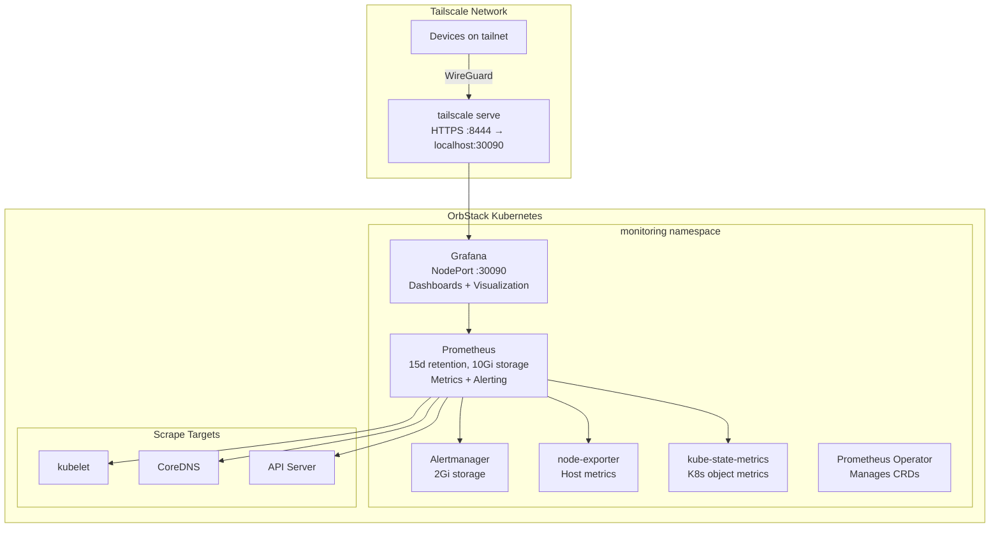

# Monitoring

The homelab uses **kube-prometheus-stack** for cluster monitoring: Prometheus for metrics collection and alerting, Grafana for dashboards and visualization, plus node-exporter and kube-state-metrics for comprehensive cluster observability.

## Architecture



## Access

| Interface | URL | Auth |
|---|---|---|
| Grafana | `https://holdens-mac-mini.story-larch.ts.net:8444` | SSO via Authentik (auto-redirects) |
| Grafana (local) | `http://localhost:30090` | SSO via Authentik |

Grafana is configured with SSO-only access — the local login form is disabled and users are auto-redirected to Authentik. The admin password in `grafana-secret` is retained for API and break-glass access.

## Directory Contents

| File | Purpose |
|------|---------|
| `kustomization.yaml` | Lists resources for Kustomize/ArgoCD rendering |
| `external-secret.yaml` | `ExternalSecret` that pulls Grafana admin password and OAuth secret from Infisical → `grafana-secret` |

> **Note:** The monitoring stack is deployed via the **Helm chart source** defined in `k8s/apps/argocd/applications/monitoring-app.yaml`. This directory only contains the ExternalSecret that provides credentials to the Helm release. The `monitoring-config` ArgoCD Application syncs this directory, while the `monitoring` Application syncs the upstream Helm chart.

## Security

The monitoring stack components are configured to run as non-root users:

- **Grafana**: runs as UID 472 (fsGroup 472).
- **Prometheus**: runs as UID 65534 (nobody) with fsGroup 65534.
- **Alertmanager**: runs as UID 1000 and GID 2000 with fsGroup 2000.
- **node-exporter** and **kube-state-metrics** run as non-root by default in the upstream chart.

The `monitoring` namespace enforces the `baseline` Pod Security Standard (with `restricted` audit/warn) because node-exporter requires host namespaces and hostPort.

## What's Included

The kube-prometheus-stack Helm chart deploys:

| Component | Purpose |
|---|---|
| **Prometheus** | Time-series metrics collection, PromQL queries, alerting rules |
| **Grafana** | Dashboards and visualization with 30+ pre-built K8s dashboards |
| **Alertmanager** | Alert routing and notification |
| **node-exporter** | Host-level metrics (CPU, memory, disk, network) |
| **kube-state-metrics** | Kubernetes object state metrics (pods, deployments, nodes) |
| **Prometheus Operator** | Manages Prometheus/Alertmanager CRDs declaratively |

### Pre-built Dashboards

Grafana ships with dashboards for:
- Cluster overview (CPU, memory, network, disk)
- Node metrics
- Pod/container resource usage
- Namespace resource quotas
- Persistent volume usage
- CoreDNS performance
- API server request rates and latency

## Custom Dashboards and Alerting Rules

This directory (`k8s/apps/monitoring/`) contains custom dashboards and alerting rules managed as GitOps resources.

### Directory Structure

```
k8s/apps/monitoring/
├── kustomization.yaml
├── external-secret.yaml
├── dashboards/
│   ├── dashboard-homelab-overview.yaml
│   ├── dashboard-node-health.yaml
│   ├── dashboard-postgresql.yaml
│   ├── dashboard-network.yaml
│   ├── dashboard-gitea.yaml
│   ├── dashboard-authentik.yaml
│   ├── dashboard-argocd.yaml
│   └── dashboard-infisical.yaml
└── rules/
    ├── recording-namespace.yaml
    ├── recording-requests.yaml
    ├── alerts-pods.yaml
    ├── alerts-pvc.yaml
    ├── alerts-nodes.yaml
    ├── alerts-prometheus.yaml
    ├── alerts-certificates.yaml
    └── alerts-argocd.yaml
```

### Dashboard Provisioning

Custom dashboards are deployed as ConfigMaps with the label `grafana_dashboard: "1"`. The Grafana sidecar (configured in the Helm chart) automatically picks up these ConfigMaps and loads them into Grafana without requiring manual UI changes.

Each dashboard is a separate ConfigMap file in `dashboards/`, following the naming convention:

```
dashboard-<name>.yaml
```

The file contains a ConfigMap with the dashboard JSON in `data.dashboard.json`. Dashboard UIDs should be unique across all dashboards.

### Prometheus Rules

Prometheus recording and alerting rules are defined as `PrometheusRule` CRDs in `rules/`. These are picked up by the Prometheus Operator automatically.

Two types of rules:

1. **Recording rules** (`recording-*.yaml`) — pre-compute expensive queries for faster dashboard rendering
2. **Alerting rules** (`alerts-*.yaml`) — generate alerts when conditions match

Naming conventions:

```
recording-<domain>.yaml   # e.g., recording-namespace.yaml, recording-requests.yaml
alerts-<domain>.yaml      # e.g., alerts-pods.yaml, alerts-nodes.yaml
```

### Adding a New Dashboard

1. Create the dashboard JSON in Grafana (export as JSON)
2. Create a new file `dashboards/dashboard-<name>.yaml`:
   ```yaml
   apiVersion: v1
   kind: ConfigMap
   metadata:
     name: dashboard-<name>
     namespace: monitoring
     labels:
       grafana_dashboard: "1"
       app.kubernetes.io/name: monitoring
       app.kubernetes.io/instance: monitoring
   data:
     dashboard.json: |
       { ... }
   ```
3. Commit and push — ArgoCD will sync automatically; the sidecar will load the dashboard.

### Adding a New Alerting or Recording Rule

1. Create a new file `rules/<type>-<domain>.yaml`:
   ```yaml
   apiVersion: monitoring.coreos.com/v1
   kind: PrometheusRule
   metadata:
     name: <name>
     namespace: monitoring
     labels:
       prometheus: kube-prometheus
       role: alert-rules
       app.kubernetes.io/name: monitoring
       app.kubernetes.io/instance: monitoring
   spec:
     groups:
       - name: <group-name>
         rules:
           - alert: <alert-name>
             expr: <promql expression>
             for: <duration>
             labels:
               severity: <severity>
             annotations:
               summary: "..."
               description: "..."
   ```
2. Commit and push — the Prometheus Operator will reload rules automatically.

### Testing Alerting Rules

To verify alert rules work correctly:

1. Generate a synthetic condition (e.g., kill a pod repeatedly to trigger `PodCrashLooping`, fill a PVC to trigger `PVCUsageTooHigh`)
2. Check alerts in Grafana or via Prometheus API:
   ```bash
   kubectl port-forward -n monitoring svc/monitoring-kube-prometheus-prometheus 9090:9090
   # Open http://localhost:9090/alerts
   ```
3. Verify Alertmanager receives the alert:
   ```bash
   kubectl port-forward -n monitoring svc/monitoring-kube-prometheus-alertmanager 9093:9093
   # Open http://localhost:9093/
   ```
4. Silence or resolve the condition, ensure the alert clears.

### Notes for OpenClaw Agents

- All metrics are scraped by the Prometheus instance deployed with the `kube-prometheus-stack` Helm chart.
- Service-specific metrics (e.g., `http_requests_total`) come from the Prometheus instrumentation of those services. Ensure the services are correctly instrumented.
- For metrics not currently available (e.g., PostgreSQL-specific metrics), consider adding a PostgreSQL exporter or instrumenting the application.
- Dashboard UIDs should remain stable across updates. Changing a dashboard's UID will create a new dashboard in Grafana instead of updating the existing one.
- To modify an existing dashboard, edit the JSON in place and keep the same UID.

## Configuration

The monitoring stack is deployed via ArgoCD using the Helm chart source directly (no local manifests). All configuration is in the Application CR at `k8s/apps/argocd/applications/monitoring-app.yaml`.

Key settings:
- **Prometheus retention:** 15 days
- **Prometheus storage:** 10Gi PVC
- **Scrape interval:** 60s (explicitly configured)
- **Evaluation interval:** 60s (explicitly configured)
- **Alertmanager storage:** 2Gi PVC
- **Grafana storage:** 2Gi PVC (dashboard persistence)
- **Disabled scrapers:** kubeProxy, kubeEtcd, kubeScheduler, kubeControllerManager (not applicable to OrbStack single-node)

### Secrets in Infisical

| Key | Purpose |
|---|---|
| `GRAFANA_ADMIN_PASSWORD` | Break-glass admin access (SSO is primary auth) |
| `GRAFANA_OAUTH_CLIENT_SECRET` | OIDC client secret for Authentik SSO integration |

### Modifying Configuration

Edit the `helm.valuesObject` in `k8s/apps/argocd/applications/monitoring-app.yaml`, then push to `main`. ArgoCD will sync the changes.

### Upgrading the Chart

Update `targetRevision` in the Application CR to the desired chart version, then push to `main`.

## Networking

| Layer | Value |
|---|---|
| Grafana container port | 3000 |
| NodePort | 30090 |
| Tailscale HTTPS | 8444 |
| URL | `https://holdens-mac-mini.story-larch.ts.net:8444` |

One-time Tailscale Serve setup:

```bash
tailscale serve --bg --https 8444 http://localhost:30090
```

## Operational Commands

```bash
# Check monitoring pods
kubectl get pods -n monitoring

# Check Prometheus targets
kubectl port-forward -n monitoring svc/monitoring-kube-prometheus-prometheus 9090:9090
# Then open http://localhost:9090/targets

# Check Alertmanager
kubectl port-forward -n monitoring svc/monitoring-kube-prometheus-alertmanager 9093:9093

# View Prometheus storage usage
kubectl exec -n monitoring prometheus-monitoring-kube-prometheus-prometheus-0 -- df -h /prometheus

# Check PVCs
kubectl get pvc -n monitoring

# Check ExternalSecret status
kubectl get externalsecret -n monitoring

# Force secret re-sync
kubectl annotate externalsecret grafana-secret -n monitoring \
  force-sync=$(date +%s) --overwrite

# Check ArgoCD application status
kubectl get application monitoring monitoring-config -n argocd
```

## Troubleshooting

| Symptom | Cause | Fix |
|---|---|---|
| Grafana login fails | SSO misconfigured | Check Authentik OIDC provider has `openid`, `email`, `profile` scope mappings; verify `api_url` has no trailing slash |
| No metrics in dashboards | Prometheus targets down | Check `kubectl get pods -n monitoring`; verify targets via port-forward |
| High memory usage | Retention too long or too many metrics | Reduce `retention` or add `retentionSize` limit in Prometheus spec |
| PVC pending | No storage provisioner | Verify `local-path` provisioner is running in `kube-system` |
| Grafana unreachable via Tailscale | Serve not configured | `tailscale serve --bg --https 8444 http://localhost:30090` |
| Grafana 404 on `/userinfo/emails` | Authentik provider missing scope mappings | Assign `openid`, `email`, `profile` scope mappings to the Grafana provider |
