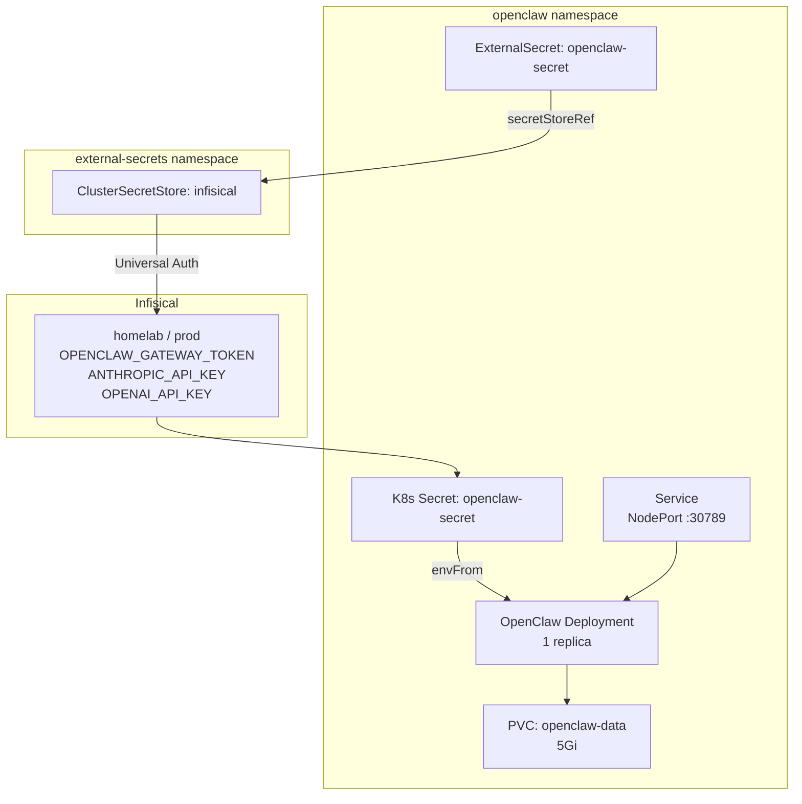

# OpenClaw

Multi-channel AI gateway for agent orchestration in the homelab. OpenClaw provides a unified gateway that connects multiple AI model providers (Anthropic, OpenAI, etc.) and messaging channels into a single service.

## Architecture



## Directory Contents

| File | Purpose |
|------|---------|
| `namespace.yaml` | Dedicated `openclaw` namespace |
| `pvc.yaml` | 5Gi persistent volume for OpenClaw state and workspace data |
| `external-secret.yaml` | Syncs gateway token and API keys from Infisical |
| `deployment.yaml` | Single-replica deployment with health probes |
| `service.yaml` | NodePort service exposing port 30789 |
| `kustomization.yaml` | Lists all resources |

## Image

The deployment uses a locally built Docker image (`openclaw:latest`) with `imagePullPolicy: Never`. OrbStack's Kubernetes cluster shares the host Docker daemon, so locally built images are immediately available.

Build the image:

```bash
./scripts/build-openclaw.sh
```

After updating the openclaw source, rebuild and restart:

```bash
./scripts/build-openclaw.sh
kubectl rollout restart deployment/openclaw -n openclaw
```

## Secrets

All secrets are stored in Infisical under `homelab / prod` and synced by ESO:

| Infisical Key | Description | Required |
|---|---|---|
| `OPENCLAW_GATEWAY_TOKEN` | Auth token for gateway access (use `openssl rand -hex 32`) | Yes |
| `GEMINI_API_KEY` | Google Gemini API key from [aistudio.google.com/apikey](https://aistudio.google.com/apikey) | At least one provider |

To add more model providers or channel tokens (e.g., `ANTHROPIC_API_KEY`, `OPENAI_API_KEY`, `TELEGRAM_BOT_TOKEN`), add the key to Infisical, then add a new entry to `external-secret.yaml` and a corresponding `env` entry in `deployment.yaml`.

## Networking

| Layer | Value |
|---|---|
| Container port | 3000 |
| NodePort | 30789 |
| Tailscale HTTPS | 8446 |
| URL | `https://holdens-mac-mini.story-larch.ts.net:8446` |

One-time Tailscale Serve setup:

```bash
tailscale serve --bg --https 8446 http://localhost:30789
```

## Operational Commands

```bash
# Check pod status
kubectl get pods -n openclaw

# View logs
kubectl logs -n openclaw deploy/openclaw --tail=100

# Restart after image rebuild
kubectl rollout restart deployment/openclaw -n openclaw

# Check ExternalSecret status
kubectl get externalsecret -n openclaw

# Force secret re-sync
kubectl annotate externalsecret openclaw-secret -n openclaw \
  force-sync=$(date +%s) --overwrite

# Port-forward for local testing (bypasses Tailscale)
kubectl port-forward -n openclaw svc/openclaw 3000:3000
```

## Troubleshooting

| Symptom | Cause | Fix |
|---|---|---|
| `ErrImageNeverPull` | Image not built locally | Run `./scripts/build-openclaw.sh` |
| Pod `CrashLoopBackOff` | Missing secrets or bad config | Check `kubectl logs -n openclaw deploy/openclaw` |
| ExternalSecret `SecretSyncedError` | Secret not in Infisical | Add missing key to Infisical `homelab / prod` |
| `connection refused` on :30789 | Pod not running | `kubectl get pods -n openclaw` |
| Health check failing | Gateway still starting | Wait 30s; check logs for startup errors |
