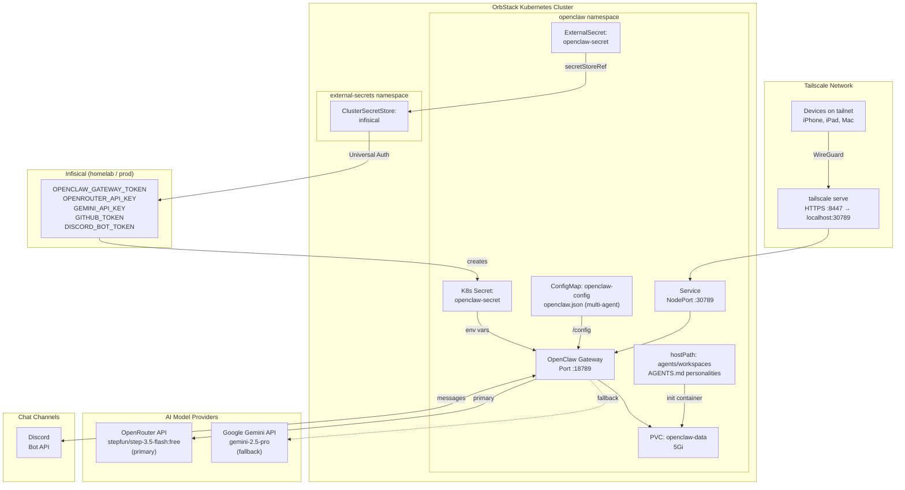
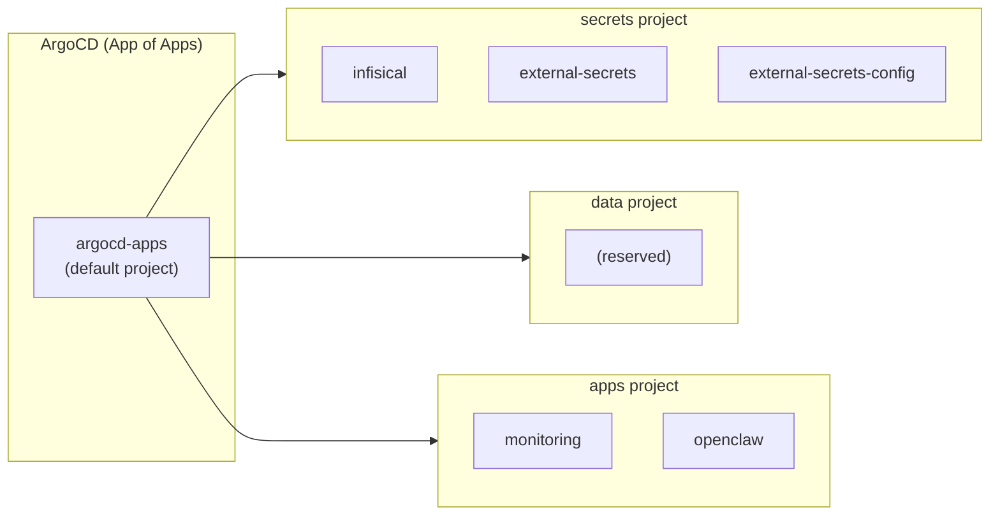
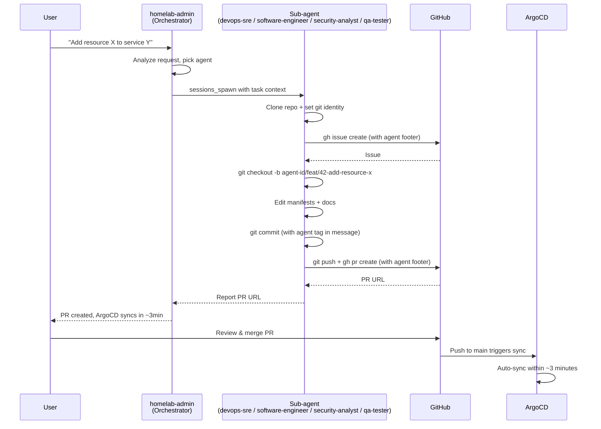
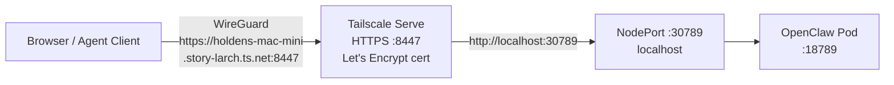
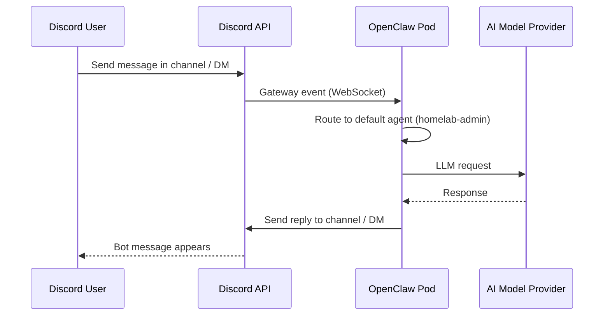
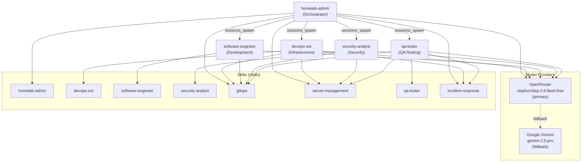

# OpenClaw

OpenClaw is a multi-channel AI gateway that serves as the agent orchestration layer for the homelab. It connects to AI model providers via OpenRouter and exposes a unified gateway API for AI agent workflows running on the Mac mini.

## Architecture



## Directory Contents

| File | Purpose |
|------|---------|
| `namespace.yaml` | Dedicated `openclaw` namespace |
| `pvc.yaml` | 5Gi PVC for state data and agent workspaces |
| `external-secret.yaml` | Syncs gateway token, API keys, GitHub token, and Discord bot token from Infisical → `openclaw-secret` |
| `configmap.yaml` | Multi-agent `openclaw.json` config (gateway, agents, channels, skills, tools) |
| `deployment.yaml` | Single-replica deployment with config/skills/workspace volumes |
| `service.yaml` | NodePort service exposing port 30789 |
| `rbac.yaml` | ServiceAccount + ClusterRoleBinding (cluster-admin) |
| `kustomization.yaml` | Kustomize resource list |

Related files outside this directory:

| File | Purpose |
|------|---------|
| `Dockerfile.openclaw` (repo root) | Homelab overlay — adds kubectl, helm, terraform, argocd, jq, git, gh |
| `k8s/apps/argocd/applications/openclaw-app.yaml` | ArgoCD Application CR |
| `scripts/build-openclaw.sh` | Docker image build helper |
| `skills/` (repo root) | Homelab-specific skills (mounted into pod via hostPath) |
| `agents/workspaces/` (repo root) | Agent AGENTS.md personality files (copied into pod by init container) |


## Security

The OpenClaw pod runs as a non-root user to reduce the impact of a potential container breakout. The pod-level securityContext is configured as:

- `runAsUser: 1000`
- `runAsGroup: 1000`
- `runAsNonRoot: true`
- `fsGroup: 1000`

This ensures that the container processes do not have root privileges on the host node. The `fsGroup` setting also ensures that any shared volumes (like the PVC for workspace data) are accessible by the non-root user.

Note: OpenClaw uses a `hostPath` volume to inject agent workspace definitions from the host (`/Users/holden.nguyen/homelab/agents/workspaces`). This is an exception to the cluster's default-deny network policies and requires the `openclaw` namespace to be exempt from the `restricted` pod security profile (due to the use of `hostPath`).

The OpenClaw service account is scoped to its own namespace via a Role with minimal permissions: read-only access to pods, logs, secrets, configmaps, services, and PVCs, plus exec into pods for debugging. The previous `cluster-admin` ClusterRoleBinding has been removed, limiting the blast radius if the service account token were compromised.

## How It Fits in the Homelab

OpenClaw runs as a standard Kustomize application managed by ArgoCD, following the same App of Apps pattern as every other service. Its secrets flow through the Infisical → ESO → K8s Secret pipeline.



## Agent Git Workflow

All agents enforce a mandatory git workflow for any change to the homelab repository. No agent pushes directly to `main`. Branch protection is enforced: PRs require at least one approving review, force pushes are blocked, and linear history is required.



The git workflow details live in the `gitops` skill (assigned to all agents). Each agent's `AGENTS.md` is a lean personality definition — identity, tone, role-specific guidance — that references skills for procedural content. Each agent sets its own git identity via `git config` in the cloned repo (e.g. `devops-sre[bot] <devops-sre@openclaw.homelab>`), so every commit is traceable to the specific agent. The `GITHUB_TOKEN` from Infisical powers `gh` CLI authentication.

**Branch freshness:** Agents are required to keep their feature branch up to date with `main` by running `git fetch origin main && git merge origin/main --no-edit` before every push. This prevents stale branches and merge conflicts when the PR is merged.

**Milestones and releases:** Every issue and PR is assigned to a GitHub Milestone representing the next planned release (`vMAJOR.MINOR.PATCH`). Version bumps follow semantic versioning — derived from type labels (`type:feat` → MINOR, `type:fix` → PATCH) with an explicit `semver:breaking` label for MAJOR bumps. The `homelab-admin` orchestrator owns the release process: tagging `main`, creating GitHub Releases with auto-generated notes, and managing the milestone lifecycle. Sub-agents never create tags or releases.

**Incident response:** Agents follow a structured incident response procedure when deployments cause service degradation. The `homelab-admin` orchestrator acts as incident commander, `devops-sre` executes rollbacks and cluster recovery, and `qa-tester` runs pre-merge and post-rollback verification checklists. All agents with the `incident-response` skill are trained to verify Helm chart value keys before PRs, check container image compatibility with `securityContext` changes, and run post-merge health checks. See the `incident-response` skill for the full procedure.

### Agent Footprint

Every action is traceable to the specific agent that performed it:

| Artifact | Footprint |
|---|---|
| Git commit author | `<agent-id>[bot] <<agent-id>@openclaw.homelab>` |
| Commit message | `... [<agent-id>]` suffix |
| Branch name | `<agent-id>/<type>/...` prefix |
| Issue/PR labels | `agent:<agent-id>` |
| Issue/PR body | `Agent: <agent-id> \| OpenClaw Homelab` footer |

## Deployment

### Prerequisites

- OpenClaw Docker image built locally (see [Build the Image](#build-the-image))
- Secrets added to Infisical (see [Secrets](#secrets))
- OpenRouter API key added to Infisical (see [Secrets](#secrets))

### Build the Image

OpenClaw uses a two-stage locally built Docker image. The first stage builds the upstream OpenClaw source (`openclaw:base`), and the second stage (`Dockerfile.openclaw`) layers homelab-specific ops tools on top. OrbStack's Kubernetes shares the host Docker daemon, so locally built images are immediately available with `imagePullPolicy: Never`.

```bash
./scripts/build-openclaw.sh
```

This builds the image as `openclaw:latest` with the following tools baked in:

| Tool | Version | Purpose |
|---|---|---|
| `kubectl` | 1.32.7 | Kubernetes operations |
| `helm` | 3.17.3 | Helm chart management |
| `terraform` | 1.5.7 | Bootstrap layer management |
| `argocd` | 2.14.11 | ArgoCD CLI |
| `jq` | 1.6 | JSON processing |
| `git` | (apt) | Git operations for the mandatory git workflow |
| `gh` | (apt) | GitHub CLI for issues, PRs, and repo cloning |

To use a custom tag:

```bash
./scripts/build-openclaw.sh openclaw:v2026.2.16
```

If using a custom tag, update `image:` in `k8s/apps/openclaw/deployment.yaml` to match.

To update tool versions, edit the `ARG` lines in `Dockerfile.openclaw` and rebuild.

### Secrets

Add the following secrets to Infisical under **homelab / prod**:

| Infisical Key | How to Generate | Required |
|---|---|---|
| `OPENCLAW_GATEWAY_TOKEN` | `openssl rand -hex 32` | Yes |
| `OPENROUTER_API_KEY` | From [openrouter.ai/keys](https://openrouter.ai/keys) | Yes (primary model provider) |
| `GEMINI_API_KEY` | From [aistudio.google.com/apikey](https://aistudio.google.com/apikey) | Yes (fallback model provider) |
| `GITHUB_TOKEN` | GitHub PAT (Fine-grained) with repo scope for `holdennguyen/homelab` | Yes (for git workflow) |
| `DISCORD_BOT_TOKEN` | From [Discord Developer Portal](https://discord.com/developers/applications) → Bot → Reset Token | Yes (for Discord chat channel) |

After adding secrets, ESO syncs them into the `openclaw-secret` K8s Secret within the `refreshInterval` (1 hour), or force an immediate sync:

```bash
kubectl annotate externalsecret openclaw-secret -n openclaw \
  force-sync=$(date +%s) --overwrite
```

### Adding More Providers or Channels

To add a new API key (e.g., `ANTHROPIC_API_KEY`, `OPENAI_API_KEY`, or `TELEGRAM_BOT_TOKEN`; see the Discord channel setup for a complete worked example):

1. Add the key to Infisical under `homelab / prod`
2. Add a new entry to `external-secret.yaml`:

```yaml
    - secretKey: ANTHROPIC_API_KEY
      remoteRef:
        key: ANTHROPIC_API_KEY
```

3. Add a corresponding `env` entry to `deployment.yaml`:

```yaml
            - name: ANTHROPIC_API_KEY
              valueFrom:
                secretKeyRef:
                  name: openclaw-secret
                  key: ANTHROPIC_API_KEY
```

4. Push to `main` — ArgoCD syncs the change automatically.

### Model Configuration

**Model strategy:** `openrouter/stepfun/step-3.5-flash:free` is the primary model (free tier via OpenRouter). `google/gemini-2.5-pro` is the fallback -- when the primary fails or hits rate limits, OpenClaw automatically falls through to Gemini.

Both OpenRouter and Google Gemini are built-in providers in OpenClaw. Auth is via `OPENROUTER_API_KEY` and `GEMINI_API_KEY` env vars (synced from Infisical).

#### Model config convention (IMPORTANT)

OpenClaw has two places to set models: `agents.defaults.model` and per-agent `agents.list[].model`. The critical rule:

> **Always set `model` as an object `{ "primary": "...", "fallbacks": ["..."] }` on EVERY agent in `agents.list[]`.**

Why:

- `agents.defaults.model` fallbacks **do not propagate** to the per-agent UI view.
- A plain string `model` (e.g. `"model": "google/gemini-2.5-pro"`) only sets `primary` and **discards fallbacks**.
- Only the object form `{ "primary", "fallbacks" }` on each agent ensures fallbacks are resolved and visible in the UI.

When changing models, update **both** `agents.defaults.model` (the canonical source) **and** every `agents.list[].model` entry. Keep them in sync.

#### Switching models

```bash
# In configmap.yaml, update BOTH:
#   1. agents.defaults.model.primary and agents.defaults.model.fallbacks
#   2. agents.list[].model.primary and agents.list[].model.fallbacks (every agent)
#
# Example primary refs:
#   openrouter/stepfun/step-3.5-flash:free
#   openrouter/anthropic/claude-opus-4-6
#   openrouter/openai/gpt-5.2
#   google/gemini-2.5-pro
# Push to main — ArgoCD syncs
```

### Deploy

Once the image is built and secrets are in Infisical, push the k8s manifests to `main`. ArgoCD detects the new Application CR and deploys within ~3 minutes.

```bash
# Verify the ArgoCD application
kubectl get application openclaw -n argocd

# Watch pod come up
kubectl get pods -n openclaw -w

# Check ExternalSecret resolved
kubectl get externalsecret -n openclaw
```

## Networking



| Layer | Port | Protocol |
|---|---|---|
| Container | 18789 | HTTP |
| NodePort | 30789 | HTTP (localhost only) |
| Tailscale Serve | 8447 | HTTPS (Let's Encrypt) |

One-time Tailscale Serve setup:

```bash
tailscale serve --bg --https 8447 http://localhost:30789
```

Access from any Tailscale device: `https://holdens-mac-mini.story-larch.ts.net:8447`

## Discord Chat Channel

OpenClaw connects to Discord as a chat channel, allowing users to converse with homelab agents from any Discord client (mobile, desktop, or web). Messages sent in a Discord channel or DM are routed to the default `homelab-admin` orchestrator agent, which can delegate to sub-agents as needed.

### How It Works



### Discord Concepts (quick primer)

If you've never used Discord before, here are the key concepts:

- **Discord account** — your personal login at [discord.com](https://discord.com). Free to create.
- **Server** (also called a "guild") — a shared space you create or join. Think of it like a Slack workspace or a group chat room.
- **Channel** — a conversation topic inside a server (e.g. `#general`, `#homelab`). Channels are prefixed with `#`.
- **Bot** — an automated user that lives in your server. The OpenClaw bot reads messages and replies using AI agents.
- **DM** (direct message) — a private conversation between you and the bot (or another user), outside of any server.
- **Mention** — typing `@BotName` in a message to get the bot's attention. With `groupPolicy: "open"`, the bot responds to mentions in any channel it can see.

### Step 1: Create a Discord Account (skip if you already have one)

1. Go to [discord.com/register](https://discord.com/register)
2. Fill in your email, display name, username, password, and date of birth
3. Verify your email address by clicking the link Discord sends you
4. (Optional) Download the Discord app for [desktop](https://discord.com/download) or mobile (App Store / Google Play) — the web app at [discord.com/app](https://discord.com/app) also works

### Step 2: Create a Discord Server

You need a server for the bot to live in. If you already have one, skip to Step 3.

1. Open Discord (app or web)
2. Click the **+** button in the left sidebar (below your server icons)
3. Choose **Create My Own**
4. Choose **For me and my friends** (or any option — it only affects the default channels)
5. Enter a server name (e.g. `Homelab`) and click **Create**

You now have a server with a `#general` channel. You can create more channels later (right-click the channel list → **Create Channel**).

### Step 3: Create a Discord Bot Application

This creates the bot identity that OpenClaw will use to connect to Discord.

1. Go to the [Discord Developer Portal](https://discord.com/developers/applications) and log in with your Discord account
2. Click **New Application** (top-right)
3. Enter a name (e.g. `OpenClaw`) and accept the Terms of Service → click **Create**
4. You are now on the application's **General Information** page. Note the **Application ID** — you may need it later for debugging

### Step 4: Configure the Bot and Get the Token

1. In the left sidebar of your application, click **Bot**
2. Under the **Token** section, click **Reset Token** (you may need to confirm with your password or 2FA)
3. **Copy the token immediately** — Discord only shows it once. If you lose it, you'll need to reset it again
4. Scroll down to **Privileged Gateway Intents** and enable:
   - **Message Content Intent** — required so the bot can read the content of messages (not just metadata). Without this, the bot sees messages arrive but cannot read what users typed

> **Security note:** The bot token is a secret credential — treat it like a password. Never paste it in chat, commit it to git, or share it publicly. It goes into Infisical in Step 6.

### Step 5: Invite the Bot to Your Server

1. In the left sidebar of your application, click **OAuth2**
2. Under **OAuth2 URL Generator**, select these scopes:
   - `bot` — allows the application to join your server as a bot user
   - `applications.commands` — allows the bot to register slash commands (future use)
3. A **Bot Permissions** panel appears below. Select:
   - `View Channels` — the bot can see the channel list
   - `Send Messages` — the bot can post replies
   - `Read Message History` — the bot can read previous messages for context
   - `Embed Links` — the bot can post rich link previews
   - `Attach Files` — the bot can upload files (e.g. images, logs)
   - `Add Reactions` — the bot can react to messages (used for acknowledgment)
4. Scroll down and copy the **Generated URL**
5. Open the URL in your browser. Discord asks you to choose a server:
   - Select your homelab server from the dropdown
   - Click **Authorize**
   - Complete the CAPTCHA if prompted
6. The bot now appears in your server's member list (it will show as offline until OpenClaw connects)

### Step 6: Store the Token in Infisical

1. Open the Infisical UI at `https://holdens-mac-mini.story-larch.ts.net:8445`
2. Navigate to the **homelab** project → **prod** environment
3. Click **Add Secret**
4. Set the key to `DISCORD_BOT_TOKEN` and paste the bot token you copied in Step 4
5. Click **Save**

### Step 7: Deploy and Connect

Force ESO to sync the new secret, then restart the pod so OpenClaw picks up the token:

```bash
kubectl annotate externalsecret openclaw-secret -n openclaw \
  force-sync=$(date +%s) --overwrite
kubectl rollout restart deployment/openclaw -n openclaw
kubectl rollout status deployment/openclaw -n openclaw
```

### Step 8: Verify the Connection

```bash
# Check that Discord shows as connected
kubectl exec -n openclaw deploy/openclaw -- node dist/index.js channels status

# Look for Discord login confirmation in logs
kubectl logs -n openclaw deploy/openclaw --tail=100 | grep -i discord
```

If successful, the bot's status in your Discord server changes from offline to **online**.

### Talking to OpenClaw via Discord

Once the bot is online, you can chat with it in two ways:

**In a server channel (mention required):**

Type `@OpenClaw <your message>` in any channel the bot can see. The bot will reply in the same channel. Other server members can see the conversation.

**In a DM (no mention needed):**

Click the bot's name in the member list → **Message** (or right-click → **Message**). Type your message directly — no `@` mention needed in DMs.

Examples of things you can ask:

- `@OpenClaw what pods are running in the cluster?`
- `@OpenClaw check the health of all services`
- `@OpenClaw show me the ArgoCD sync status`

The bot routes all messages to the `homelab-admin` orchestrator, which can delegate to sub-agents (`devops-sre`, `software-engineer`, `security-analyst`, `qa-tester`) as needed.

### Configuration Reference

Discord requires two config sections in `openclaw.json`:

**Channel config** (`channels.discord`):

| Key | Value | Purpose |
|---|---|---|
| `enabled` | `true` | Activate the Discord channel on startup |
| `groupPolicy` | `"open"` | Allow messages from all guild channels (mention-gating still applies) |

**Plugin entry** (`plugins.entries.discord`):

| Key | Value | Purpose |
|---|---|---|
| `enabled` | `true` | Load the Discord extension plugin at startup |

The plugin entry is required because the ConfigMap is mounted read-only. OpenClaw normally auto-enables channel plugins by writing to the config file at startup, but this fails on a read-only filesystem. Explicitly setting `plugins.entries.discord.enabled: true` in the ConfigMap bypasses the auto-enable write.

The bot token is resolved from the `DISCORD_BOT_TOKEN` environment variable (injected via ESO from Infisical). No token is stored in the config file.

**Available group policies:**

| Policy | Behavior |
|---|---|
| `"open"` | Bot responds in any channel it can see (when mentioned). This is the current setting. |
| `"allowlist"` | Bot only responds in channels explicitly listed in `channels.discord.guilds.<id>.channels` |
| `"disabled"` | Block all guild channel messages; only DMs work |

## Running CLI Commands Inside the Pod

The OpenClaw CLI is built into the container image. Run any `openclaw` subcommand via `kubectl exec`:

```bash
kubectl exec -n openclaw deploy/openclaw -- node dist/index.js <command>
```

The gateway uses its default port (18789) inside the pod, so CLI commands auto-discover it without extra env vars or flags.

Common commands:

```bash
# Gateway health
kubectl exec -n openclaw deploy/openclaw -- node dist/index.js health

# List devices (paired + pending)
kubectl exec -n openclaw deploy/openclaw -- node dist/index.js devices list

# Approve a device
kubectl exec -n openclaw deploy/openclaw -- node dist/index.js devices approve <requestId>

# Print dashboard URL with embedded token
kubectl exec -n openclaw deploy/openclaw -- node dist/index.js dashboard --no-open

# Run diagnostics
kubectl exec -n openclaw deploy/openclaw -- node dist/index.js doctor
```

## First Connection: Device Pairing

OpenClaw requires a **one-time device pairing approval** for every new browser or device that connects to the Control UI over the network. This is a security measure separate from the gateway token -- even with the correct token, remote connections must be explicitly approved.

### What Happens

1. Open the Control UI at `https://holdens-mac-mini.story-larch.ts.net:8447`
2. Enter your `OPENCLAW_GATEWAY_TOKEN` in the settings panel and click **Connect**
3. You see: `disconnected (1008): pairing required`

This is expected. The browser generated a unique device ID and sent a pairing request to the gateway.

### Approve the Device

```bash
# List pending pairing requests
kubectl exec -n openclaw deploy/openclaw -- node dist/index.js devices list

# Find the request ID in the "Request" column and approve it
kubectl exec -n openclaw deploy/openclaw -- node dist/index.js devices approve <requestId>
```

After approval, go back to the UI and click **Connect** again. The connection should succeed.

### Pairing Rules

- **Local connections** (`127.0.0.1`, e.g., via `kubectl port-forward`) are auto-approved.
- **Remote connections** (Tailscale, LAN) always require explicit approval.
- **Each browser profile** generates a unique device ID. Switching browsers, clearing browser data, or using incognito mode requires re-pairing.
- **Approval persists** across gateway restarts (stored in the PVC at `/data`).
- **Revoke a device**: `kubectl exec -n openclaw deploy/openclaw -- node dist/index.js devices revoke --device <id> --role <role>`

### Retrieve the Gateway Token

If you need to retrieve the token value stored in the cluster:

```bash
kubectl get secret openclaw-secret -n openclaw \
  -o jsonpath='{.data.OPENCLAW_GATEWAY_TOKEN}' | base64 -d
```

## Updating OpenClaw

The `openclaw/` directory is a **git submodule** pointing to `github.com/OpenClaw/OpenClaw`. The homelab repo pins a specific commit; openclaw's internal files are not tracked by the homelab repo.

### Pull the latest upstream release

```bash
# 1. Fetch and update the submodule to the latest upstream commit
cd openclaw
git fetch origin
git checkout main
git pull origin main
cd ..

# 2. Record the new commit in the homelab repo
git add openclaw
git commit -m "update openclaw submodule to $(cd openclaw && git log -1 --format='%h — %s')"
git push origin main

# 3. Rebuild the Docker image with the new source
./scripts/build-openclaw.sh

# 4. Restart the deployment to pick up the new image
kubectl rollout restart deployment/openclaw -n openclaw

# 5. Watch the rollout
kubectl rollout status deployment/openclaw -n openclaw
```

### Pin to a specific version

```bash
cd openclaw
git fetch origin --tags
git checkout v2026.2.16    # or any tag/commit
cd ..
git add openclaw
git commit -m "pin openclaw submodule to v2026.2.16"
git push origin main
./scripts/build-openclaw.sh
kubectl rollout restart deployment/openclaw -n openclaw
```

### Clone the homelab repo (fresh machine)

When cloning the homelab repo on a new machine, the submodule directory will be empty by default. Initialize it with:

```bash
git clone https://github.com/holdennguyen/homelab.git
cd homelab
git submodule update --init
```

## Gateway Configuration

The `openclaw.json` config (in `configmap.yaml`) contains these key settings:

| Section | Key | Value | Purpose |
|---|---|---|---|
| `gateway` | `mode` | `"local"` | Enables full gateway functionality for the single-node deployment |
| `gateway` | `trustedProxies` | RFC 1918 ranges | Treats internal K8s network traffic as local (fixes proxy header warnings) |
| `agents.defaults.model` | `primary` / `fallbacks` | Step 3.5 Flash (OpenRouter) primary, Gemini 2.5 Pro fallback | Free primary model with Gemini as fallback |
| `tools.agentToAgent` | `enabled` / `allow` | All 5 agents | Enables inter-agent communication |
| `tools.sessions` | `visibility` | `"all"` | Allows the orchestrator to view sub-agent session history for debugging |
| `agents.defaults.subagents` | `maxSpawnDepth` | `2` | Orchestrator → sub-agent → leaf worker |
| `agents.list[].subagents` | `allowAgents` | Per-agent list | Controls which agents each agent can spawn — only the orchestrator has non-empty lists |
| `channels.discord` | `enabled` | `true` | Connect to Discord on startup using `DISCORD_BOT_TOKEN` env var |
| `channels.discord` | `groupPolicy` | `"open"` | Respond in any guild channel the bot can see (mention required) |
| `plugins.entries.discord` | `enabled` | `true` | Load Discord extension plugin (required for read-only ConfigMap) |

## Multi-Agent & Skills Architecture

OpenClaw runs five agents with the orchestrator pattern: a default `homelab-admin` agent that delegates to specialized sub-agents.



Each agent has a `skills` allowlist in the configmap that restricts which skills it can see (omit = all skills; empty array = none):

| Agent | Assigned Skills |
|---|---|
| `homelab-admin` | `homelab-admin`, `gitops`, `secret-management`, `incident-response` |
| `devops-sre` | `devops-sre`, `gitops`, `secret-management`, `incident-response` |
| `software-engineer` | `software-engineer`, `gitops` |
| `security-analyst` | `security-analyst`, `gitops`, `secret-management` |
| `qa-tester` | `qa-tester`, `gitops`, `secret-management`, `incident-response` |

### Agents

| Agent ID | Role | Workspace |
|---|---|---|
| `homelab-admin` | Default orchestrator — coordinates tasks, delegates to sub-agents | `/data/workspaces/homelab-admin` |
| `devops-sre` | Infrastructure, K8s ops, Terraform, incident response | `/data/workspaces/devops-sre` |
| `software-engineer` | Code development, review, testing | `/data/workspaces/software-engineer` |
| `security-analyst` | Security audits, vulnerability assessment, hardening | `/data/workspaces/security-analyst` |
| `qa-tester` | Deployment validation, service health testing, regression checks | `/data/workspaces/qa-tester` |

Every agent has an explicit object-form `model` in the configmap (see [Model config convention](#model-config-convention-important)):

| Setting | Value |
|---|---|
| Primary | `openrouter/stepfun/step-3.5-flash:free` |
| Fallback | `google/gemini-2.5-pro` |

When the primary model fails, OpenClaw automatically falls through to Gemini. Auth is via `OPENROUTER_API_KEY` and `GEMINI_API_KEY` (both synced from Infisical).

Agent configuration is in the `openclaw-config` ConfigMap (mounted at `/config/openclaw.json`). Each agent has its own AGENTS.md personality file in `agents/workspaces/<id>/AGENTS.md`, copied into the pod workspace on every restart by the `init-workspaces` init container.

The pod runs with a `cluster-admin` ServiceAccount so agents can execute `kubectl`, `helm`, and other ops tools against the cluster directly.

### Skills

Homelab-specific skills live in `skills/` at the repo root and are mounted into the pod at `/skills` via hostPath:

| Skill | Description |
|---|---|
| `homelab-admin` | Cluster operations, service management, delegation framework, change impact assessment |
| `devops-sre` | SRE best practices: SLOs, resource management, deployment strategies, runbooks, incident response, monitoring |
| `software-engineer` | Stack conventions (K8s/Terraform/Docker/Bash), manifest best practices, testing, error handling, dependency management |
| `security-analyst` | STRIDE threat modeling, CIS hardening, container/image security, RBAC audit, secret lifecycle, supply chain security |
| `qa-tester` | Test strategy, per-service acceptance criteria, full cluster validation, chaos testing, defect classification |
| `gitops` | ArgoCD App of Apps pattern, sync management, mandatory git workflow, agent footprint conventions |
| `incident-response` | Incident triage, rollback procedures, pre-merge validation, post-incident documentation |
| `secret-management` | Infisical → ESO → K8s pipeline operations |
| `common/Documentation` | Standardized documentation generation |

Skills follow the [AgentSkills](https://agentskills.io) format with OpenClaw-compatible `SKILL.md` frontmatter.

### Sub-agent spawning

The orchestrator pattern uses `maxSpawnDepth: 2`:
- **Depth 0** — main agent (`homelab-admin`) receives user requests
- **Depth 1** — orchestrator spawns specialized sub-agents via `sessions_spawn`
- **Depth 2** — sub-agents can spawn leaf workers for parallel tasks

Sub-agents announce results back up the chain. Configure limits in the ConfigMap:
- `maxConcurrent: 4` — max parallel sub-agents
- `maxChildrenPerAgent: 3` — max children per agent session
- `archiveAfterMinutes: 120` — auto-cleanup of finished sub-agent sessions

### Adding a new agent

1. Add the agent entry to `configmap.yaml` under `agents.list` — include a `skills` array and a `subagents.allowAgents` list
2. Add the new agent ID to the orchestrator's `subagents.allowAgents` so it can be spawned
3. Create `agents/workspaces/<id>/AGENTS.md` with a lean agent personality (identity, tone, role-specific guidance, rules referencing skills)
4. Add the agent ID to the init container's `for` loop in `deployment.yaml`
5. Add the agent ID to `tools.agentToAgent.allow` in the config
6. Push to `main` via PR (branch protection requires review)

### Adding a new skill

1. Create `skills/<name>/SKILL.md` with OpenClaw frontmatter (`name`, `description`, optional `metadata`)
2. Add the skill name to the `skills` array of each agent that should use it in the configmap
3. Push to `main` and restart the pod: `kubectl rollout restart deployment/openclaw -n openclaw`

## Operational Commands

### Kubernetes

```bash
# Pod status
kubectl get pods -n openclaw

# Logs (last 100 lines)
kubectl logs -n openclaw deploy/openclaw --tail=100

# Follow logs
kubectl logs -n openclaw deploy/openclaw -f

# Restart deployment
kubectl rollout restart deployment/openclaw -n openclaw

# Check ExternalSecret status
kubectl describe externalsecret openclaw-secret -n openclaw

# Force secret re-sync
kubectl annotate externalsecret openclaw-secret -n openclaw \
  force-sync=$(date +%s) --overwrite

# Port-forward for local testing (bypasses Tailscale)
kubectl port-forward -n openclaw svc/openclaw 18789:18789

# Check ArgoCD application sync status
kubectl get application openclaw -n argocd
```

### OpenClaw CLI (via kubectl exec)

```bash
# Gateway health check
kubectl exec -n openclaw deploy/openclaw -- node dist/index.js health

# List paired and pending devices
kubectl exec -n openclaw deploy/openclaw -- node dist/index.js devices list

# Approve a pending device
kubectl exec -n openclaw deploy/openclaw -- node dist/index.js devices approve <requestId>

# Revoke a device
kubectl exec -n openclaw deploy/openclaw -- node dist/index.js devices revoke --device <id> --role <role>

# Print dashboard URL with embedded token
kubectl exec -n openclaw deploy/openclaw -- node dist/index.js dashboard --no-open

# List connected channels
kubectl exec -n openclaw deploy/openclaw -- node dist/index.js channels status

# Run diagnostics
kubectl exec -n openclaw deploy/openclaw -- node dist/index.js doctor

# View/edit gateway config
kubectl exec -n openclaw deploy/openclaw -- node dist/index.js config get
```

## Troubleshooting

| Symptom | Cause | Fix |
|---|---|---|
| `disconnected (1008): pairing required` | New browser/device needs approval | `kubectl exec -n openclaw deploy/openclaw -- node dist/index.js devices list` then `devices approve <requestId>` |
| `unauthorized: gateway token missing` | Token not set in UI settings | Open Control UI settings, paste the `OPENCLAW_GATEWAY_TOKEN` |
| `ErrImageNeverPull` | Docker image not built locally | Run `./scripts/build-openclaw.sh` |
| Pod `CrashLoopBackOff` | Missing secrets or config error | `kubectl logs -n openclaw deploy/openclaw` — check for missing env vars |
| ExternalSecret `SecretSyncedError` | Secret key missing in Infisical | Add the missing key to Infisical `homelab / prod /` |
| `connection refused` on `:30789` | Pod not running or not ready | `kubectl get pods -n openclaw` — wait for `Running` status |
| Health check `/health` failing | Gateway still starting up | Wait 30s for initial startup; check logs for errors |
| 401 Unauthorized on gateway | Wrong `OPENCLAW_GATEWAY_TOKEN` | Verify the token in Infisical matches what you use in requests |
| Model API errors | Invalid or expired API key | Update the key in Infisical; force ESO re-sync; restart pod |
| OpenRouter 401/403 | Invalid or missing `OPENROUTER_API_KEY` | Add/update the key in Infisical `homelab / prod / OPENROUTER_API_KEY`; force ESO re-sync; restart pod |
| OpenRouter rate limit (429) | Account credit exhausted | Top up credits at [openrouter.ai/credits](https://openrouter.ai/credits); or switch to a cheaper model in `agents.defaults.model.primary` |
| Tailscale URL not responding | `tailscale serve` not configured | Run `tailscale serve --bg --https 8447 http://localhost:30789` |
| Discord bot not connecting | Missing or invalid `DISCORD_BOT_TOKEN` | Verify the token in Infisical; force ESO re-sync; restart pod |
| Discord bot connects but ignores messages | Message Content Intent not enabled | Enable it in Discord Developer Portal → Bot → Privileged Gateway Intents |
| Discord bot can't see a channel | Missing permissions in the server | Ensure the bot role has View Channel + Send Messages on the target channel |
