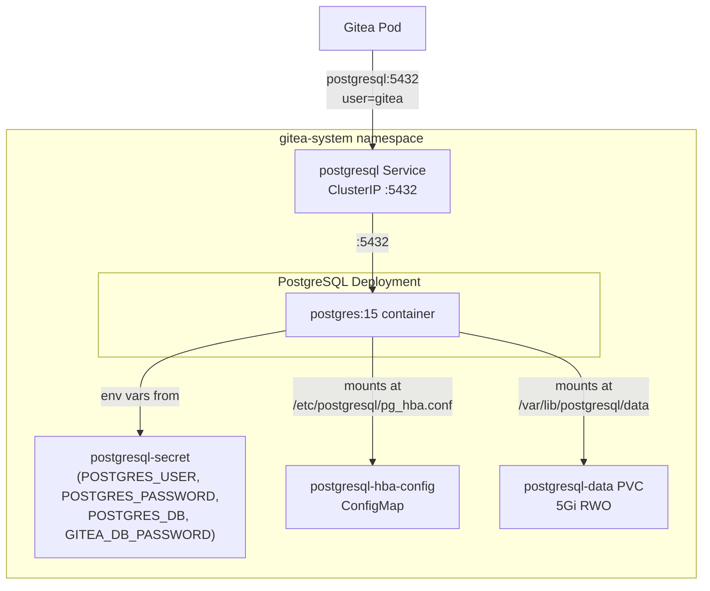
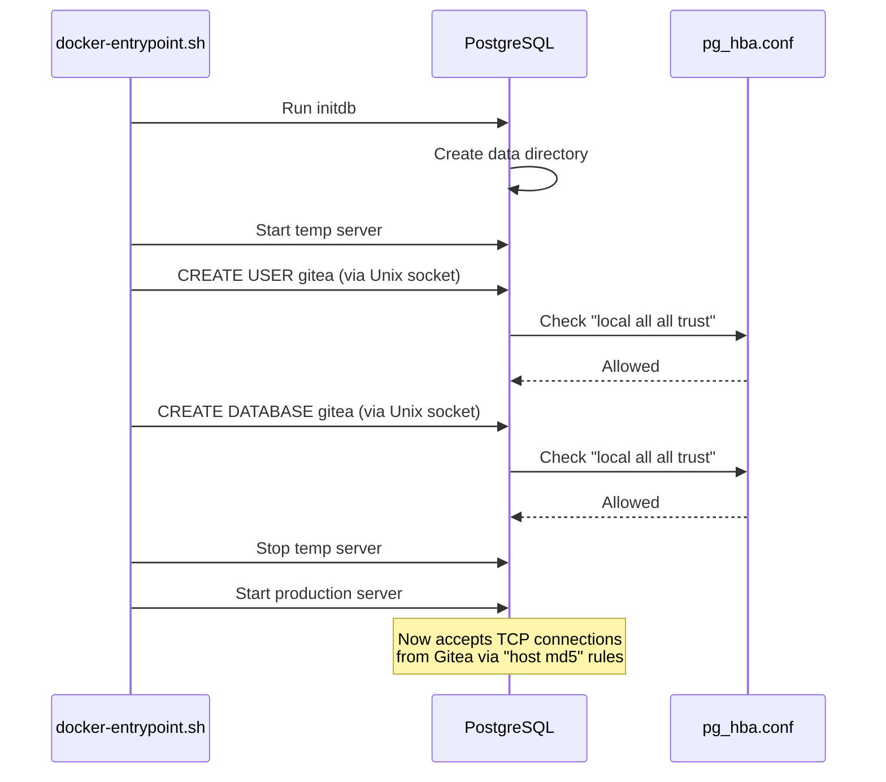
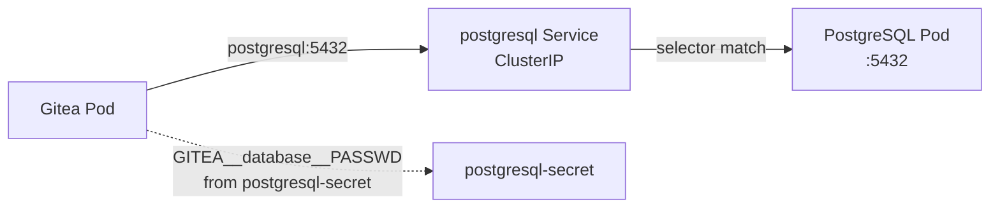

# PostgreSQL

Dedicated PostgreSQL 15 instance serving as the database backend for Gitea. Deployed in the `gitea-system` namespace alongside Gitea for direct service-to-service connectivity.

## Architecture



## Directory Contents

| File | Purpose |
|------|---------|
| `kustomization.yaml` | Lists all resources for Kustomize/Argo CD rendering |
| `namespace.yaml` | Creates the `gitea-system` namespace (owns it via `CreateNamespace=true` in the Argo CD Application) |
| `pvc.yaml` | 5Gi `ReadWriteOnce` PersistentVolumeClaim for database files |
| `secret.yaml` | Credentials for PostgreSQL superuser and Gitea database access |
| `postgresql-hba-config.yaml` | Custom `pg_hba.conf` controlling client authentication |
| `deployment.yaml` | PostgreSQL Deployment with volume mounts and resource limits |
| `service.yaml` | ClusterIP Service exposing port 5432 |

## Configuration Details

### Data Directory (PGDATA)

The PVC is mounted at `/var/lib/postgresql/data`. To avoid issues with `lost+found` directories created by some filesystem provisioners, `PGDATA` is set to a subdirectory:

```
PGDATA=/var/lib/postgresql/data/pgdata
```

The directory layout inside the container:

```
/var/lib/postgresql/data/         <-- PVC mount
└── pgdata/                       <-- PGDATA (actual database files)
    ├── base/
    ├── global/
    ├── pg_wal/
    └── ...
```

### Host-Based Authentication (pg_hba.conf)

A custom `pg_hba.conf` is provided via the `postgresql-hba-config` ConfigMap, mounted at `/etc/postgresql/pg_hba.conf` (outside the data directory). The postgres process is told to use it via the container argument:

```yaml
args: ["-c", "hba_file=/etc/postgresql/pg_hba.conf"]
```

The authentication rules:

```
# TYPE  DATABASE  USER  ADDRESS      METHOD
local   all       all                trust    # Unix socket (used during initdb)
host    all       all   127.0.0.1/32 md5      # Loopback TCP
host    all       all   0.0.0.0/0    md5      # All TCP connections (pod network)
```

The `local trust` rule is required because the `postgres:15` Docker image's entrypoint script uses Unix socket connections to create the database and user during first initialization. Without it, `initdb` fails with `no pg_hba.conf entry for host "[local]"`.



### Why pg_hba.conf is Mounted Outside the Data Directory

Mounting the ConfigMap inside `/var/lib/postgresql/data/` (the PVC) would cause a conflict: the PVC volume mount owns that directory, and a subPath ConfigMap mount inside it creates a race condition with `initdb` which also writes `pg_hba.conf` there. Mounting to `/etc/postgresql/` avoids this entirely.

### Secret Management

The `postgresql-secret` contains four base64-encoded values:

| Key | Value | Used By |
|-----|-------|---------|
| `POSTGRES_USER` | `gitea` | PostgreSQL init (creates this as the superuser) |
| `POSTGRES_PASSWORD` | `giteapassword` | PostgreSQL init (sets the superuser password) |
| `POSTGRES_DB` | `gitea` | PostgreSQL init (creates this database) |
| `GITEA_DB_PASSWORD` | `giteapassword` | Gitea Deployment (injected as `GITEA__database__PASSWD` env var) |

`POSTGRES_PASSWORD` and `GITEA_DB_PASSWORD` must match because `POSTGRES_USER=gitea` makes `gitea` the PostgreSQL superuser, and Gitea connects as that same user. If they differ, Gitea will fail with `password authentication failed`.

**Important:** These are development-only values. For production, generate strong random passwords and consider using Sealed Secrets or an External Secrets Operator.

### Changing the Password

Because PostgreSQL stores the password hash in its data files during `initdb`, changing the Secret alone does not update the running database. To change the password:

1. Update the Secret values in `secret.yaml`
2. Delete the PostgreSQL PVC to force reinitialization:

```bash
kubectl scale deployment postgresql -n gitea-system --replicas=0
kubectl delete pvc postgresql-data -n gitea-system
kubectl scale deployment postgresql -n gitea-system --replicas=1
```

This destroys all database data. For non-destructive password changes, exec into the pod and run `ALTER USER`.

### Resource Limits

| Resource | Request | Limit |
|----------|---------|-------|
| CPU | 100m | 500m |
| Memory | 256Mi | 512Mi |

## Integration with Gitea

Gitea connects to PostgreSQL using the Kubernetes Service DNS name:

```
Host: postgresql.gitea-system.svc.cluster.local:5432
```

In Gitea's `app.ini`, this is shortened to `postgresql:5432` since both pods are in the same namespace. The connection flow:



## Operational Commands

```bash
# Check pod status
kubectl get pods -n gitea-system -l app.kubernetes.io/name=postgresql

# View logs
kubectl logs -n gitea-system deploy/postgresql

# Connect to psql
kubectl exec -n gitea-system deploy/postgresql -- psql -U gitea -d gitea

# List tables
kubectl exec -n gitea-system deploy/postgresql -- psql -U gitea -d gitea -c '\dt'

# Check database size
kubectl exec -n gitea-system deploy/postgresql -- psql -U gitea -d gitea \
  -c "SELECT pg_size_pretty(pg_database_size('gitea'));"
```
