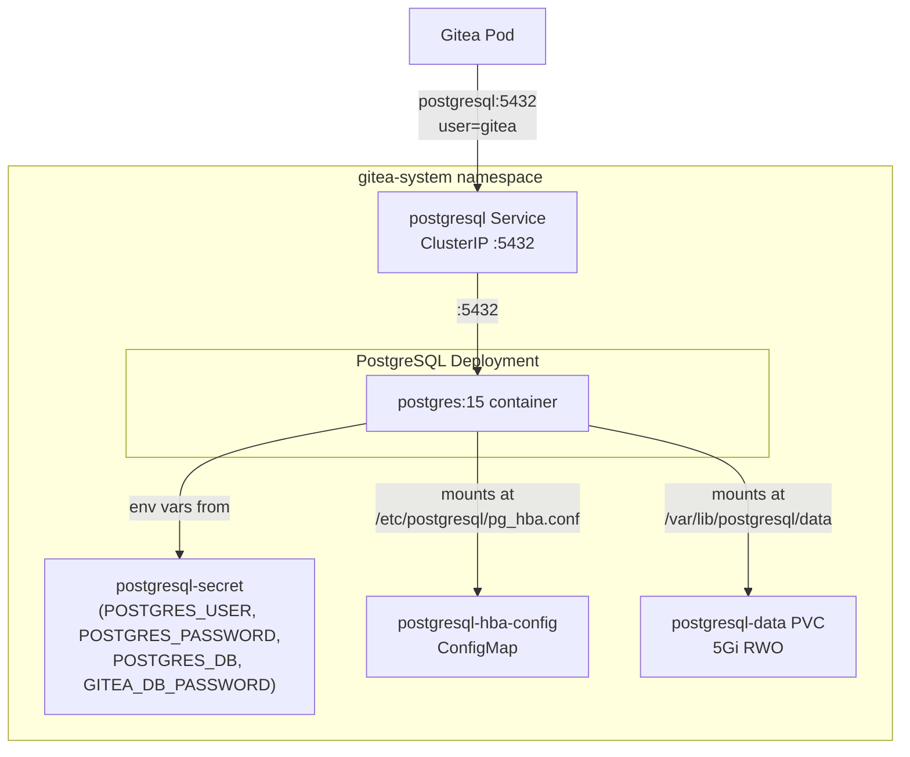
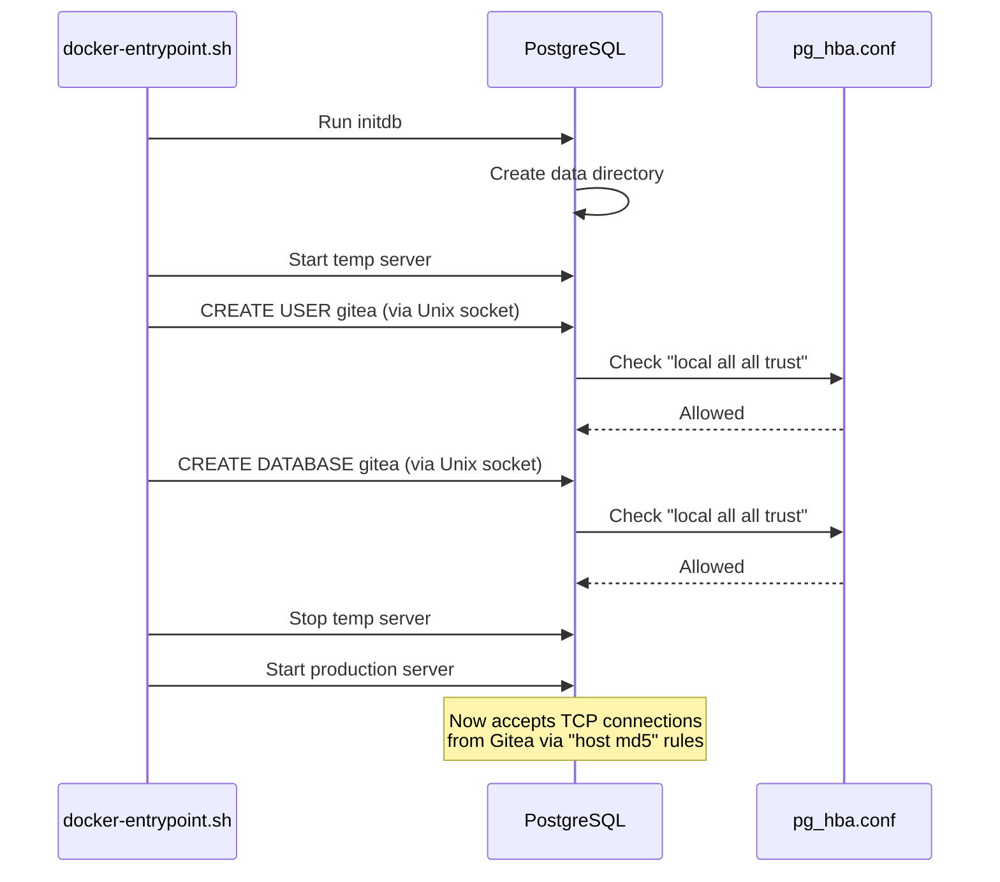
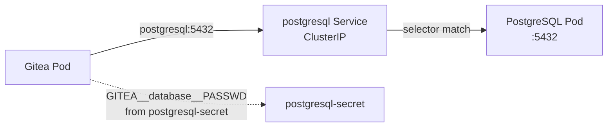

# PostgreSQL

Dedicated PostgreSQL 15 instance serving as the database backend for Gitea. Deployed in the `gitea-system` namespace alongside Gitea for direct service-to-service connectivity.

## Architecture



## Directory Contents

| File | Purpose |
|------|---------|
| `kustomization.yaml` | Lists all resources for Kustomize/ArgoCD rendering |
| `namespace.yaml` | Creates the `gitea-system` namespace (owns it via `CreateNamespace=true` in the ArgoCD Application) |
| `pvc.yaml` | 5Gi `ReadWriteOnce` PersistentVolumeClaim for database files |
| `external-secret.yaml` | `ExternalSecret` that pulls all PostgreSQL credentials from Infisical via ESO |
| `postgresql-hba-config.yaml` | Custom `pg_hba.conf` controlling client authentication |
| `deployment.yaml` | PostgreSQL Deployment with volume mounts and resource limits |
| `service.yaml` | ClusterIP Service exposing port 5432 |

> **No `secret.yaml`:** There is no static `Secret` manifest in this directory. All credentials originate in Infisical and are synchronized by the External Secrets Operator. See [docs/secret-management.md](../../docs/secret-management.md).

## Configuration Details

### Data Directory (PGDATA)

The PVC is mounted at `/var/lib/postgresql/data`. To avoid issues with `lost+found` directories created by some filesystem provisioners, `PGDATA` is set to a subdirectory:

```
PGDATA=/var/lib/postgresql/data/pgdata
```

The directory layout inside the container:

```
/var/lib/postgresql/data/         <-- PVC mount
└── pgdata/                       <-- PGDATA (actual database files)
    ├── base/
    ├── global/
    ├── pg_wal/
    └── ...
```

### Host-Based Authentication (pg_hba.conf)

A custom `pg_hba.conf` is provided via the `postgresql-hba-config` ConfigMap, mounted at `/etc/postgresql/pg_hba.conf` (outside the data directory). The postgres process is told to use it via the container argument:

```yaml
args: ["-c", "hba_file=/etc/postgresql/pg_hba.conf"]
```

The authentication rules:

```
# TYPE  DATABASE  USER  ADDRESS      METHOD
local   all       all                trust    # Unix socket (used during initdb)
host    all       all   127.0.0.1/32 md5      # Loopback TCP
host    all       all   0.0.0.0/0    md5      # All TCP connections (pod network)
```

The `local trust` rule is required because the `postgres:15` Docker image's entrypoint script uses Unix socket connections to create the database and user during first initialization. Without it, `initdb` fails with `no pg_hba.conf entry for host "[local]"`.



### Why pg_hba.conf is Mounted Outside the Data Directory

Mounting the ConfigMap inside `/var/lib/postgresql/data/` (the PVC) would cause a conflict: the PVC volume mount owns that directory, and a subPath ConfigMap mount inside it creates a race condition with `initdb` which also writes `pg_hba.conf` there. Mounting to `/etc/postgresql/` avoids this entirely.

### Secret Management

The `postgresql-secret` K8s Secret is created by the External Secrets Operator by pulling credentials from Infisical. There is no `secret.yaml` in git — values live in Infisical under `homelab / prod /`.

| K8s Secret Key | Infisical Key | Used By |
|----------------|--------------|---------|
| `POSTGRES_USER` | `POSTGRES_USER` | PostgreSQL init (creates this as the superuser) |
| `POSTGRES_PASSWORD` | `POSTGRES_PASSWORD` | PostgreSQL init (sets the superuser password) |
| `POSTGRES_DB` | `POSTGRES_DB` | PostgreSQL init (creates this database) |
| `GITEA_DB_PASSWORD` | `GITEA_DB_PASSWORD` | Gitea Deployment (injected as `GITEA__database__PASSWD` env var) |

`POSTGRES_PASSWORD` and `GITEA_DB_PASSWORD` must be set to identical values in Infisical. PostgreSQL creates the `gitea` user with `POSTGRES_PASSWORD` during `initdb`, and Gitea connects as that same user using `GITEA_DB_PASSWORD`. If they differ, Gitea will fail with `password authentication failed`.

To add or update secrets, open the Infisical UI at `https://holdens-mac-mini.story-larch.ts.net:8445`, navigate to `homelab / prod`, and update the values. ESO reconciles within `refreshInterval` (1 hour), or immediately:

```bash
kubectl annotate externalsecret postgresql-secret -n gitea-system \
  force-sync=$(date +%s) --overwrite
```

### Changing the Password

Because PostgreSQL stores the password hash in its data files during `initdb`, updating the secret in Infisical alone does not change the running database.

**Destructive reset (data loss):**

```bash
kubectl scale deployment postgresql -n gitea-system --replicas=0
kubectl delete pvc postgresql-data -n gitea-system
# Update Infisical to new values, force ESO reconcile, then restart
kubectl annotate externalsecret postgresql-secret -n gitea-system force-sync=$(date +%s) --overwrite
kubectl scale deployment postgresql -n gitea-system --replicas=1
```

**Non-destructive (no data loss):**

```bash
# 1. Change the password at the DB level
kubectl exec -n gitea-system deploy/postgresql -- \
  psql -U gitea -c "ALTER USER gitea PASSWORD 'new-password';"

# 2. Update POSTGRES_PASSWORD and GITEA_DB_PASSWORD in Infisical UI

# 3. Force ESO reconcile
kubectl annotate externalsecret postgresql-secret -n gitea-system force-sync=$(date +%s) --overwrite

# 4. Restart Gitea to pick up new GITEA_DB_PASSWORD
kubectl rollout restart deployment gitea -n gitea-system
```

### Resource Limits

| Resource | Request | Limit |
|----------|---------|-------|
| CPU | 100m | 500m |
| Memory | 256Mi | 512Mi |

## Non-Root Execution

The PostgreSQL container runs as the non-root `postgres` user (UID 999), enforced by the pod's `securityContext`.

```yaml
securityContext:
  runAsUser: 999
  runAsGroup: 999
  fsGroup: 999
```

This reduces the risk of privilege escalation from a container escape.

## Integration with Gitea

Gitea connects to PostgreSQL using the Kubernetes Service DNS name:

```
Host: postgresql.gitea-system.svc.cluster.local:5432
```

In Gitea's `app.ini`, this is shortened to `postgresql:5432` since both pods are in the same namespace. The connection flow:



## Operational Commands

```bash
# Check pod status
kubectl get pods -n gitea-system -l app.kubernetes.io/name=postgresql

# View logs
kubectl logs -n gitea-system deploy/postgresql

# Connect to psql
kubectl exec -n gitea-system deploy/postgresql -- psql -U gitea -d gitea

# List tables
kubectl exec -n gitea-system deploy/postgresql -- psql -U gitea -d gitea -c '\dt'

# Check database size
kubectl exec -n gitea-system deploy/postgresql -- psql -U gitea -d gitea \
  -c "SELECT pg_size_pretty(pg_database_size('gitea'));"
```
