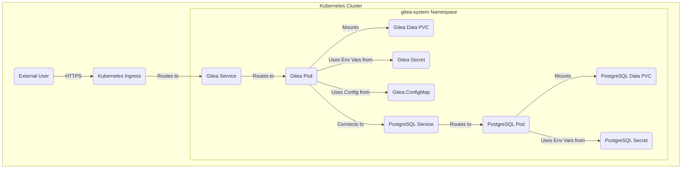

# PostgreSQL Deployment for Gitea on Kubernetes

This directory contains the Kubernetes manifests for deploying a dedicated PostgreSQL database instance within your Kubernetes cluster, specifically configured to serve as the backend for the Gitea application. This setup follows GitOps principles, allowing for declarative management of the database infrastructure.

## Overview

This PostgreSQL deployment provides a persistent and isolated database for Gitea. It includes a Persistent Volume Claim (PVC) for data storage, ensuring data persistence across pod restarts or redeployments. Sensitive information like database passwords are managed securely using Kubernetes Secrets.

### Key Concepts

*   **PersistentVolumeClaim (PVC):** A request for storage by a user. Kubernetes automatically provisions a PersistentVolume (PV) to satisfy this claim, providing durable storage for the database data. This means your Gitea data (repositories, users, etc.) will not be lost if the PostgreSQL pod is rescheduled or deleted.
*   **Secret:** Kubernetes object used to store sensitive information, such as passwords, API keys, and other credentials. Secrets are stored base64 encoded by default. For this setup, we store the PostgreSQL superuser password and the Gitea database user password securely.
*   **Deployment:** A Kubernetes resource that provides declarative updates for Pods and ReplicaSets. Here, it manages the PostgreSQL container, ensuring a specified number of replicas (typically one for a single-instance database) are running and handling updates.
*   **Service:** An abstract way to expose an application running on a set of Pods as a network service. For PostgreSQL, a ClusterIP Service provides a stable internal IP address and DNS name (`postgresql.gitea-system.svc.cluster.local`) for Gitea to connect to, abstracting away the actual Pod IPs.

## Components

-   `namespace.yaml`: References the `gitea-system` namespace, ensuring PostgreSQL resources are co-located with Gitea for easier management and network access.
-   `pvc.yaml`: Defines the `postgresql-data` Persistent Volume Claim, requesting storage for the database.
-   `secret.yaml`: Stores the `POSTGRES_PASSWORD` (for the `postgres` superuser), `POSTGRES_USER`, `POSTGRES_DB`, and `GITEA_DB_PASSWORD` (for the Gitea application's database user). **Ensure passwords are strong and randomly generated.**
-   `deployment.yaml`: Configures the PostgreSQL server Deployment. It uses the `postgres:15` Docker image, mounts the PVC, and injects environment variables from the `secret.yaml` for database configuration.
-   `service.yaml`: Creates a ClusterIP Service named `postgresql`, exposing port 5432 for internal cluster communication.
-   `kustomization.yaml`: Orchestrates the deployment of all these PostgreSQL resources using Kustomize.

## Integration with Gitea

Gitea is configured to connect to this PostgreSQL instance using its Service DNS name (`postgresql.gitea-system.svc.cluster.local`) and the credentials stored in the `postgresql-secret`. The `GITEA_DB_PASSWORD` is specifically used by the Gitea application to access its database.

## Deployment using GitOps

Once your Argo CD (or chosen GitOps tool) is configured to monitor this repository, changes pushed to this `k8s/apps/postgresql` directory will automatically trigger the deployment or update of the PostgreSQL instance in your Kubernetes cluster.

## Example Diagram: Gitea and PostgreSQL Interaction

