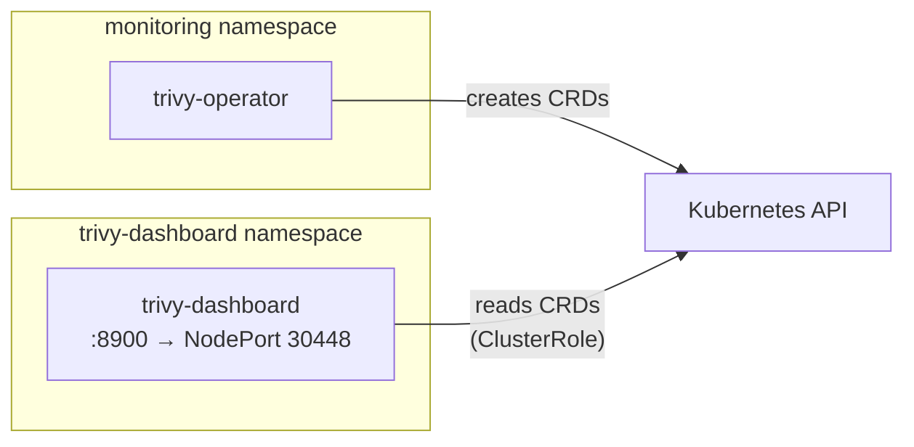

# Trivy Dashboard

Web UI for browsing [Trivy Operator](https://github.com/aquasecurity/trivy-operator) security reports. Based on [raoulx24/trivy-operator-dashboard](https://github.com/raoulx24/trivy-operator-dashboard).

## Access

| Interface | URL |
|---|---|
| Tailscale | `https://hardy-mac-mini.folk-adelie.ts.net:8448` |
| Local | `http://localhost:30448` |

One-time Tailscale Serve setup:

```bash
tailscale serve --bg --https 8448 http://localhost:30448
```

## Architecture

The dashboard reads Trivy CRDs (VulnerabilityReports, ConfigAuditReports, etc.) from the Kubernetes API via a read-only ClusterRole. It has no database or persistent state.



## Directory Contents

| File | Purpose |
|------|---------|
| `kustomization.yaml` | Lists all resources for Kustomize/ArgoCD rendering |
| `deployment.yaml` | Trivy Dashboard Deployment (image `ghcr.io/raoulx24/trivy-operator-dashboard:1.8.0`) |
| `service.yaml` | NodePort Service on port 30448 |
| `serviceaccount.yaml` | ServiceAccount for API access |
| `clusterrole.yaml` | Read-only access to all Trivy CRDs and namespaces |
| `clusterrolebinding.yaml` | Binds ClusterRole to the ServiceAccount |
| `networkpolicy.yaml` | Default-deny with allowances for Tailscale ingress, DNS, and API server |

## Networking

| Layer | Value |
|---|---|
| Container port | 8900 |
| NodePort | 30448 |
| Tailscale HTTPS | 8448 |
| URL | `https://hardy-mac-mini.folk-adelie.ts.net:8448` |

## Configuration

OpenTelemetry is disabled by default via environment variables in the deployment to avoid unnecessary crash loops when no OTel collector is present.

## Updating

To upgrade the dashboard image, update the tag in `deployment.yaml`:

```yaml
image: ghcr.io/raoulx24/trivy-operator-dashboard:<new-version>
```

Check releases at https://github.com/raoulx24/trivy-operator-dashboard/releases.
