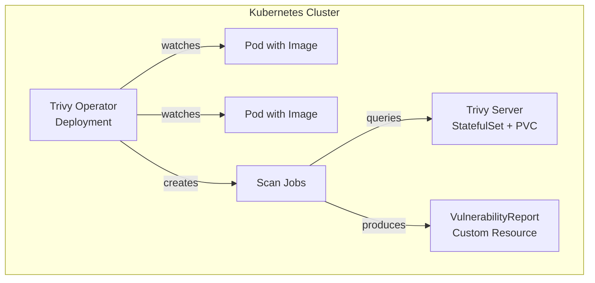

# Trivy Operator

Trivy Operator is a Kubernetes operator that continuously scans container images for vulnerabilities and generates `VulnerabilityReport` resources for each running pod.

## Overview

- **Helm Chart**: `aquasecurity/trivy-operator`
- **Namespace**: `monitoring`
- **Reports**: View vulnerabilities with `kubectl get vulnerabilityreports -n <pod-namespace>`
- **Integration**: Works natively with Prometheus and Grafana (dashboards can be added)

## Architecture

The operator runs in **ClientServer mode**: a dedicated `trivy-server` StatefulSet maintains the vulnerability database on a persistent volume, and scan jobs query it over HTTP instead of each managing their own cache. This eliminates cache lock contention when scanning pods with multiple containers.



## Configuration

The operator is deployed with tuned settings to balance scanning coverage with resource stability on a single-node homelab:

- Runs in **ClientServer mode** with a built-in trivy-server (eliminates cache lock contention)
- Scans images of running pods on creation and at regular intervals
- Does not block pod scheduling (report-only)
- Stores reports as Kubernetes custom resources
- Excludes the `openclaw` namespace (locally-built image not available from any registry)
- Limits concurrent scan jobs to 3

### Helm Values

Overrides are set in the Application CR's `spec.source.helm.valuesObject`:

| Key | Value | Purpose |
|-----|-------|---------|
| `trivy.mode` | `ClientServer` | Centralized DB via trivy-server, no per-job cache |
| `operator.builtInTrivyServer` | `true` | Deploy trivy-server StatefulSet in-cluster |
| `trivy.serverURL` | `http://trivy-service.monitoring:4975` | Scan jobs query this endpoint |
| `resources.limits.memory` | `512Mi` | Operator deployment — prevents OOM |
| `operator.scanJobsConcurrentLimit` | `3` | Limit parallel scan jobs |
| `trivy.resources.limits.memory` | `512Mi` | Scan job container memory |
| `trivy.server.resources.limits.memory` | `512Mi` | Trivy server memory |
| `excludeNamespaces` | `openclaw` | Skip namespaces with local-only images |

Additional options:
- `trivy.severity`: filter by severity (e.g., `HIGH`, `CRITICAL`)
- `trivy.ignoreUnfixed`: whether to ignore vulnerabilities without a fix

Refer to the [Trivy Operator documentation](https://github.com/aquasecurity/trivy-operator) for advanced configuration.

## Secrets

No secrets are required; the operator uses read-only access to the Kubernetes API and the container runtime (via hostPID and container runtime socket).

## Networking

- The trivy-server needs egress to download the vulnerability database (`mirror.gcr.io/aquasec/trivy-db`).
- Scan jobs need egress to container registries to pull image layers for scanning.
- Ensure that egress to `ghcr.io`, `docker.io`, `mirror.gcr.io`, and other registries is allowed on HTTPS (443).

## Operational Commands

```bash
# List all vulnerability reports
kubectl get vulnerabilityreports --all-namespaces

# View report for a specific pod
kubectl get vulnerabilityreport <pod-name> -n <namespace> -o yaml

# Delete old reports (they are automatically garbage-collected)
kubectl delete vulnerabilityreport --all -n <namespace>
```

## Troubleshooting

| Symptom | Cause | Fix |
|---------|-------|-----|
| No VulnerabilityReport CRs appear | Operator not running or RBAC issues | Check pod logs: `kubectl logs -n monitoring -l app.kubernetes.io/name=trivy-operator` |
| Reports show `FAILED` | Image scan failed (private registry, large image, timeout) | Verify image pull secret exists; consider increasing resources/timeouts |
| Operator OOMKilled (exit 137) | Too many workloads to reconcile | Increase `resources.limits.memory` in Helm values |
| "cache may be in use by another process" | Multiple scan containers contending on shared cache | Use ClientServer mode (`trivy.mode: ClientServer`) |
| Scan job OOMKilled | Large container image exceeds scan job memory | Increase `trivy.resources.limits.memory` |
| "unable to find the specified image" | Local-only image not in any registry | Add namespace to `excludeNamespaces` |
