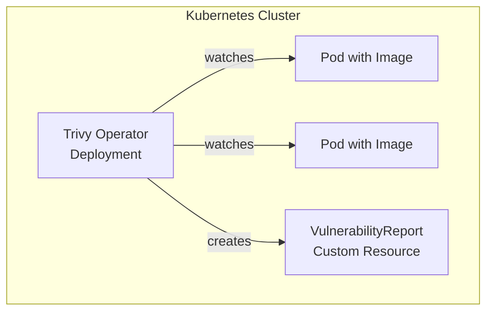

# Trivy Operator

Trivy Operator is a Kubernetes operator that continuously scans container images for vulnerabilities and generates `VulnerabilityReport` resources for each running pod.

## Overview

- **Helm Chart**: `aquasecurity/trivy-operator`
- **Namespace**: `monitoring`
- **Reports**: View vulnerabilities with `kubectl get vulnerabilityreports -n <pod-namespace>`
- **Integration**: Works natively with Prometheus and Grafana (dashboards can be added)

## Architecture

Trivy Operator watches Kubernetes pods, extracts their container images, and scans them using the Trivy vulnerability database. It creates a `VulnerabilityReport` custom resource for each pod, summarizing found CVEs along with fix availability.



## Configuration

The operator is deployed with tuned settings to balance scanning coverage with resource stability on a single-node homelab:

- Scans images of running pods on creation and at regular intervals
- Does not block pod scheduling (report-only)
- Stores reports as Kubernetes custom resources
- Excludes the `openclaw` namespace (locally-built image not available from any registry)
- Limits concurrent scan jobs to 3 to avoid Trivy cache lock contention

### Helm Values

Overrides are set in the Application CR's `spec.source.helm.valuesObject`:

| Key | Value | Purpose |
|-----|-------|---------|
| `resources.limits.memory` | `512Mi` | Operator deployment — prevents OOM on large clusters |
| `resources.requests.memory` | `256Mi` | Operator deployment baseline |
| `operator.scanJobsConcurrentLimit` | `3` | Prevents cache lock contention between parallel scan jobs |
| `trivy.resources.limits.memory` | `1Gi` | Scan job containers — large images need more memory |
| `excludeNamespaces` | `openclaw` | Skip namespaces with local-only images |

Additional options:
- `trivy.severity`: filter by severity (e.g., `HIGH`, `CRITICAL`)
- `trivy.ignoreUnfixed`: whether to ignore vulnerabilities without a fix

Refer to the [Trivy Operator documentation](https://github.com/aquasecurity/trivy-operator) for advanced configuration.

## Secrets

No secrets are required; the operator uses read-only access to the Kubernetes API and the container runtime (via hostPID and container runtime socket).

## Networking

- The operator needs egress to container registries to download image layers for scanning.
- It may also need egress to the internet for vulnerability database updates (via `aquasecurity/trivy-db`).
- Ensure that egress to `ghcr.io`, `docker.io`, and other registries is allowed on HTTPS (443). This should be covered by the default internet egress from the `monitoring` namespace (if network policies are in place).

## Operational Commands

```bash
# List all vulnerability reports
kubectl get vulnerabilityreports --all-namespaces

# View report for a specific pod
kubectl get vulnerabilityreport <pod-name> -n <namespace> -o yaml

# Delete old reports (they are automatically garbage-collected)
kubectl delete vulnerabilityreport --all -n <namespace>
```

## Troubleshooting

| Symptom | Cause | Fix |
|---------|-------|-----|
| No VulnerabilityReport CRs appear | Operator not running or RBAC issues | Check pod logs: `kubectl logs -n monitoring -l app.kubernetes.io/name=trivy-operator` |
| Reports show `FAILED` | Image scan failed (private registry, large image, timeout) | Verify image pull secret exists; consider increasing resources/timeouts |
| Operator OOMKilled (exit 137) | Too many workloads to reconcile | Increase `resources.limits.memory` in Helm values |
| "cache may be in use by another process" | Concurrent scan jobs contending on Trivy cache | Reduce `operator.scanJobsConcurrentLimit` (default 10) |
| Scan job OOMKilled | Large container image exceeds scan job memory | Increase `trivy.resources.limits.memory` |
| "unable to find the specified image" | Local-only image not in any registry | Add namespace to `excludeNamespaces` |
