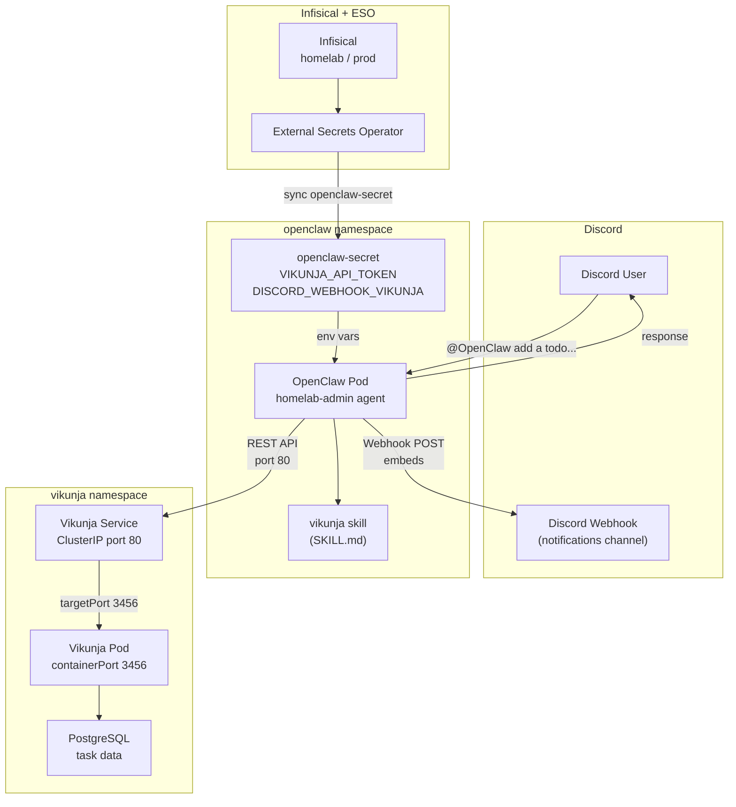
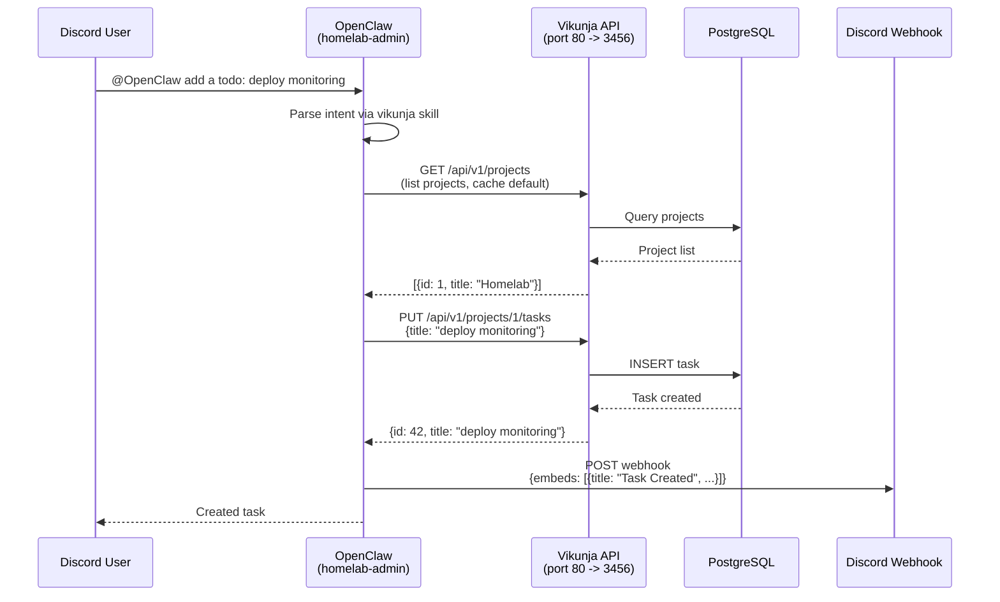
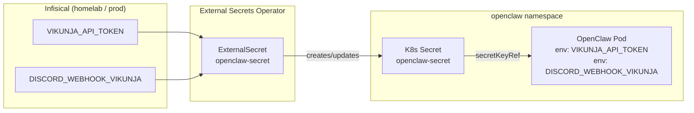
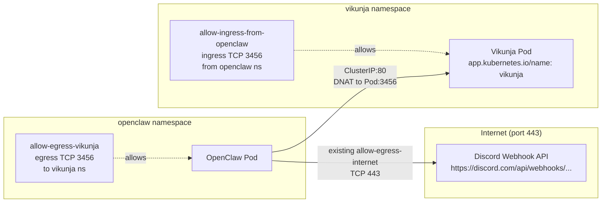

# Vikunja Todo List Application

Vikunja is a self-hosted, feature-rich todo list and task management application.

## Architecture

This deployment consists of:
- PostgreSQL database (Deployment with PVC) for data persistence
- Vikunja application server (Deployment)
- Kubernetes Services for internal and external access
- Prometheus ServiceMonitor for metrics collection
- OIDC authentication via Authentik (SSO)

## Resources

| Resource | Request | Limit |
|----------|---------|-------|
| PostgreSQL | CPU: 100m, Mem: 256Mi | CPU: 500m, Mem: 512Mi |
| Vikunja | CPU: 100m, Mem: 512Mi | CPU: 500m, Mem: 1Gi |
| Storage (PostgreSQL) | 5Gi | - |
| Storage (Vikunja files) | 1Gi | - |

## Access

- **Internal service DNS:** `vikunja.vikunja.svc.cluster.local`
- **NodePort:** `http://localhost:30888`
- **Tailscale Serve:** `https://holdens-mac-mini.story-larch.ts.net:8449`

One-time Tailscale Serve setup (run on the Mac mini):

```bash
tailscale serve --bg --https 8449 http://localhost:30888
```

Vikunja is an OIDC-protected application in the Authentik portal under the **Productivity** group. Login is handled via Authentik SSO.

## Setup Steps

### 1. Create Infisical Secrets

Before the first sync, add the following secrets to Infisical under `homelab / prod / ` (root path):

| Key | Description | Example |
|-----|-------------|---------|
| `VIKUNJA_POSTGRES_USER` | PostgreSQL superuser username | `vikunja` |
| `VIKUNJA_POSTGRES_PASSWORD` | Password for the PostgreSQL user | (random strong password) |
| `VIKUNJA_POSTGRES_DB` | PostgreSQL database name | `vikunja` |
| `VIKUNJA_OIDC_CLIENT_SECRET` | Authentik OAuth2 client secret for Vikunja | (random 64-char alphanumeric string) |

The External Secrets Operator will sync these into a `vikunja-db-secret` in the `vikunja` namespace. Both the PostgreSQL and Vikunja deployments share the same password key — no duplication needed.

### 2. Create Authentik OIDC Provider (via API)

Vikunja uses Authentik for SSO via OpenID Connect. The provider is created via the Authentik API — same one-time bootstrap pattern as ArgoCD and Grafana.

Run the following on the Mac mini (requires `kubectl` access):

```bash
BOOTSTRAP_TOKEN=$(kubectl get secret authentik-secret -n authentik \
  -o jsonpath='{.data.AUTHENTIK_BOOTSTRAP_TOKEN}' | base64 -d)

OIDC_SECRET=$(kubectl get secret vikunja-db-secret -n vikunja \
  -o jsonpath='{.data.OIDC_CLIENT_SECRET}' | base64 -d)

AUTH_FLOW=$(curl -sk -H "Authorization: Bearer $BOOTSTRAP_TOKEN" \
  "https://holdens-mac-mini.story-larch.ts.net/api/v3/flows/instances/?slug=default-provider-authorization-implicit-consent" \
  | python3 -c "import json,sys; print(json.load(sys.stdin)['results'][0]['pk'])")

INVAL_FLOW=$(curl -sk -H "Authorization: Bearer $BOOTSTRAP_TOKEN" \
  "https://holdens-mac-mini.story-larch.ts.net/api/v3/flows/instances/?slug=default-provider-invalidation-flow" \
  | python3 -c "import json,sys; print(json.load(sys.stdin)['results'][0]['pk'])")

SIGNING_KEY=$(curl -sk -H "Authorization: Bearer $BOOTSTRAP_TOKEN" \
  "https://holdens-mac-mini.story-larch.ts.net/api/v3/crypto/certificatekeypairs/?name=authentik+Self-signed+Certificate" \
  | python3 -c "import json,sys; print(json.load(sys.stdin)['results'][0]['pk'])")

SCOPE_OPENID=$(curl -sk -H "Authorization: Bearer $BOOTSTRAP_TOKEN" \
  "https://holdens-mac-mini.story-larch.ts.net/api/v3/propertymappings/provider/scope/?scope_name=openid" \
  | python3 -c "import json,sys; print(json.load(sys.stdin)['results'][0]['pk'])")
SCOPE_EMAIL=$(curl -sk -H "Authorization: Bearer $BOOTSTRAP_TOKEN" \
  "https://holdens-mac-mini.story-larch.ts.net/api/v3/propertymappings/provider/scope/?scope_name=email" \
  | python3 -c "import json,sys; print(json.load(sys.stdin)['results'][0]['pk'])")
SCOPE_PROFILE=$(curl -sk -H "Authorization: Bearer $BOOTSTRAP_TOKEN" \
  "https://holdens-mac-mini.story-larch.ts.net/api/v3/propertymappings/provider/scope/?scope_name=profile" \
  | python3 -c "import json,sys; print(json.load(sys.stdin)['results'][0]['pk'])")

# Create the OAuth2 provider
PROVIDER_PK=$(curl -sk -X POST \
  -H "Authorization: Bearer $BOOTSTRAP_TOKEN" \
  -H "Content-Type: application/json" \
  "https://holdens-mac-mini.story-larch.ts.net/api/v3/providers/oauth2/" \
  -d "{
    \"name\": \"vikunja\",
    \"authorization_flow\": \"$AUTH_FLOW\",
    \"invalidation_flow\": \"$INVAL_FLOW\",
    \"client_type\": \"confidential\",
    \"client_id\": \"vikunja\",
    \"client_secret\": \"$OIDC_SECRET\",
    \"redirect_uris\": [{\"matching_mode\": \"strict\", \"url\": \"https://holdens-mac-mini.story-larch.ts.net:8449/auth/openid/authentik\"}],
    \"signing_key\": \"$SIGNING_KEY\",
    \"property_mappings\": [\"$SCOPE_OPENID\", \"$SCOPE_EMAIL\", \"$SCOPE_PROFILE\"]
  }" | python3 -c "import json,sys; print(json.load(sys.stdin)['pk'])")

# Link the provider to the application (created by blueprint)
curl -sk -X PATCH \
  -H "Authorization: Bearer $BOOTSTRAP_TOKEN" \
  -H "Content-Type: application/json" \
  "https://holdens-mac-mini.story-larch.ts.net/api/v3/core/applications/vikunja/" \
  -d "{\"provider\": $PROVIDER_PK}"

# Restart Vikunja to discover the provider
kubectl rollout restart deployment vikunja -n vikunja
```

**How the client secret flows:**

1. `VIKUNJA_OIDC_CLIENT_SECRET` is stored once in Infisical
2. Vikunja ExternalSecret pulls it into `vikunja-db-secret` → mounted as a file at `/secrets/oidc-client-secret`
3. Vikunja config (`vikunja-config.yaml`) references the file for `clientsecret`
4. The same secret value is passed to the Authentik API when creating the provider (read from the K8s secret at creation time)

**OIDC details:**

| Setting | Value |
|---|---|
| Client ID | `vikunja` |
| Redirect URI | `https://holdens-mac-mini.story-larch.ts.net:8449/auth/openid/authentik` |
| OIDC Discovery | `https://holdens-mac-mini.story-larch.ts.net/application/o/vikunja/.well-known/openid-configuration` |
| Scopes | `openid profile email` |
| Signing algorithm | RS256 |

For the general pattern, see [Adding a new OIDC-protected service](../authentik/README.md#adding-a-new-oidc-protected-service).

### 3. ArgoCD Sync

Once the files are merged to `main`, ArgoCD will automatically sync the `vikunja` application within ~3 minutes.

You can also manually trigger sync:
```bash
kubectl patch application vikunja -n argocd \
  --type merge -p '{"metadata":{"annotations":{"argocd.argoproj.io/refresh":"hard"}}}'
```

## Post-Deployment Verification

```bash
# Check pods
kubectl get pods -n vikunja

# Check services
kubectl get svc -n vikunja

# Test connectivity
kubectl exec -n vikunja deploy/vikunja -- curl -s http://postgresql.vikunja.svc.cluster.local:5432

# View vikunja logs
kubectl logs -n vikunja deploy/vikunja

# Access via Tailscale: open browser to http://<node-tailscale-ip>:30888
```

## Maintenance

### Changing the Vikunja version

Edit `k8s/apps/vikunja/vikunja-deployment.yaml` and update the `image` tag (e.g., `vikunja/vikunja:1.1.0`). Then commit and push; ArgoCD will roll out the update.

### Backing up the database

```bash
kubectl exec -n vikunja deploy/postgresql -- \
  pg_dump -U vikunja vikunja > backup_$(date +%F).sql
```

### Restoring a backup

```bash
kubectl exec -i -n vikunja deploy/postgresql -- \
  psql -U vikunja -d vikunja < backup_2024-01-01.sql
```

### Updating Infisical secrets

After updating secrets in Infisical, force a sync:
```bash
kubectl annotate externalsecret vikunja-db-secret -n vikunja \
  force-sync=$(date +%s) --overwrite
```

Then restart affected deployments:
```bash
kubectl rollout restart deployment postgresql -n vikunja
kubectl rollout restart deployment vikunja -n vikunja
```

Note: Changing the PostgreSQL `POSTGRES_PASSWORD` requires a database password update inside PostgreSQL as well (see PostgreSQL docs). For simplicity, treat these credentials as immutable; if you must change them, back up and recreate the database.

## Troubleshooting

- **Pods not starting:** Check `kubectl logs -n vikunja <pod>`; common issues are missing Infisical secret or invalid values.
- **Cannot connect to database:** Verify the `vikunja-db-secret` exists and has correct keys. Ensure PostgreSQL pod is Ready.
- **No metrics in Prometheus:** Confirm the ServiceMonitor has been synced and the `vikunja` Service has the correct labels.
- **External access not working:** Ensure Tailscale routing to the node and that the NodePort is within the allowed range (30000-32767). Check service `type: NodePort` and `nodePort: 30888`.
- **OIDC "Login with Authentik" not showing:** Check that `vikunja-config` ConfigMap is mounted at `/etc/vikunja/config.yml` and the `auth.openid.enabled` is `true`. Verify the pod has restarted after ConfigMap changes.
- **OIDC "invalid client" error:** Verify `VIKUNJA_OIDC_CLIENT_SECRET` in Infisical matches what the Authentik provider has. Force re-sync ExternalSecret (`vikunja-db-secret`) and restart both pods.
- **OIDC discovery returns 404:** The Authentik provider does not exist or is not linked to the application. Re-run the API bootstrap script from Step 2.

## OpenClaw & Discord Integration

Vikunja integrates with OpenClaw and Discord for AI-powered task management and notifications. The integration has three components:

1. **OpenClaw → Vikunja** — the `homelab-admin` agent can create, query, update, and complete tasks via the Vikunja REST API
2. **Discord → Vikunja** — users send natural language commands in Discord (e.g., "add a todo: deploy monitoring"), and OpenClaw translates them into Vikunja API calls
3. **Vikunja → Discord** — task change notifications are sent to a Discord channel via webhook

### Prerequisites

| Infisical Secret | Description |
|---|---|
| `VIKUNJA_API_TOKEN` | Vikunja API token (created in the Vikunja UI) |
| `DISCORD_WEBHOOK_VIKUNJA` | Discord webhook URL for task notifications |

### Creating a Vikunja API Token

1. Log in to Vikunja at `https://holdens-mac-mini.story-larch.ts.net:8449`
2. Go to **Settings → API Tokens**
3. Click **Create Token**
4. Give it a descriptive name (e.g., `openclaw-integration`)
5. Set permissions: select all task and project scopes
6. Copy the token and store it in Infisical as `VIKUNJA_API_TOKEN`

### Creating a Discord Webhook

1. Open Discord and navigate to the channel where you want task notifications
2. Click the gear icon (Edit Channel) → **Integrations** → **Webhooks**
3. Click **New Webhook**, name it (e.g., `Vikunja Tasks`), and copy the webhook URL
4. Store the URL in Infisical as `DISCORD_WEBHOOK_VIKUNJA`

### Activating the Integration

After adding both secrets to Infisical:

```bash
kubectl annotate externalsecret openclaw-secret -n openclaw \
  force-sync=$(date +%s) --overwrite
kubectl rollout restart deployment/openclaw -n openclaw
```

### Usage via Discord

Once active, message the OpenClaw bot in Discord:

- `@OpenClaw add a todo: review pull request #99`
- `@OpenClaw what tasks are due today?`
- `@OpenClaw complete task 42`
- `@OpenClaw show my overdue tasks`

The `vikunja` skill (assigned to `homelab-admin`) handles the API calls and responds with formatted results.

### Integration Architecture



### Data Flow: Discord Command to Task Creation



### Secret Flow



Both `VIKUNJA_API_TOKEN` and `DISCORD_WEBHOOK_VIKUNJA` are stored in Infisical, synced by ESO into the existing `openclaw-secret`, and injected as environment variables into the OpenClaw pod. No new ExternalSecret or K8s Secret is needed — the integration piggybacks on the existing OpenClaw secret pipeline.

### Network Policies



Two new NetworkPolicies enable the cross-namespace communication:

| Policy | Namespace | Direction | Selector | Port | Matches |
|---|---|---|---|---|---|
| `allow-egress-vikunja` | `openclaw` | Egress | All pods → `vikunja` namespace | TCP 3456 | Post-DNAT destination (container port) |
| `allow-ingress-from-openclaw` | `vikunja` | Ingress | `app.kubernetes.io/name: vikunja` ← `openclaw` namespace | TCP 3456 | Container port |

Discord webhook POST requests use the existing `allow-egress-internet` policy (TCP 443) in the `openclaw` namespace — no additional policy is needed for outbound Discord traffic.

## References

- [Vikunja Documentation](https://vikunja.io)
- [Vikunja OpenID Connect](https://vikunja.io/docs/openid)
- [Vikunja GitHub](https://github.com/go-vikunja/vikunja)
- [Authentik API Reference](https://docs.goauthentik.io/developer-docs/api/)
- [Authentik OIDC Provider](https://docs.goauthentik.io/docs/add-secure-apps/providers/oauth2/)
