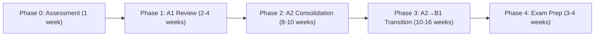

# Deutsch Tutor

An AI-enhanced German learning system delivered through Discord, built on spaced repetition principles from the [repeater](https://github.com/shaankhosla/repeater) project. Flashcard decks live in plain Markdown (Q/A + cloze format), and the AI agent manages review scheduling, grammar explanations, and conversation practice.

## Learner Profile

| Attribute | Value |
|---|---|
| Native language | Vietnamese |
| Previous level | Completed A1 + A2 (1 year), then 2-year gap |
| Target level | B1 (Goethe-Zertifikat) |
| Timeline | 6–9 months |
| Known weak areas | Articles (der/die/das), verb conjugation, Nebensatz word order |

## Learning Roadmap



### Phase 0 — Assessment (Week 1)

Run a diagnostic session to identify gaps:
- Present 20 mixed cards from A1 + A2 decks
- Track accuracy per category (grammar, vocabulary, sentence structure)
- Identify the top 3 weak areas to prioritize

### Phase 1 — A1 Review (Weeks 2–5)

Focus: Präsens, Artikel, Nomen, W-Fragen, Zahlen, Pronomen

Daily target: 15 review cards + 10 new cards
Weekly target: 5–7 hours

### Phase 2 — A2 Consolidation (Weeks 6–15)

Focus: Perfekt, trennbare Verben, Modalverben, Präpositionen, Negation, Komparativ/Superlativ

Daily target: 20 review cards + 10 new cards
Weekly target: 7–10 hours

### Phase 3 — A2→B1 Transition (Weeks 16–31)

Focus: Präteritum, Nebensätze (dass/weil/wenn/ob), Relativsätze, Konjunktiv II, vocabulary expansion (2000–2500 words)

Daily target: 25 review cards + 10 new cards
Weekly target: 8–12 hours

### Phase 4 — Exam Prep (Weeks 32–35)

Focus: Mock exams (Lesen, Hören, Schreiben, Sprechen), timed practice, weak-area drilling

## Spaced Repetition System

This skill uses FSRS (Free Spaced Repetition Scheduler) principles, the same algorithm used by repeater and modern Anki.

### Card States

| State | Description |
|---|---|
| New | Never reviewed — presented in learning order |
| Learning | Recently introduced — short intervals (1min, 10min, 1day) |
| Review | Graduated — intervals grow (1d → 3d → 7d → 14d → 30d → ...) |
| Relearning | Failed a review — back to short intervals |

### Rating Scale

When the user answers a card, rate their response:

| Rating | Meaning | Effect |
|---|---|---|
| Again (1) | Wrong or blank | Reset to relearning, interval = 1 min |
| Hard (2) | Correct but struggled | Interval × 1.2 |
| Good (3) | Correct with normal effort | Interval × 2.5 (default) |
| Easy (4) | Instant recall | Interval × 3.5 |

Target retention: 90%

### Session Format

A drill session via Discord follows this flow:

1. **Greet** — `Guten Morgen! 🇩🇪 Bereit für heute?` (with Vietnamese if needed)
2. **Due cards first** — Present cards that are due for review (oldest first)
3. **New cards** — After reviews, introduce new cards (max 10 per session)
4. **Present each card**:
   - Show the question (Q:) or cloze (C: with blanks)
   - Wait for user's answer
   - Reveal the correct answer
   - Rate: Again / Hard / Good / Easy
   - If wrong, explain in Vietnamese why, give a mnemonic or pattern
5. **Session summary** — Cards reviewed, accuracy %, streak, weak areas to revisit

### Card Format (repeater-compatible Markdown)

Cards live in `skills/deutsch-tutor/decks/` as plain `.md` files:

```markdown
Notes and explanations are ignored by the card parser.

Q: Was bedeutet "der Tisch"?
A: Cái bàn (the table) — masculine noun

---

Q: Konjugiere "sein" im Präsens: ich ___
A: ich bin

---

C: Ich [habe] gestern ein Buch [gekauft]. (Perfekt)

---

C: Ich glaube, [dass] der Film interessant [ist]. (Nebensatz)
```

## Deck Structure

| Deck file | Level | Topics |
|---|---|---|
| `decks/a1-grammatik.md` | A1 | Präsens, Artikel, W-Fragen, Zahlen, Pronomen, trennbare Verben |
| `decks/a1-wortschatz.md` | A1 | ~500 essential words with Vietnamese translations |
| `decks/a2-grammatik.md` | A2 | Perfekt, Modalverben, Präpositionen, Negation, Komparativ |
| `decks/a2-wortschatz.md` | A2 | ~500 words building on A1 |
| `decks/b1-grammatik.md` | B1 | Präteritum, Nebensätze, Relativsätze, Konjunktiv II, Passiv |
| `decks/b1-wortschatz.md` | B1 | ~1000 words for B1 topics |

## Discord Interaction Patterns

### Daily Drill Session

When the user messages in #deutsch, start a session:

```
🇩🇪 Guten Morgen, Holden!

📊 Hôm nay bạn có:
- 12 thẻ cần ôn lại (review)
- 10 thẻ mới

Bắt đầu nhé? Gõ **start** hoặc **bắt đầu**
```

### Card Presentation

```
📝 **Thẻ 1/22** (A2 — Perfekt)

Q: Bilde einen Satz im Perfekt mit "fahren"

💡 Gợi ý: fahren dùng "sein" thay vì "haben"
```

User answers: `Ich bin nach Berlin gefahren`

```
✅ Richtig! Tuyệt vời!

**Ich bin nach Berlin gefahren.**
→ "fahren" dùng sein vì nó là động từ chỉ sự di chuyển

Đánh giá: 1️⃣ Again | 2️⃣ Hard | 3️⃣ Good | 4️⃣ Easy
```

### Grammar Explanation (on wrong answer)

```
❌ Chưa đúng rồi.

Bạn viết: "Ich habe nach Berlin gefahren"
Đáp án: "Ich bin nach Berlin gefahren"

💡 **Quy tắc:** Động từ chỉ sự di chuyển (fahren, gehen, kommen, fliegen...) dùng **sein** thay vì **haben** trong Perfekt.

Cách nhớ: Nếu bạn "đi từ A đến B" → dùng **sein**

Thử lại: Bilde einen Satz im Perfekt mit "kommen"
```

### Session Summary

```
📊 **Kết quả hôm nay:**

✅ Đúng: 18/22 (82%)
❌ Sai: 4 thẻ (sẽ ôn lại ngày mai)
🔥 Streak: 5 ngày liên tiếp!

**Điểm yếu cần chú ý:**
- Perfekt với sein vs haben (2 lỗi)
- Artikel cho danh từ mới (2 lỗi)

Hẹn gặp lại ngày mai! Tschüss! 👋
```

### Conversation Practice

When the user wants to practice speaking/writing:

```
🗣️ **Übung: Erzähl mir über deinen Tag!**
(Hãy kể về ngày hôm nay của bạn bằng tiếng Đức)

Gợi ý cấu trúc:
- Heute habe ich...
- Am Morgen bin ich...
- Das Wetter war...
```

After the user writes, provide corrections inline:

```
📝 Bạn viết:
> Heute ich habe in der Arbeit gegangen. Das Wetter war schön.

✏️ Sửa lại:
> Heute **bin** ich **zur** Arbeit **gegangen**. Das Wetter war schön. ✅

💡 Giải thích:
1. "gehen" → dùng **sein** (di chuyển)
2. "in der Arbeit" → **zur Arbeit** (đi đến chỗ làm = zu + der = zur)
3. Động từ chia ở vị trí 2 trong câu chính: "Heute **bin** ich..."
```

## Weekly Review (Sunday)

On Sundays, present a weekly summary:

```
📊 **Tổng kết tuần (24 Feb – 1 Mar):**

📚 Tổng thẻ đã ôn: 154
✅ Tỷ lệ đúng: 85%
🆕 Từ mới học: 52
🔥 Streak: 7/7 ngày!

**Tiến bộ theo chủ đề:**
- Perfekt: 90% ✅ (tuần trước: 75%)
- Artikel: 78% ⚠️ (cần luyện thêm)
- Nebensätze: 82% ✅

**Tuần tới tập trung:**
- Ôn lại Artikel (der/die/das) — thêm 20 thẻ
- Bắt đầu Modalverben (können, müssen, dürfen)

Nghỉ ngơi cuối tuần nhé! Gute Nacht! 🌙
```

## AI-Enhanced Features

### Auto-generate Cards

The agent can generate new cards based on:
- Grammar topics the learner is studying
- Vocabulary from conversation practice mistakes
- Words from German content the learner shares

### Adaptive Difficulty

- If accuracy > 95% for 3 sessions → advance to next phase
- If accuracy < 70% for 2 sessions → add more review cards, slow new card introduction
- If a specific grammar topic accuracy < 60% → trigger a focused mini-lesson

### Mnemonic Generation

For difficult words/rules, generate Vietnamese-friendly mnemonics:

```
💡 Cách nhớ "der Tisch" (masculine):
→ Tưởng tượng một ông già (der = nam) ngồi ở bàn (Tisch)

💡 Cách nhớ Nebensatz word order:
→ Trong Nebensatz, động từ chia "chạy về cuối câu" như người Việt nói ngược
```

### Error Pattern Detection

Track recurring mistakes and create targeted drills:

| Pattern | Response |
|---|---|
| Repeatedly confusing sein/haben in Perfekt | Generate 10 extra Perfekt cards focusing on movement verbs |
| Wrong article 3+ times for same noun | Add the noun to a "difficult articles" mini-deck |
| Wrong word order in Nebensatz | Create a Nebensatz word-order drill set |

## Discord Webhook

Post progress updates and reminders via webhook:

```bash
curl -s -X POST -H "Content-Type: application/json" "$DISCORD_WEBHOOK_DEUTSCH" \
  -d '{
    "embeds": [{
      "title": "🇩🇪 Deutsch Reminder",
      "description": "Du hast heute noch nicht geübt!\n12 Karten warten auf dich.",
      "color": 16760576,
      "footer": {"text": "Deutsch Tutor • Streak: 5 Tage"}
    }]
  }'
```

### Reminder Schedule

| Time (ICT) | Action |
|---|---|
| 7:00 AM | Morning reminder if no session yesterday |
| 8:00 PM | Evening reminder if no session today |
| Sunday 9:00 AM | Weekly review summary |

## State Management

The agent tracks learning state in-context (conversation memory) and via Discord message history:
- Current phase (0–4)
- Cards seen / due / new counts
- Per-topic accuracy rates
- Streak count
- Last session timestamp

For persistent state across sessions, the agent reads back recent #deutsch channel messages to reconstruct progress.
