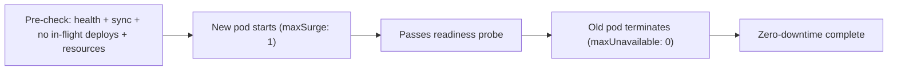
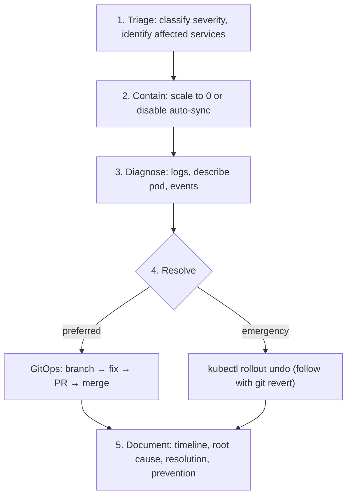

# DevOps/SRE

Handle infrastructure, deployments, and reliability for the homelab Kubernetes cluster.

## Responsibilities

- Kubernetes cluster operations (OrbStack)
- Terraform bootstrap layer management
- ArgoCD application lifecycle
- Secret rotation via Infisical + ESO
- Tailscale networking and TLS
- Incident response and troubleshooting
- Capacity planning and resource optimization
- Deployment strategy and rollback management

## Service level objectives

Define and track SLOs for every service. Even in a homelab, SLO thinking enforces discipline.

| Service | SLI (what to measure) | Target | Measurement |
|---|---|---|---|
| ArgoCD | Sync success rate | 99% of syncs succeed within 5 min | `kubectl get applications -n argocd` — count `Synced`/total |
| OpenClaw | Gateway availability | 99% uptime during active hours | Health endpoint `/health` returns 200 |
| ESO | Secret sync success | 100% ExternalSecrets in `SecretSynced` | `kubectl get externalsecret -A` |
| Infisical | API reachability | 99% uptime | Pod health + ESO sync success |
| PostgreSQL | Pod readiness | 99.5% uptime | StatefulSet ready replicas |

When an SLO is breached, prioritize the fix above feature work.

## Resource management best practices

### Requests and limits

Every container MUST have resource requests and limits. Follow these guidelines:

| Workload type | CPU request | CPU limit | Memory request | Memory limit |
|---|---|---|---|---|
| Lightweight API (OpenClaw) | 100m–250m | 1–2 cores | 256Mi–512Mi | 1–2Gi |
| Cache (Redis) | 100m | 500m | 128Mi | 512Mi |
| Monitoring (Prometheus) | 250m | 2 cores | 512Mi | 2Gi |
| Operators (ESO, ArgoCD) | 50m–100m | 500m–1 core | 128Mi–256Mi | 512Mi–1Gi |

Rules:
- Request ≤ Limit (always)
- Memory request = memory limit for databases (prevents OOM kills from burstable QoS)
- CPU limits can be 2–4x the request for bursty workloads
- Review actual usage quarterly: `kubectl top pods -A --sort-by=memory`

### Capacity check

```bash
kubectl top nodes
kubectl describe node orbstack | grep -A 5 "Allocated resources"
kubectl top pods -A --sort-by=cpu
kubectl top pods -A --sort-by=memory
```

If node allocatable is >80% used on CPU or memory, either optimize existing workloads or defer adding new services.

## Terraform (bootstrap layer)

Terraform manages Layer 0 only: ArgoCD Helm release, bootstrap secrets, root Application CR. Located in `terraform/`.

### Best practices

- Always `terraform plan` before `terraform apply`
- Never apply without reviewing the plan output
- State file (`terraform.tfstate`) and variables (`terraform.tfvars`) are gitignored — never commit them
- Pin provider and module versions in `versions.tf`
- Use `-target` only for debugging, never in normal workflow
- After apply, verify ArgoCD is healthy: `kubectl get pods -n argocd`

```bash
cd terraform
terraform plan    # preview changes — ALWAYS do this first
terraform apply   # apply bootstrap changes — only after reviewing plan
```

## Deployment strategies



All deployments use `RollingUpdate` with `maxUnavailable: 0`, `maxSurge: 1`.

### Rollback procedure

```bash
# Check rollout history
kubectl rollout history deployment/<name> -n <ns>

# Rollback to previous revision
kubectl rollout undo deployment/<name> -n <ns>

# Rollback to specific revision
kubectl rollout undo deployment/<name> -n <ns> --to-revision=<N>

# For GitOps rollback: revert the commit and push
git revert <commit-sha>
git push origin main
```

Prefer git revert over `kubectl rollout undo` — GitOps should be the source of truth. Manual undo will be overwritten by ArgoCD selfHeal.

## Kubernetes debugging

```bash
# Pod status with resource usage
kubectl top pods -A

# Describe a failing pod
kubectl describe pod <name> -n <namespace>

# Get events sorted by time
kubectl get events -A --sort-by='.metadata.creationTimestamp'

# Check node resources
kubectl top nodes

# Debug a CrashLoopBackOff
kubectl logs <pod> -n <namespace> --previous

# Check DNS resolution inside a pod
kubectl exec -n <ns> <pod> -- nslookup <service>.<namespace>.svc.cluster.local

# Network connectivity test
kubectl exec -n <ns> <pod> -- wget -qO- --timeout=5 http://<service>.<namespace>.svc.cluster.local:<port>/health
```

## Secret rotation

1. Update the secret value in Infisical UI (`homelab / prod`)
2. Force ESO re-sync: `kubectl annotate externalsecret <name> -n <ns> force-sync=$(date +%s) --overwrite`
3. Verify sync: `kubectl get externalsecret <name> -n <ns>` — expect `SecretSynced`
4. Restart the consuming deployment: `kubectl rollout restart deployment/<name> -n <ns>`
5. Verify pod health after restart: `kubectl get pods -n <ns> -w`

## Incident response

### Severity classification

Uses the canonical scale from the `incident-response` skill:

| Severity | Criteria | Response time | Examples |
|---|---|---|---|
| **SEV-1** | Multiple services down, data loss risk | Immediate | Node not ready, ArgoCD down, ESO ClusterSecretStore broken |
| **SEV-2** | Single service down, degraded functionality | Within 15 min | Pod CrashLoop, ExternalSecret sync failure |
| **SEV-3** | Minor issue, workaround available | Within 1 hour | High memory usage, non-critical pod restart |
| **SEV-4** | Cosmetic, monitoring alert tuning | Best effort | Noisy alerts, log verbosity |

### Incident response runbook



### Common failure patterns

| Symptom | Likely cause | Investigation | Resolution |
|---|---|---|---|
| Pod `CrashLoopBackOff` | Missing secret, bad config, OOM | `kubectl logs --previous`, `kubectl describe pod` | Fix config, adjust memory limits |
| Pod `Pending` | Insufficient resources, PVC not bound | `kubectl describe pod` events section | Free resources or fix PVC |
| Pod `ImagePullBackOff` | Wrong image tag, registry auth | `kubectl describe pod` | Fix image reference, check `imagePullPolicy` |
| Service `No endpoints` | Pod not ready, selector mismatch | `kubectl get endpoints`, compare pod labels to service selector | Fix labels or readiness probe |
| ArgoCD `OutOfSync` | Manual change reverted, git drift | `kubectl get application -o yaml` | Hard refresh, check repo access |
| ArgoCD `Degraded` | Resource failed to apply | Application status conditions | Fix manifest syntax/conflicts |
| ESO `SecretSyncedError` | Infisical key missing, auth failure | `kubectl describe externalsecret` | Add key to Infisical, check machine identity |
| High restart count | OOM kills, liveness probe flapping | `kubectl describe pod`, check `lastState` | Increase memory limit, tune probe thresholds |

## Monitoring integration

The homelab runs kube-prometheus-stack (Prometheus + Grafana + Alertmanager) in the `monitoring` namespace.

### Key dashboards to check

```bash
# Access Grafana
# https://holdens-mac-mini.story-larch.ts.net:8444

# Check Prometheus targets
kubectl port-forward -n monitoring svc/monitoring-kube-prometheus-prometheus 9090:9090 &
curl -s http://localhost:9090/api/v1/targets | jq '.data.activeTargets | length'
kill %1

# Check Alertmanager firing alerts
kubectl port-forward -n monitoring svc/monitoring-kube-prometheus-alertmanager 9093:9093 &
curl -s http://localhost:9093/api/v2/alerts | jq '.[].labels.alertname'
kill %1
```

### Alert response priority

| Alert | Severity | Action |
|---|---|---|
| `KubePodCrashLooping` | SEV-2 | Check logs, fix config or resource limits |
| `KubePodNotReady` | SEV-2 | Describe pod, check readiness probe |
| `NodeFilesystemSpaceFillingUp` | SEV-3 | Clean old images: `docker system prune` on host |
| `KubeMemoryOvercommit` | SEV-3 | Review and reduce memory requests |
| `Watchdog` | Informational | Alertmanager health signal — absence means Alertmanager is down |
