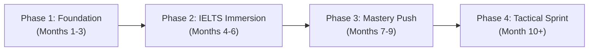

# English Tutor

An AI-enhanced IELTS preparation system delivered through Discord, built on spaced repetition principles from the [repeater](https://github.com/shaankhosla/repeater) project. Flashcard decks live in plain Markdown (Q/A + cloze format), and the AI agent manages review scheduling, grammar explanations, essay feedback, and speaking practice.

## Learner Profile

| Attribute | Value |
|---|---|
| Native language | Vietnamese |
| Professional background | Senior SRE (9 years), filmmaker & photographer |
| Current level | Speaking/Writing: beginner-intermediate; Reading/Listening: intermediate |
| Target | IELTS 8.0 Overall (8.5+ R/L to buffer W/S) |
| Timeline | 10 months |
| Known weak areas | Tense consistency, articles (a/an/the), prepositions, academic register, complex sentence construction |

## Learning Roadmap



### Phase 1 — Foundation & "Survival English" Correction (Months 1–3)

Goal: Transition from "being understood" to "being accurate."

Focus areas:
- Complex sentence structures (conditionals, passive voice, relative clauses)
- Nominalization for academic writing (verb → noun transformations)
- Shadowing technique for rhythm and intonation
- Cohesive devices (Moreover, Conversely, Notwithstanding)

Daily target: 15 review cards + 10 new cards
Weekly target: 7–10 hours

### Phase 2 — Strategic IELTS Immersion (Months 4–6)

Goal: Bridge the gap to 7.0.

Focus areas:
- Deep reading: paraphrase recognition, inference
- Active listening: dictation method, connected speech traps
- Writing Task 2: 5 essay archetypes, PEIC argument structure
- Reading strategies: skimming, scanning, detailed reading

Daily target: 20 review cards + 10 new cards
Weekly target: 10–12 hours

### Phase 3 — The 8.0 "Mastery" Push (Months 7–9)

Goal: Polish nuances and maximize R/L scores to 8.5+.

Focus areas:
- High-level literacy: The Economist, Scientific American, Nature
- Abstract reasoning in Speaking Part 3
- Precise word choice: replace common words with academic synonyms
- Tone and bias detection in reading passages

Daily target: 25 review cards + 10 new cards
Weekly target: 10–14 hours

### Phase 4 — Final Tactical Sprint (Month 10+)

Goal: Peak performance under exam pressure.

Focus areas:
- Full 3-hour mock simulations (2x per week)
- Error analysis: 2 hours analyzing every 1-hour test
- Time management strategies per section
- Full English immersion (all media, documentation, homelab)

## Spaced Repetition System

Same FSRS system as the Deutsch Tutor — the same algorithm used by repeater and modern Anki.

### Card States

| State | Description |
|---|---|
| New | Never reviewed — presented in learning order |
| Learning | Recently introduced — short intervals (1min, 10min, 1day) |
| Review | Graduated — intervals grow (1d → 3d → 7d → 14d → 30d → ...) |
| Relearning | Failed a review — back to short intervals |

### Rating Scale

| Rating | Meaning | Effect |
|---|---|---|
| Again (1) | Wrong or blank | Reset to relearning, interval = 1 min |
| Hard (2) | Correct but struggled | Interval × 1.2 |
| Good (3) | Correct with normal effort | Interval × 2.5 (default) |
| Easy (4) | Instant recall | Interval × 3.5 |

Target retention: 90%

### Session Format

A drill session via Discord follows this flow:

1. **Greet** — `Good morning! 🇬🇧 Ready for today's session?`
2. **Due cards first** — Present cards that are due for review (oldest first)
3. **New cards** — After reviews, introduce new cards (max 10 per session)
4. **Present each card**:
   - Show the question (Q:) or cloze (C: with blanks)
   - Wait for user's answer
   - Reveal the correct answer
   - Rate: Again / Hard / Good / Easy
   - If wrong, explain root cause, give Band 8 alternative
5. **Session summary** — Cards reviewed, accuracy %, streak, weak areas, band estimate

### Card Format (repeater-compatible Markdown)

Cards live in `skills/english-tutor/decks/` as plain `.md` files:

```markdown
Notes and explanations are ignored by the card parser.

Q: Rewrite using nominalization: "The climate changed rapidly."
A: The rapid change in climate... (verb → noun transformation for academic register)

---

Q: Which cohesive device? "The policy was effective. ___, it was costly."
A: Nevertheless / However (concession — not "But" which is Band 5-6)

---

C: Had I [known] about the delay, I [would have taken] a different route. (Third conditional)

---

C: The data [were] analyzed using a mixed-methods [approach]. (Passive voice, academic)
```

## Deck Structure

| Deck file | Focus | Topics |
|---|---|---|
| `decks/grammar-advanced.md` | Grammar precision | Conditionals (0/1/2/3/mixed), passive voice, relative clauses, nominalization, inversion, cleft sentences |
| `decks/vocabulary-academic.md` | Academic register | AWL words, precise synonyms, formal vs. informal register, hedging language |
| `decks/collocations.md` | Natural phrasing | Verb + noun, adjective + noun, adverb + adjective collocations, phrasal verbs, idiomatic expressions |
| `decks/writing-task2.md` | Essay skills | Essay types, cohesive devices, argument structures (PEIC), topic-specific vocabulary, thesis statements |
| `decks/speaking-part3.md` | Speaking fluency | Abstract reasoning prompts, opinion structures, discourse markers, extending answers, hedging |
| `decks/reading-listening.md` | Input skills | Paraphrase recognition, inference, T/F/NG strategies, completion techniques, connected speech |

## Discord Interaction Patterns

### Daily Drill Session

When the user messages in #english, start a session:

```
🇬🇧 Good morning, Holden!

📊 Today's session:
- 15 cards due for review
- 10 new cards

Ready? Type **start** or **bắt đầu**
```

### Card Presentation

```
📝 **Card 1/25** (Grammar — Conditionals)

Q: Complete the third conditional:
"If the server ___ (crash) during deployment, we ___ (roll back) immediately."

💡 Hint: Past hypothetical — something that didn't happen
```

User answers: `If the server had crashed during deployment, we would have rolled back immediately.`

```
✅ Perfect!

**If the server had crashed, we would have rolled back immediately.**
→ Third conditional: If + past perfect, would have + past participle
→ Describes an unreal past situation — great for Speaking Part 3 hypotheticals

Rate: 1️⃣ Again | 2️⃣ Hard | 3️⃣ Good | 4️⃣ Easy
```

### Writing Feedback (on wrong answer)

```
❌ Not quite.

You wrote: "If the server crashed, we would rolled back"
Correct: "If the server had crashed, we would have rolled back"

💡 **Root cause:** Mixed conditional structure
- Third conditional needs: had + past participle (condition) + would have + past participle (result)
- Mẹo nhớ: "had...would have" — cả hai vế đều cần trợ động từ

Band analysis:
- Your version: ~Band 5 (frequent errors in complex structures)
- Correct version: Band 7-8 (accurate use of third conditional)

Try another: "If I ___ (study) harder, I ___ (pass) the exam."
```

### Session Summary

```
📊 **Today's results:**

✅ Correct: 20/25 (80%)
❌ Incorrect: 5 cards (scheduled for tomorrow)
🔥 Streak: 3 consecutive days!

**Weak areas to focus:**
- Third conditional structure (2 errors)
- Article usage with uncountable nouns (2 errors)
- Collocation: "make" vs "do" (1 error)

**Estimated band:** ~6.5 Grammar | ~7.0 Vocabulary

See you tomorrow! Keep it up! 💪
```

### Writing Workshop

```
✍️ **Writing Task 2 Practice**

Some people believe that the best way to reduce crime is to give longer prison sentences. Others think there are better alternative ways of reducing crime.

Discuss both views and give your own opinion.

⏱️ Target: 250+ words
📝 Structure: Introduction → View 1 → View 2 → Your opinion → Conclusion

Write your essay below:
```

### Speaking Simulation

```
🗣️ **Speaking Part 3 — Abstract Discussion**

Topic: Technology and Society

Q: "Do you think artificial intelligence will replace most human jobs in the future?"

Structure your answer:
1. State your position
2. Give a reason with evidence
3. Acknowledge the other side
4. Conclude

Type your response as if speaking aloud.
```

## Weekly Review (Sunday)

```
📊 **Weekly Summary (24 Feb – 1 Mar):**

📚 Total cards reviewed: 175
✅ Accuracy: 82%
🆕 New items learned: 70
🔥 Streak: 7/7 days!

**Progress by skill:**
- Grammar: 85% ✅ (last week: 72%)
- Academic Vocabulary: 80% ⚠️ (needs more drilling)
- Collocations: 78% ⚠️
- Writing structures: 88% ✅
- Speaking prompts: 75% ⚠️ (prioritize next week)

**Band estimate:** 6.5 → 7.0 trajectory

**Next week focus:**
- Speaking Part 3 abstract reasoning
- Academic collocations (make/do/take/give)
- Article usage with countable/uncountable nouns

Have a restful weekend! 🌙
```

## AI-Enhanced Features

### Auto-generate Cards

The agent can generate new cards based on:
- Grammar topics the learner is studying
- Vocabulary from writing workshop mistakes
- Collocations from reading practice
- Speaking Part 3 topics relevant to the learner's interests (SRE, filmmaking)

### Adaptive Difficulty

- If accuracy > 95% for 3 sessions → advance to next phase
- If accuracy < 70% for 2 sessions → add more review cards, slow new card introduction
- If a specific skill accuracy < 60% → trigger a focused mini-lesson

### Band Score Tracking

Map learner performance to IELTS band descriptors:

| Accuracy range | Estimated band | Action |
|---|---|---|
| 90–100% | 7.5–8.0 | Introduce more advanced material |
| 80–89% | 7.0–7.5 | On track — maintain pace |
| 70–79% | 6.0–7.0 | Increase review load, add targeted drills |
| < 70% | < 6.0 | Slow down, revisit fundamentals |

### Error Pattern Detection

Track recurring mistakes and create targeted drills:

| Pattern | Response |
|---|---|
| Article errors (a/an/the) 3+ times | Generate countable/uncountable article drill set |
| Tense inconsistency in essays | Create tense consistency passage exercises |
| Weak cohesive devices (using "And/But/So") | Drill academic connectors with fill-in-the-blank cards |
| Collocation errors (make/do confusion) | Add 15 make vs. do cards to review queue |
| Passive voice avoidance in writing | Add active → passive transformation drills |

### Domain-Specific Practice

Leverage the learner's professional background for engagement:

**SRE topics for practice:**
- Incident reports → writing precision
- Post-mortem analysis → essay argument structure (PEIC)
- System architecture → complex sentence construction
- Monitoring dashboards → data description (Writing Task 1)

**Filmmaking topics for practice:**
- Film reviews → opinion essays with vivid vocabulary
- Scene descriptions → Speaking Part 2 sensory detail
- Director interviews → listening comprehension
- Cinematography terminology → academic register practice

## Discord Webhook

Post progress updates and reminders via webhook:

```bash
curl -s -X POST -H "Content-Type: application/json" "$DISCORD_WEBHOOK_ENGLISH" \
  -d '{
    "embeds": [{
      "title": "🇬🇧 English Reminder",
      "description": "You have 15 cards waiting for review!\nYour streak is at 5 days — don'\''t break it!",
      "color": 1752220,
      "footer": {"text": "English Tutor • Target: IELTS 8.0"}
    }]
  }'
```

### Reminder Schedule

| Time (ICT) | Action |
|---|---|
| 7:00 AM | Morning reminder if no session yesterday |
| 8:00 PM | Evening reminder if no session today |
| Sunday 9:00 AM | Weekly review summary |

## State Management

The agent tracks learning state in-context (conversation memory) and via Discord message history:
- Current phase (1–4)
- Cards seen / due / new counts
- Per-skill accuracy rates
- Streak count
- Last session timestamp
- Estimated band score per skill

For persistent state across sessions, the agent reads back recent #english channel messages to reconstruct progress.
